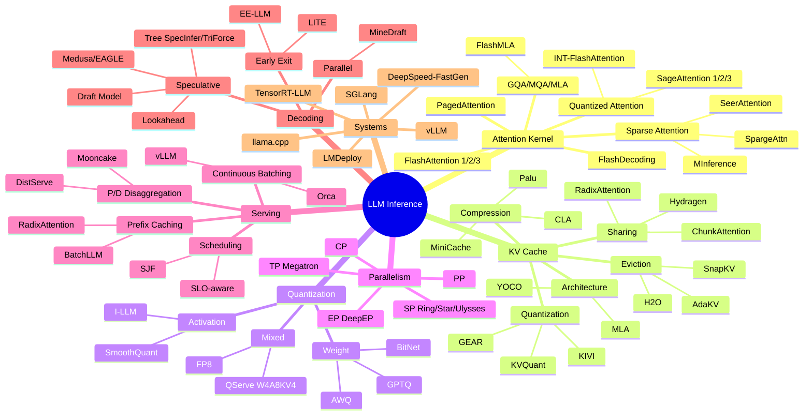

# LLM Inference 技术全景分析 — 主报告

> 基于 Awesome-LLM-Inference 仓库 362 篇论文的系统性分析  
> 生成日期：2026-05-31

---

## Executive Summary

本报告对 Awesome-LLM-Inference 仓库收录的 362 篇论文（2018.03–2026.03）进行了全面的技术体系分析。仓库覆盖 LLM 推理的 7 大核心方向：Attention Kernel 优化、KV Cache 管理、量化压缩、并行策略、调度与 Serving、解码加速、架构创新。

**核心发现**：

1. **Attention Kernel 已进入成熟期**：FlashAttention 系列（1→2→3）奠定了 IO-aware tiling 的范式，后续工作主要在 sparse attention（SeerAttention, SpargeAttn）和低精度 attention（SageAttention FP4）方向探索增量改进。真正的突破点在于 decode 阶段的 split-K 并行（FlashDecoding）和 GQA/MLA 专用 kernel（FlashMLA）。

2. **KV Cache 是当前最活跃的研究方向**：仓库中 54 篇论文（占比 15%）直接涉及 KV cache，涵盖量化（KVQuant, GEAR）、驱逐（H2O, SnapKV, AdaKV）、共享（RadixAttention, Hydragen）、压缩（Palu, MiniCache）四大子方向。DeepSeek-V3 的 MLA 从架构层面将 KV cache 压缩到 latent space，代表了根本性的解决思路。

3. **Speculative Decoding 从理论走向工程**：Medusa/EAGLE 的多头方案已被 vLLM/SGLang 集成，MineDraft 解决了 batch 场景下的效率问题。核心瓶颈从"如何实现"转向"如何与 continuous batching 兼容"和"如何自适应调整 speculation length"。

4. **Serving 系统趋向 Disaggregated 架构**：Prefill/Decode 分离（DistServe, Mooncake）成为大规模部署的标准模式，KV cache 的跨节点传输和弹性调度是工程核心挑战。

5. **量化已达到 W4A8 的工程成熟度**：QServe（W4A8KV4）代表了当前精度-效率的最佳平衡点。下一步是 W4A4（BitNet v2）和 FP4（Blackwell Tensor Core），但精度恢复仍是开放问题。

6. **DeepSeek 系列重新定义了推理系统设计**：MLA + EP + FP8 的组合使 DeepSeek-V3 在 cost/token 上领先，其开源的 FlashMLA、DeepEP、DeepGEMM、EPLB、DualPipe 构成了完整的推理技术栈。

---

## 技术全景图

---

## 各方向核心发现

### 1. Attention Kernel（38 篇）

- FlashAttention 的 tiling + recomputation 范式已成为标准，所有主流框架均已集成
- Decode 阶段的瓶颈是 memory bandwidth（单 token query），FlashDecoding 的 split-K 是当前最优解
- Sparse attention（SeerAttention, MInference）在 prefill 阶段可获得 2-4x 加速，但需要额外的 sparsity prediction 开销
- FP4 attention（SageAttention-3）是 Blackwell 时代的方向，但精度恢复策略尚未成熟
- 关键公式：Standard Attention IO = O(N²d)，FlashAttention IO = O(N²d²/M)，其中 M 为 SRAM 大小

### 2. KV Cache（54 篇）

- 显存公式：`2 × L × n_kv_heads × d_h × seq_len × batch × bytes`
- Llama-3-70B 在 128K context 下 KV cache = 20 GB（GQA 8 heads），DeepSeek-V3 仅 7.6 GB（MLA）
- 压缩方法的 Pareto frontier：KVQuant（2-4bit, <0.1 PPL loss）> GEAR（low-rank + quantization）> H2O（eviction, 有信息损失）
- Prefix sharing（RadixAttention）在多轮对话场景可节省 60-80% KV cache
- 工程难点：与 continuous batching 的兼容性、动态 batch 下的 memory fragmentation

### 3. Quantization（35 篇）

- W4A16（GPTQ/AWQ）是当前最广泛部署的方案，精度损失 <0.5 PPL
- W4A8（QServe）是 serving 场景的最佳平衡，需要 INT8 Tensor Core 支持
- SmoothQuant 解决了 activation outlier 问题，是 A8 的基础
- BitNet v2 的 W1A4 代表极端压缩方向，但需要专用训练
- 关键 tradeoff：每降低 1 bit，throughput 提升 ~25%，但 PPL 损失非线性增长

### 4. Speculative Decoding（26 篇）

- 理论加速比：`(1-α^(γ+1))/((1-α)(1+cγ))`，其中 α=acceptance rate, γ=draft length, c=draft/verify cost ratio
- Medusa（multi-head）在 vLLM/SGLang 中已可用，典型加速 1.8-2.5x
- 大 batch 下收益递减（decode 变为 compute-bound），MagicDec 通过 long-context speculation 解决
- Tree decoding（SpecInfer, TriForce）提升 acceptance rate 但增加 verification cost
- 与 continuous batching 的兼容性是主要工程挑战

### 5. Distributed Inference（14 篇）

- TP 适合单机多卡（NVLink），PP 适合跨机，EP 适合 MoE
- DeepSeek-V3 的推理系统：TP=4 within node + EP across nodes + FP8
- Ring Attention / Star Attention 解决百万级 context 的跨 GPU attention
- 通信优化：DualPipe（计算-通信 overlap）、DeepEP（高效 all-to-all）、Triton-distributed（TileLink）
- 关键瓶颈：跨节点通信延迟（InfiniBand ~1μs latency vs NVLink ~0.1μs）

### 6. Serving & Scheduling（11 篇 + 系统论文）

- Continuous Batching（Orca → vLLM）是基础，所有现代框架均支持
- P/D Disaggregation（DistServe, Mooncake）是大规模部署趋势
- Prefix Caching（RadixAttention）对多轮对话和 RAG 场景至关重要
- SLO-aware scheduling 是生产环境的核心需求，但学术研究相对不足
- 关键指标：TTFT（首 token 延迟）、TPOT（token 间延迟）、throughput（tokens/s）、SLO violation rate

### 7. 系统演进

- vLLM：PagedAttention 开创者，社区最活跃，功能最全面
- SGLang：RadixAttention + 编程模型创新，prefix-heavy 场景最优
- TensorRT-LLM：NVIDIA 官方，性能最优但灵活性受限
- llama.cpp：CPU/边缘部署标准，量化支持最全面
- DeepSpeed-FastGen：SplitFuse 创新但社区活跃度下降

---

## 关键趋势与预测（2025-2027）

### 确定性趋势

1. **MLA 架构普及**：DeepSeek-V3 证明 MLA 可将 KV cache 压缩 10x+，预计 2025-2026 年主流模型将采用类似架构
2. **FP8 成为推理默认精度**：H100/H200 的 FP8 Tensor Core 已成熟，FP8 inference 将取代 FP16
3. **P/D 分离成为标准部署模式**：大规模 serving 将全面采用 disaggregated 架构
4. **Speculative Decoding 默认开启**：框架集成度提升，将成为 serving 的默认配置

### 高概率趋势

5. **FP4 Attention 和 W4A4 推理**：Blackwell GPU 的 FP4 Tensor Core 将推动 4-bit 全栈推理
6. **百万级 Context 成为标准**：Ring/Star Attention + KV compression 使 1M context 可部署
7. **端侧 LLM 3B-8B 成为主流**：W4 量化 + NPU 优化使手机运行 8B 模型成为可能

### 探索性方向

8. **Non-Transformer 架构（Mamba/RWKV）的推理优势**：O(1) per-token cost 可能在特定场景取代 Transformer
9. **Inference-time compute scaling**：DeepSeek-R1 式的长 CoT 推理需要新的系统优化
10. **Carbon-aware inference scheduling**：可持续 AI 将推动能耗感知的调度策略

---

## 研究建议

### 给研究者

- **高影响力方向**：KV cache compression for MLA、FP4 attention 精度恢复、speculative decoding 与 batching 的兼容性
- **低垂果实**：adaptive KV budget allocation、prefix-aware batching、cross-layer KV sharing 模式搜索
- **避免方向**：纯 FlashAttention 变体（已饱和）、单纯的 eviction 策略（缺乏理论保证）

### 给工程师

- **立即可用**：vLLM + AWQ W4A16 + prefix caching（最简部署方案）
- **中期升级**：SGLang + QServe W4A8KV4 + speculative decoding（性能最优）
- **长期规划**：P/D 分离 + FP8 + MLA 模型（成本最优）

### 给架构师

- **单机方案**：vLLM/SGLang + TP4/8 + FlashAttention + continuous batching
- **多机方案**：P/D disaggregation + EP for MoE + Ring Attention for long context
- **成本优化**：FP8 推理 + KV cache quantization + prefix sharing + spot instance

---

## 报告文件索引

| 文件 | 用途 | 行数 |
|------|------|------|
| `00_MASTER_REPORT.md` | 主报告，全局综合分析 | 本文件 |
| `01_repo_map.md` | 仓库概览，章节结构，论文统计 | 479 |
| `02_paper_catalog.csv` | 论文目录 CSV 格式 | 363 |
| `02_paper_catalog.json` | 论文目录 JSON 格式 | 4493 |
| `03_taxonomy.md` | 技术分类体系，7 大方向分类树 | 429 |
| `04_systems_lineage.md` | 9 大系统演进谱系与对比 | 400 |
| `05_kernel_and_math.md` | Attention Kernel 数学分析，复杂度公式，Roofline | 487 |
| `06_serving_scheduling.md` | Serving 框架与调度策略分析 | 344 |
| `07_kv_cache.md` | KV Cache 全面分析，显存公式，压缩方法 | 471 |
| `08_speculative_decoding.md` | Speculative Decoding 方法分类与加速比分析 | 303 |
| `09_quantization.md` | 量化技术深度分析，精度-效率 tradeoff | 550 |
| `10_distributed_inference.md` | 分布式推理，TP/PP/EP/SP/CP 分析 | 364 |
| `11_benchmark_map.md` | Benchmark 指标定义与系统对比 | 304 |
| `12_reproduction_plan.md` | 关键方法复现路线与工程难点 | 171 |
| `13_contradictions_and_caveats.md` | 矛盾、遗漏、不可比问题汇总 | 200 |
| `14_knowledge_graph.md` | 知识图谱 Mermaid 格式 | 258 |
| `14_knowledge_graph.json` | 知识图谱 JSON 格式（nodes + edges） | 162 |
| `15_presentation_outline.md` | 60 分钟技术演讲大纲 | 162 |
| `16_reading_plan.md` | 分级读论文路线（入门/进阶/专家） | 210 |
| `17_research_ideas.md` | 55 条研究选题库 | 522 |

**总计：20 个文件，覆盖论文目录、技术分类、系统分析、数学推导、知识图谱、研究选题全链路。**

---

## 方法论说明

本分析基于以下原则：
1. 只看方法、证据、实验和工程结果，忽略宣传性描述
2. 区分"已验证"（有可复现实验）和"声称"（仅有理论分析）
3. 标注 benchmark 的可比性条件（硬件、模型、输入长度、batch size）
4. 对系统间的技术借鉴关系基于代码和论文引用，而非推测

---

*报告生成完毕。所有文件位于 `reports/` 目录。*
