# Awesome-LLM-Inference 仓库概览

## 基本信息

| 属性 | 值 |
|------|-----|
| 仓库名称 | Awesome-LLM-Inference |
| 维护者 | xlite-dev, liyucheng09 |
| 版本 | v2.6 |
| 许可证 | GPLv3.0 |
| 论文总数 | 362 |
| 章节数 | 21 |
| 时间跨度 | 2018.03 ~ 2026.03 |
| 有代码仓库的论文 | 202 |
| 有Stars徽章的项目 | 215 |

## 章节结构与论文数量

| 序号 | 章节名称 | 论文数 |
|------|----------|--------|
| 1 | Trending LLM/VLM Topics | 13 |
| 2 | DeepSeek/MLA Topics | 14 |
| 3 | Multi-GPUs/Multi-Nodes Parallelism | 14 |
| 4 | Disaggregating Prefill and Decoding | 5 |
| 5 | LLM Algorithmic/Eval Survey | 13 |
| 6 | LLM Train/Inference Framework/Design | 28 |
| 7 | Weight/Activation Quantize/Compress | 35 |
| 8 | Continuous/In-flight Batching | 11 |
| 9 | IO/FLOPs-Aware/Sparse Attention | 38 |
| 10 | KV Cache Scheduling/Quantize/Dropping | 54 |
| 11 | Prompt/Context Compression | 13 |
| 12 | Long Context Attention/KV Cache Optimization | 29 |
| 13 | Early-Exit/Intermediate Layer Decoding | 10 |
| 14 | Parallel Decoding/Sampling | 25 |
| 15 | Structured Prune/KD/Weight Sparse | 8 |
| 16 | Mixture-of-Experts([MoE](https://arxiv.org/abs/2407.06204)) [LLM Inference](https://arxiv.org/abs/2410.04466) | 6 |
| 17 | CPU/NPU/FPGA/Mobile Inference | 15 |
| 18 | Non Transformer Architecture | 5 |
| 19 | GEMM/Tensor Cores/WMMA/Parallel | 20 |
| 20 | VLM/Position Embed/Others | 5 |
| 21 | [LLM Inference](https://arxiv.org/abs/2410.04466) Applications | 1 |

## 🔥 Fire Emoji 热度分析

- 🔥🔥🔥 (极高关注): 23 篇
- 🔥🔥 (高关注): 112 篇
- 🔥 (关注): 133 篇
- 无火标记: 94 篇

### 🔥🔥🔥 极高关注论文 (Top Trending)

| Date | Title | Section |
|------|-------|---------|
| 2026.03 | [OneComp](https://arxiv.org/abs/2603.28845) | Trending LLM/VLM Topics |
| 2024.04 | [Open-Sora](https://github.com/hpcaitech/Open-Sora/blob/main/README.md) | Trending LLM/VLM Topics |
| 2024.04 | [Open-Sora Plan](https://github.com/PKU-YuanGroup/Open-Sora-Plan/blob/main/docs/Report-v1.0.0.md) | Trending LLM/VLM Topics |
| 2024.05 | [DeepSeek-V2](https://arxiv.org/abs/2405.04434) | Trending LLM/VLM Topics |
| 2024.11 | [Star-Attention: 11x~ speedup](https://arxiv.org/abs/2411.17116) | Trending LLM/VLM Topics |
| 2024.12 | [DeepSeek-V3](https://arxiv.org/abs/2412.19437) | Trending LLM/VLM Topics |
| 2025.01 | [MiniMax-Text-01](https://filecdn.minimax.chat/_Arxiv_MiniMax_01_Report.pdf) | Trending LLM/VLM Topics |
| 2025.01 | [DeepSeek-R1](https://arxiv.org/abs/2501.12948v1) | Trending LLM/VLM Topics |
| 2024.05 | [DeepSeek-V2](https://arxiv.org/abs/2405.04434) | DeepSeek/MLA Topics |
| 2024.12 | [DeepSeek-V3](https://arxiv.org/abs/2412.19437) | DeepSeek/MLA Topics |
| 2025.01 | [DeepSeek-R1](https://arxiv.org/abs/2501.12948v1) | DeepSeek/MLA Topics |
| 2025.02 | [DeepSeek-NSA](https://arxiv.org/abs/2502.11089) | DeepSeek/MLA Topics |
| 2025.02 | Flash[MLA](https://arxiv.org/abs/2405.04434) | DeepSeek/MLA Topics |
| 2025.02 | [DualPipe](https://github.com/deepseek-ai/DualPipe) | DeepSeek/MLA Topics |
| 2025.02 | [DeepEP](https://github.com/deepseek-ai/DeepEP) | DeepSeek/MLA Topics |
| 2025.02 | [DeepGEMM](https://github.com/deepseek-ai/DeepGEMM) | DeepSeek/MLA Topics |
| 2025.02 | [EPLB](https://github.com/deepseek-ai/EPLB) | DeepSeek/MLA Topics |
| 2025.02 | [3FS](https://github.com/deepseek-ai/3FS) | DeepSeek/MLA Topics |
| 2025.03 | [推理系统](https://zhuanlan.zhihu.com/p/27181462601) | DeepSeek/MLA Topics |
| 2024.11 | [SP: Star-Attention, 11x~ speedup](https://arxiv.org/abs/2411.17116) | Multi-GPUs/Multi-Nodes Parallelism |

## 主要系统/框架列表

| 项目名 | 所属章节 | 推荐等级 |
|--------|----------|----------|
| [SeerAttention](https://arxiv.org/abs/2410.13276) | IO/FLOPs-Aware/Sparse Attention | ⭐️⭐️⭐️ |
| OpenMchine | IO/FLOPs-Aware/Sparse Attention | ⭐️⭐️⭐️ |
| [OneCompression](https://arxiv.org/abs/2603.28845) | Trending LLM/VLM Topics | ⭐️⭐️ |
| [Open-Sora](https://github.com/hpcaitech/Open-Sora/blob/main/README.md) | Trending LLM/VLM Topics | ⭐️⭐️ |
| [Open-Sora](https://github.com/hpcaitech/Open-Sora/blob/main/README.md)-Plan | Trending LLM/VLM Topics | ⭐️⭐️ |
| [DeepSeek-V2](https://arxiv.org/abs/2405.04434) | Trending LLM/VLM Topics | ⭐️⭐️ |
| unilm-[YOCO](https://arxiv.org/abs/2405.05254) | Trending LLM/VLM Topics | ⭐️⭐️ |
| [Mooncake](https://arxiv.org/abs/2407.00079) | Trending LLM/VLM Topics | ⭐️⭐️ |
| [flash-attention](https://github.com/Dao-AILab/flash-attention) | Trending LLM/VLM Topics | ⭐️⭐️ |
| [MInference 1.0](https://arxiv.org/abs/2407.02490) | Trending LLM/VLM Topics | ⭐️⭐️ |
| [Star-Attention](https://arxiv.org/abs/2411.17116) | Trending LLM/VLM Topics | ⭐️⭐️ |
| [DeepSeek-V3](https://arxiv.org/abs/2412.19437) | Trending LLM/VLM Topics | ⭐️⭐️ |
| [MiniMax-01](https://filecdn.minimax.chat/_Arxiv_MiniMax_01_Report.pdf) | Trending LLM/VLM Topics | ⭐️⭐️ |
| [DeepSeek-R1](https://arxiv.org/abs/2501.12948v1) | Trending LLM/VLM Topics | ⭐️⭐️ |
| Flash[MLA](https://arxiv.org/abs/2405.04434) | DeepSeek/MLA Topics | ⭐️⭐️ |
| [DualPipe](https://github.com/deepseek-ai/DualPipe) | DeepSeek/MLA Topics | ⭐️⭐️ |
| [DeepEP](https://github.com/deepseek-ai/DeepEP) | DeepSeek/MLA Topics | ⭐️⭐️ |
| [DeepGEMM](https://github.com/deepseek-ai/DeepGEMM) | DeepSeek/MLA Topics | ⭐️⭐️ |
| [EPLB](https://github.com/deepseek-ai/EPLB) | DeepSeek/MLA Topics | ⭐️⭐️ |
| [3FS](https://github.com/deepseek-ai/3FS) | DeepSeek/MLA Topics | ⭐️⭐️ |
| [MHA2MLA](https://arxiv.org/abs/2502.14837) | DeepSeek/MLA Topics | ⭐️⭐️ |
| [TransMLA](https://arxiv.org/abs/2502.07864) | DeepSeek/MLA Topics | ⭐️⭐️ |
| [deepspeed](https://github.com/microsoft/DeepSpeed) | Multi-GPUs/Multi-Nodes Parallelism | ⭐️⭐️ |
| [Megatron-LM](https://github.com/NVIDIA/Megatron-LM) | Multi-GPUs/Multi-Nodes Parallelism | ⭐️⭐️ |
| [RingAttention](https://arxiv.org/abs/2310.01889) | Multi-GPUs/Multi-Nodes Parallelism | ⭐️⭐️ |
| striped_attention | Multi-GPUs/Multi-Nodes Parallelism | ⭐️⭐️ |
| long-context-attention | Multi-GPUs/Multi-Nodes Parallelism | ⭐️⭐️ |
| token-ring | Multi-GPUs/Multi-Nodes Parallelism | ⭐️⭐️ |
| [DistServe](https://arxiv.org/abs/2401.09670) | Disaggregating Prefill and Decoding | ⭐️⭐️ |
| Efficient-LLMs-Survey | LLM Algorithmic/Eval Survey | ⭐️⭐️ |
| [LLM-Viewer](https://arxiv.org/abs/2402.16363) | LLM Algorithmic/Eval Survey | ⭐️⭐️ |
| ICSF-Survey | LLM Algorithmic/Eval Survey | ⭐️⭐️ |
| [vllm](https://github.com/vllm-project/vllm) | LLM Train/Inference Framework/Design | ⭐️⭐️ |
| [TensorRT-LLM](https://github.com/NVIDIA/TensorRT-LLM) | LLM Train/Inference Framework/Design | ⭐️⭐️ |
| [deepspeed-fastgen](https://github.com/microsoft/DeepSpeed/tree/master/blogs/deepspeed-fastgen) | LLM Train/Inference Framework/Design | ⭐️⭐️ |
| [sglang](https://github.com/sgl-project/sglang) | LLM Train/Inference Framework/Design | ⭐️⭐️ |
| [petals](https://github.com/bigscience-workshop/petals) | LLM Train/Inference Framework/Design | ⭐️⭐️ |
| [lmdeploy](https://github.com/InternLM/lmdeploy) | LLM Train/Inference Framework/Design | ⭐️⭐️ |
| [mlc-llm](https://github.com/mlc-ai/mlc-llm) | LLM Train/Inference Framework/Design | ⭐️⭐️ |
| [lightllm](https://github.com/ModelTC/lightllm) | LLM Train/Inference Framework/Design | ⭐️⭐️ |
| [llama.cpp](https://github.com/ggerganov/llama.cpp) | LLM Train/Inference Framework/Design | ⭐️⭐️ |
| [flashinfer](https://flashinfer.ai/2024/02/02/cascade-inference.html) | LLM Train/Inference Framework/Design | ⭐️⭐️ |
| [Nanoflow](https://github.com/efeslab/Nanoflow) | LLM Train/Inference Framework/Design | ⭐️⭐️ |
| [siiRL](https://arxiv.org/abs/2507.13833) | LLM Train/Inference Framework/Design | ⭐️⭐️ |
| [DeepSpeed](https://github.com/microsoft/DeepSpeed) | Weight/Activation Quantize/Compress | ⭐️⭐️ |
| [gptq](https://github.com/IST-DASLab/gptq) | Weight/Activation Quantize/Compress | ⭐️⭐️ |
| [FasterTransformer](https://github.com/NVIDIA/FasterTransformer) | Weight/Activation Quantize/Compress | ⭐️⭐️ |
| [smoothquant](https://github.com/mit-han-lab/smoothquant) | Weight/Activation Quantize/Compress | ⭐️⭐️ |
| [llm-awq](https://github.com/mit-han-lab/llm-awq) | Weight/Activation Quantize/Compress | ⭐️⭐️ |
| [qserve](https://github.com/mit-han-lab/qserve) | Weight/Activation Quantize/Compress | ⭐️⭐️ |
| [GuidedQuant](https://arxiv.org/abs/2505.07004) | Weight/Activation Quantize/Compress | ⭐️⭐️ |
| [vAttention](https://arxiv.org/abs/2405.04437) | Continuous/In-flight Batching | ⭐️⭐️ |
| [vTensor](https://arxiv.org/abs/2407.15309) | Continuous/In-flight Batching | ⭐️⭐️ |
| [reformer](https://arxiv.org/abs/2001.04451) | IO/FLOPs-Aware/Sparse Attention | ⭐️⭐️ |
| flaxformer | IO/FLOPs-Aware/Sparse Attention | ⭐️⭐️ |
| [SageAttention](https://arxiv.org/abs/2410.02367) | IO/FLOPs-Aware/Sparse Attention | ⭐️⭐️ |
| SqueezedAttention | IO/FLOPs-Aware/Sparse Attention | ⭐️⭐️ |
| ffpa-attn | IO/FLOPs-Aware/Sparse Attention | ⭐️⭐️ |
| SpargeAttn | IO/FLOPs-Aware/Sparse Attention | ⭐️⭐️ |
| [MInference](https://arxiv.org/abs/2407.02490) | IO/FLOPs-Aware/Sparse Attention | ⭐️⭐️ |
| SparseFrontier | IO/FLOPs-Aware/Sparse Attention | ⭐️⭐️ |
| attention-gym | IO/FLOPs-Aware/Sparse Attention | ⭐️⭐️ |
| APE | IO/FLOPs-Aware/Sparse Attention | ⭐️⭐️ |
| Block-attention | IO/FLOPs-Aware/Sparse Attention | ⭐️⭐️ |
| nexusquant | KV Cache Scheduling/Quantize/Dropping | ⭐️⭐️ |
| Compressed-Context-Memory | KV Cache Scheduling/Quantize/Dropping | ⭐️⭐️ |
| chunk-attention | KV Cache Scheduling/Quantize/Dropping | ⭐️⭐️ |
| [QAQ](https://arxiv.org/abs/2403.04643)-KVCacheQuantization | KV Cache Scheduling/Quantize/Dropping | ⭐️⭐️ |
| [Keyformer](https://arxiv.org/abs/2403.09054) | KV Cache Scheduling/Quantize/Dropping | ⭐️⭐️ |
| [SqueezeAttention](https://arxiv.org/abs/2404.04793) | KV Cache Scheduling/Quantize/Dropping | ⭐️⭐️ |
| [LMCache](https://github.com/LMCache/LMCache) | KV Cache Scheduling/Quantize/Dropping | ⭐️⭐️ |
| [Palu](https://arxiv.org/abs/2407.21118) | KV Cache Scheduling/Quantize/Dropping | ⭐️⭐️ |
| [AdaKV](https://arxiv.org/abs/2407.11550) | KV Cache Scheduling/Quantize/Dropping | ⭐️⭐️ |
| [DynamicLLaVA](https://arxiv.org/abs/2412.00876) | KV Cache Scheduling/Quantize/Dropping | ⭐️⭐️ |
| [KVzip](https://arxiv.org/abs/2505.23416) | KV Cache Scheduling/Quantize/Dropping | ⭐️⭐️ |
| avp-python | KV Cache Scheduling/Quantize/Dropping | ⭐️⭐️ |
| [KVQuant](https://arxiv.org/abs/2401.18079) | Long Context Attention/KV Cache Optimization | ⭐️⭐️ |
| [HOMER](https://arxiv.org/abs/2404.10308) | Long Context Attention/KV Cache Optimization | ⭐️⭐️ |
| [LOOK-M](https://arxiv.org/abs/2406.18139) | Long Context Attention/KV Cache Optimization | ⭐️⭐️ |
| [Quest](https://arxiv.org/abs/2406.10774) | Long Context Attention/KV Cache Optimization | ⭐️⭐️ |
| [ShadowKV](https://arxiv.org/abs/2410.21465) | Long Context Attention/KV Cache Optimization | ⭐️⭐️ |
| [EE-LLM](https://arxiv.org/abs/2312.04916) | Early-Exit/Intermediate Layer Decoding | ⭐️⭐️ |
| fast_robust_early_exit | Early-Exit/Intermediate Layer Decoding | ⭐️⭐️ |
| [EE-Tuning](https://arxiv.org/abs/2402.00518) | Early-Exit/Intermediate Layer Decoding | ⭐️⭐️ |
| [LLMSpeculativeSampling](https://github.com/feifeibear/LLMSpeculativeSampling) | Parallel Decoding/Sampling | ⭐️⭐️ |
| [Medusa](https://arxiv.org/abs/2401.10774) | Parallel Decoding/Sampling | ⭐️⭐️ |
| [LookaheadDecoding](https://arxiv.org/abs/2402.02057) | Parallel Decoding/Sampling | ⭐️⭐️ |
| [TriForce](https://arxiv.org/abs/2404.11912) | Parallel Decoding/Sampling | ⭐️⭐️ |
| PEARL | Parallel Decoding/Sampling | ⭐️⭐️ |
| [MineDraft](https://arxiv.org/abs/2603.18016) | Parallel Decoding/Sampling | ⭐️⭐️ |
| [FLAP](https://arxiv.org/abs/2312.11983) | Structured Prune/KD/Weight Sparse | ⭐️⭐️ |
| laser | Structured Prune/KD/Weight Sparse | ⭐️⭐️ |
| [SDMPrune](https://arxiv.org/abs/2506.11120) | Structured Prune/KD/Weight Sparse | ⭐️⭐️ |
| [HFPrune](https://arxiv.org/abs/2603.08083) | Structured Prune/KD/Weight Sparse | ⭐️⭐️ |
| [mixtral-offloading](https://github.com/dvmazur/mixtral-offloading) | Mixture-of-Experts([MoE](https://arxiv.org/abs/2407.06204)) [LLM Inference](https://arxiv.org/abs/2410.04466) | ⭐️⭐️ |
| [RWKV](https://arxiv.org/abs/2305.13048)-LM | Non Transformer Architecture | ⭐️⭐️ |
| [mamba](https://github.com/state-spaces/mamba) | Non Transformer Architecture | ⭐️⭐️ |
| [RWKV-CLIP](https://arxiv.org/abs/2406.06973) | Non Transformer Architecture | ⭐️⭐️ |
| [flash-linear-attention](https://github.com/sustcsonglin/flash-linear-attention) | Non Transformer Architecture | ⭐️⭐️ |
| [QUICK](https://arxiv.org/abs/2402.10076) | GEMM/Tensor Cores/WMMA/Parallel | ⭐️⭐️ |
| [flute](https://arxiv.org/abs/2407.10960) | GEMM/Tensor Cores/WMMA/Parallel | ⭐️⭐️ |
| [marlin](https://github.com/IST-DASLab/marlin) | GEMM/Tensor Cores/WMMA/Parallel | ⭐️⭐️ |
| TritonBench | GEMM/Tensor Cores/WMMA/Parallel | ⭐️⭐️ |
| [Triton-distributed](https://arxiv.org/abs/2503.20313) | GEMM/Tensor Cores/WMMA/Parallel | ⭐️⭐️ |
| Awesome-LLMs-Evaluation | LLM Algorithmic/Eval Survey | ⭐️ |
| [FlexGen](https://arxiv.org/abs/2303.06865) | LLM Train/Inference Framework/Design | ⭐️ |
| [FlexFlow](https://github.com/flexflow/FlexFlow) | LLM Train/Inference Framework/Design | ⭐️ |
| [streaming-llm](https://github.com/mit-han-lab/streaming-llm) | LLM Train/Inference Framework/Design | ⭐️ |
| [LightSeq](https://arxiv.org/abs/2310.03294) | LLM Train/Inference Framework/Design | ⭐️ |
| [PowerInfer](https://ipads.se.sjtu.edu.cn/_media/publications/powerinfer-20231219.pdf) | LLM Train/Inference Framework/Design | ⭐️ |
| [inferflow](https://arxiv.org/abs/2401.08294) | LLM Train/Inference Framework/Design | ⭐️ |
| [prima.cpp](https://arxiv.org/abs/2504.08791) | LLM Train/Inference Framework/Design | ⭐️ |
| toolpipe-mcp-server | LLM Train/Inference Framework/Design | ⭐️ |
| [FP8](https://arxiv.org/abs/2209.05433)-quantization | Weight/Activation Quantize/Compress | ⭐️ |
| [bitsandbytes](https://github.com/bitsandbytes-foundation/bitsandbytes) | Weight/Activation Quantize/Compress | ⭐️ |
| [SpQR](https://arxiv.org/abs/2306.03078) | Weight/Activation Quantize/Compress | ⭐️ |
| [SqueezeLLM](https://arxiv.org/abs/2306.07629) | Weight/Activation Quantize/Compress | ⭐️ |
| MS-AMP | Weight/Activation Quantize/Compress | ⭐️ |
| [LLM-Shearing](https://arxiv.org/abs/2310.06694) | Weight/Activation Quantize/Compress | ⭐️ |
| [LLM-FP4](https://arxiv.org/abs/2310.16836) | Weight/Activation Quantize/Compress | ⭐️ |
| smoothquantplus | Weight/Activation Quantize/Compress | ⭐️ |
| [ABQ-LLM](https://arxiv.org/abs/2408.08554) | Weight/Activation Quantize/Compress | ⭐️ |
| TEAL | Weight/Activation Quantize/Compress | ⭐️ |
| [VPTQ](https://arxiv.org/abs/2409.17066) | Weight/Activation Quantize/Compress | ⭐️ |
| [bitnet](https://github.com/microsoft/BitNet) | Weight/Activation Quantize/Compress | ⭐️ |
| [SpotServe](https://arxiv.org/abs/2311.15566) | Continuous/In-flight Batching | ⭐️ |
| dynamic-sparse-flash-attention | IO/FLOPs-Aware/Sparse Attention | ⭐️ |
| [sparsegpt](https://github.com/IST-DASLab/sparsegpt) | IO/FLOPs-Aware/Sparse Attention | ⭐️ |
| [MoA](https://arxiv.org/abs/2406.14909) | IO/FLOPs-Aware/Sparse Attention | ⭐️ |
| shareAtt | IO/FLOPs-Aware/Sparse Attention | ⭐️ |
| INT-[FlashAttention](https://arxiv.org/abs/2205.14135) | IO/FLOPs-Aware/Sparse Attention | ⭐️ |
| [LTP](https://arxiv.org/abs/2107.00910) | KV Cache Scheduling/Quantize/Dropping | ⭐️ |
| [H2O](https://arxiv.org/abs/2306.14048) | KV Cache Scheduling/Quantize/Dropping | ⭐️ |
| [GEAR](https://arxiv.org/abs/2403.05527) | KV Cache Scheduling/Quantize/Dropping | ⭐️ |
| [SnapKV](https://arxiv.org/abs/2404.14469) | KV Cache Scheduling/Quantize/Dropping | ⭐️ |
| pythia-mlkv | KV Cache Scheduling/Quantize/Dropping | ⭐️ |
| [AlignedKV](https://arxiv.org/abs/2409.16546) | KV Cache Scheduling/Quantize/Dropping | ⭐️ |
| [FastBERT](https://aclanthology.org/2020.acl-main.537.pdf) | Early-Exit/Intermediate Layer Decoding | ⭐️ |
| berxit | Early-Exit/Intermediate Layer Decoding | ⭐️ |
| Instructive-Decoding | Parallel Decoding/Sampling | ⭐️ |
| [FocusLLM](https://arxiv.org/abs/2408.11745) | Parallel Decoding/Sampling | ⭐️ |
| [MagicDec](https://arxiv.org/abs/2408.11049) | Parallel Decoding/Sampling | ⭐️ |
| admm-pruning | Structured Prune/KD/Weight Sparse | ⭐️ |
| [Simba](https://arxiv.org/abs/2505.20698) | Structured Prune/KD/Weight Sparse | ⭐️ |
| [intel-extension-for-transformers](https://github.com/intel/intel-extension-for-transformers) | CPU/NPU/FPGA/Mobile Inference | ⭐️ |
| [xFasterTransformer](https://arxiv.org/abs/2407.07304) | CPU/NPU/FPGA/Mobile Inference | ⭐️ |
| nitro | CPU/NPU/FPGA/Mobile Inference | ⭐️ |
| off-grid-mobile | CPU/NPU/FPGA/Mobile Inference | ⭐️ |
| ram-coffers | CPU/NPU/FPGA/Mobile Inference | ⭐️ |
| llama-cpp-power8 | CPU/NPU/FPGA/Mobile Inference | ⭐️ |
| DissectingTensorCores | GEMM/Tensor Cores/WMMA/Parallel | ⭐️ |
| wmma_extension | GEMM/Tensor Cores/WMMA/Parallel | ⭐️ |
| [cutlass](https://github.com/NVIDIA/cutlass) | GEMM/Tensor Cores/WMMA/Parallel | ⭐️ |
| hadamard_transform | GEMM/Tensor Cores/WMMA/Parallel | ⭐️ |
| [transformers](https://github.com/huggingface/transformers) | VLM/Position Embed/Others | ⭐️ |
| [ByteTransformer](https://arxiv.org/abs/2210.03052) | VLM/Position Embed/Others | ⭐️ |
| storyroute | [LLM Inference](https://arxiv.org/abs/2410.04466) Applications | ⭐️ |

## Mermaid 仓库结构图

```mermaid
graph TD
    A[Awesome-LLM-Inference<br>v2.6] --> B[模型架构优化]
    A --> C[推理系统设计]
    A --> D[内存与计算优化]
    A --> E[解码策略]
    A --> F[硬件适配]
    A --> G[应用]

    B --> B1[Trending LLM/VLM Topics]
    B --> B2[DeepSeek/MLA Topics]
    B --> B3[Non Transformer Architecture]
    B --> B4[Mixture-of-Experts MoE]

    C --> C1[Multi-GPUs/Multi-Nodes Parallelism]
    C --> C2[Disaggregating Prefill and Decoding]
    C --> C3[LLM Train/Inference Framework]
    C --> C4[Continuous/In-flight Batching]

    D --> D1[Weight/Activation Quantize]
    D --> D2[IO/FLOPs-Aware/Sparse Attention]
    D --> D3[KV Cache Scheduling/Quantize]
    D --> D4[Prompt/Context Compression]
    D --> D5[Long Context Attention/KV cache]

    E --> E1[Early-Exit/Intermediate Layer]
    E --> E2[Parallel Decoding/Sampling]
    E --> E3[Structured Prune/KD/Weight Sparse]

    F --> F1[CPU/NPU/FPGA/Mobile Inference]
    F --> F2[GEMM/Tensor Cores/WMMA]
    F --> F3[VLM/Position Embed/Others]

    G --> G1[LLM Inference Applications]
```

