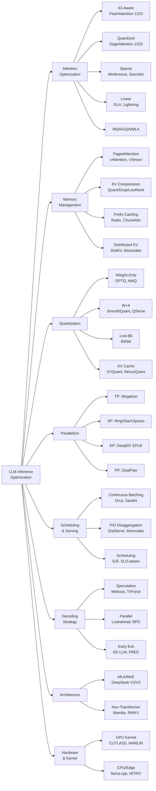

# [LLM Inference](https://arxiv.org/abs/2410.04466) 技术分类体系

## 分类树概览

本文档基于 Awesome-LLM-Inference 仓库中 362 篇论文，建立 LLM 推理优化的完整技术分类体系。

---

## 一、Attention Optimization（注意力优化）

### 1.1 IO-Aware Attention
- **FlashAttention 系列**: [FlashAttention](https://arxiv.org/abs/2205.14135) (2022.05) → [FlashAttention-2](https://arxiv.org/abs/2307.08691) (2023.07) → [FlashAttention-3](https://arxiv.org/abs/2407.08608) (2024.07)
  - 核心：tiling + recomputation，避免 HBM 读写 O(N²) attention matrix
  - FA-2 改进 work partitioning（warp 间并行）
  - FA-3 引入 asynchrony（warp-specialized pipeline）+ [FP8](https://arxiv.org/abs/2209.05433) 低精度
- [**Flash-Decoding**](https://crfm.stanford.edu/2023/10/12/flashdecoding.html) (2023.10): 针对 decode 阶段 KV 维度并行拆分
- [**FFPA**](https://github.com/xlite-dev/ffpa-attn) (2025.01): O(1) SRAM complexity for headdim > 256

### 1.2 Quantized Attention
- [**SageAttention**](https://arxiv.org/abs/2410.02367) (2024.10) → [SageAttention-2](https://arxiv.org/abs/2411.10958) (2024.11) → [SageAttention-3 (2025.05)](https://arxiv.org/pdf/2505.11594)
  - SA-1: INT8 QK matmul + FP16 PV
  - SA-2: per-thread INT4 + outlier smoothing
  - SA-3: Microscaling FP4
- [**INT-FlashAttention**](https://arxiv.org/abs/2409.16997) (2024.09): INT8 量化融入 [FlashAttention](https://arxiv.org/abs/2205.14135) kernel
- [**TurboAttention**](https://arxiv.org/abs/2412.08585) (2024.12): attention approximation for high throughput

### 1.3 Sparse Attention
- **Static Sparse**: Hash Attention/[Reformer](https://arxiv.org/abs/2001.04451) (2020), [Sparse FlashAttention](https://arxiv.org/abs/2306.01160) (2023.06)
- **Dynamic Sparse**: [MInference 1.0](https://arxiv.org/abs/2407.02490) (2024.07), [SeerAttention (2025.02)](https://arxiv.org/abs/2410.13276), [SpargeAttention](https://arxiv.org/abs/2502.18137) (2025.03)
- **Learned Sparse**: [MoA](https://arxiv.org/abs/2406.14909) (2024.04), [Sparse Frontier](https://arxiv.org/abs/2504.17768) (2025.04)
- **Channel-wise Sparse**: [CHESS](https://arxiv.org/abs/2409.01366) (2024.09), [CHAI](https://arxiv.org/abs/2403.08058) (2024.03)
- [**Slim Attention**](https://arxiv.org/abs/2503.05840) (2025.03): 仅保留 K-cache，V 从 K 推导

### 1.4 Linear / Sub-quadratic Attention
- [**GLA**](https://arxiv.org/abs/2312.06635) (2023.12): Gated Linear Attention with hardware-efficient training
- [**LightningAttention-1/2**](https://arxiv.org/abs/2401.04658) (2023.07/2024.01): TransNormer 系列线性注意力
- [**HyperAttention**](https://arxiv.org/abs/2310.05869) (2023.11): near-linear time via LSH

### 1.5 Multi-Query / Grouped-Query Attention
- [**MQA**](https://arxiv.org/abs/1911.02150) (2019.11): 单 write-head，减少 KV cache
- [**GQA**](https://arxiv.org/abs/2305.13245) (2023.05): 分组共享 KV head，MHA→[MQA](https://arxiv.org/abs/1911.02150) 的折中
- [**MLA**](https://arxiv.org/abs/2405.04434) (2024.05): DeepSeek Multi-head Latent Attention，低秩压缩 KV

### 1.6 [Parallel Encoding](https://arxiv.org/abs/2409.15355) / Prefix-Aware
- [**APE** (2025.04)](https://arxiv.org/abs/2502.05431): Adaptive [Parallel Encoding](https://arxiv.org/abs/2409.15355) for context-augmented generation
- [**Block-Attention** (2025.04)](https://arxiv.org/abs/2409.15355): 块级独立 prefill 后合并

---

## 二、Memory Management（内存管理）

### 2.1 KV Cache Memory Allocation
- [**PagedAttention**](https://arxiv.org/abs/2309.06180) (2023.09): 虚拟内存分页管理 KV cache（vLLM 核心）
- [**vAttention**](https://arxiv.org/abs/2405.04437) (2024.05): 利用 OS 虚拟内存，无需 paging kernel 开销
- [**vTensor**](https://arxiv.org/abs/2407.15309) (2024.07): 弹性虚拟 tensor 管理

### 2.2 [KV Cache Compress](https://arxiv.org/abs/2305.17118)ion
- **Quantization**: [KVQuant](https://arxiv.org/abs/2401.18079) (2024.01), [SKVQ](https://arxiv.org/abs/2405.06219) (2024.05), [ZipCache](https://arxiv.org/abs/2405.14256) (2024.05), [NexusQuant](https://arxiv.org/abs/2505.00949) (2026.03)
- **Dropping/Eviction**: [H2O](https://arxiv.org/abs/2306.14048) (2023.06), [Scissorhands (2023.05)](https://arxiv.org/abs/2305.17118), [SnapKV](https://arxiv.org/abs/2404.14469) (2024.04), [AdaKV (2024.10)](https://arxiv.org/abs/2407.11550)
- **Low-Rank**: [Palu](https://arxiv.org/abs/2407.21118) (2024.07), [LORC (2024.10)](https://arxiv.org/abs/2410.03111), [Eigen Attention](https://arxiv.org/abs/2408.05646) (2024.08)
- **Cross-Layer Sharing**: [CLA](https://arxiv.org/abs/2405.12981) (2024.05), [MLKV](https://arxiv.org/abs/2406.09297) (2024.07), [MiniCache](https://arxiv.org/abs/2405.14366) (2024.05)
- **Hybrid**: [GEAR](https://arxiv.org/abs/2403.05527) (2024.03), [DynamicKV](https://arxiv.org/abs/2412.14838) (2024.12), [KVzip (2025.05)](https://arxiv.org/abs/2505.23416)

### 2.3 Prefix Caching
- [**Prompt Cache**](https://arxiv.org/abs/2311.04934) (2023.11): 模块化 attention 复用
- [**RadixAttention**](https://arxiv.org/abs/2312.07104) (2023.12): [SGLang](https://github.com/sgl-project/sglang) 的 radix tree 前缀匹配
- [**ChunkAttention**](https://arxiv.org/abs/2402.15220) (2024.02): prefix-aware KV cache + two-phase partition
- [**CacheBlend**](https://arxiv.org/abs/2405.16444) (2024.05): cached knowledge fusion
- [**Hydragen** (2024.02)](https://arxiv.org/abs/2402.05099): shared prefix high-throughput inference

### 2.4 Distributed KV Cache
- [**DistKV-LLM/Infinite-LLM**](https://arxiv.org/abs/2401.02669) (2024.01): 分布式 KV cache + DistAttention
- [**MemServe**](https://arxiv.org/abs/2406.17565) (2024.06): elastic memory pool for disaggregated serving
- [**Mooncake**](https://arxiv.org/abs/2407.00079) (2024.06): KVCache-centric disaggregated architecture

---

## 三、Quantization（量化）

### 3.1 Weight-Only Quantization
- [**GPTQ**](https://arxiv.org/abs/2210.17323) (2022.10): one-shot PTQ via approximate second-order
- [**AWQ**](https://arxiv.org/abs/2306.00978) (2023.06): activation-aware weight quantization
- [**VPTQ**](https://arxiv.org/abs/2409.17066) (2024.09): vector post-training quantization
- [**SpinQuant**](https://arxiv.org/abs/2405.16406) (2024.05): learned rotations for quantization

### 3.2 Weight + Activation Quantization
- [**SmoothQuant**](https://arxiv.org/abs/2211.10438) (2022.11): per-channel smoothing → W8A8
- **QServe/W4A8KV4** (2024.05): system co-design for [W4A8KV4](https://arxiv.org/abs/2405.04532)
- [**I-LLM**](https://arxiv.org/abs/2405.17849) (2024.05): integer-only inference
- [**ABQ-LLM**](https://arxiv.org/abs/2408.08554) (2024.08): arbitrary-bit quantization

### 3.3 Low-Bit / Binary
- [**BitNet a4.8**](https://arxiv.org/abs/2411.04965) (2024.11) → [BitNet v2](https://arxiv.org/abs/2504.18415) (2025.04): 1-bit weights + 4-bit activations
- [**2-bit LLM**](https://arxiv.org/abs/2311.16442) (2023.11): memory alignment + sparse outlier

### 3.4 [FP8](https://arxiv.org/abs/2209.05433) / Mixed Precision
- [**ZeroQuant**](https://arxiv.org/abs/2206.01861) (2022.06) → [ZeroQuant-V2](https://arxiv.org/abs/2303.08302) (2023.03) → [ZeroQuant-FP (2023.07)](https://arxiv.org/pdf/2307.09782.pdf)
- [**FP8-LM**](https://arxiv.org/abs/2310.18313) (2023.10): FP8 training
- [**FP6-LLM**](https://arxiv.org/abs/2401.14112) (2024.01): FP6 algorithm-system co-design

### 3.5 KV Cache Quantization
- **TensorRT-LLM KV FP8** (2023.10)
- [**KVQuant**](https://arxiv.org/abs/2401.18079) (2024.01): 10M context via KV quantization
- [**QAQ**](https://arxiv.org/abs/2403.04643) (2024.03): quality adaptive quantization
- [**AlignedKV**](https://arxiv.org/abs/2409.16546) (2024.09): precision-aligned quantization
- [**NexusQuant**](https://arxiv.org/abs/2505.00949) (2026.03): E8 lattice VQ + temporal predictive coding

---

## 四、Parallelism（并行策略）

### 4.1 Data Parallelism
- [**ZeRO** (2019.10)](https://arxiv.org/abs/1910.02054): memory optimization stages 1/2/3
- [**FSDP** (2025.05)](https://pytorch.org/tutorials/intermediate/FSDP_tutorial.html): PyTorch Fully Sharded Data Parallel

### 4.2 [Tensor Parallel](https://arxiv.org/abs/2402.04925)ism
- **Megatron-LM TP** (2020.05): column/row parallel linear layers
- **Communication Compression** (2024.11): 压缩 TP 通信

### 4.3 Sequence Parallelism
- [**Ring Attention**](https://arxiv.org/abs/2310.01889) (2023.10): blockwise ring communication
- [**Striped Attention** (2023.11)](https://arxiv.org/abs/2311.09431): load-balanced causal ring attention
- [**DeepSpeed Ulysses** (2023.10)](https://arxiv.org/abs/2309.14509): all-to-all based SP
- [**USP** (2024.05)](https://github.com/feifeibear/long-context-attention): hybrid Ring + Ulysses
- [**Star Attention** (2024.11)](https://arxiv.org/abs/2411.17116): 11x speedup via star topology
- [**TokenRing** (2024.12)](https://arxiv.org/abs/2412.20501): bidirectional communication

### 4.4 Context Parallelism
- **Megatron-LM CP** (2024.03)
- **Meta CP** (2024.11): scalable million-token inference

### 4.5 Expert Parallelism
- [**DeepEP** (2025.02)](https://github.com/deepseek-ai/DeepEP): DeepSeek expert parallelism
- [**EPLB** (2025.02)](https://github.com/deepseek-ai/EPLB): expert parallel load balancing
- [**MegaScale-Infer**](https://arxiv.org/abs/2504.02263) (2025.04): disaggregated expert parallelism

### 4.6 Pipeline Parallelism
- [**DualPipe** (2025.02)](https://github.com/deepseek-ai/DualPipe): DeepSeek bidirectional pipeline

---

## 五、Scheduling & Serving（调度与服务）

### 5.1 [Continuous Batching](https://www.usenix.org/system/files/osdi22-yu.pdf)
- [**Orca**](https://www.usenix.org/conference/osdi22/presentation/yu) (2022.07): iteration-level scheduling（开创性工作）
- **TensorRT-LLM In-flight Batching** (2023.10)
- [**DeepSpeed-FastGen** (2023.11)](https://github.com/microsoft/DeepSpeed): SplitFuse
- [**Sarathi**](https://arxiv.org/abs/2308.16369) (2023.08): chunked prefills piggybacking decodes

### 5.2 Disaggregated Prefill/Decode
- [**DistServe**](https://arxiv.org/abs/2401.09670) (2024.01): goodput-optimized disaggregation
- [**Splitwise**](https://arxiv.org/abs/2311.18677) (2023.11): phase splitting
- [**Mooncake**](https://arxiv.org/abs/2407.00079) (2024.06): KVCache-centric disaggregation
- [**KVDirect**](https://arxiv.org/abs/2501.14743) (2024.12): distributed disaggregated inference
- [**MegaScale-Infer**](https://arxiv.org/abs/2504.02263) (2025.04): MoE-specific disaggregation

### 5.3 Scheduling Algorithms
- [**FastServe**](https://arxiv.org/abs/2305.05920) (2023.05): preemptive scheduling
- [**SJF Scheduling**](https://arxiv.org/abs/2408.15792) (2024.08): learning to rank for SJF
- [**BatchLLM**](https://arxiv.org/abs/2412.03594) (2024.12): global prefix sharing + throughput-oriented batching
- **SLO-Aware Tuning** (2024.08): automatic inference engine tuning
- [**LayerKV**](https://arxiv.org/abs/2410.00428) (2024.10): layer-wise KV cache management

### 5.4 Serving Frameworks
- [**vLLM**](https://github.com/vllm-project/vllm) (2023.09): [PagedAttention](https://arxiv.org/abs/2309.06180) + continuous batching
- [**SGLang**](https://github.com/sgl-project/sglang) (2023.12): [RadixAttention](https://arxiv.org/abs/2312.07104) + structured generation
- [**TensorRT-LLM**](https://github.com/NVIDIA/TensorRT-LLM) (2023.10): NVIDIA optimized runtime
- [**LMDeploy**](https://lmdeploy.readthedocs.io/en/latest/) (2023.06): InternLM toolkit
- [**LightLLM**](https://github.com/ModelTC/lightllm) (2023.08): Python-based lightweight serving
- [**Mooncake**](https://arxiv.org/abs/2407.00079) (2024.06): disaggregated architecture

---

## 六、Decoding Strategy（解码策略）

### 6.1 [Speculative Decoding](https://arxiv.org/abs/2211.17192)
- [**Speculative Sampling**](https://arxiv.org/abs/2211.17192) (2023.02/2023.05): draft model + verification
- [**Medusa**](https://arxiv.org/abs/2401.10774) (2023.09): multiple decoding heads
- [**TriForce**](https://arxiv.org/abs/2404.11912) (2024.04): hierarchical speculative decoding
- [**MagicDec**](https://arxiv.org/abs/2408.11049) (2024.08): breaking latency-throughput tradeoff
- [**PEARL** (2024.08)](https://arxiv.org/abs/2408.11850): adaptive draft length
- [**MineDraft**](https://arxiv.org/abs/2603.18016) (2026.03): batch parallel speculative decoding

### 6.2 Parallel / Blockwise Decoding
- [**Blockwise Parallel Decoding** (2018.11)](https://arxiv.org/abs/1811.03115): 开创性工作
- [**Lookahead Decoding**](https://arxiv.org/abs/2402.02057) (2024.02): n-gram based parallel
- [**Hidden Transfer**](https://arxiv.org/abs/2404.12022) (2024.04): lossless parallel via hidden states

### 6.3 Early Exit
- [**SkipDecode**](https://arxiv.org/abs/2307.02628) (2023.06): autoregressive skip decoding
- [**EE-LLM**](https://arxiv.org/abs/2312.04916) (2023.12): 3D parallelism for early-exit LLMs
- [**FREE**](https://arxiv.org/abs/2310.05424) (2023.10): synchronized parallel early-exit
- [**KOALA**](https://arxiv.org/abs/2408.08146) (2024.08): multi-layer draft heads

---

## 七、Architecture（模型架构）

### 7.1 Transformer Variants
- **DeepSeek-V2/V3** (2024.05/2024.12): [MLA](https://arxiv.org/abs/2405.04434) + [MoE](https://arxiv.org/abs/2407.06204)
- [**YOCO**](https://arxiv.org/abs/2405.05254) (2024.05): decoder-decoder with single cache
- [**MiniMax-01** (2025.01)](https://filecdn.minimax.chat/_Arxiv_MiniMax_01_Report.pdf): [Lightning Attention](https://filecdn.minimax.chat/_Arxiv_MiniMax_01_Report.pdf)

### 7.2 Non-Transformer
- [**RWKV**](https://arxiv.org/abs/2305.13048) (2023.05): RNN for transformer era
- [**Mamba**](https://arxiv.org/abs/2312.00752) (2023.12): selective state spaces
- [**FLA**](https://github.com/sustcsonglin/flash-linear-attention) (2024.08): flash linear attention library

### 7.3 [MoE](https://arxiv.org/abs/2407.06204) Architecture
- [**DeepSeek-V2**](https://arxiv.org/abs/2405.04434) (2024.05): MLA + DeepSeekMoE
- [**Mixtral Offloading**](https://arxiv.org/abs/2312.17238) (2023.12): expert offloading
- [**MoE-Mamba**](https://arxiv.org/abs/2401.04081) (2024.01): SSM + MoE hybrid

---

## 八、Hardware & Kernel（硬件与算子）

### 8.1 GPU Kernel Optimization
- [**CUTLASS/CuTe**](https://dl.acm.org/doi/pdf/10.1145/3582016.3582018) (2023.03): NVIDIA tensor computation IR
- [**MARLIN**](https://arxiv.org/abs/2408.11743) (2024.08): mixed-precision auto-regressive kernel
- [**flute**](https://arxiv.org/abs/2407.10960) (2024.07): LUT-quantized fast matmul
- [**LUT Tensor Core**](https://arxiv.org/abs/2408.06003) (2024.08): lookup table on tensor cores
- [**DeepGEMM** (2025.02)](https://github.com/deepseek-ai/DeepGEMM): DeepSeek [FP8](https://arxiv.org/abs/2209.05433) GEMM

### 8.2 CPU / Edge Inference
- [**llama.cpp**](https://github.com/ggerganov/llama.cpp) (2023.03): pure C/C++ inference
- [**Intel xFasterTransformer**](https://arxiv.org/abs/2407.07304) (2024.07)
- [**Transformer-Lite**](https://arxiv.org/abs/2403.20041) (2024.03): mobile GPU
- [**NITRO**](https://arxiv.org/abs/2412.11053) (2024.12): Intel NPU inference

### 8.3 FPGA
- [**FlightLLM**](https://arxiv.org/abs/2401.03868) (2024.03): complete mapping flow on FPGAs

---

## Mermaid 技术分类图



---

## 方法继承/改进关系

### [FlashAttention](https://arxiv.org/abs/2205.14135) 演进链
```
[Online Softmax (2018)](https://arxiv.org/pdf/2112.05682.pdf) → [FlashAttention (2022.05)](https://courses.cs.washington.edu/courses/cse599m/23sp/notes/flashattn.pdf) → [FlashAttention-2 (2023.07)](https://arxiv.org/pdf/2307.08691.pdf) → [Flash-Decoding (2023.10)](https://crfm.stanford.edu/2023/10/12/flashdecoding.html) → [FlashAttention-3 (2024.07)](https://tridao.me/publications/flash3/flash3.pdf) → [FFPA (2025.01)](https://github.com/xlite-dev/ffpa-attn)
```

### KV Cache 压缩演进
```
MQA (2019) → GQA (2023) → MLA (2024)
[PagedAttention (2023)](https://arxiv.org/pdf/2309.06180.pdf) → [vAttention (2024)](https://arxiv.org/pdf/2405.04437) → [vTensor (2024)](https://arxiv.org/pdf/2407.15309)
H2O (2023) → Scissorhands → SnapKV → AdaKV → [DynamicKV (2024)](https://arxiv.org/pdf/2412.14838)
[KVQuant (2024.01)](https://arxiv.org/abs/2401.18079) → ZipCache → [NexusQuant (2026.03)](https://arxiv.org/abs/2505.00949)
```

### [Speculative Decoding](https://arxiv.org/abs/2211.17192) 演进
```
[Blockwise Parallel Decoding (2018)](https://arxiv.org/abs/1811.03115) → [Speculative Sampling (2023)](https://arxiv.org/pdf/2211.17192.pdf) → [Medusa (2023)](https://arxiv.org/pdf/2401.10774.pdf) → [TriForce (2024)](https://arxiv.org/pdf/2404.11912) → [MagicDec (2024)](https://arxiv.org/pdf/2408.11049) → [MineDraft (2026)](https://arxiv.org/pdf/2603.18016)
```

### Serving 系统演进
```
[Orca (2022)](https://www.usenix.org/system/files/osdi22-yu.pdf) → [vLLM (2023)](https://github.com/vllm-project/vllm) → [SGLang (2023)](https://arxiv.org/pdf/2312.07104) → [DistServe (2024)](https://arxiv.org/pdf/2401.09670) → [Mooncake (2024)](https://arxiv.org/abs/2407.20960) → [MegaScale-Infer (2025)](https://arxiv.org/pdf/2504.02263)
```
