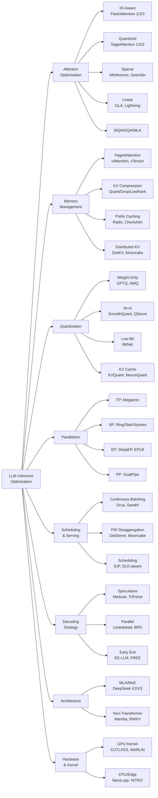

# LLM Inference 技术分类体系

## 分类树概览

本文档基于 Awesome-LLM-Inference 仓库中 362 篇论文，建立 LLM 推理优化的完整技术分类体系。

---

## 一、Attention Optimization（注意力优化）

### 1.1 IO-Aware Attention
- **FlashAttention 系列**: FlashAttention (2022.05) → FlashAttention-2 (2023.07) → FlashAttention-3 (2024.07)
  - 核心：tiling + recomputation，避免 HBM 读写 O(N²) attention matrix
  - FA-2 改进 work partitioning（warp 间并行）
  - FA-3 引入 asynchrony（warp-specialized pipeline）+ FP8 低精度
- **Flash-Decoding** (2023.10): 针对 decode 阶段 KV 维度并行拆分
- **FFPA** (2025.01): O(1) SRAM complexity for headdim > 256

### 1.2 Quantized Attention
- **SageAttention** (2024.10) → SageAttention-2 (2024.11) → SageAttention-3 (2025.05)
  - SA-1: INT8 QK matmul + FP16 PV
  - SA-2: per-thread INT4 + outlier smoothing
  - SA-3: Microscaling FP4
- **INT-FlashAttention** (2024.09): INT8 量化融入 FlashAttention kernel
- **TurboAttention** (2024.12): attention approximation for high throughput

### 1.3 Sparse Attention
- **Static Sparse**: Hash Attention/Reformer (2020), Sparse FlashAttention (2023.06)
- **Dynamic Sparse**: MInference 1.0 (2024.07), SeerAttention (2025.02), SpargeAttention (2025.03)
- **Learned Sparse**: MoA (2024.04), Sparse Frontier (2025.04)
- **Channel-wise Sparse**: CHESS (2024.09), CHAI (2024.03)
- **Slim Attention** (2025.03): 仅保留 K-cache，V 从 K 推导

### 1.4 Linear / Sub-quadratic Attention
- **GLA** (2023.12): Gated Linear Attention with hardware-efficient training
- **LightningAttention-1/2** (2023.07/2024.01): TransNormer 系列线性注意力
- **HyperAttention** (2023.11): near-linear time via LSH

### 1.5 Multi-Query / Grouped-Query Attention
- **MQA** (2019.11): 单 write-head，减少 KV cache
- **GQA** (2023.05): 分组共享 KV head，MHA→MQA 的折中
- **MLA** (2024.05): DeepSeek Multi-head Latent Attention，低秩压缩 KV

### 1.6 Parallel Encoding / Prefix-Aware
- **APE** (2025.04): Adaptive Parallel Encoding for context-augmented generation
- **Block-Attention** (2025.04): 块级独立 prefill 后合并

---

## 二、Memory Management（内存管理）

### 2.1 KV Cache Memory Allocation
- **PagedAttention** (2023.09): 虚拟内存分页管理 KV cache（vLLM 核心）
- **vAttention** (2024.05): 利用 OS 虚拟内存，无需 paging kernel 开销
- **vTensor** (2024.07): 弹性虚拟 tensor 管理

### 2.2 KV Cache Compression
- **Quantization**: KVQuant (2024.01), SKVQ (2024.05), ZipCache (2024.05), NexusQuant (2026.03)
- **Dropping/Eviction**: H2O (2023.06), Scissorhands (2023.05), SnapKV (2024.04), AdaKV (2024.10)
- **Low-Rank**: Palu (2024.07), LORC (2024.10), Eigen Attention (2024.08)
- **Cross-Layer Sharing**: CLA (2024.05), MLKV (2024.07), MiniCache (2024.05)
- **Hybrid**: GEAR (2024.03), DynamicKV (2024.12), KVzip (2025.05)

### 2.3 Prefix Caching
- **Prompt Cache** (2023.11): 模块化 attention 复用
- **RadixAttention** (2023.12): SGLang 的 radix tree 前缀匹配
- **ChunkAttention** (2024.02): prefix-aware KV cache + two-phase partition
- **CacheBlend** (2024.05): cached knowledge fusion
- **Hydragen** (2024.02): shared prefix high-throughput inference

### 2.4 Distributed KV Cache
- **DistKV-LLM/Infinite-LLM** (2024.01): 分布式 KV cache + DistAttention
- **MemServe** (2024.06): elastic memory pool for disaggregated serving
- **Mooncake** (2024.06): KVCache-centric disaggregated architecture

---

## 三、Quantization（量化）

### 3.1 Weight-Only Quantization
- **GPTQ** (2022.10): one-shot PTQ via approximate second-order
- **AWQ** (2023.06): activation-aware weight quantization
- **VPTQ** (2024.09): vector post-training quantization
- **SpinQuant** (2024.05): learned rotations for quantization

### 3.2 Weight + Activation Quantization
- **SmoothQuant** (2022.11): per-channel smoothing → W8A8
- **QServe/W4A8KV4** (2024.05): system co-design for W4A8KV4
- **I-LLM** (2024.05): integer-only inference
- **ABQ-LLM** (2024.08): arbitrary-bit quantization

### 3.3 Low-Bit / Binary
- **BitNet a4.8** (2024.11) → BitNet v2 (2025.04): 1-bit weights + 4-bit activations
- **2-bit LLM** (2023.11): memory alignment + sparse outlier

### 3.4 FP8 / Mixed Precision
- **ZeroQuant** (2022.06) → ZeroQuant-V2 (2023.03) → ZeroQuant-FP (2023.07)
- **FP8-LM** (2023.10): FP8 training
- **FP6-LLM** (2024.01): FP6 algorithm-system co-design

### 3.5 KV Cache Quantization
- **TensorRT-LLM KV FP8** (2023.10)
- **KVQuant** (2024.01): 10M context via KV quantization
- **QAQ** (2024.03): quality adaptive quantization
- **AlignedKV** (2024.09): precision-aligned quantization
- **NexusQuant** (2026.03): E8 lattice VQ + temporal predictive coding

---

## 四、Parallelism（并行策略）

### 4.1 Data Parallelism
- **ZeRO** (2019.10): memory optimization stages 1/2/3
- **FSDP** (2025.05): PyTorch Fully Sharded Data Parallel

### 4.2 Tensor Parallelism
- **Megatron-LM TP** (2020.05): column/row parallel linear layers
- **Communication Compression** (2024.11): 压缩 TP 通信

### 4.3 Sequence Parallelism
- **Ring Attention** (2023.10): blockwise ring communication
- **Striped Attention** (2023.11): load-balanced causal ring attention
- **DeepSpeed Ulysses** (2023.10): all-to-all based SP
- **USP** (2024.05): hybrid Ring + Ulysses
- **Star Attention** (2024.11): 11x speedup via star topology
- **TokenRing** (2024.12): bidirectional communication

### 4.4 Context Parallelism
- **Megatron-LM CP** (2024.03)
- **Meta CP** (2024.11): scalable million-token inference

### 4.5 Expert Parallelism
- **DeepEP** (2025.02): DeepSeek expert parallelism
- **EPLB** (2025.02): expert parallel load balancing
- **MegaScale-Infer** (2025.04): disaggregated expert parallelism

### 4.6 Pipeline Parallelism
- **DualPipe** (2025.02): DeepSeek bidirectional pipeline

---

## 五、Scheduling & Serving（调度与服务）

### 5.1 Continuous Batching
- **Orca** (2022.07): iteration-level scheduling（开创性工作）
- **TensorRT-LLM In-flight Batching** (2023.10)
- **DeepSpeed-FastGen** (2023.11): SplitFuse
- **Sarathi** (2023.08): chunked prefills piggybacking decodes

### 5.2 Disaggregated Prefill/Decode
- **DistServe** (2024.01): goodput-optimized disaggregation
- **Splitwise** (2023.11): phase splitting
- **Mooncake** (2024.06): KVCache-centric disaggregation
- **KVDirect** (2024.12): distributed disaggregated inference
- **MegaScale-Infer** (2025.04): MoE-specific disaggregation

### 5.3 Scheduling Algorithms
- **FastServe** (2023.05): preemptive scheduling
- **SJF Scheduling** (2024.08): learning to rank for SJF
- **BatchLLM** (2024.12): global prefix sharing + throughput-oriented batching
- **SLO-Aware Tuning** (2024.08): automatic inference engine tuning
- **LayerKV** (2024.10): layer-wise KV cache management

### 5.4 Serving Frameworks
- **vLLM** (2023.09): PagedAttention + continuous batching
- **SGLang** (2023.12): RadixAttention + structured generation
- **TensorRT-LLM** (2023.10): NVIDIA optimized runtime
- **LMDeploy** (2023.06): InternLM toolkit
- **LightLLM** (2023.08): Python-based lightweight serving
- **Mooncake** (2024.06): disaggregated architecture

---

## 六、Decoding Strategy（解码策略）

### 6.1 Speculative Decoding
- **Speculative Sampling** (2023.02/2023.05): draft model + verification
- **Medusa** (2023.09): multiple decoding heads
- **TriForce** (2024.04): hierarchical speculative decoding
- **MagicDec** (2024.08): breaking latency-throughput tradeoff
- **PEARL** (2024.08): adaptive draft length
- **MineDraft** (2026.03): batch parallel speculative decoding

### 6.2 Parallel / Blockwise Decoding
- **Blockwise Parallel Decoding** (2018.11): 开创性工作
- **Lookahead Decoding** (2024.02): n-gram based parallel
- **Hidden Transfer** (2024.04): lossless parallel via hidden states

### 6.3 Early Exit
- **SkipDecode** (2023.06): autoregressive skip decoding
- **EE-LLM** (2023.12): 3D parallelism for early-exit LLMs
- **FREE** (2023.10): synchronized parallel early-exit
- **KOALA** (2024.08): multi-layer draft heads

---

## 七、Architecture（模型架构）

### 7.1 Transformer Variants
- **DeepSeek-V2/V3** (2024.05/2024.12): MLA + MoE
- **YOCO** (2024.05): decoder-decoder with single cache
- **MiniMax-01** (2025.01): Lightning Attention

### 7.2 Non-Transformer
- **RWKV** (2023.05): RNN for transformer era
- **Mamba** (2023.12): selective state spaces
- **FLA** (2024.08): flash linear attention library

### 7.3 MoE Architecture
- **DeepSeek-V2** (2024.05): MLA + DeepSeekMoE
- **Mixtral Offloading** (2023.12): expert offloading
- **MoE-Mamba** (2024.01): SSM + MoE hybrid

---

## 八、Hardware & Kernel（硬件与算子）

### 8.1 GPU Kernel Optimization
- **CUTLASS/CuTe** (2023.03): NVIDIA tensor computation IR
- **MARLIN** (2024.08): mixed-precision auto-regressive kernel
- **flute** (2024.07): LUT-quantized fast matmul
- **LUT Tensor Core** (2024.08): lookup table on tensor cores
- **DeepGEMM** (2025.02): DeepSeek FP8 GEMM

### 8.2 CPU / Edge Inference
- **llama.cpp** (2023.03): pure C/C++ inference
- **Intel xFasterTransformer** (2024.07)
- **Transformer-Lite** (2024.03): mobile GPU
- **NITRO** (2024.12): Intel NPU inference

### 8.3 FPGA
- **FlightLLM** (2024.03): complete mapping flow on FPGAs

---

## Mermaid 技术分类图



---

## 方法继承/改进关系

### FlashAttention 演进链
```
Online Softmax (2018) → FlashAttention (2022.05) → FlashAttention-2 (2023.07) → Flash-Decoding (2023.10) → FlashAttention-3 (2024.07) → FFPA (2025.01)
```

### KV Cache 压缩演进
```
MQA (2019) → GQA (2023) → MLA (2024)
PagedAttention (2023) → vAttention (2024) → vTensor (2024)
H2O (2023) → Scissorhands → SnapKV → AdaKV → DynamicKV (2024)
KVQuant (2024.01) → ZipCache → NexusQuant (2026.03)
```

### Speculative Decoding 演进
```
Blockwise Parallel Decoding (2018) → Speculative Sampling (2023) → Medusa (2023) → TriForce (2024) → MagicDec (2024) → MineDraft (2026)
```

### Serving 系统演进
```
Orca (2022) → vLLM (2023) → SGLang (2023) → DistServe (2024) → Mooncake (2024) → MegaScale-Infer (2025)
```
