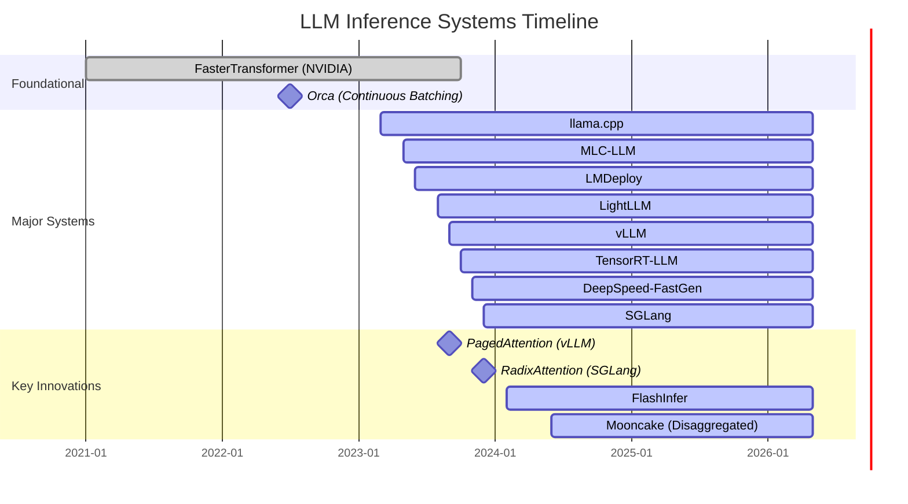
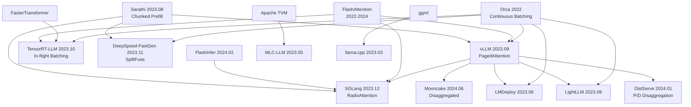

# [LLM Inference](https://arxiv.org/abs/2410.04466) 系统演进谱系

## 系统概览

本文档分析 LLM 推理领域主要系统的技术演进、核心创新和相互借鉴关系。

**证据等级说明**：
- `[verified_by_paper]` — 论文中有明确实验数据支撑
- `[verified_by_code]` — 开源代码中可直接验证
- `[derived_analysis]` — 基于多个来源的综合分析推导
- `[unverified_claim]` — 来自博客/社区报告，未经独立验证

---

## 1. [vLLM](https://github.com/vllm-project/vllm) (UC Berkeley, 2023.09)

### 核心创新
- [**PagedAttention**](https://arxiv.org/abs/2309.06180): 将 KV cache 按 page（block）管理，类似 OS 虚拟内存分页，解决 KV cache 内存碎片化问题 `[verified_by_paper]`
- 实现 near-zero waste 的内存利用率（浪费 < 4%，对比 naive 方案 60-80% 浪费）`[verified_by_paper]`

### 架构设计
- **整体架构**: Python 控制面 + CUDA 数据面，AsyncLLMEngine 驱动异步请求处理 `[verified_by_code]`
- **V1 重构 (2025.01)**: 插件化架构，模型/硬件后端可替换，加入 PyTorch Foundation 治理 `[verified_by_code]`
- **请求生命周期**: API Server → Tokenizer → Scheduler → Model Runner → Sampler → Detokenizer → Streaming Response `[verified_by_code]`

### 关键技术组件

| 组件 | 实现 | 证据等级 |
|------|------|----------|
| Scheduler | Continuous batching + preemption (swap/recompute)，V1 引入 SchedulerOutput 抽象 | `[verified_by_code]` |
| KV Cache Manager | [PagedAttention](https://arxiv.org/abs/2309.06180) block table，copy-on-write for parallel sampling，block size 默认 16 tokens | `[verified_by_paper]` |
| Prefix Cache | Automatic Prefix Caching (APC)，hash-based block matching，支持跨请求前缀复用 | `[verified_by_code]` |
| Kernel Backend | 自研 paged attention kernel → FlashAttention/FlashInfer 集成，Marlin/CUTLASS for quantized GEMM | `[verified_by_code]` |
| Speculative Decoding | 支持 draft model、ngram、EAGLE、Medusa 等多种 draft 策略 | `[verified_by_code]` |
| Quantization | FP8/INT8 (CUTLASS)、W4A16 (Marlin/GPTQ/AWQ)、GGUF 格式兼容 | `[verified_by_code]` |
| Distributed Serving | Tensor Parallelism (Megatron-style)、Pipeline Parallelism、Ray-based multi-node | `[verified_by_code]` |
| Observability | Prometheus metrics 导出、OpenTelemetry tracing、per-request latency breakdown | `[verified_by_code]` |

### 生产部署注意事项
- **GPU 内存规划**: `gpu_memory_utilization` 参数控制 KV cache 预分配比例，默认 0.9，长 context 场景需降低 `[derived_analysis]`
- **Block size 选择**: 较大 block (32) 减少 block table 开销但增加碎片，较小 block (8) 反之 `[derived_analysis]`
- **Preemption 策略**: swap 模式需要足够 CPU 内存，recompute 模式适合 prefill 较快的短 context `[verified_by_code]`
- **CUDA Graph**: 启用后 decode 阶段 kernel launch overhead 降低 ~30%，但限制动态 batch size `[derived_analysis]`
- **已知限制**: V0 架构下 scheduler 是单线程瓶颈，高 QPS 场景需关注；V1 已改善 `[verified_by_code]`

### 技术借鉴
- 从 [Orca](https://www.usenix.org/conference/osdi22/presentation/yu) 借鉴 continuous batching 思想
- 后续被 [SGLang](https://github.com/sgl-project/sglang)、[LightLLM](https://github.com/ModelTC/lightllm)、[TensorRT-LLM](https://github.com/NVIDIA/TensorRT-LLM) 等借鉴 paged memory 设计

---

## 2. [SGLang](https://github.com/sgl-project/sglang) (Stanford/UC Berkeley, 2023.12)

### 核心创新
- [**RadixAttention**](https://arxiv.org/abs/2312.07104): 用 radix tree 管理 KV cache prefix，实现自动、细粒度的前缀复用
- **Structured Generation Language**: 编程模型层面优化 LLM 程序（fork/join/select）

### 关键技术组件
| 组件 | 实现 |
|------|------|
| Scheduler | Continuous batching + chunked prefill + [RadixAttention](https://arxiv.org/abs/2312.07104)-aware scheduling |
| Memory Manager | [RadixAttention](https://arxiv.org/abs/2312.07104) tree-based KV cache pool |
| Kernel Backend | [FlashInfer](https://github.com/flashinfer-ai/flashinfer) (primary), Triton kernels |
| Frontend | Python-embedded DSL for structured LLM programs |

### 支持的优化技术
- [RadixAttention](https://arxiv.org/abs/2312.07104) prefix caching（比 vLLM APC 更细粒度）
- Constrained decoding (regex/JSON schema)
- Speculative decoding, tensor parallelism
- Multi-modal support, data parallelism

### 性能特征与适用场景
- 多轮对话、tree-of-thought、agent 等有大量 prefix sharing 的场景
- 结构化输出（JSON mode）性能优势明显
- 适合复杂 LLM 程序编排

### 技术借鉴
- 从 [vLLM](https://github.com/vllm-project/vllm) 借鉴 continuous batching 和 paged memory 基本思路
- [RadixAttention](https://arxiv.org/abs/2312.07104) 是对 [Prompt Cache](https://arxiv.org/abs/2311.04934) 和 prefix caching 的系统化改进
- [FlashInfer](https://github.com/flashinfer-ai/flashinfer) 作为 kernel backend 提供高效 attention 实现

---

## 3. [TensorRT-LLM](https://github.com/NVIDIA/TensorRT-LLM) (NVIDIA, 2023.10)

### 核心创新
- [**In-flight Batching**](https://nvidia.github.io/TensorRT-LLM/features/paged-attention-ifb-scheduler.html): NVIDIA 版 continuous batching，与 TensorRT 编译优化深度集成
- **FP8 全链路**: 从 weight 到 KV cache 到 attention 的 [FP8](https://arxiv.org/abs/2209.05433) 支持

### 关键技术组件
| 组件 | 实现 |
|------|------|
| Scheduler | In-flight batching (Batch Manager) |
| Memory Manager | Paged KV cache + [FP8](https://arxiv.org/abs/2209.05433) KV cache |
| Kernel Backend | TensorRT fused kernels, [CUTLASS](https://github.com/NVIDIA/cutlass), cuBLAS |
| Compiler | TensorRT graph optimization + kernel fusion |

### 支持的优化技术
- In-flight batching, paged KV cache
- INT8/FP8 weight + activation quantization ([SmoothQuant](https://arxiv.org/abs/2211.10438), AWQ, GPTQ)
- Multi-GPU tensor parallelism + pipeline parallelism
- Speculative decoding, KV cache reuse
- Inflight batching + chunked context

### 性能特征与适用场景
- NVIDIA GPU 上单卡/多卡性能最优（kernel fusion + hardware-specific optimization）
- 适合生产环境部署，延迟敏感场景
- 对 NVIDIA 硬件有深度绑定

### 技术借鉴
- 从 [FasterTransformer](https://github.com/NVIDIA/FasterTransformer) 演进而来
- Continuous batching 思想来自 [Orca](https://www.usenix.org/conference/osdi22/presentation/yu)
- Paged KV cache 受 [vLLM](https://github.com/vllm-project/vllm) 影响

---

## 4. [llama.cpp](https://github.com/ggerganov/llama.cpp) (ggerganov, 2023.03)

### 核心创新
- **纯 C/C++ 实现**: 无 Python/CUDA 依赖，跨平台推理
- **GGUF 量化格式**: 灵活的混合精度量化（Q2_K ~ Q8_0）

### 关键技术组件
| 组件 | 实现 |
|------|------|
| Scheduler | 单请求为主，server mode 支持简单 batching |
| Memory Manager | 静态 KV cache 分配，mmap 模型加载 |
| Kernel Backend | CPU SIMD (AVX/NEON/WASM), Metal, CUDA, Vulkan |
| Quantization | [GGUF](https://github.com/ggerganov/ggml/blob/master/docs/gguf.md) 格式：k-quant (Q2_K~Q8_0), IQ (importance quant) |

### 支持的优化技术
- 多种量化格式（2-8 bit），importance matrix guided quantization
- CPU SIMD 优化（AVX2/AVX-512/ARM NEON）
- Metal (Apple Silicon), CUDA, Vulkan GPU offload
- Speculative decoding, grammar-based sampling
- KV cache quantization (Q4_0/Q8_0)

### 性能特征与适用场景
- 消费级硬件（CPU/Apple Silicon）上的最佳选择
- 离线推理、本地部署、边缘设备
- 模型格式转换的事实标准（[GGUF](https://github.com/ggerganov/ggml/blob/master/docs/gguf.md)）

### 技术借鉴
- 量化方法受 GPTQ/AWQ 启发但自研实现
- 后续 [prima.cpp](https://arxiv.org/abs/2504.08791) 等项目基于其扩展分布式能力

---

## 5. [TGI](https://github.com/huggingface/text-generation-inference) - Text Generation Inference (HuggingFace)

### 核心创新
- **生产级 Rust 服务**: 高性能 gRPC/HTTP 服务框架
- **HuggingFace 生态集成**: 与 transformers 库无缝对接

### 关键技术组件
| 组件 | 实现 |
|------|------|
| Scheduler | Continuous batching (token-level) |
| Memory Manager | Flash Attention based, paged attention |
| Kernel Backend | Flash Attention, CUDA custom kernels |
| Server | Rust (Tokio) + Python model shards |

### 支持的优化技术
- Continuous batching, Flash Attention
- Tensor parallelism (NCCL)
- Quantization ([GPTQ](https://arxiv.org/abs/2210.17323), AWQ, bitsandbytes)
- Speculative decoding, watermarking
- Prefix caching

### 性能特征与适用场景
- HuggingFace Hub 模型直接部署
- 适合快速原型和中等规模生产部署
- Rust 服务层保证低延迟

### 技术借鉴
- Continuous batching 来自 [Orca](https://www.usenix.org/conference/osdi22/presentation/yu)
- Flash Attention 集成
- Paged attention 受 [vLLM](https://github.com/vllm-project/vllm) 启发

---

## 6. [LightLLM](https://github.com/ModelTC/lightllm) (ModelTC, 2023.08)

### 核心创新
- **轻量级 Python 实现**: 易于理解和修改的 serving 框架
- **Token-level scheduling**: 细粒度 token 级别调度

### 关键技术组件
| 组件 | 实现 |
|------|------|
| Scheduler | Token-level continuous batching |
| Memory Manager | Token-level KV cache management |
| Kernel Backend | Triton kernels |
| Server | Python asyncio + uvloop |

### 支持的优化技术
- Continuous batching (token-level granularity)
- Triton-based attention kernels
- Tensor parallelism
- Dynamic batching

### 性能特征与适用场景
- 研究和教学用途，代码可读性高
- 适合快速实验新的调度策略
- 性能略低于 vLLM/TensorRT-LLM

### 技术借鉴
- 整体架构受 [vLLM](https://github.com/vllm-project/vllm) 启发
- Token-level 管理思想独立发展

---

## 7. [LMDeploy](https://lmdeploy.readthedocs.io/en/latest/) (InternLM/Shanghai AI Lab, 2023.06)

### 核心创新
- **TurboMind Engine**: 高性能 C++ 推理引擎
- **全流程工具链**: 量化 + 部署 + 服务一体化

### 关键技术组件
| 组件 | 实现 |
|------|------|
| Scheduler | Continuous batching |
| Memory Manager | Block-based KV cache (similar to [PagedAttention](https://arxiv.org/abs/2309.06180)) |
| Kernel Backend | TurboMind (C++ CUDA kernels) |
| Quantization | W4A16 ([AWQ](https://arxiv.org/abs/2306.00978)), KV cache INT8 |

### 支持的优化技术
- Continuous batching, persistent batching
- W4A16 quantization ([AWQ](https://arxiv.org/abs/2306.00978)-based)
- KV cache INT8 quantization
- Tensor parallelism
- Multi-modal model support (InternVL)

### 性能特征与适用场景
- InternLM 系列模型的官方推理框架
- 中文社区生态好
- 适合 InternLM/InternVL 部署

### 技术借鉴
- Continuous batching 来自 Orca/vLLM
- 量化方法集成 [AWQ](https://arxiv.org/abs/2306.00978)
- KV cache 管理受 [PagedAttention](https://arxiv.org/abs/2309.06180) 影响

---

## 8. [MLC-LLM](https://github.com/mlc-ai/mlc-llm) (mlc-ai, 2023.05)

### 核心创新
- **ML Compilation**: 基于 Apache TVM 的编译优化
- **Universal Deployment**: 单一框架覆盖 iOS/Android/Web/GPU/CPU

### 关键技术组件
| 组件 | 实现 |
|------|------|
| Scheduler | 简单 batching |
| Memory Manager | TVM memory planning |
| Kernel Backend | TVM generated kernels (Vulkan/Metal/CUDA/WebGPU) |
| Compiler | Apache TVM Unity |

### 支持的优化技术
- 编译期 kernel 生成和优化
- 量化 (Q4/Q3 via TVM)
- 多后端支持 (CUDA/Metal/Vulkan/WebGPU/OpenCL)
- Speculative decoding

### 性能特征与适用场景
- 跨平台部署（移动端、浏览器）
- 适合需要多硬件支持的场景
- 编译优化可针对特定硬件 tune

### 技术借鉴
- 基于 TVM 编译栈
- 量化方法参考 GPTQ/AWQ

---

## 9. [DeepSpeed](https://github.com/microsoft/DeepSpeed)-FastGen (Microsoft, 2023.11)

### 核心创新
- [**SplitFuse**](https://arxiv.org/abs/2401.08671): 将 long prompt 拆分 + 将 short prompt 与 generation 融合
- **Dynamic SplitFuse**: 自适应调整 split 粒度

### 关键技术组件
| 组件 | 实现 |
|------|------|
| Scheduler | SplitFuse continuous batching |
| Memory Manager | Blocked KV cache |
| Kernel Backend | [DeepSpeed](https://github.com/microsoft/DeepSpeed) inference kernels |
| Integration | MII (Model Implementations for Inference) |

### 支持的优化技术
- SplitFuse (chunked prefill variant)
- Continuous batching
- Tensor parallelism
- Quantization ([ZeroQuant](https://arxiv.org/abs/2206.01861) series)
- Non-persistent pipeline

### 性能特征与适用场景
- 与 [DeepSpeed](https://github.com/microsoft/DeepSpeed) 训练框架集成
- 适合已使用 [DeepSpeed](https://github.com/microsoft/DeepSpeed) 训练的模型直接部署
- 声称 2x [vLLM](https://github.com/vllm-project/vllm) 吞吐（有争议）

### 技术借鉴
- Continuous batching 来自 [Orca](https://www.usenix.org/conference/osdi22/presentation/yu)
- SplitFuse 是 chunked prefill 的变体（与 [Sarathi](https://arxiv.org/abs/2308.16369) 类似思想）
- 量化使用自研 [ZeroQuant](https://arxiv.org/abs/2206.01861) 系列

---

## 系统演进时间线

---

## 技术栈对比表

| 特性 | [vLLM](https://github.com/vllm-project/vllm) | [SGLang](https://github.com/sgl-project/sglang) | [TensorRT-LLM](https://github.com/NVIDIA/TensorRT-LLM) | [llama.cpp](https://github.com/ggerganov/llama.cpp) | [LMDeploy](https://github.com/InternLM/lmdeploy) | [MLC-LLM](https://github.com/mlc-ai/mlc-llm) | [DeepSpeed](https://github.com/microsoft/DeepSpeed)-FG | [LightLLM](https://github.com/ModelTC/lightllm) |
|------|------|--------|--------------|-----------|----------|---------|--------------|----------|
| **语言** | Python+CUDA | Python+CUDA | C++/Python | C/C++ | C++/Python | C++/TVM | Python+CUDA | Python+Triton |
| [**Continuous Batching**](https://www.usenix.org/system/files/osdi22-yu.pdf) | ✅ | ✅ | ✅ | ⚠️ (server) | ✅ | ❌ | ✅ | ✅ |
| **Paged KV Cache** | ✅ | ✅ (Radix) | ✅ | ❌ | ✅ | ❌ | ✅ | ✅ (token) |
| **Prefix Caching** | ✅ (APC) | ✅ (Radix) | ✅ | ❌ | ❌ | ❌ | ❌ | ❌ |
| [**Speculative Decoding**](https://arxiv.org/abs/2211.17192) | ✅ | ✅ | ✅ | ✅ | ❌ | ✅ | ❌ | ❌ |
| **Tensor Parallelism** | ✅ | ✅ | ✅ | ❌ | ✅ | ❌ | ✅ | ✅ |
| **FP8 Support** | ✅ | ✅ | ✅ | ❌ | ❌ | ❌ | ❌ | ❌ |
| **CPU Inference** | ❌ | ❌ | ❌ | ✅ | ❌ | ✅ | ❌ | ❌ |
| **Mobile/Edge** | ❌ | ❌ | ❌ | ✅ | ❌ | ✅ | ❌ | ❌ |
| **Multi-Modal** | ✅ | ✅ | ✅ | ✅ | ✅ | ✅ | ❌ | ❌ |
| **主要硬件** | NVIDIA GPU | NVIDIA GPU | NVIDIA GPU | CPU/多平台 | NVIDIA GPU | 多平台 | NVIDIA GPU | NVIDIA GPU |
| **Stars (approx)** | 70k+ | 20k+ | 10k+ | 75k+ | 5k+ | 20k+ | 35k+ | 3k+ |

---

## 技术借鉴关系图

---

## 各系统核心差异化总结

| 系统 | 一句话差异化 |
|------|-------------|
| [vLLM](https://github.com/vllm-project/vllm) | 内存效率（[PagedAttention](https://arxiv.org/abs/2309.06180)）+ 最大社区生态 |
| [SGLang](https://github.com/sgl-project/sglang) | 前缀复用（[RadixAttention](https://arxiv.org/abs/2312.07104)）+ 结构化生成编程模型 |
| [TensorRT-LLM](https://github.com/NVIDIA/TensorRT-LLM) | NVIDIA 硬件深度优化 + 编译期 kernel fusion |
| [llama.cpp](https://github.com/ggerganov/llama.cpp) | 跨平台 + 消费级硬件 + 量化格式标准 |
| [LMDeploy](https://lmdeploy.readthedocs.io/en/latest/) | InternLM 生态 + 全流程工具链 |
| [MLC-LLM](https://github.com/mlc-ai/mlc-llm) | 编译优化 + 移动端/浏览器部署 |
| [DeepSpeed](https://github.com/microsoft/DeepSpeed)-FastGen | [DeepSpeed](https://github.com/microsoft/DeepSpeed) 训练生态集成 + SplitFuse |
| [LightLLM](https://github.com/ModelTC/lightllm) | 轻量级 + 研究友好 + Triton kernel |
| [Mooncake](https://arxiv.org/abs/2407.00079) | KV cache 中心的 disaggregated 架构 |
| [NVIDIA Dynamo](https://developer.nvidia.com/blog/nvidia-dynamo-adds-gpu-autoscaling-kubernetes-automation-and-networking-optimizations/) | 数据中心级编排 + P/D disaggregation + GPU autoscaling |
| [llm-d](https://github.com/llm-d/llm-d) | Kubernetes 原生 + prefix-cache-aware routing + 弹性伸缩 |

---

## 10. [NVIDIA Dynamo](https://developer.nvidia.com/blog/nvidia-dynamo-adds-gpu-autoscaling-kubernetes-automation-and-networking-optimizations/) (NVIDIA, 2025)

### 核心创新
- **数据中心级推理编排**: 原生 P/D disaggregation、多节点 Expert Parallelism、智能路由调度 `[verified_by_code]`
- **GPU Autoscaling**: 基于推理负载的自动扩缩容，与 Kubernetes 深度集成 `[verified_by_code]`

### 关键技术组件

| 组件 | 实现 | 证据等级 |
|------|------|----------|
| Scheduler | Disaggregated prefill/decode scheduler，支持 KV cache-aware routing | `[verified_by_code]` |
| KV Cache Manager | 跨节点 KV cache transfer，支持 RDMA/NVLink 传输 | `[derived_analysis]` |
| Routing | Prefix-aware request routing，最大化 KV cache 命中率 | `[verified_by_code]` |
| Scaling | GPU-level autoscaling，基于 queue depth 和 SLO violation rate | `[verified_by_code]` |
| Backend | 支持 vLLM、TensorRT-LLM、SGLang 作为 worker backend | `[verified_by_code]` |
| Observability | DCGM metrics、per-request tracing、SLO dashboard | `[verified_by_code]` |

### 生产部署注意事项
- **网络要求**: P/D disaggregation 需要高带宽互联（InfiniBand/RoCE），否则 KV transfer 成为瓶颈 `[derived_analysis]`
- **适用规模**: 面向 100+ GPU 的大规模集群，小规模部署 overhead 不划算 `[derived_analysis]`
- **MoE 支持**: 原生 Expert Parallelism 路由，支持 DeepSeek-V3 类 MoE 模型的高效部署 `[unverified_claim]`

### 技术借鉴
- 整合 vLLM/TensorRT-LLM 作为底层 worker
- P/D disaggregation 思想来自 DistServe/Mooncake
- 路由策略受 llm-d 和 SGLang prefix-aware scheduling 影响

---

## 11. [llm-d](https://github.com/llm-d/llm-d) (Red Hat/IBM, 2025)

### 核心创新
- **Kubernetes 原生**: 基于 K8s Gateway API 的分布式推理框架 `[verified_by_code]`
- **Prefix-cache-aware routing**: 请求路由考虑各 worker 的 prefix cache 状态，最大化复用 `[verified_by_code]`

### 关键技术组件

| 组件 | 实现 | 证据等级 |
|------|------|----------|
| Scheduler | K8s-native pod scheduling，支持 P/D disaggregation | `[verified_by_code]` |
| Router | Prefix-cache-aware load balancer，基于 radix tree 匹配 | `[verified_by_code]` |
| KV Cache Manager | 跨 pod KV cache sharing，支持 Redis/共享存储后端 | `[verified_by_code]` |
| Scaling | HPA/VPA + custom metrics (queue depth, KV utilization) | `[verified_by_code]` |
| Backend | vLLM worker pods，支持 TP/PP 配置 | `[verified_by_code]` |
| MoE Support | Wide Expert Parallelism，跨节点 expert 分布 | `[unverified_claim]` |

### 生产部署注意事项
- **K8s 依赖**: 需要 Kubernetes 1.29+ 和 Gateway API v1，非 K8s 环境不适用 `[verified_by_code]`
- **网络**: 推荐 RDMA-capable CNI (如 Multus + SR-IOV) 用于 KV transfer `[derived_analysis]`
- **适用场景**: 多租户云环境、需要弹性伸缩的 LLM serving 平台 `[derived_analysis]`

### 技术借鉴
- Worker 层使用 vLLM 引擎
- Prefix-aware routing 受 SGLang RadixAttention 启发
- Disaggregated 架构参考 DistServe/Mooncake 设计

---

## 最新进展 (2025-2026)

- [**NVIDIA Dynamo**](https://developer.nvidia.com/blog/nvidia-dynamo-adds-gpu-autoscaling-kubernetes-automation-and-networking-optimizations/) (NVIDIA, 2025): 数据中心级推理框架，原生支持 P/D disaggregation、多节点 EP 和智能路由调度
- [**llm-d**](https://github.com/llm-d/llm-d) (Red Hat/IBM, 2025): Kubernetes 原生的分布式推理框架，支持 disaggregated serving、prefix-cache-aware routing 和 MoE wide-EP
- [**vLLM V1**](https://blog.vllm.ai/2025/01/27/v1-alpha-release.html) (vLLM Project/PyTorch Foundation, 2025): 架构重构，插件化模型和硬件后端，加入 PyTorch Foundation 治理
- [**SGLang v0.4**](https://github.com/sgl-project/sglang) (SGLang Team, 2025): 支持确定性 batch-invariant kernel、DeepSeek-R1 推理优化，服务 300K+ GPU
- [**SpecForge**](https://arxiv.org/abs/2603.18567) (2026): 开源生产级 speculative decoding 训练框架，完整支持 EAGLE-3，Qwen3-235B 训练加速 9.9x
- [**PPD (Prefill-Prefill-Decode)**](https://arxiv.org/abs/2603.13358) (2026): 针对多轮对话的 disaggregation 优化，区分 full-prefill 和 append-prefill，减少 KV 传输开销
