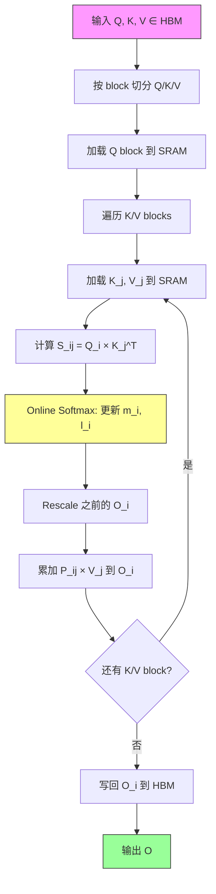
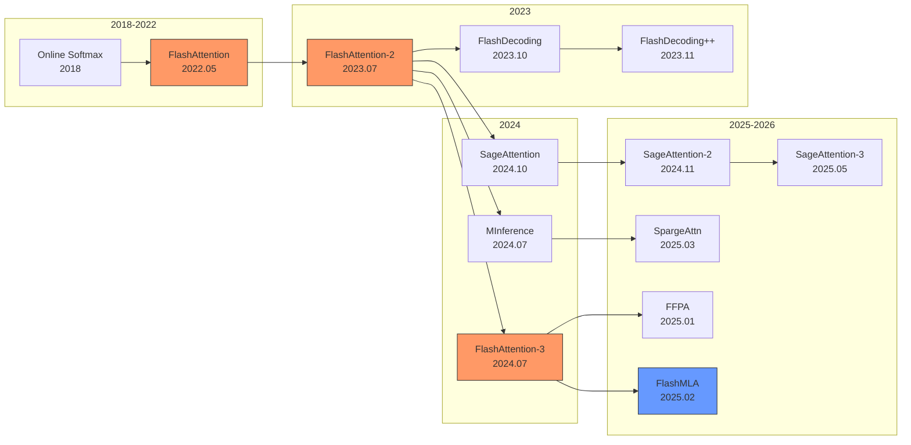

# Attention Kernel 数学与工程分析

## 1. Standard Attention 复杂度分析

### 1.1 Self-Attention 基本公式

给定输入序列 $X \in \mathbb{R}^{N \times d}$，Self-Attention 计算：

$$
\text{Attention}(Q, K, V) = \text{softmax}\left(\frac{QK^T}{\sqrt{d_h}}\right) V
$$

其中 $Q = XW_Q$, $K = XW_K$, $V = XW_V$，$W_Q, W_K, W_V \in \mathbb{R}^{d \times d_h}$。

**FLOPs 分析（单头）：**

| 操作 | 形状变换 | FLOPs |
|------|----------|-------|
| $QK^T$ | $(N \times d_h) \cdot (d_h \times N)$ | $2N^2 d_h$ |
| softmax | $(N \times N)$ | $5N^2$（exp, sum, div, max, sub） |
| $S \cdot V$ | $(N \times N) \cdot (N \times d_h)$ | $2N^2 d_h$ |
| **总计（单头）** | | $4N^2 d_h + 5N^2$ |
| **总计（$h$ 头）** | | $4N^2 d + 5hN^2$（其中 $d = h \cdot d_h$） |

**内存分析：**

- 存储 $S = QK^T$：$O(N^2)$ 元素（每头）
- 总 attention matrix 内存：$O(hN^2)$
- 对于 Llama-70B（$h=64$, $N=4096$, FP16）：$64 \times 4096^2 \times 2 = 2$ GB

### 1.2 Causal Mask 下的实际计算量

Causal mask 使得 $S_{ij} = -\infty$ for $j > i$，有效计算量为上三角的一半：

$$
\text{FLOPs}_{\text{causal}} = \frac{1}{2} \times 4N^2 d_h \times h = 2N^2 d
$$

但在 GPU 上，由于 warp 对齐和 tile 粒度，实际节省通常 < 50%。[FlashAttention-2](https://arxiv.org/abs/2307.08691) 通过 causal mask aware tiling 实现接近理论值的节省。

### 1.3 Roofline 定位

对于 A100 GPU（312 TFLOPS FP16, 2 TB/s HBM bandwidth）：

- Arithmetic Intensity of standard attention: $\frac{4N^2d_h}{2(2Nd_h + N^2)} \approx \frac{4N^2d_h}{2N^2} = 2d_h$
- 当 $d_h = 128$：AI = 256 ops/byte
- A100 ridge point: $312 \times 10^{12} / (2 \times 10^{12}) = 156$ ops/byte
- **Standard attention 理论上是 compute-bound**，但实际因 $N^2$ 中间矩阵的 HBM 读写变为 **memory-bound**

---

## 2. [FlashAttention](https://arxiv.org/abs/2205.14135) 系列

### 2.1 [FlashAttention](https://arxiv.org/abs/2205.14135)-1 (Dao et al., 2022)

**核心问题：** Standard attention 需要将 $N \times N$ 的 attention matrix 写入 HBM，导致 $O(N^2)$ 的 HBM 访问。

**核心思想：** Tiling + [Online Softmax](https://arxiv.org/abs/2112.05682) + Recomputation

**算法：**

将 $Q, K, V$ 分块为大小 $B_r \times d_h$ 和 $B_c \times d_h$ 的 tile：

```
for each Q block i (size B_r):
    for each K,V block j (size B_c):
        S_ij = Q_i @ K_j^T           # (B_r × B_c), in SRAM
        m_ij = rowmax(S_ij)           # online softmax
        P_ij = exp(S_ij - m_ij)       # in SRAM
        O_i = diag(correction) @ O_i + P_ij @ V_j  # accumulate
    end
end
```

**Online Softmax 数学推导：**

维护 running max $m^{(j)}$ 和 running sum $\ell^{(j)}$：

$$
m^{(j)} = \max(m^{(j-1)}, \tilde{m}^{(j)})
$$
$$
\ell^{(j)} = e^{m^{(j-1)} - m^{(j)}} \ell^{(j-1)} + e^{\tilde{m}^{(j)} - m^{(j)}} \tilde{\ell}^{(j)}
$$
$$
O^{(j)} = \text{diag}\left(\frac{e^{m^{(j-1)} - m^{(j)}} \ell^{(j-1)}}{\ell^{(j)}}\right) O^{(j-1)} + \frac{e^{\tilde{m}^{(j)} - m^{(j)}}}{\ell^{(j)}} \tilde{P}^{(j)} V_j
$$

**IO Complexity：**

$$
\text{HBM accesses} = O\left(\frac{N^2 d^2}{M}\right)
$$

其中 $M$ 为 SRAM 大小。对比 standard attention 的 $O(Nd + N^2)$，当 $M = O(Nd)$ 时 [FlashAttention](https://arxiv.org/abs/2205.14135) 的 IO 为 $O(N^2d / M) = O(N)$。

**SRAM Tiling 约束推导：**

SRAM 需同时容纳：
- $Q_i$ block: $B_r \times d_h$ 元素
- $K_j$ block: $B_c \times d_h$ 元素
- $S_{ij}$ block: $B_r \times B_c$ 元素
- $V_j$ block: $B_c \times d_h$ 元素
- $O_i$ accumulator: $B_r \times d_h$ 元素

约束：$(2B_r + 2B_c) \times d_h + B_r \times B_c \leq M$

最优 tile size（忽略 $S$ 项）：$B_r = B_c = \lceil M / (4d_h) \rceil$

A100 SRAM = 192 KB, $d_h = 128$, FP16:
- $B_r = B_c = 192 \times 1024 / (4 \times 128 \times 2) = 192$ rows

**时间复杂度：** $O(N^2 d)$（与 standard 相同）
**空间复杂度：** $O(N)$（无需存储完整 attention matrix）
**HBM 带宽利用率：** 接近峰值，因为 kernel 是 compute-bound

### 2.2 [FlashAttention-2](https://arxiv.org/abs/2307.08691) (Dao, 2023)

**改进点：**

1. **减少非 matmul FLOPs：** 将 rescaling 延迟到最后，减少 online softmax 的中间除法
2. **改进 work partitioning：**
   - FA-1: 外层循环 K/V blocks，内层循环 Q blocks → 每个 thread block 写回多个 Q 的部分结果
   - FA-2: 外层循环 Q blocks，内层循环 K/V blocks → 每个 thread block 只写一个 Q block 的最终结果
3. **Warp-level parallelism：**
   - FA-1: 4 warps 分别计算 $QK^T$ 的不同部分，需要 shared memory 通信
   - FA-2: 4 warps 分别处理不同的 K/V blocks，无需 warp 间同步

**性能提升：** 相比 FA-1 约 2x speedup，达到 A100 理论 FLOPS 的 50-73%。

**Causal mask 优化：** 跳过完全被 mask 的 tile（右上角），节省约 50% 计算。

### 2.3 [FlashAttention-3](https://arxiv.org/abs/2407.08608) (Shah et al., 2024)

**针对 Hopper (H100) 架构的优化：**

1. **Warp-specialization：**
   - Producer warps: 负责从 HBM 加载数据到 SRAM (TMA)
   - Consumer warps: 负责 GEMM 计算 (WGMMA)
   - 通过 async barrier 实现 overlap

2. **FP8 支持：**
   - 使用 E4M3 格式进行 $QK^T$ 和 $PV$ 的 matmul
   - Incoherent processing 减少量化误差
   - Block quantization with per-block scaling factors

3. **Asynchronous execution：**
   - Softmax 与下一个 tile 的 GEMM overlap
   - 利用 H100 的 TMA (Tensor Memory Accelerator) 实现异步数据搬运

**性能：** H100 上达到 740 TFLOPS (FP16)，接近理论峰值的 75%。

### 2.4 Roofline Model 对比

| 方法 | Arithmetic Intensity | A100 定位 | H100 定位 |
|------|---------------------|-----------|-----------|
| Standard Attention (实际) | ~4 ops/byte | Memory-bound | Memory-bound |
| [FlashAttention](https://arxiv.org/abs/2205.14135)-1 | ~128 ops/byte | Compute-bound | Compute-bound |
| [FlashAttention-2](https://arxiv.org/abs/2307.08691) | ~200 ops/byte | Compute-bound | Compute-bound |
| [FlashAttention-3](https://arxiv.org/abs/2407.08608) (FP8) | ~400 ops/byte | Compute-bound | Compute-bound |

---

## 3. [FlashDecoding](https://crfm.stanford.edu/2023/10/12/flashdecoding.html) / [FlashDecoding++](https://arxiv.org/abs/2311.01282)

### 3.1 Decode 阶段的瓶颈

Decode 阶段：$Q \in \mathbb{R}^{1 \times d_h}$（单 token），$K, V \in \mathbb{R}^{N \times d_h}$（完整 KV cache）。

- FLOPs: $4Nd_h$（极少）
- 数据量: $2Nd_h \times \text{bytes}$（读取 KV cache）
- Arithmetic Intensity: $4Nd_h / (2Nd_h \times 2) = 1$ op/byte (FP16)
- **纯 memory-bound 操作**

[FlashAttention](https://arxiv.org/abs/2205.14135) 在 decode 时的问题：外层循环只有 batch_size × num_heads 个并行单元，当 batch 小时 GPU 利用率低。

### 3.2 [Flash-Decoding](https://crfm.stanford.edu/2023/10/12/flashdecoding.html) (Dao et al., 2023)

**核心思想：** 在 sequence length 维度增加并行度。

**算法：**

```
Step 1: Split KV cache into S splits along sequence dimension
        Each split computes partial attention independently:
        - local_max[s], local_sum[s], local_out[s] for split s

Step 2: Reduce across splits (log-sum-exp correction):
        global_max = max(local_max[0], ..., local_max[S-1])
        For each split s:
            correction[s] = exp(local_max[s] - global_max)
        global_sum = sum(correction[s] * local_sum[s])
        O = sum(correction[s] * local_sum[s] * local_out[s]) / global_sum
```

**并行度：** batch × heads × num_splits（Split-K 策略）

**时间复杂度：** $O(Nd_h / P)$，$P$ 为并行度
**空间复杂度：** $O(S \times d_h)$ 额外空间存储 partial results
**带宽利用率：** 接近 HBM 峰值带宽（memory-bound kernel 的最优情况）

### 3.3 [FlashDecoding++](https://arxiv.org/abs/2311.01282) (Tsinghua & Infinigence-AI, 2023)

**改进：**

1. **Unified max value：** 使用预设的 flat SOFTMAX（避免两次 pass）
   - 预估 attention score 的 max 值，避免 reduction 步骤
   - 当预估不准时 fallback 到标准 log-sum-exp

2. **Asynchronous softmax with double buffering**

3. **支持 [GQA](https://arxiv.org/abs/2305.13245) 的优化 layout**

---

## 4. GQA/MQA 分析

### 4.1 演进路线

| 方法 | KV Heads | 参数量 | KV Cache 大小 |
|------|----------|--------|---------------|
| MHA (Multi-Head Attention) | $h$ | $3hd_h \cdot d$ | $2 \times h \times d_h \times N \times B$ |
| [MQA](https://arxiv.org/abs/1911.02150) (Multi-Query Attention) | 1 | $(h+2)d_h \cdot d$ | $2 \times 1 \times d_h \times N \times B$ |
| [GQA](https://arxiv.org/abs/2305.13245) (Grouped-Query Attention) | $g$ | $(h+2g)d_h \cdot d$ | $2 \times g \times d_h \times N \times B$ |

### 4.2 KV Cache 内存公式

$$
\text{KV Cache Size} = 2 \times n_{\text{kv\_heads}} \times d_{\text{head}} \times \text{seq\_len} \times \text{batch\_size} \times \text{bytes\_per\_element}
$$

**典型模型对比（seq_len=4096, batch=1, FP16）：**

| 模型 | $n_{\text{kv\_heads}}$ | $d_h$ | Layers | KV Cache |
|------|------------------------|--------|--------|----------|
| Llama-2-7B (MHA) | 32 | 128 | 32 | 2 × 32 × 128 × 4096 × 32 × 2 = 2 GB |
| Llama-2-7B ([GQA](https://arxiv.org/abs/2305.13245), 假设 g=8) | 8 | 128 | 32 | 512 MB |
| Llama-2-70B ([GQA](https://arxiv.org/abs/2305.13245), g=8) | 8 | 128 | 80 | 1.28 GB |
| [DeepSeek-V2](https://arxiv.org/abs/2405.04434) (MLA) | 等效 ~1 | 512 | 60 | ~500 MB |

### 4.3 [GQA](https://arxiv.org/abs/2305.13245) 的 Compute 影响

[GQA](https://arxiv.org/abs/2305.13245) 不改变 attention 的 FLOPs（Q 仍然是 $h$ 头），只减少 KV cache 的内存和带宽需求：

- Prefill: 计算量不变，但 KV projection 参数减少
- Decode: 带宽需求降低 $h/g$ 倍（读取更少的 KV cache）
- Decode throughput 提升约 $h/g$ 倍（memory-bound 场景）

### 4.4 GPU Occupancy 分析

MQA/GQA 减少 shared memory 占用（KV tile 更小），允许更多 thread blocks 同时驻留：

$$
\text{Occupancy} = \frac{\text{Active Warps per SM}}{\text{Max Warps per SM}}
$$

[GQA](https://arxiv.org/abs/2305.13245) 使得每个 thread block 的 shared memory 需求从 $(2h + 1) \times B_c \times d_h$ 降至 $(h + g + 1) \times B_c \times d_h$。

---

## 5. [PagedAttention](https://arxiv.org/abs/2309.06180)

### 5.1 问题背景

传统 KV cache 分配：为每个 sequence 预分配 max_seq_len 的连续内存。

- 内部碎片：实际 seq_len < max_seq_len 时浪费
- 外部碎片：不同 sequence 长度不同，内存无法复用
- 典型浪费率：60-80%

### 5.2 Block-level Memory Management

**设计（类比 OS 虚拟内存）：**

- **Physical Block：** GPU 内存中固定大小的 KV cache 块（如 16 tokens）
- **Logical Block：** 每个 sequence 的逻辑地址空间
- **Block Table：** logical block → physical block 的映射

```
Block size = block_size × num_heads × head_dim × 2 (K+V) × dtype_bytes
           = 16 × 32 × 128 × 2 × 2 = 256 KB (per block, Llama-7B, FP16)
```

**内存利用率：** 接近 100%（仅最后一个 block 有内部碎片，平均浪费 block_size/2 tokens）

### 5.3 Copy-on-Write for Beam Search

Beam search 中多个 beam 共享前缀的 KV cache：

```
Beam 1: [Block A] → [Block B] → [Block C]
Beam 2: [Block A] → [Block B] → [Block D]  (fork at step 3)
```

- Block A, B 的 ref_count = 2
- 当某个 beam 需要修改共享 block 时，才复制（Copy-on-Write）
- 内存节省：$1 - 1/\text{beam\_width}$（前缀部分）

### 5.4 性能分析

**时间复杂度：** 与连续 KV cache 相同 $O(Nd_h)$
**空间复杂度：** $O(N)$，但利用率从 ~20-40% 提升到 ~96%
**额外开销：**
- Block table lookup: 可忽略（O(1) per block）
- 非连续内存访问：通过 custom CUDA kernel 中的 gather 操作处理，overhead < 5%

**Throughput 提升：** 由于内存利用率提高，可服务 2-4x 更多并发请求。

---

## 6. [RadixAttention](https://arxiv.org/abs/2312.07104)

### 6.1 Radix Tree for Prefix Sharing

**问题：** 多个请求共享相同的 system prompt 或 few-shot examples，重复计算和存储 KV cache。

**数据结构：** Radix tree（压缩前缀树），节点存储 token 序列对应的 KV cache blocks。

```
Root
├── "You are a helpful assistant..." → [KV blocks 0-3]
│   ├── "Translate to French:" → [KV blocks 4-5]
│   │   ├── "Hello world" → [KV blocks 6]
│   │   └── "Good morning" → [KV blocks 6']
│   └── "Summarize:" → [KV blocks 4'-5']
└── "System: You are a coder..." → [KV blocks 0'-3']
```

### 6.2 Cache Hit Rate 分析

**LRU Eviction + Radix Matching：**

$$
\text{Hit Rate} = \frac{\sum_{r \in \text{requests}} \text{shared\_prefix\_len}(r)}{\sum_{r \in \text{requests}} \text{total\_len}(r)}
$$

典型场景的 hit rate：
- 相同 system prompt: 30-60%（取决于 prompt 长度占比）
- Few-shot learning: 50-80%
- Multi-turn conversation: 70-90%（前几轮完全命中）
- RAG with shared context: 40-70%

**时间复杂度：**
- Lookup: $O(L)$，$L$ 为 prefix 长度
- Insert: $O(L)$
- Eviction: $O(1)$（LRU）

**空间节省：**

$$
\text{Memory Saved} = \text{num\_shared\_requests} \times \text{shared\_prefix\_len} \times \text{per\_token\_kv\_size}
$$

---

## 7. Sparse Attention

### 7.1 [StreamingLLM](https://arxiv.org/abs/2309.17453) — Attention Sink (Xiao et al., 2023)

**观察：** Attention score 集中在：
1. 前几个 token（"attention sink"），无论语义相关性
2. 局部窗口内的 token

**方法：** 保留 $k$ 个 sink tokens + sliding window of size $w$：

$$
\text{KV Cache} = \text{KV}[0:k] \cup \text{KV}[t-w:t]
$$

**复杂度：**
- 时间：$O((k+w) \times d_h)$ per token（decode）
- 空间：$O((k+w) \times d_h)$（固定，不随 seq_len 增长）
- 适用：无限长度 streaming 推理

**精度损失：** 对于需要远距离依赖的任务（如 retrieval）有明显退化。

### 7.2 [H2O](https://arxiv.org/abs/2306.14048) — Heavy Hitter Oracle (Zhang et al., 2023)

**观察：** 少量 token 累积了大部分 attention score（Heavy Hitters）。

**方法：** 动态维护 top-$k$ heavy hitter tokens + recent window：

$$
\text{Score}(t) = \sum_{i} \text{attn}_{i,t} \quad \text{(cumulative attention received)}
$$

保留策略：$\text{KV Cache} = \text{TopK}(\text{Score}, k) \cup \text{Recent}(w)$

**复杂度：**
- 时间：$O((k+w) \times d_h)$ + $O(N \log k)$ for top-k maintenance
- 空间：$O((k+w) \times d_h)$
- 压缩率：可达 5-10x

### 7.3 [Quest](https://arxiv.org/abs/2406.10774) (MIT Han Lab, 2024)

**核心思想：** Query-aware sparsity — 根据当前 query 动态选择相关的 KV cache pages。

**方法：**
1. 将 KV cache 分为 pages（每 page $p$ tokens）
2. 每个 page 维护 key 的 min/max 统计量
3. 用 query 与 page 统计量计算 upper bound of attention score
4. 只加载 top-$k$ pages 进行精确计算

$$
\text{Upper Bound}(q, \text{page}_j) = \sum_{d} \max(q_d \cdot \text{key\_max}_{j,d}, \; q_d \cdot \text{key\_min}_{j,d})
$$

**复杂度：**
- Page selection: $O(N/p \times d_h)$
- Attention computation: $O(k \times p \times d_h)$
- 总计: $O(N d_h / p + kp d_h)$，当 $kp \ll N$ 时显著加速

### 7.4 [MInference](https://arxiv.org/abs/2407.02490) (Microsoft, 2024)

**观察：** Long-context prefill 中 attention 呈现三种稀疏模式：
1. **A-shape：** 前几个 token 获得高 attention（类似 sink）
2. **Vertical-Slash：** 特定位置的 token 被所有 query attend
3. **Block-Sparse：** 局部块状 attention

**方法：** 为每个 head 离线确定其稀疏模式，推理时只计算非零区域。

**加速比：** Prefill 阶段 1M context 下约 10x speedup。

### 7.5 [SampleAttention](https://arxiv.org/abs/2406.15486) (2024)

**方法：** 两阶段近似：
1. 用低精度/低维度的 query-key 近似快速筛选 candidate tokens
2. 对 candidates 进行精确 attention 计算

**数学表达：**

$$
\hat{A} = \text{softmax}\left(\frac{Q_{\text{low}} K_{\text{low}}^T}{\sqrt{d'}}\right) \quad \text{(approximate, } d' \ll d_h\text{)}
$$
$$
\text{Selected} = \text{TopK}(\hat{A}, k)
$$
$$
O = \text{softmax}\left(\frac{Q K_{\text{Selected}}^T}{\sqrt{d_h}}\right) V_{\text{Selected}}
$$

### 7.6 稀疏 Attention 方法对比

| 方法 | 时间复杂度 | 空间复杂度 | 适用阶段 | 精度保持 |
|------|-----------|-----------|----------|----------|
| [StreamingLLM](https://arxiv.org/abs/2309.17453) | $O((k+w)d_h)$ | $O((k+w)d_h)$ | Decode | 中（丢失远距离信息） |
| [H2O](https://arxiv.org/abs/2306.14048) | $O((k+w)d_h)$ | $O((k+w)d_h)$ | Decode | 较好 |
| [Quest](https://arxiv.org/abs/2406.10774) | $O(Nd_h/p + kpd_h)$ | $O(Nd_h)$ | Decode | 好（有 bound 保证） |
| [MInference](https://arxiv.org/abs/2407.02490) | $O(\alpha N^2 d_h)$, $\alpha \ll 1$ | $O(N d_h)$ | Prefill | 好（pattern-aware） |
| [SampleAttention](https://arxiv.org/abs/2406.15486) | $O(Nd' + kd_h)$ | $O(Nd_h)$ | Both | 好 |

**Roofline 定位：**
- 所有 sparse attention 方法在 decode 阶段仍为 memory-bound（减少的是数据量而非计算密度）
- Prefill 阶段的 sparse methods 可能从 compute-bound 转为 memory-bound（计算量大幅减少但数据访问模式变差）

---

## 附录：GPU Occupancy 与 Kernel 设计要点

### A.1 Occupancy 计算

$$
\text{Occupancy} = \min\left(\frac{\text{Max Blocks per SM}}{\lceil \text{Registers per Block} / \text{Registers per SM} \rceil}, \frac{\text{Shared Mem per SM}}{\text{Shared Mem per Block}}\right)
$$

[FlashAttention](https://arxiv.org/abs/2205.14135) kernel 的典型配置（A100）：
- Shared memory per block: 96-164 KB（A100 max 164 KB configurable）
- Registers per thread: 128-255
- Threads per block: 128-256（4-8 warps）
- Achieved occupancy: 50-75%

### A.2 Memory-bound vs Compute-bound 判定

$$
\text{If } \frac{\text{FLOPs}}{\text{Bytes Accessed}} > \frac{\text{Peak FLOPS}}{\text{Peak Bandwidth}} \Rightarrow \text{Compute-bound}
$$

A100: Ridge point = 156 ops/byte (FP16), 312 ops/byte (FP8/INT8)
H100: Ridge point = 267 ops/byte (FP16), 534 ops/byte ([FP8](https://arxiv.org/abs/2209.05433))

| Kernel | AI (ops/byte) | A100 Bound | H100 Bound |
|--------|---------------|------------|------------|
| Standard Attn (materialized) | ~4 | Memory | Memory |
| [FlashAttention](https://arxiv.org/abs/2205.14135) Prefill | ~128-200 | Compute | Compute |
| Decode (single query) | ~1 | Memory | Memory |
| [Flash-Decoding](https://crfm.stanford.edu/2023/10/12/flashdecoding.html) | ~1 | Memory | Memory |
| GEMM (large) | ~128-256 | Compute | Compute |

---

## 附录：Mermaid 图

### [FlashAttention](https://arxiv.org/abs/2205.14135) Tiling 流程



### Attention Kernel 演进时间线



