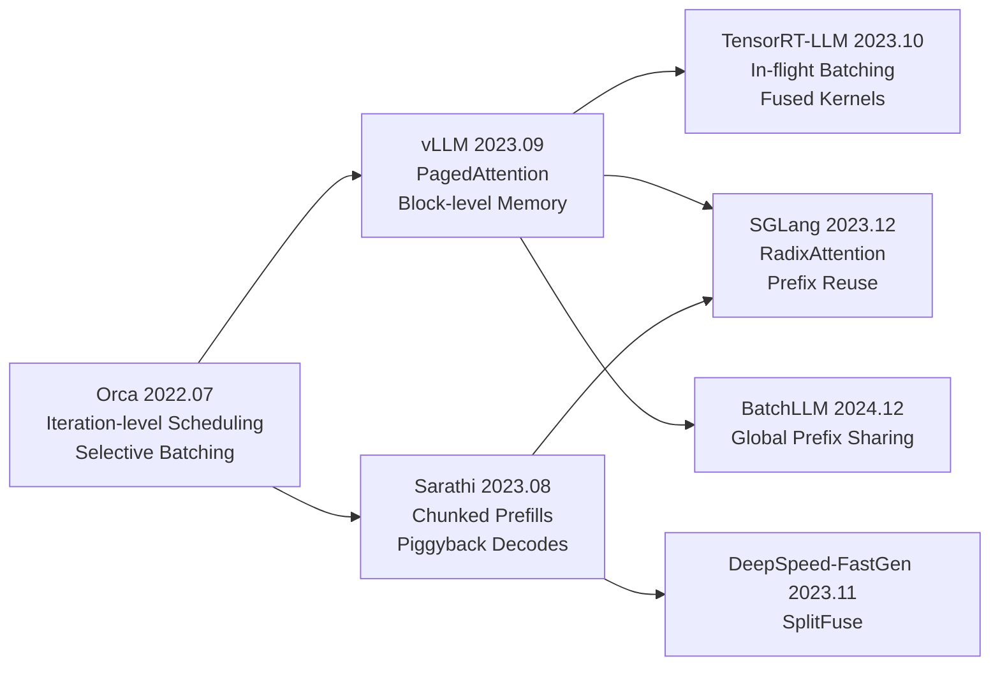

# Serving Framework 与 Scheduling 深度分析

**证据等级说明**：
- `[verified_by_paper]` — 论文中有明确实验数据支撑
- `[verified_by_code]` — 开源代码中可直接验证
- `[derived_analysis]` — 基于多个来源的综合分析推导
- `[unverified_claim]` — 来自博客/社区报告，未经独立验证

## 1. [Continuous Batching](https://www.usenix.org/system/files/osdi22-yu.pdf) 机制详解

### 1.1 问题定义

传统 static batching 要求同一 batch 内所有请求同时开始、同时结束。由于 LLM 生成长度不可预测，短请求必须等待最长请求完成，导致 GPU 利用率低下（通常 < 30%）。

### 1.2 演进路线：[Orca](https://www.usenix.org/conference/osdi22/presentation/yu) → [vLLM](https://github.com/vllm-project/vllm) → [TensorRT-LLM](https://github.com/NVIDIA/TensorRT-LLM) → [SGLang](https://github.com/sgl-project/sglang)

#### [Orca](https://www.usenix.org/conference/osdi22/presentation/yu) (2022.07, Seoul National University)
- **方法核心**: Iteration-level scheduling — 每个 iteration（一次 forward pass）独立调度，请求完成即释放资源
- **系统机制**: 
  - Selective batching: 区分 prefill 和 decode 请求，分别组 batch
  - 请求级别的 preemption 和 insertion
- **实验指标**: 相比 static batching，吞吐提升 36.9x（极端场景）`[verified_by_paper]`
- **工程难点**: 需要重写 attention kernel 支持 variable-length sequences in a batch
- **影响**: 所有后续 serving 系统的基础范式 `[verified_by_paper]`

#### [vLLM](https://github.com/vllm-project/vllm) (2023.09, UC Berkeley)
- **方法核心**: [PagedAttention](https://arxiv.org/abs/2309.06180) — 将 KV cache 按固定大小 block 分配，通过 block table 间接寻址
- **系统机制**:
  - Block manager: 维护 physical block 的 free list
  - Copy-on-write: parallel sampling 时共享 prefix blocks
  - Preemption: swap to CPU 或 recomputation
  - All-or-nothing scheduling: 保证请求要么完全分配到资源，要么不调度
- **实验指标**: 相比 [FasterTransformer](https://github.com/NVIDIA/FasterTransformer)，吞吐提升 2-4x；内存浪费从 60-80% 降至 < 4% `[verified_by_paper]`
- **工程难点**: 
  - Paged attention kernel 需要 gather/scatter 操作，引入额外 overhead
  - Block size 选择影响内存效率和 kernel 性能的 tradeoff
- **对后续系统影响**: 几乎所有系统都采用了某种形式的 paged/blocked KV cache

#### [TensorRT-LLM](https://github.com/NVIDIA/TensorRT-LLM) (2023.10, NVIDIA)
- **方法核心**: [In-flight Batching](https://nvidia.github.io/TensorRT-LLM/features/paged-attention-ifb-scheduler.html) — NVIDIA 对 continuous batching 的工程实现，深度集成 TensorRT 编译优化
- **系统机制**:
  - Batch Manager: 管理 active/waiting/paused 请求队列
  - Paged KV cache with [FP8](https://arxiv.org/abs/2209.05433) support
  - Fused kernels: 将多个操作融合减少 kernel launch overhead
  - GptSession API: 封装完整推理流程
- **实验指标**: 在 NVIDIA GPU 上通常是 latency 最优的选择
- **工程难点**: 
  - 闭源组件多，调试困难
  - 模型转换流程复杂（需要 build engine）
  - 版本迭代快，API 不稳定

#### [SGLang](https://github.com/sgl-project/sglang) (2023.12, Stanford/UC Berkeley)
- **方法核心**: [RadixAttention](https://arxiv.org/abs/2312.07104) — 用 radix tree 组织所有 KV cache，自动发现和复用任意前缀
- **系统机制**:
  - Radix tree: 每个节点对应一段 token sequence 的 KV cache
  - LRU eviction: 基于 LRU 策略淘汰不活跃的 tree nodes
  - Chunked prefill: 将长 prefill 拆分为 chunks 与 decode 交错执行
  - Structured generation: constrained decoding 与 scheduling 协同优化
- **实验指标**: 在多轮对话场景比 [vLLM](https://github.com/vllm-project/vllm) 快 5x（prefix hit rate 高时）`[verified_by_paper]`
- **工程难点**:
  - Radix tree 维护开销（insert/evict/match）
  - 与 tensor parallelism 的交互复杂
  - Cache-aware scheduling 需要预测 prefix match

### 1.3 [Continuous Batching](https://www.usenix.org/system/files/osdi22-yu.pdf) 演进 Mermaid 图

---

## 2. Prefix caching 技术演进

### 2.1 问题定义

多个请求共享相同的 system prompt 或 context prefix 时，重复计算 prefill 浪费大量算力。Prefix caching 旨在复用已计算的 KV cache。

### 2.2 演进路线

#### [Prompt Cache](https://arxiv.org/abs/2311.04934) (2023.11, Yale University)
- **方法核心**: 预定义 prompt modules（可复用的 attention state segments）
- **系统机制**: 用户显式标注可缓存的 prompt 片段，系统存储对应 KV cache
- **局限**: 需要用户手动标注，不够自动化

#### [RadixAttention](https://arxiv.org/abs/2312.07104) / [SGLang](https://github.com/sgl-project/sglang) (2023.12, Stanford)
- **方法核心**: 用 radix tree 自动管理所有历史 KV cache，任意前缀匹配
- **系统机制**:
  - Token sequence 作为 key，KV cache blocks 作为 value
  - 新请求到来时，在 radix tree 中做 longest prefix match
  - 匹配到的部分直接复用，未匹配部分做 prefill
  - LRU eviction 管理内存
- **优势**: 完全自动，无需用户标注；支持任意粒度的前缀复用
- **实验指标**: 多轮对话 5x speedup，few-shot learning 3x speedup

#### [ChunkAttention](https://arxiv.org/abs/2402.15220) (2024.02, Microsoft)
- **方法核心**: Prefix-aware KV cache + two-phase partition
- **系统机制**:
  - Phase 1: 检测 batch 内请求的共享前缀，构建 prefix tree
  - Phase 2: 对共享前缀部分使用 shared attention kernel，非共享部分独立计算
  - 在 attention kernel 层面实现前缀共享（不仅是 cache 复用）
- **优势**: 减少 memory bandwidth（共享前缀只读一次）
- **工程难点**: 需要特殊的 attention kernel 支持 tree-structured KV cache

#### [CacheBlend](https://arxiv.org/abs/2405.16444) (2024.05, University of Chicago)
- **方法核心**: 部分复用 cached KV + selective recomputation 融合
- **系统机制**:
  - 对 cached KV cache 做 partial recomputation（只重算部分 layer/token）
  - 通过 attention score 判断哪些 cached KV 需要 refresh
  - 在精度和速度之间取得平衡
- **优势**: 解决 prefix caching 在 context 变化时的精度下降问题
- **实验指标**: 相比完全 recompute 节省 2.2-3.3x 计算，精度损失 < 1%

### 2.3 Prefix caching 对比

| 方法 | 自动化程度 | 粒度 | 精度保证 | 适用场景 |
|------|-----------|------|---------|---------|
| [Prompt Cache](https://arxiv.org/abs/2311.04934) | 手动标注 | Module级 | 精确 | 固定 system prompt |
| [RadixAttention](https://arxiv.org/abs/2312.07104) | 全自动 | Token级 | 精确 | 多轮对话、agent |
| [ChunkAttention](https://arxiv.org/abs/2402.15220) | 全自动 | Chunk级 | 精确 | Batch 内共享前缀 |
| [CacheBlend](https://arxiv.org/abs/2405.16444) | 全自动 | Layer级 | 近似 | RAG、变化 context |
| [Hydragen](https://arxiv.org/abs/2402.05099) | 全自动 | Prefix级 | 精确 | 高吞吐共享前缀 |

---

## 3. Disaggregated Prefill/Decode 架构

### 3.1 问题定义

Prefill 阶段是 compute-bound（大量矩阵乘法），decode 阶段是 memory-bound（逐 token 生成，受 KV cache 读取带宽限制）。将两者混合在同一 GPU 上导致：
- Prefill 的长计算阻塞 decode 请求的低延迟需求
- 两种 workload 的最优 batch size 和并行策略不同
- 资源利用率难以同时优化

### 3.2 系统分析

#### [DistServe](https://arxiv.org/abs/2401.09670) (2024.01, PKU)
- **方法核心**: Goodput-optimized disaggregation — 将 prefill 和 decode 分配到不同 GPU 集群
- **系统机制**:
  - Prefill cluster: 大 batch、高 compute utilization
  - Decode cluster: 小 batch、低 latency
  - KV cache transfer: prefill 完成后通过 RDMA/NVLink 传输 KV cache 到 decode 节点
  - Placement algorithm: 基于 SLO 约束优化 prefill/decode 的 GPU 分配比例
- **实验指标**: 相比 colocated serving，在满足 SLO 的前提下 goodput 提升 1.5-2.3x `[verified_by_paper]`
- **工程难点**:
  - KV cache 传输延迟（尤其是跨节点）
  - Prefill/decode 比例的动态调整
  - 负载不均衡时的资源浪费

#### [Mooncake](https://arxiv.org/abs/2407.00079) (2024.06, Moonshot AI)
- **方法核心**: KVCache-centric disaggregated architecture
- **系统机制**:
  - KVCache Pool: 独立的分布式 KV cache 存储层
  - Prefill nodes: 计算 KV cache 并写入 pool
  - Decode nodes: 从 pool 读取 KV cache 进行生成
  - Cache-aware scheduling: 优先调度到已有 cached KV 的节点
  - Prediction-based prefetching: 预测下一步需要的 KV cache 并预取
- **实验指标**: 在 Moonshot AI 生产环境验证，支持长 context 场景
- **工程难点**:
  - 分布式 KV cache 的一致性和可用性
  - 网络带宽成为瓶颈（KV cache 体积大）
  - Cache eviction 策略对性能影响大

#### [Splitwise](https://arxiv.org/abs/2311.18677) (2023.11, Microsoft)
- **方法核心**: Phase splitting — 基于 profiling 将 prefill/decode 分配到异构硬件
- **系统机制**:
  - 分析 prefill 和 decode 的 compute/memory 需求
  - Prefill 分配到 compute-rich 节点，decode 分配到 memory-bandwidth-rich 节点
  - 支持同构和异构 GPU 集群
- **工程难点**: 异构集群管理复杂度高

#### [MegaScale-Infer](https://arxiv.org/abs/2504.02263) (2025.04, ByteDance Seed)
- **方法核心**: [MoE](https://arxiv.org/abs/2407.06204) 模型的 disaggregated expert parallelism
- **系统机制**:
  - 将 attention 和 expert 计算分离到不同 GPU 组
  - Expert parallelism: 每个 GPU 只存储部分 experts
  - All-to-all communication 在 expert 组内完成
  - Prefill/decode 进一步在 expert 层面 disaggregate
- **实验指标**: 支持 [DeepSeek-V3](https://arxiv.org/abs/2412.19437) 级别 MoE 模型的高效推理
- **工程难点**:
  - All-to-all 通信开销
  - Expert load balancing
  - 多级 disaggregation 的调度复杂度

### 3.3 Disaggregated Architecture Mermaid 图

```mermaid
graph TB
    subgraph "Colocated (Traditional)"
        GPU1[GPU: Prefill + Decode Mixed]
    end

    subgraph "Disaggregated (DistServe/Mooncake)"
        PF[Prefill Cluster<br>Compute-bound<br>Large Batch]
        DC[Decode Cluster<br>Memory-bound<br>Low Latency]
        KV[KV Cache Transfer<br>RDMA/NVLink]
        PF --> KV --> DC
    end

    subgraph "KVCache-Centric (Mooncake)"
        PF2[Prefill Nodes]
        DC2[Decode Nodes]
        KVPOOL[Distributed<br>KV Cache Pool]
        PF2 --> KVPOOL
        KVPOOL --> DC2
    end

    subgraph "MoE Disaggregated (MegaScale-Infer)"
        ATT[Attention Nodes]
        EXP[Expert Nodes]
        A2A[All-to-All Comm]
        ATT --> A2A --> EXP
    end
```

---

## 4. Scheduler 设计模式

### 4.1 FCFS (First-Come-First-Served)
- **代表**: 早期 serving 系统默认策略
- **特点**: 简单公平，但 head-of-line blocking 严重
- **问题**: 长请求阻塞短请求，平均延迟高

### 4.2 SJF (Shortest-Job-First)
- **代表**: [Efficient LLM Scheduling by Learning to Rank](https://arxiv.org/abs/2408.15792) (2024.08)
- **方法核心**: 训练一个轻量模型预测请求的输出长度，按预测长度排序调度
- **系统机制**:
  - 用历史数据训练 output length predictor
  - 新请求到来时预测长度，插入优先队列
  - 短请求优先执行，减少平均等待时间
- **实验指标**: 相比 FCFS，平均 JCT (Job Completion Time) 降低 2.8x `[verified_by_paper]`
- **工程难点**: 预测不准确时可能导致 starvation

### 4.3 Priority-Based
- **代表**: [FastServe](https://arxiv.org/abs/2305.05920) (2023.05)
- **方法核心**: Preemptive scheduling with priority
- **系统机制**:
  - 基于请求属性（用户等级、deadline）分配优先级
  - 高优先级请求可 preempt 低优先级请求
  - Preempted 请求的 KV cache swap to CPU 或 discard
- **工程难点**: Preemption 开销（swap/recompute）

### 4.4 SLO-Aware
- **代表**: Towards SLO-Optimized LLM Serving (2024.08)
- **方法核心**: 根据 SLO (Service Level Objective) 约束动态调整调度策略
- **系统机制**:
  - 定义 TTFT (Time-To-First-Token) 和 TPOT (Time-Per-Output-Token) SLO
  - 监控实时 SLO 达成率
  - 动态调整 batch size、prefill/decode 比例、preemption 策略
  - Auto-tuning inference engine parameters
- **实验指标**: 在满足 P99 SLO 的前提下最大化吞吐

### 4.5 Layer-Wise KV Cache Scheduling
- **代表**: [LayerKV](https://arxiv.org/abs/2410.00428) (2024.10, Ant Group)
- **方法核心**: 不同 layer 的 KV cache 采用不同的调度策略
- **系统机制**:
  - 分析各 layer KV cache 的重要性（attention score 分布）
  - 重要 layer 保留完整 KV cache，不重要 layer 做压缩/eviction
  - Layer-wise budget allocation

---

## 5. Memory Management 策略

### 5.1 [PagedAttention](https://arxiv.org/abs/2309.06180) (vLLM, 2023.09)
- **核心思想**: 借鉴 OS 虚拟内存分页
- **机制**:
  - Physical blocks: 固定大小的连续 GPU 内存块
  - Block table: 逻辑 block → physical block 的映射
  - 按需分配: 只在需要时分配新 block
  - Copy-on-write: fork 时共享 blocks，写时复制
- **优势**: 内存碎片 < 4%，支持 parallel sampling 无额外内存
- **代价**: Paged attention kernel 有 ~5% 性能开销（gather/scatter）

### 5.2 [vAttention](https://arxiv.org/abs/2405.04437) (Microsoft Research India, 2024.05)
- **核心思想**: 利用 OS 虚拟内存机制，避免 paged attention kernel 开销
- **机制**:
  - 为每个请求分配连续的虚拟地址空间
  - 通过 OS page fault 机制按需分配物理页
  - Attention kernel 看到的是连续内存，无需特殊 paged kernel
  - 利用 CUDA virtual memory management API
- **优势**: 无 paged attention kernel 开销，可直接使用 [FlashAttention](https://arxiv.org/abs/2205.14135)
- **代价**: 依赖 OS/CUDA VMM 支持，虚拟地址空间有限

### 5.3 [vTensor](https://arxiv.org/abs/2407.15309) (SJTU, 2024.07)
- **核心思想**: 弹性虚拟 tensor 管理
- **机制**:
  - 将 KV cache 抽象为 virtual tensor
  - 支持动态 resize（grow/shrink）
  - 底层通过 memory pool 管理物理内存
  - 支持跨设备（GPU/CPU/SSD）的透明迁移
- **优势**: 更灵活的内存管理，支持异构存储层次
- **适用**: 长 context 场景，KV cache 超出 GPU 内存

### 5.4 对比总结

| 策略 | 内存效率 | Kernel 开销 | 实现复杂度 | 适用场景 |
|------|---------|------------|-----------|---------|
| Static Allocation | 低（预分配最大长度） | 无 | 低 | 固定长度 batch |
| [PagedAttention](https://arxiv.org/abs/2309.06180) | 高（< 4% 浪费） | ~5% | 中 | 通用 serving |
| [vAttention](https://arxiv.org/abs/2405.04437) | 高 | 无 | 高（依赖 VMM） | 高性能 serving |
| [vTensor](https://arxiv.org/abs/2407.15309) | 高 | 低 | 高 | 长 context / 异构 |

---

## 6. 综合分析：关键工程挑战

### 6.1 Prefill-Decode 干扰
- Prefill 的大量计算会阻塞 decode 请求的 TTFT/TPOT
- 解决方案：chunked prefill ([Sarathi](https://arxiv.org/abs/2308.16369))、disaggregation ([DistServe](https://arxiv.org/abs/2401.09670))、priority scheduling

### 6.2 KV Cache 内存墙
- 长 context 下 KV cache 占用远超模型权重
- 解决方案：quantization、compression、offloading、distributed KV cache

### 6.3 负载波动
- 请求到达率和长度分布高度不均匀
- 解决方案：auto-scaling、SLO-aware scheduling、elastic resource allocation

### 6.4 多租户隔离
- 不同用户/应用的 SLO 要求不同
- 解决方案：priority-based scheduling、resource quota、fairness guarantee

### 6.5 长尾延迟
- P99 延迟远高于 P50，影响用户体验
- 解决方案：preemption、request migration、tail-latency-aware scheduling

---

## 最新进展 (2025-2026)

### [STAR](https://arxiv.org/abs/2510.13668) (2025)

**问题**: 在Prefill-Decode disaggregated架构中，decode实例间存在严重的负载不均衡问题——长输出的reasoning任务会导致部分decode实例过载而其他实例空闲。

**方法**: 提出decode阶段的请求重调度算法，通过监控各decode实例的负载状态，在运行时将请求从过载实例迁移到空闲实例；重调度决策基于请求的剩余生成长度预估和实例当前队列深度。

**关键结果**:
- 长度预测 MAE 降低 49.42%，预测器参数量减少 93.28% `[verified_by_paper]`
- P99 TPOT 降低 75.1%，Goodput 提升 2.63x `[verified_by_paper]`
- 针对长输出 reasoning 任务（CoT）场景效果显著 `[verified_by_paper]`

**工程启示**: disaggregated serving 不仅需要优化 prefill-decode 分离，还需要关注 decode 实例间的动态负载均衡；LLM hidden states 是预测生成长度的有效信号源，无需额外模型；对于输出长度方差大的 workload（如 CoT 推理），重调度机制是必要的。

**局限性**: 请求迁移涉及 KV cache 传输开销；预测器依赖 hidden states 访问，需要与推理引擎深度集成 `[verified_by_paper]`。

---

### [PPD Disaggregation](https://arxiv.org/abs/2603.13358) (2026)

**问题**: 传统Prefill-Decode两级disaggregation在多轮对话场景下效率低下——每轮对话的append-prefill（处理新用户输入+已有KV cache）与首轮full-prefill的计算特征差异大，混合处理导致资源浪费和大量KV cache跨节点传输。

**方法**: 区分full-prefill和append-prefill两种不同的prefill类型，提出三级Prefill-Prefill-Decode disaggregation架构；将append-prefill请求路由到已持有对应KV cache的节点，避免跨节点KV传输；针对两种prefill类型分别优化资源配置。

**关键结果**:
- 多轮对话场景下 KV 传输带宽消耗减少一个数量级 `[verified_by_paper]`
- Turn 2+ TTFT 降低约 68%，TPOT 保持竞争力 `[verified_by_paper]`
- ICML 2026 录用 `[verified_by_paper]`

**工程启示**: 多轮对话是生产环境的主要 workload 模式，PPD 架构直接解决了实际部署痛点；KV cache locality-aware routing 是减少网络开销的关键；不存在单一最优路由策略，需要根据 SLO 动态调整。

**局限性**: 三级架构增加了系统复杂度和调度决策空间；需要维护 KV cache 位置的全局元数据；与 Mooncake 的 KVCache Pool 思路互补但方法不同 `[verified_by_paper]`。

---

### [Fluid-Guided Online Scheduling](https://arxiv.org/abs/2504.11320) (2025)

**问题**: LLM推理调度面临内存约束下的在线优化难题——请求到达时间和生成长度未知，需要在有限GPU内存下最大化吞吐量同时满足延迟SLO。

**方法**: 将LLM推理调度建模为流体近似（fluid approximation）的在线优化问题；通过连续松弛将离散调度决策转化为可求解的凸优化；考虑KV cache内存约束作为容量限制，推导出具有理论保证的在线调度策略。

**关键结果**:
- 提出具有理论最优性保证的在线调度策略（WAIT 和 Nested WAIT 算法）`[verified_by_paper]`
- 扩大稳定运行区域，在接近过载和过载 regime 下显著降低延迟 `[verified_by_paper]`
- 论文含完整理论证明（69 页），渐近逼近流体基准 `[verified_by_paper]`

**工程启示**: 流体近似为 LLM 调度提供了理论框架，可指导启发式算法设计和容量规划；内存约束是 LLM 调度的核心瓶颈，显式建模比隐式处理更有效；适用于负载接近系统容量上限的场景。

**局限性**: 流体近似在请求到达率波动大时精度下降；基于 Vidur 模拟器验证，实际系统集成需额外工程 `[verified_by_paper]`。

---

### [DuetServe](https://arxiv.org/abs/2511.04791) (2025)

**问题**: 完全物理隔离prefill和decode到不同GPU的disaggregated方案虽然消除了干扰，但导致GPU利用率低——prefill实例在等待新请求时空闲，decode实例在batch较小时计算利用率不足。

**方法**: 提出自适应intra-GPU隔离策略，挑战"所有prefill都需要物理隔离"的假设；根据当前负载动态决定是否在同一GPU上混合执行prefill和decode；通过细粒度的时间片划分和优先级调度减少两阶段间的干扰。

**关键结果**:
- 在同一 GPU 上高效协调 prefill 和 decode 执行 `[verified_by_paper]`
- 相比 SOTA 框架吞吐提升 1.3x，同时保持低 TBT 延迟 `[verified_by_paper]`
- 避免了 disaggregation 的模型重复和 KV 传输开销 `[verified_by_paper]`

**工程启示**: disaggregation 不是非此即彼的选择，自适应策略可以在隔离和共享间找到最优平衡点；SM 级分区是 NVIDIA GPU 的原生能力（MPS/MIG），DuetServe 将其自动化；适用于中等负载场景——负载不足以 justify 完全 disaggregation 的部署。

**局限性**: attention-aware roofline 模型的预测精度影响决策质量；在极端负载下退化为完全隔离 `[verified_by_paper]`。
