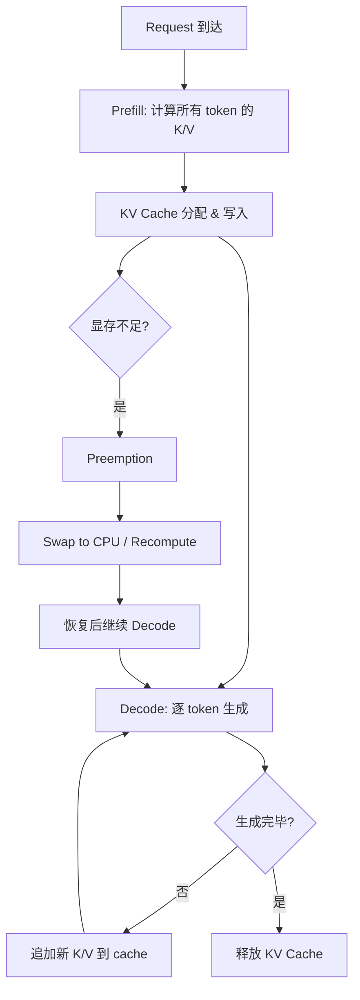
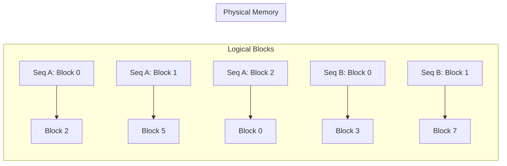
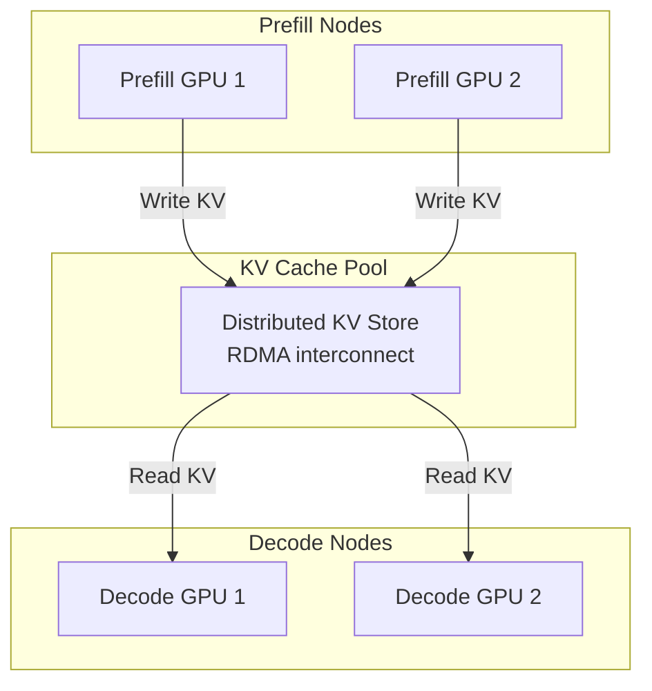

# KV Cache 全面分析

## 1. KV Cache 基础

### 1.1 为什么需要 KV Cache

Autoregressive decoding 中，生成第 $t$ 个 token 时需要计算：

$$
\text{Attention}(q_t, K_{1:t}, V_{1:t}) = \text{softmax}\left(\frac{q_t K_{1:t}^T}{\sqrt{d_h}}\right) V_{1:t}
$$

若不缓存，生成长度为 $T$ 的序列需要重复计算所有历史 token 的 K/V projection：

- 无 cache：总 FLOPs = $\sum_{t=1}^{T} O(t \cdot d) = O(T^2 d)$
- 有 cache：总 FLOPs = $\sum_{t=1}^{T} O(d) = O(Td)$（仅计算新 token 的 K/V）

KV Cache 将 prefill 阶段的 $O(N^2 d)$ 计算转化为 decode 阶段的 $O(Nd)$ 内存访问，是 memory-compute tradeoff 的经典案例。

### 1.2 显存占用公式

$$
\text{KV Cache Size} = 2 \times L \times n_{\text{kv\_heads}} \times d_h \times N \times B \times \text{bytes}
$$

其中：
- 2: Key 和 Value 两个矩阵
- $L$: Transformer 层数
- $n_{\text{kv\_heads}}$: KV head 数量（GQA/MQA 时 < $n_{\text{heads}}$）
- $d_h$: 每个 head 的维度
- $N$: 序列长度
- $B$: batch size
- bytes: 数据类型字节数（FP16=2, FP8=1, INT8=1, INT4=0.5）

### 1.3 典型模型 KV Cache 大小

| 模型 | L | $n_{\text{kv\_heads}}$ | $d_h$ | 每 token 每 batch (FP16) | 4K seq, B=1 | 128K seq, B=1 |
|------|---|------------------------|--------|--------------------------|-------------|---------------|
| Llama-2-7B | 32 | 32 | 128 | 512 KB | 2 GB | 64 GB |
| Llama-2-13B | 40 | 40 | 128 | 640 KB | 2.5 GB | 80 GB |
| Llama-2-70B | 80 | 8 (GQA) | 128 | 160 KB | 0.625 GB | 20 GB |
| Llama-3-8B | 32 | 8 (GQA) | 128 | 128 KB | 0.5 GB | 16 GB |
| Llama-3-70B | 80 | 8 (GQA) | 128 | 160 KB | 0.625 GB | 20 GB |
| Mixtral-8x7B | 32 | 8 (GQA) | 128 | 128 KB | 0.5 GB | 16 GB |
| DeepSeek-V2 | 60 | 1 (MLA) | 512* | 60 KB | 0.24 GB | 7.5 GB |
| DeepSeek-V3 | 61 | 1 (MLA) | 512* | 61 KB | 0.24 GB | 7.6 GB |

*注：DeepSeek-V2/V3 使用 MLA，KV cache 为压缩后的 latent vector（$d_c = 512$），而非传统 KV heads。

**推导示例（Llama-2-7B, 4K, B=1, FP16）：**

$$
2 \times 32 \times 32 \times 128 \times 4096 \times 1 \times 2 = 2,147,483,648 \text{ bytes} = 2 \text{ GB}
$$

模型权重本身 7B × 2 bytes = 14 GB，KV cache 在长序列时可超过模型权重。

### 1.4 KV Cache 生命周期

---

## 2. KV Cache Compression

### 2.1 Quantization 方法

#### 2.1.1 KIVI (Liu et al., 2024)

**问题定义：** KV cache 在长序列时占用大量显存，需要低比特量化但不能显著损失精度。

**方法核心：**
- Key cache: per-channel quantization（因为 key 的 channel 维度方差大）
- Value cache: per-token quantization（因为 value 的 token 维度方差大）
- 使用 2-bit 量化 + residual 存储

**量化公式：**

$$
\hat{X} = \text{clamp}\left(\left\lfloor \frac{X - z}{s} \right\rceil, 0, 2^b - 1\right) \cdot s + z
$$

其中 $s = \frac{\max(X) - \min(X)}{2^b - 1}$，$z = \min(X)$。

Key per-channel: 对每个 $d_h$ 维度独立计算 $s, z$
Value per-token: 对每个 token 位置独立计算 $s, z$

**实验指标：** Llama-2-7B 上 2-bit KV cache，WikiText-2 perplexity 仅增加 0.3（5.47 → 5.77）。

**工程难点：** Per-channel key quantization 需要在 attention 计算时做 dequantize，与 FlashAttention 的 tiling 策略冲突，需要定制 kernel。

#### 2.1.2 KVQuant (Hooper et al., 2024)

**问题定义：** 支持 10M+ context length 的 KV cache 量化。

**方法核心：**
- Non-Uniform Quantization (NUQ): 基于 sensitivity-weighted k-means 确定量化 codebook
- Per-channel key quantization + per-token value quantization
- Dense-and-Sparse: 将 outlier 单独存储为 sparse format
- Q-Norm: 对 key 做 RMSNorm 后再量化，减少 outlier

**压缩率：** 3-bit 量化 + sparse outlier，有效压缩率约 3.2 bits/element。

**工程难点：** NUQ 需要 calibration data 确定 codebook，增加部署复杂度。

#### 2.1.3 Gear (Kang et al., 2024)

**问题定义：** 统一处理 KV cache 中的 outlier 问题。

**方法核心：**
- Low-rank approximation: $\hat{X} = X - UV^T$（捕获主要分布）
- Uniform quantization: 对残差 $X - UV^T$ 做低比特量化
- Sparse outlier: 对量化后仍有大误差的元素单独存储

$$
X \approx UV^T + Q(X - UV^T) + S
$$

其中 $U \in \mathbb{R}^{N \times r}$, $V \in \mathbb{R}^{d_h \times r}$, $r \ll \min(N, d_h)$。

**压缩率：** 2-bit 主体 + rank-4 低秩 + 2% sparse，等效约 2.5 bits/element。

#### 2.1.4 WKVQuant (Yue et al., 2024)

**方法核心：** 将 weight quantization 和 KV cache quantization 联合优化。

- 观察：weight quantization 误差会放大 KV cache 的 outlier
- 方案：先做 weight-aware KV calibration，再做 KV quantization

#### 2.1.5 QAQ (Dong et al., 2024)

**方法核心：** Quality Adaptive Quantization
- 对不同 attention head 和不同 layer 使用不同的量化精度
- 基于 attention entropy 判断 head 重要性
- 重要 head 用高精度（4-bit），不重要 head 用低精度（2-bit）

### 2.2 Eviction/Dropping 方法

#### 2.2.1 H2O - Heavy Hitter Oracle (Zhang et al., 2023)

**问题定义：** 在有限 KV cache budget 下保持 attention 质量。

**方法核心：**
- 观察：少量 token 累积了大部分 attention score（Heavy Hitters）
- 策略：保留 recent tokens + heavy hitter tokens，evict 其余
- Heavy Hitter 判定：累积 attention score 超过阈值

**数学表达：**

$$
\text{Cache}_t = \text{Recent}(W) \cup \text{TopK}\left(\sum_{i=1}^{t} \alpha_{t,i}, k\right)
$$

其中 $\alpha_{t,i}$ 为 token $i$ 在第 $t$ 步的 attention weight，$W$ 为 recent window size。

**Budget 分配：** 总 budget $B$ = recent window $W$ + heavy hitter slots $k$。

**实验指标：** 20% KV cache budget 下，Llama-2-7B 在多数任务上精度损失 < 1%。

**工程难点：** 需要维护 cumulative attention score，每步 decode 有额外开销。

#### 2.2.2 SnapKV (Li et al., 2024)

**问题定义：** 自动压缩 KV cache 用于长上下文推理。

**方法核心：**
- 使用 observation window（最后几个 token 的 attention pattern）识别重要 token
- 对每个 head 独立选择 top-k important positions
- Pooling kernel 平滑 attention pattern 避免噪声

**与 H2O 的区别：** SnapKV 在 prefill 结束后一次性决定保留哪些 token，无需 decode 时动态更新。

#### 2.2.3 PyramidKV (Cai et al., 2024)

**方法核心：** 不同层使用不同的 KV cache budget。

- 观察：底层 attention 更分散（需要更多 token），高层 attention 更集中（需要更少 token）
- 策略：金字塔形分配，底层 budget 大，高层 budget 小

$$
B_l = B_{\text{total}} \times \frac{L - l + 1}{\sum_{i=1}^{L} i} = B_{\text{total}} \times \frac{2(L - l + 1)}{L(L+1)}
$$

#### 2.2.4 FastGen (Ge et al., 2024)

**方法核心：** 基于 attention pattern 的自适应 KV cache 压缩。

- 识别 4 种 attention pattern: full, local, column (sink), slash
- 对每个 head 选择最匹配的 pattern，只保留对应的 KV entries
- 不同 head 可以有不同的压缩策略

#### 2.2.5 Scissorhands (Liu et al., 2023)

**方法核心：** 基于 "importance persistence" 假设。

- 观察：如果一个 token 在最近几步都不重要（attention score 低），未来也不太可能重要
- 策略：evict 连续多步 attention score 低于阈值的 token

### 2.3 Merging 方法

#### 2.3.1 CaM - Cache Merging (Zhang et al., 2024)

**方法核心：** 将相似的 KV entries 合并而非丢弃。

$$
K_{\text{merged}} = \frac{\alpha_i K_i + \alpha_j K_j}{\alpha_i + \alpha_j}, \quad V_{\text{merged}} = \frac{\alpha_i V_i + \alpha_j V_j}{\alpha_i + \alpha_j}
$$

其中 $\alpha$ 为 attention weight 或 importance score。

**优势：** 相比 eviction，merging 保留了被丢弃 token 的部分信息。

#### 2.3.2 D2O (Wan et al., 2024)

**方法核心：** Dynamic token Dropping with cOmpensation。

- 在 evict token 时，将其信息补偿到相邻 token 的 KV 中
- 补偿公式基于 attention weight 的相对大小

#### 2.3.3 KVMerger (Wang et al., 2024)

**方法核心：** 基于 Gaussian kernel weighted merging。

- 使用 cosine similarity 识别可合并的 KV pairs
- Gaussian kernel 控制合并权重：距离近的 token 合并权重大

### 2.4 压缩粒度对比

| 粒度 | 方法示例 | 优势 | 劣势 |
|------|----------|------|------|
| Token-level | H2O, SnapKV | 实现简单，压缩率高 | 丢失完整 token 信息 |
| Head-level | PyramidKV, QAQ | 适应不同 head 的重要性 | 需要 per-head 分析 |
| Layer-level | PyramidKV, CLA | 利用层间冗余 | 可能影响深层推理 |
| Channel-level | KIVI (key) | 适应 channel 分布 | kernel 实现复杂 |
| Mixed | Gear, FastGen | 灵活，精度好 | 系统复杂度高 |

---

## 3. KV Cache Scheduling

### 3.1 vLLM Block Manager

**核心设计：** 借鉴 OS 虚拟内存的 paging 机制。

**Physical Block：** 固定大小的连续 GPU 内存块，存储固定数量 token 的 KV cache。

$$
\text{Block Size} = \text{block\_tokens} \times n_{\text{layers}} \times 2 \times n_{\text{kv\_heads}} \times d_h \times \text{bytes}
$$

典型配置：block_tokens = 16，Llama-7B FP16 下每 block = 16 × 32 × 2 × 32 × 128 × 2 = 8 MB。

**Logical-Physical Mapping：**

**优势：**
- 消除内存碎片（无需连续分配）
- 按需分配（序列增长时才分配新 block）
- 内存利用率接近 100%（vs naive 预分配的 ~50%）

### 3.2 Preemption 策略

当 GPU 显存不足时，vLLM 支持两种 preemption：

| 策略 | 机制 | 延迟 | 适用场景 |
|------|------|------|----------|
| Swap | 将 KV blocks 搬到 CPU 内存 | PCIe 带宽限制（~32 GB/s） | KV cache 较大，recompute 代价高 |
| Recompute | 丢弃 KV cache，需要时重新 prefill | 取决于序列长度 | 短序列，GPU 计算充裕 |

**Swap 带宽分析：**

Llama-7B, 4K context, FP16: KV cache = 2 GB
PCIe Gen4 x16: 32 GB/s
Swap out time: 2 / 32 = 62.5 ms

### 3.3 Prefix Caching

**场景：** 多个请求共享相同的 system prompt 或 few-shot examples。

**实现：**
- 对 prefix tokens 计算 hash
- 相同 hash 的 KV blocks 在物理内存中共享
- Reference counting 管理生命周期

**节省：** 对于 2K system prompt + 2K user input，prefix caching 节省 50% 的 prefill 计算和 KV 存储。

### 3.4 Copy-on-Write (Beam Search)

Beam search 中多个 beam 共享前缀：

- 初始：所有 beam 指向相同的 physical blocks
- 分叉时：仅复制最后一个 block（即将被修改的 block）
- 其余 blocks 继续共享

**内存节省：** beam_width $b$ 的 beam search，传统方法需要 $b \times N$ 的 KV cache，CoW 方法约需 $N + b \times \text{diverged\_length}$。

### 3.5 Disaggregated KV Cache

#### 3.5.1 Mooncake (Moonshot AI, 2024)

**架构：** KV Cache 中心的分离式推理架构。

**核心设计：**
- Prefill 和 Decode 使用不同的 GPU pool
- KV Cache 通过 RDMA 在节点间传输
- Chunk-level pipeline: prefill 产生的 KV chunk 立即可被 decode 使用

**带宽需求：** Llama-70B, 4K context, FP16: 20 GB KV cache。RDMA 200 Gbps (25 GB/s) 下传输时间 = 0.8s。

#### 3.5.2 InfiniGen (Lee et al., 2024)

**方法核心：** 将 KV cache offload 到 CPU，按需 prefetch 到 GPU。

- 使用轻量级 predictor 预测下一步需要哪些 KV entries
- 只 prefetch 预测为重要的 entries
- Overlap prefetch 与当前层的计算

---

## 4. Long Context KV Cache

### 4.1 InfLLM (Xiao et al., 2024)

**问题定义：** 支持超长上下文（100K+ tokens）而不 OOM。

**方法核心：**
- 将 KV cache 分为：GPU resident（recent + important）+ CPU offloaded（其余）
- Block-level management: 以 block 为单位管理和调度
- Relevance-based retrieval: 根据当前 query 从 CPU 检索相关 blocks

### 4.2 MemServe (Hu et al., 2024)

**方法核心：** 跨请求的 KV cache 复用。

- MemPool: 分布式 KV cache 存储池
- Locality-aware scheduling: 将相似请求调度到有缓存的节点
- 支持 partial hit: 即使只命中部分 prefix 也能复用

### 4.3 RetrievalAttention (Liu et al., 2024)

**方法核心：** 将长上下文 KV cache 视为检索问题。

- 对 KV cache 建立向量索引（如 HNSW）
- Attention 计算时，先检索 top-k 相关 KV entries
- 只对检索到的 entries 做精确 attention

**复杂度：** 从 $O(Nd_h)$ 降为 $O(k d_h + \log N)$，其中 $k \ll N$。

### 4.4 Chunk-level Attention

将长序列分为固定大小的 chunks，每个 chunk 内做 full attention，chunk 间做 sparse/summary attention：

$$
O_i = \text{Attn}(Q_i, K_i, V_i) + \sum_{j < i} w_{ij} \cdot \text{Attn}(Q_i, \text{Summary}(K_j), \text{Summary}(V_j))
$$

代表方法：HOMER, Infini-attention。

---

## 5. 各方法对比表

### 5.1 压缩方法对比

| 方法 | 类型 | 压缩率 | 精度损失 (PPL↑) | 适用场景 | 工程复杂度 |
|------|------|--------|-----------------|----------|------------|
| KIVI | Quantization | 8x (2-bit) | +0.3 | 通用 | 中（需定制 kernel） |
| KVQuant | Quantization | 5x (3-bit) | +0.1 | 超长上下文 | 高（NUQ codebook） |
| Gear | Quant+LowRank | 6x (2.5-bit) | +0.2 | 通用 | 高（三组件） |
| H2O | Eviction | 5x (20% budget) | +0.5-1.0 | Decode | 低 |
| SnapKV | Eviction | 5-10x | +0.2-0.5 | 长上下文 prefill | 低 |
| PyramidKV | Eviction | 5-8x | +0.3 | 多层模型 | 低 |
| CaM | Merging | 3-5x | +0.1-0.3 | 通用 | 中 |
| StreamingLLM | Window | ∞ (固定 budget) | 任务相关 | 流式生成 | 极低 |

### 5.2 调度方法对比

| 方法 | 核心机制 | 吞吐提升 | 延迟影响 | 适用规模 |
|------|----------|----------|----------|----------|
| vLLM PagedAttention | Block paging | 2-4x | 无 | 单机多卡 |
| Prefix Caching | Hash-based sharing | 1.5-3x (共享场景) | 降低 TTFT | 单机/多机 |
| Mooncake | P/D 分离 + RDMA | 2-5x | 增加 TTFT | 大规模集群 |
| InfiniGen | CPU offload + prefetch | 支持更长上下文 | 略增 | 单机 |
| MemServe | 跨请求复用 | 1.5-2x | 降低 TTFT | 多机 |

### 5.3 长上下文方法对比

| 方法 | 支持长度 | 精度保持 | 额外硬件需求 | 延迟开销 |
|------|----------|----------|--------------|----------|
| InfLLM | 1M+ | 好 | CPU 内存 | 中（retrieval） |
| RetrievalAttention | 1M+ | 中 | CPU 内存 + 索引 | 中 |
| RingAttention | 无限（多卡） | 无损 | 多 GPU | 通信开销 |
| Star-Attention | 1M+ | 好 | 多 GPU | 低 |
| YOCO | 1M+ | 好 | 无 | 低（架构改变） |

---

## 附录：KV Cache 显存预算规划

### A.1 给定显存预算，计算最大 batch size

$$
B_{\max} = \left\lfloor \frac{\text{GPU\_Mem} - \text{Model\_Size} - \text{Overhead}}{2 \times L \times n_{\text{kv}} \times d_h \times N_{\max} \times \text{bytes}} \right\rfloor
$$

**示例：** A100 80GB, Llama-2-7B (FP16, 14GB), overhead 2GB, seq_len 4096:

$$
B_{\max} = \left\lfloor \frac{80 - 14 - 2}{2 \times 32 \times 32 \times 128 \times 4096 \times 2 / 10^9} \right\rfloor = \left\lfloor \frac{64}{2.15} \right\rfloor = 29
$$

### A.2 KV Cache 与 Throughput 的关系

吞吐量（tokens/s）= batch_size × decode_speed_per_token

- 更大 batch → 更高吞吐（GPU 利用率提升）
- 但 KV cache 限制了 max batch size
- 因此 KV cache 压缩直接提升系统吞吐

**量化收益估算：** FP16 → INT4 KV cache，理论上 batch size 可提升 4x，吞吐提升接近 4x（decode 阶段 memory-bound）。
