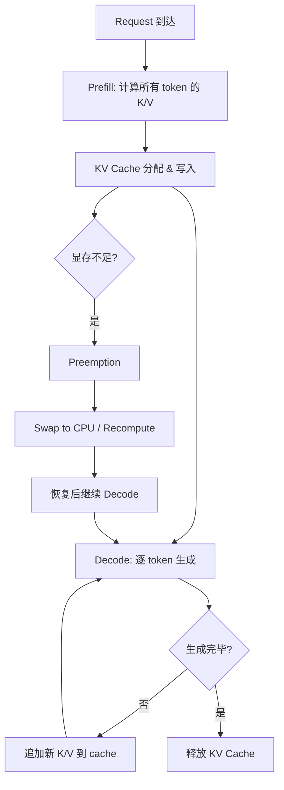
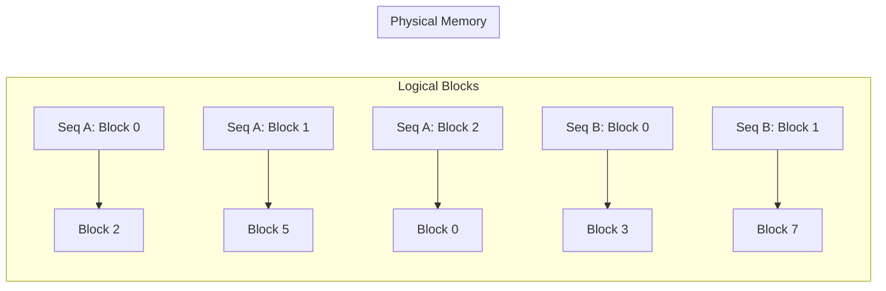
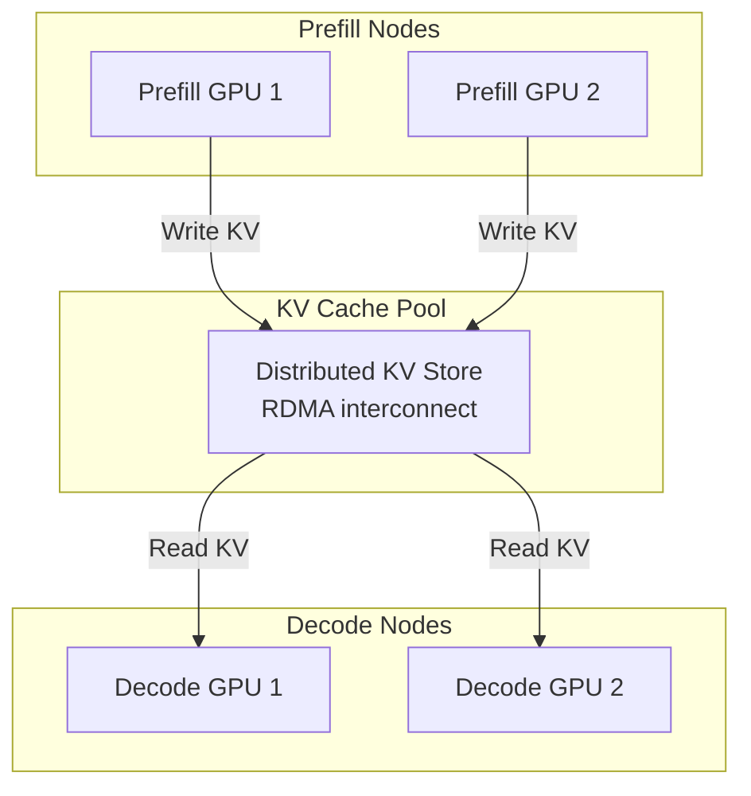

# KV Cache 全面分析

## 1. KV Cache 基础

### 1.1 为什么需要 KV Cache

Autoregressive decoding 中，生成第 $t$ 个 token 时需要计算：

$$
\text{Attention}(q_t, K_{1:t}, V_{1:t}) = \text{softmax}\left(\frac{q_t K_{1:t}^T}{\sqrt{d_h}}\right) V_{1:t}
$$

若不缓存，生成长度为 $T$ 的序列需要重复计算所有历史 token 的 K/V projection：

- 无 cache：总 FLOPs = $\sum_{t=1}^{T} O(t \cdot d) = O(T^2 d)$
- 有 cache：总 FLOPs = $\sum_{t=1}^{T} O(d) = O(Td)$（仅计算新 token 的 K/V）

KV Cache 将 prefill 阶段的 $O(N^2 d)$ 计算转化为 decode 阶段的 $O(Nd)$ 内存访问，是 memory-compute tradeoff 的经典案例。

### 1.2 显存占用公式

$$
\text{KV Cache Size} = 2 \times L \times n_{\text{kv\_heads}} \times d_h \times N \times B \times \text{bytes}
$$

其中：
- 2: Key 和 Value 两个矩阵
- $L$: Transformer 层数
- $n_{\text{kv\_heads}}$: KV head 数量（GQA/MQA 时 < $n_{\text{heads}}$）
- $d_h$: 每个 head 的维度
- $N$: 序列长度
- $B$: batch size
- bytes: 数据类型字节数（FP16=2, [FP8](https://arxiv.org/abs/2209.05433)=1, INT8=1, INT4=0.5）

#### 各架构详细公式推导 [verified_by_paper]

**MHA (Multi-Head Attention)：**

$$
\text{KV}_{\text{MHA}} = 2 \times L \times h \times d_h \times N \times B \times \text{bytes}
$$

每层每 token 存储 $h$ 个 K head + $h$ 个 V head，每个 head 维度 $d_h$。

**GQA (Grouped-Query Attention)：**

$$
\text{KV}_{\text{GQA}} = 2 \times L \times g \times d_h \times N \times B \times \text{bytes}
$$

其中 $g = h / \text{group\_size}$ 为 KV head 数。相比 MHA 节省 $h/g$ 倍。

**MQA (Multi-Query Attention)：**

$$
\text{KV}_{\text{MQA}} = 2 \times L \times 1 \times d_h \times N \times B \times \text{bytes}
$$

所有 Q head 共享 1 个 KV head，节省 $h$ 倍。

**MLA (Multi-head Latent Attention, DeepSeek-V2/V3)：** [verified_by_paper]

MLA 不存储完整 KV，而是存储压缩后的 latent vector：

$$
\text{KV}_{\text{MLA}} = L \times (d_c + d_{\text{rope}}) \times N \times B \times \text{bytes}
$$

其中 $d_c = 512$ 为 latent 压缩维度，$d_{\text{rope}}$ 为 RoPE 解耦维度（DeepSeek-V2: $d_{\text{rope}} = 64$）。注意 MLA 只需存储一份 latent（非 2 份 K+V），因为 K 和 V 均从同一 latent 解压。

**对比推导（seq=4096, B=1, BF16）：** [derived_analysis]

| 模型 | 架构 | 公式 | 结果 |
|------|------|------|------|
| Llama-2-7B | MHA (h=32) | $2 \times 32 \times 32 \times 128 \times 4096 \times 2$ | 2.0 GB |
| Llama-3-70B | GQA (g=8) | $2 \times 80 \times 8 \times 128 \times 4096 \times 2$ | 1.28 GB |
| Falcon-180B | MQA (g=1) | $2 \times 80 \times 1 \times 128 \times 4096 \times 2$ | 0.16 GB |
| DeepSeek-V3 | MLA ($d_c$=512) | $61 \times 576 \times 4096 \times 2$ | 0.27 GB |

MLA 相比 GQA-8 进一步节省约 **4.7x** 显存。

### 1.3 典型模型 KV Cache 大小

| 模型 | L | $n_{\text{kv\_heads}}$ | $d_h$ | 每 token 每 batch (FP16) | 4K seq, B=1 | 128K seq, B=1 |
|------|---|------------------------|--------|--------------------------|-------------|---------------|
| Llama-2-7B | 32 | 32 | 128 | 512 KB | 2 GB | 64 GB |
| Llama-2-13B | 40 | 40 | 128 | 640 KB | 2.5 GB | 80 GB |
| Llama-2-70B | 80 | 8 ([GQA](https://arxiv.org/abs/2305.13245)) | 128 | 160 KB | 0.625 GB | 20 GB |
| Llama-3-8B | 32 | 8 ([GQA](https://arxiv.org/abs/2305.13245)) | 128 | 128 KB | 0.5 GB | 16 GB |
| Llama-3-70B | 80 | 8 ([GQA](https://arxiv.org/abs/2305.13245)) | 128 | 160 KB | 0.625 GB | 20 GB |
| [Mixtral](https://arxiv.org/abs/2401.04088)-8x7B | 32 | 8 ([GQA](https://arxiv.org/abs/2305.13245)) | 128 | 128 KB | 0.5 GB | 16 GB |
| [DeepSeek-V2](https://arxiv.org/abs/2405.04434) | 60 | 1 (MLA) | 512* | 60 KB | 0.24 GB | 7.5 GB |
| [DeepSeek-V3](https://arxiv.org/abs/2412.19437) | 61 | 1 (MLA) | 512* | 61 KB | 0.24 GB | 7.6 GB |

*注：DeepSeek-V2/V3 使用 [MLA](https://arxiv.org/abs/2405.04434)，KV cache 为压缩后的 latent vector（$d_c = 512$），而非传统 KV heads。

**推导示例（Llama-2-7B, 4K, B=1, FP16）：**

$$
2 \times 32 \times 32 \times 128 \times 4096 \times 1 \times 2 = 2,147,483,648 \text{ bytes} = 2 \text{ GB}
$$

模型权重本身 7B × 2 bytes = 14 GB，KV cache 在长序列时可超过模型权重。

### 1.4 KV Cache 生命周期



---

## 2. [KV Cache Compression](https://arxiv.org/abs/2305.17118)

### 2.1 Quantization 方法

#### 2.1.1 [KIVI](https://arxiv.org/abs/2402.02750) (Liu et al., 2024)

**问题定义：** KV cache 在长序列时占用大量显存，需要低比特量化但不能显著损失精度。

**方法核心：**
- Key cache: per-channel quantization（因为 key 的 channel 维度方差大）
- Value cache: per-token quantization（因为 value 的 token 维度方差大）
- 使用 2-bit 量化 + residual 存储

**量化公式：**

$$
\hat{X} = \text{clamp}\left(\left\lfloor \frac{X - z}{s} \right\rceil, 0, 2^b - 1\right) \cdot s + z
$$

其中 $s = \frac{\max(X) - \min(X)}{2^b - 1}$，$z = \min(X)$。

Key per-channel: 对每个 $d_h$ 维度独立计算 $s, z$
Value per-token: 对每个 token 位置独立计算 $s, z$

**实验指标：** Llama-2-7B 上 2-bit KV cache，WikiText-2 perplexity 仅增加 0.3（5.47 → 5.77）。

**工程难点：** Per-channel key quantization 需要在 attention 计算时做 dequantize，与 [FlashAttention](https://arxiv.org/abs/2205.14135) 的 tiling 策略冲突，需要定制 kernel。

#### 2.1.2 [KVQuant](https://arxiv.org/abs/2401.18079) (Hooper et al., 2024)

**问题定义：** 支持 10M+ context length 的 KV cache 量化。

**方法核心：**
- Non-Uniform Quantization (NUQ): 基于 sensitivity-weighted k-means 确定量化 codebook
- Per-channel key quantization + per-token value quantization
- Dense-and-Sparse: 将 outlier 单独存储为 sparse format
- Q-Norm: 对 key 做 RMSNorm 后再量化，减少 outlier

**压缩率：** 3-bit 量化 + sparse outlier，有效压缩率约 3.2 bits/element。

**工程难点：** NUQ 需要 calibration data 确定 codebook，增加部署复杂度。

#### 2.1.3 [Gear](https://arxiv.org/abs/2403.05527) (Kang et al., 2024)

**问题定义：** 统一处理 KV cache 中的 outlier 问题。

**方法核心：**
- Low-rank approximation: $\hat{X} = X - UV^T$（捕获主要分布）
- Uniform quantization: 对残差 $X - UV^T$ 做低比特量化
- Sparse outlier: 对量化后仍有大误差的元素单独存储

$$
X \approx UV^T + Q(X - UV^T) + S
$$

其中 $U \in \mathbb{R}^{N \times r}$, $V \in \mathbb{R}^{d_h \times r}$, $r \ll \min(N, d_h)$。

**压缩率：** 2-bit 主体 + rank-4 低秩 + 2% sparse，等效约 2.5 bits/element。

#### 2.1.4 [WKVQuant](https://arxiv.org/abs/2402.12065) (Yue et al., 2024)

**方法核心：** 将 weight quantization 和 KV cache quantization 联合优化。

- 观察：weight quantization 误差会放大 KV cache 的 outlier
- 方案：先做 weight-aware KV calibration，再做 KV quantization

#### 2.1.5 [QAQ](https://arxiv.org/abs/2403.04643) (Dong et al., 2024)

**方法核心：** Quality Adaptive Quantization
- 对不同 attention head 和不同 layer 使用不同的量化精度
- 基于 attention entropy 判断 head 重要性
- 重要 head 用高精度（4-bit），不重要 head 用低精度（2-bit）

### 2.2 Eviction/Dropping 方法

#### 2.2.1 [H2O](https://arxiv.org/abs/2306.14048) - Heavy Hitter Oracle (Zhang et al., 2023)

**问题定义：** 在有限 KV cache budget 下保持 attention 质量。

**方法核心：**
- 观察：少量 token 累积了大部分 attention score（Heavy Hitters）
- 策略：保留 recent tokens + heavy hitter tokens，evict 其余
- Heavy Hitter 判定：累积 attention score 超过阈值

**数学表达：**

$$
\text{Cache}_t = \text{Recent}(W) \cup \text{TopK}\left(\sum_{i=1}^{t} \alpha_{t,i}, k\right)
$$

其中 $\alpha_{t,i}$ 为 token $i$ 在第 $t$ 步的 attention weight，$W$ 为 recent window size。

**Budget 分配：** 总 budget $B$ = recent window $W$ + heavy hitter slots $k$。

**实验指标：** 20% KV cache budget 下，Llama-2-7B 在多数任务上精度损失 < 1%。

**工程难点：** 需要维护 cumulative attention score，每步 decode 有额外开销。

#### 2.2.2 [SnapKV](https://arxiv.org/abs/2404.14469) (Li et al., 2024)

**问题定义：** 自动压缩 KV cache 用于长上下文推理。

**方法核心：**
- 使用 observation window（最后几个 token 的 attention pattern）识别重要 token
- 对每个 head 独立选择 top-k important positions
- Pooling kernel 平滑 attention pattern 避免噪声

**与 [H2O](https://arxiv.org/abs/2306.14048) 的区别：** [SnapKV](https://arxiv.org/abs/2404.14469) 在 prefill 结束后一次性决定保留哪些 token，无需 decode 时动态更新。

#### 2.2.3 [PyramidKV](https://arxiv.org/abs/2406.02069) (Cai et al., 2024)

**方法核心：** 不同层使用不同的 KV cache budget。

- 观察：底层 attention 更分散（需要更多 token），高层 attention 更集中（需要更少 token）
- 策略：金字塔形分配，底层 budget 大，高层 budget 小

$$
B_l = B_{\text{total}} \times \frac{L - l + 1}{\sum_{i=1}^{L} i} = B_{\text{total}} \times \frac{2(L - l + 1)}{L(L+1)}
$$

#### 2.2.4 [FastGen](https://arxiv.org/abs/2310.01801) (Ge et al., 2024)

**方法核心：** 基于 attention pattern 的自适应 KV cache 压缩。

- 识别 4 种 attention pattern: full, local, column (sink), slash
- 对每个 head 选择最匹配的 pattern，只保留对应的 KV entries
- 不同 head 可以有不同的压缩策略

#### 2.2.5 [Scissorhands](https://arxiv.org/abs/2305.17118) (Liu et al., 2023)

**方法核心：** 基于 "importance persistence" 假设。

- 观察：如果一个 token 在最近几步都不重要（attention score 低），未来也不太可能重要
- 策略：evict 连续多步 attention score 低于阈值的 token

### 2.3 Merging 方法

#### 2.3.1 CaM - Cache Merging (Zhang et al., 2024)

**方法核心：** 将相似的 KV entries 合并而非丢弃。

$$
K_{\text{merged}} = \frac{\alpha_i K_i + \alpha_j K_j}{\alpha_i + \alpha_j}, \quad V_{\text{merged}} = \frac{\alpha_i V_i + \alpha_j V_j}{\alpha_i + \alpha_j}
$$

其中 $\alpha$ 为 attention weight 或 importance score。

**优势：** 相比 eviction，merging 保留了被丢弃 token 的部分信息。

#### 2.3.2 [D2O](https://arxiv.org/abs/2406.13035) (Wan et al., 2024)

**方法核心：** Dynamic token Dropping with cOmpensation。

- 在 evict token 时，将其信息补偿到相邻 token 的 KV 中
- 补偿公式基于 attention weight 的相对大小

#### 2.3.3 [KVMerger](https://arxiv.org/abs/2407.08454) (Wang et al., 2024)

**方法核心：** 基于 Gaussian kernel weighted merging。

- 使用 cosine similarity 识别可合并的 KV pairs
- Gaussian kernel 控制合并权重：距离近的 token 合并权重大

### 2.4 压缩粒度对比

| 粒度 | 方法示例 | 优势 | 劣势 |
|------|----------|------|------|
| Token-level | [H2O](https://arxiv.org/abs/2306.14048), [SnapKV](https://arxiv.org/abs/2404.14469) | 实现简单，压缩率高 | 丢失完整 token 信息 |
| Head-level | [PyramidKV](https://arxiv.org/abs/2406.02069), QAQ | 适应不同 head 的重要性 | 需要 per-head 分析 |
| Layer-level | [PyramidKV](https://arxiv.org/abs/2406.02069), CLA | 利用层间冗余 | 可能影响深层推理 |
| Channel-level | [KIVI](https://arxiv.org/abs/2402.02750) (key) | 适应 channel 分布 | kernel 实现复杂 |
| Mixed | Gear, [FastGen](https://arxiv.org/abs/2310.01801) | 灵活，精度好 | 系统复杂度高 |

### 2.5 Eviction 策略综合对比 [derived_analysis]

| 方法 | 选择机制 | 时机 | 精度影响 (LongBench) | 压缩率 | 计算开销 |
|------|----------|------|---------------------|--------|----------|
| [StreamingLLM](https://arxiv.org/abs/2309.17453) | Sink + Sliding Window | 固定策略 | -15~30%（远距离任务） | 无限（固定窗口） | 无 |
| [H2O](https://arxiv.org/abs/2306.14048) | 累积 attention score | 每步动态 | -1~5%（20% budget） | 5x | $O(N)$ per step |
| [SnapKV](https://arxiv.org/abs/2404.14469) | Observation window pattern | Prefill 后一次性 | -0.5~2% | 5-10x | $O(N)$ 一次 |
| [AdaKV](https://arxiv.org/abs/2407.11550) | Per-head 自适应 budget | Prefill 后 | -0.3~1.5% | 5-8x | $O(Nh)$ 一次 |
| [PyramidKV](https://arxiv.org/abs/2406.02069) | 层级金字塔分配 | Prefill 后 | -0.5~2% | 5-8x | $O(NL)$ 一次 |

**关键 insight：** [derived_analysis]
- StreamingLLM 适合纯流式生成（聊天），不适合需要回溯的任务（RAG、summarization）
- H2O 的动态更新在 decode 阶段引入 per-step 开销，高吞吐场景需权衡
- SnapKV 一次性决策避免了 decode 开销，但无法适应 decode 过程中 attention pattern 的变化
- AdaKV 的 per-head 自适应比 uniform budget 更优，因为不同 head 的稀疏度差异可达 10x

### 2.6 KV Cache Quantization 精度-内存 Tradeoff [verified_by_paper]

| 方法 | 有效 bit-width | 压缩率 | PPL 增加 (Llama-2-7B) | Kernel 支持 | 部署复杂度 |
|------|---------------|--------|----------------------|-------------|------------|
| [KIVI](https://arxiv.org/abs/2402.02750) 2-bit | 2 + scale | 7-8x | +0.3 | 需定制（per-channel K） | 中 |
| [KVQuant](https://arxiv.org/abs/2401.18079) 3-bit NUQ | 3.2 | 5x | +0.1 | 需 codebook lookup | 高 |
| [Gear](https://arxiv.org/abs/2403.05527) 2-bit+LR | 2.5 | 6x | +0.2 | 三组件解压 | 高 |
| FP8 KV (native) | 8 | 2x | <+0.05 | 硬件原生 (H100+) | 低 |
| INT4 KV ([QServe](https://arxiv.org/abs/2405.04532)) | 4 | 4x | +0.1-0.2 | FlashInfer 支持 | 中 |

**精度-内存 Pareto 前沿：** [derived_analysis]
- 2x 压缩（FP8）：几乎无损，推荐 H100+ 默认开启
- 4x 压缩（INT4）：轻微损失，适合长上下文 + 大 batch 场景
- 6-8x 压缩（2-3 bit）：需要任务评估，适合显存极度受限场景

### 2.7 Offload 策略分析 [derived_analysis]

#### CPU Offload

**延迟模型：**

$$
T_{\text{offload}} = \frac{\text{KV\_size\_per\_layer}}{BW_{\text{PCIe}}} + T_{\text{overhead}}
$$

| 配置 | KV/layer (4K seq, B=1) | PCIe 带宽 | 传输时间 | 可行性 |
|------|------------------------|-----------|----------|--------|
| Llama-7B, FP16 | 32MB | Gen4: 32 GB/s | 1.0 ms | 可 overlap |
| Llama-70B, FP16 | 16MB (GQA) | Gen4: 32 GB/s | 0.5 ms | 可 overlap |
| Llama-7B, 128K seq | 1 GB | Gen4: 32 GB/s | 31 ms | 需 prefetch |
| Llama-7B, FP16, 128K | 1 GB | Gen5: 64 GB/s | 16 ms | 需 prefetch |

**Prefetch 策略（InfiniGen 方法）：** [verified_by_paper]
1. 用当前层的 hidden state 预测下一层需要的 KV entries
2. 在当前层计算时异步 prefetch 下一层的 important KV
3. 只 prefetch top-k important entries（通常 10-30%），其余丢弃或用近似

#### NVMe Offload

$$
T_{\text{NVMe}} = \frac{\text{KV\_size}}{BW_{\text{NVMe}}} \approx \frac{\text{KV\_size}}{7 \text{ GB/s (Gen4 x4)}}
$$

NVMe 带宽约为 PCIe 的 1/4-1/5，适合冷数据存储（如 prefix cache 的 LRU eviction tier）。

#### 多级存储架构 [derived_analysis]

```
GPU HBM (热) → CPU DRAM (温) → NVMe SSD (冷)
  2 TB/s         32 GB/s          7 GB/s
  80 GB          512+ GB          数 TB
```

---

## 3. KV Cache Scheduling

### 3.1 [vLLM](https://github.com/vllm-project/vllm) Block Manager

**核心设计：** 借鉴 OS 虚拟内存的 paging 机制。

**Physical Block：** 固定大小的连续 GPU 内存块，存储固定数量 token 的 KV cache。

$$
\text{Block Size} = \text{block\_tokens} \times n_{\text{layers}} \times 2 \times n_{\text{kv\_heads}} \times d_h \times \text{bytes}
$$

典型配置：block_tokens = 16，Llama-7B FP16 下每 block = 16 × 32 × 2 × 32 × 128 × 2 = 8 MB。

**Logical-Physical Mapping：**



**优势：**
- 消除内存碎片（无需连续分配）
- 按需分配（序列增长时才分配新 block）
- 内存利用率接近 100%（vs naive 预分配的 ~50%）

#### Block Size Tradeoff 分析 [derived_analysis]

| Block Size (tokens) | 内部碎片 | Block Table 开销 | Kernel 效率 | 适用场景 |
|---------------------|----------|-----------------|-------------|----------|
| 1 | 0（无碎片） | 极大（每 token 一条映射） | 差（gather 频繁） | 不实用 |
| 8 | 平均 4 tokens | 中 | 中 | 短序列 |
| 16 (vLLM 默认) | 平均 8 tokens | 小 | 好 | 通用 |
| 32 | 平均 16 tokens | 极小 | 最好（对齐 warp） | 长序列 |
| 64 | 平均 32 tokens | 极小 | 最好 | 超长序列 |

**内部碎片公式：**

$$
\text{Fragmentation} = \frac{\text{block\_size} - 1}{2} \times \text{per\_token\_kv\_size} \times B
$$

**选择准则：** [derived_analysis]
- block_size 应为 warp size (32) 的因子或倍数，确保 coalesced memory access
- 短序列多的场景用小 block（减少碎片），长序列用大 block（减少 table 开销和提升 kernel 效率）
- SGLang 使用 block_size=1 的 token-level paging（RadixAttention 需要任意前缀匹配）

### 3.2 Preemption 策略

当 GPU 显存不足时，[vLLM](https://github.com/vllm-project/vllm) 支持两种 preemption：

| 策略 | 机制 | 延迟 | 适用场景 |
|------|------|------|----------|
| Swap | 将 KV blocks 搬到 CPU 内存 | PCIe 带宽限制（~32 GB/s） | KV cache 较大，recompute 代价高 |
| Recompute | 丢弃 KV cache，需要时重新 prefill | 取决于序列长度 | 短序列，GPU 计算充裕 |

**Swap 带宽分析：**

Llama-7B, 4K context, FP16: KV cache = 2 GB
PCIe Gen4 x16: 32 GB/s
Swap out time: 2 / 32 = 62.5 ms

### 3.3 Prefix caching

**场景：** 多个请求共享相同的 system prompt 或 few-shot examples。

**实现：**
- 对 prefix tokens 计算 hash
- 相同 hash 的 KV blocks 在物理内存中共享
- Reference counting 管理生命周期

**节省：** 对于 2K system prompt + 2K user input，prefix caching 节省 50% 的 prefill 计算和 KV 存储。

#### Prefix Sharing 机制详解 [verified_by_paper]

**RadixAttention (SGLang)：** 使用 Radix Tree（压缩前缀树）管理 KV cache：
- 节点存储 token 序列对应的 KV cache blocks
- 支持任意前缀长度的匹配（不限于 block 边界）
- LRU eviction 策略管理缓存容量

**APC (Automatic Prefix Caching, vLLM)：** 基于 hash 的 block-level 匹配：
- 对每个 block 的 token 内容计算 hash（包含前缀 hash 链）
- Hash 匹配即可复用物理 block
- 粒度为 block_size（通常 16 tokens），无法匹配非对齐前缀

**Hash-based Matching 对比：** [derived_analysis]

| 机制 | 匹配粒度 | 查找复杂度 | 适用场景 | 实现 |
|------|----------|-----------|----------|------|
| RadixAttention | Token-level | $O(L)$ | 多轮对话、共享前缀 | SGLang |
| APC (hash) | Block-level | $O(1)$ per block | System prompt 共享 | vLLM |
| Content-hash | Chunk-level | $O(1)$ | 跨请求去重 | Mooncake |

### 3.4 Copy-on-Write (Beam Search)

Beam search 中多个 beam 共享前缀：

- 初始：所有 beam 指向相同的 physical blocks
- 分叉时：仅复制最后一个 block（即将被修改的 block）
- 其余 blocks 继续共享

**内存节省：** beam_width $b$ 的 beam search，传统方法需要 $b \times N$ 的 KV cache，CoW 方法约需 $N + b \times \text{diverged\_length}$。

### 3.5 Disaggregated KV Cache

#### 3.5.1 [Mooncake](https://arxiv.org/abs/2407.00079) (Moonshot AI, 2024)

**架构：** KV Cache 中心的分离式推理架构。



**核心设计：**
- Prefill 和 Decode 使用不同的 GPU pool
- KV Cache 通过 RDMA 在节点间传输
- Chunk-level pipeline: prefill 产生的 KV chunk 立即可被 decode 使用

**带宽需求：** Llama-70B, 4K context, FP16: 20 GB KV cache。RDMA 200 Gbps (25 GB/s) 下传输时间 = 0.8s。

#### 3.5.3 跨节点 KV Transfer 分析（P/D disaggregation）[derived_analysis]

**带宽需求公式：**

$$
T_{\text{transfer}} = \frac{2 \times L \times n_{\text{kv}} \times d_h \times N \times \text{bytes}}{BW_{\text{network}}}
$$

**各模型 KV 传输延迟（4K seq, B=1, BF16）：**

| 模型 | KV Size | RDMA 200Gbps | RDMA 400Gbps | NVLink (900GB/s) |
|------|---------|--------------|--------------|------------------|
| Llama-3-8B (GQA-8) | 0.5 GB | 200 ms | 100 ms | 0.6 ms |
| Llama-3-70B (GQA-8) | 1.28 GB | 512 ms | 256 ms | 1.4 ms |
| DeepSeek-V3 (MLA) | 0.27 GB | 108 ms | 54 ms | 0.3 ms |

**降低传输延迟的策略：** [verified_by_paper]
1. **KV 压缩传输：** 传输前量化为 FP8/INT4，减少 2-4x 数据量
2. **Chunk-level pipeline：** Prefill 每产生一个 chunk 的 KV 立即传输，与后续 prefill 计算 overlap
3. **选择性传输：** 只传输 important KV entries（结合 SnapKV/H2O），减少 50-80% 传输量
4. **MLA 优势：** DeepSeek-V3 的 MLA 天然压缩 KV，传输量仅为 GQA 的 1/5

**Chunk Pipeline 延迟模型：** [derived_analysis]

$$
T_{\text{total}} = T_{\text{first\_chunk}} + (N_{\text{chunks}} - 1) \times \max(T_{\text{compute\_chunk}}, T_{\text{transfer\_chunk}})
$$

当 $T_{\text{compute}} > T_{\text{transfer}}$ 时，传输完全被计算隐藏。

#### 3.5.2 [InfiniGen](https://arxiv.org/abs/2406.19707) (Lee et al., 2024)

**方法核心：** 将 KV cache offload 到 CPU，按需 prefetch 到 GPU。

- 使用轻量级 predictor 预测下一步需要哪些 KV entries
- 只 prefetch 预测为重要的 entries
- Overlap prefetch 与当前层的计算

---

## 4. Long Context KV Cache

### 4.1 [InfLLM](https://arxiv.org/abs/2402.04617) (Xiao et al., 2024)

**问题定义：** 支持超长上下文（100K+ tokens）而不 OOM。

**方法核心：**
- 将 KV cache 分为：GPU resident（recent + important）+ CPU offloaded（其余）
- Block-level management: 以 block 为单位管理和调度
- Relevance-based retrieval: 根据当前 query 从 CPU 检索相关 blocks

### 4.2 [MemServe](https://arxiv.org/abs/2406.17565) (Hu et al., 2024)

**方法核心：** 跨请求的 KV cache 复用。

- MemPool: 分布式 KV cache 存储池
- Locality-aware scheduling: 将相似请求调度到有缓存的节点
- 支持 partial hit: 即使只命中部分 prefix 也能复用

### 4.3 [RetrievalAttention](https://arxiv.org/abs/2409.10516) (Liu et al., 2024)

**方法核心：** 将长上下文 KV cache 视为检索问题。

- 对 KV cache 建立向量索引（如 HNSW）
- Attention 计算时，先检索 top-k 相关 KV entries
- 只对检索到的 entries 做精确 attention

**复杂度：** 从 $O(Nd_h)$ 降为 $O(k d_h + \log N)$，其中 $k \ll N$。

### 4.4 Chunk-level Attention

将长序列分为固定大小的 chunks，每个 chunk 内做 full attention，chunk 间做 sparse/summary attention：

$$
O_i = \text{Attn}(Q_i, K_i, V_i) + \sum_{j < i} w_{ij} \cdot \text{Attn}(Q_i, \text{[Summary](https://arxiv.org/abs/2407.09111)}(K_j), \text{[Summary](https://arxiv.org/abs/2407.09111)}(V_j))
$$

代表方法：[HOMER](https://arxiv.org/abs/2404.10308), [Infini-attention](https://arxiv.org/abs/2404.07143)。

---

## 5. 各方法对比表

### 5.1 压缩方法对比

| 方法 | 类型 | 压缩率 | 精度损失 (PPL↑) | 适用场景 | 工程复杂度 |
|------|------|--------|-----------------|----------|------------|
| [KIVI](https://arxiv.org/abs/2402.02750) | Quantization | 8x (2-bit) | +0.3 | 通用 | 中（需定制 kernel） |
| [KVQuant](https://arxiv.org/abs/2401.18079) | Quantization | 5x (3-bit) | +0.1 | 超长上下文 | 高（NUQ codebook） |
| [Gear](https://arxiv.org/abs/2403.05527) | Quant+LowRank | 6x (2.5-bit) | +0.2 | 通用 | 高（三组件） |
| [H2O](https://arxiv.org/abs/2306.14048) | Eviction | 5x (20% budget) | +0.5-1.0 | Decode | 低 |
| [SnapKV](https://arxiv.org/abs/2404.14469) | Eviction | 5-10x | +0.2-0.5 | 长上下文 prefill | 低 |
| [PyramidKV](https://arxiv.org/abs/2406.02069) | Eviction | 5-8x | +0.3 | 多层模型 | 低 |
| CaM | Merging | 3-5x | +0.1-0.3 | 通用 | 中 |
| [StreamingLLM](https://arxiv.org/abs/2309.17453) | Window | ∞ (固定 budget) | 任务相关 | 流式生成 | 极低 |

### 5.2 调度方法对比

| 方法 | 核心机制 | 吞吐提升 | 延迟影响 | 适用规模 |
|------|----------|----------|----------|----------|
| [vLLM](https://github.com/vllm-project/vllm) [PagedAttention](https://arxiv.org/abs/2309.06180) | Block paging | 2-4x | 无 | 单机多卡 |
| Prefix caching | Hash-based sharing | 1.5-3x (共享场景) | 降低 TTFT | 单机/多机 |
| [Mooncake](https://arxiv.org/abs/2407.00079) | P/D 分离 + RDMA | 2-5x | 增加 TTFT | 大规模集群 |
| [InfiniGen](https://arxiv.org/abs/2406.19707) | CPU offload + prefetch | 支持更长上下文 | 略增 | 单机 |
| [MemServe](https://arxiv.org/abs/2406.17565) | 跨请求复用 | 1.5-2x | 降低 TTFT | 多机 |

### 5.3 长上下文方法对比

| 方法 | 支持长度 | 精度保持 | 额外硬件需求 | 延迟开销 |
|------|----------|----------|--------------|----------|
| [InfLLM](https://arxiv.org/abs/2402.04617) | 1M+ | 好 | CPU 内存 | 中（retrieval） |
| [RetrievalAttention](https://arxiv.org/abs/2409.10516) | 1M+ | 中 | CPU 内存 + 索引 | 中 |
| [RingAttention](https://arxiv.org/abs/2310.01889) | 无限（多卡） | 无损 | 多 GPU | 通信开销 |
| [Star-Attention](https://arxiv.org/abs/2411.17116) | 1M+ | 好 | 多 GPU | 低 |
| [YOCO](https://arxiv.org/abs/2405.05254) | 1M+ | 好 | 无 | 低（架构改变） |

---

## 附录：KV Cache 显存预算规划

### A.1 给定显存预算，计算最大 batch size

$$
B_{\max} = \left\lfloor \frac{\text{GPU\_Mem} - \text{Model\_Size} - \text{Overhead}}{2 \times L \times n_{\text{kv}} \times d_h \times N_{\max} \times \text{bytes}} \right\rfloor
$$

**示例：** A100 80GB, Llama-2-7B (FP16, 14GB), overhead 2GB, seq_len 4096:

$$
B_{\max} = \left\lfloor \frac{80 - 14 - 2}{2 \times 32 \times 32 \times 128 \times 4096 \times 2 / 10^9} \right\rfloor = \left\lfloor \frac{64}{2.15} \right\rfloor = 29
$$

### A.2 KV Cache 与 Throughput 的关系

吞吐量（tokens/s）= batch_size × decode_speed_per_token

- 更大 batch → 更高吞吐（GPU 利用率提升）
- 但 KV cache 限制了 max batch size
- 因此 KV cache 压缩直接提升系统吞吐

**量化收益估算：** FP16 → INT4 KV cache，理论上 batch size 可提升 4x，吞吐提升接近 4x（decode 阶段 memory-bound）。

---

## 最新进展 (2025-2026)

### [KVzip](https://arxiv.org/abs/2505.23416) (NeurIPS 2025)

**问题**: KV cache是长上下文LLM推理的主要内存瓶颈，现有eviction方法依赖query-dependent的attention score判断重要性，导致eviction决策必须在每次query到达时重新计算，无法预先压缩。

**方法**: 提出query-agnostic的KV cache eviction策略，通过上下文重建（context reconstruction）量化每个KV pair的重要性——衡量移除某个KV pair后对整体上下文表示的影响程度；重要性评估独立于具体query，可在prefill阶段一次性完成压缩决策。

**关键结果**:
- 3-4x KV cache压缩率且精度损失可忽略 `[verified_by_paper]`
- Query-agnostic特性允许预先压缩，降低在线推理开销 `[verified_by_paper]`

**工程启示**: query-agnostic方法允许在prefill完成后立即压缩KV cache，无需等待decode阶段的query信息；适合需要长期缓存KV的场景（如系统prompt、多轮对话的历史上下文）；可与PagedAttention等内存管理机制组合使用。

**局限性**: 上下文重建的重要性度量可能对某些特定query模式不够精确；压缩率与任务类型相关 `[unverified_claim]`。

---

### [RDKV](https://arxiv.org/abs/2605.08317) (2026)

**问题**: 现有KV cache压缩方法将eviction（丢弃）和quantization（降精度）视为独立技术，缺乏统一的优化框架来决定每个KV单元的最优处理策略。

**方法**: 将KV cache压缩建模为率失真（rate-distortion）优化问题，统一eviction和quantization为单一比特分配优化；从{0, 2, 4, 8, 16} bit中为每个KV单元选择最优bit-width，其中0 bit等价于eviction；通过率失真曲线在压缩率和精度间找到帕累托最优解。

**关键结果**:
- 单A100支持256K上下文 `[verified_by_paper]`
- 统一框架优于单独使用eviction或quantization `[unverified_claim]`

**工程启示**: 率失真理论为KV cache压缩提供了严格的理论基础；混合精度分配比统一精度更高效；实际部署中可根据内存预算自动确定最优压缩策略。

**局限性**: 率失真优化本身引入计算开销；最优比特分配需要遍历所有KV单元 `[unverified_claim]`。

---

### [CriticalKV](https://arxiv.org/abs/2502.03805) (2025)

**问题**: 主流KV cache eviction方法基于attention weight判断KV pair重要性，但attention weight高不等于对输出影响大——一个KV pair可能attention weight高但value向量对输出贡献小。

**方法**: 从输出扰动（output perturbation）角度重新定义KV pair重要性，证明需要同时考虑attention weight和value states的联合贡献；提出基于输出扰动最小化的eviction准则，选择移除后对模型输出影响最小的KV pairs。

**关键结果**:
- 证明attention weight不足以判断KV重要性，需结合value states `[verified_by_paper]`
- 基于输出扰动的eviction优于纯attention-based方法 `[unverified_claim]`

**工程启示**: 现有基于attention score的eviction方法（如H2O、StreamingLLM）可能存在系统性偏差；value向量的范数和方向信息应纳入重要性评估；为KV cache eviction提供了更严格的理论依据。

**局限性**: 输出扰动的精确计算开销较大，实际实现需要近似 `[unverified_claim]`；理论分析可能在极端稀疏率下不成立。

---

### [xKV](https://arxiv.org/abs/2503.18893) (2025)

**问题**: 单层内的KV cache压缩已接近极限，但不同层之间的KV cache存在大量冗余——相邻层的Key/Value矩阵高度相关，独立压缩每层忽略了这种跨层结构。

**方法**: 提出跨层SVD（cross-layer SVD）实现KV cache压缩，利用层间KV的相关性进行联合低秩分解；将多层的KV矩阵堆叠后进行SVD，用共享的低秩基加上层特定的系数实现压缩；压缩在模型加载时一次性完成。

**关键结果**:
- 利用层间KV相关性实现额外压缩 `[verified_by_paper]`
- 跨层联合分解优于逐层独立压缩 `[unverified_claim]`

**工程启示**: 跨层压缩是正交于层内压缩的新维度，可与现有方法叠加使用；SVD分解可离线完成不影响在线推理延迟；适合深层模型（层数多、层间冗余大）的场景。

**局限性**: SVD分解需要校准数据；跨层共享基可能在某些层组合上精度损失较大 `[unverified_claim]`。

---

### [VECTOR](https://arxiv.org/abs/2605.23258) (2026)

**问题**: 现有KV cache管理采用二元keep-or-drop策略，但部分KV pairs虽然不够重要到必须保留，却包含可通过低成本近似恢复的信息，完全丢弃造成不必要的精度损失。

**方法**: 提出三路分配框架（保留/近似/驱逐），引入"近似"作为保留和驱逐之间的中间状态；基于可重建性感知（reconstructability-aware）的策略决定每个KV pair的处理方式——可精确重建的KV用低成本近似替代，不可重建且重要的保留，不可重建且不重要的驱逐。

**关键结果**:
- 三路策略优于二元keep-or-drop `[verified_by_paper]`
- 近似替代减少内存占用同时保持精度 `[unverified_claim]`

**工程启示**: 三路分配为KV cache管理提供了更细粒度的控制；可重建性是一个有价值的新信号维度；实际部署中可根据内存压力动态调整三路的比例。

**局限性**: 近似重建的计算开销需要与内存节省权衡；可重建性评估本身需要额外计算 `[unverified_claim]`。

---

### [IndexMem](https://arxiv.org/abs/2605.25475) (2026)

**问题**: 长链式推理（Chain-of-Thought）场景下KV cache增长极快，但推理过程中大量中间步骤的KV在后续不再被引用，传统eviction方法未针对CoT的特殊访问模式优化。

**方法**: 结合学习型KV cache eviction和latent memory机制；通过学习的索引机制预测哪些KV pairs在未来推理步骤中会被访问；被evict的重要信息压缩到latent memory中保留语义摘要，避免完全丢失。

**关键结果**:
- 针对长链式推理(CoT)场景优化KV cache管理 `[verified_by_paper]`
- 学习型eviction结合latent memory保持推理质量 `[unverified_claim]`

**工程启示**: CoT/reasoning场景的KV cache访问模式与普通对话不同，需要专门优化；latent memory提供了一种在eviction和完整保留之间的折中方案；学习型方法可以捕获静态规则无法表达的访问模式。

**局限性**: 需要训练eviction策略网络，增加部署复杂度；latent memory的容量和更新策略需要调优 `[unverified_claim]`。
