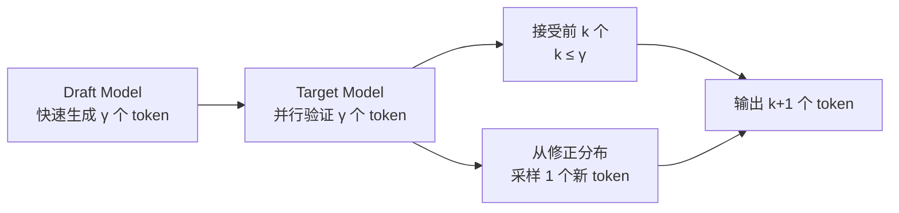
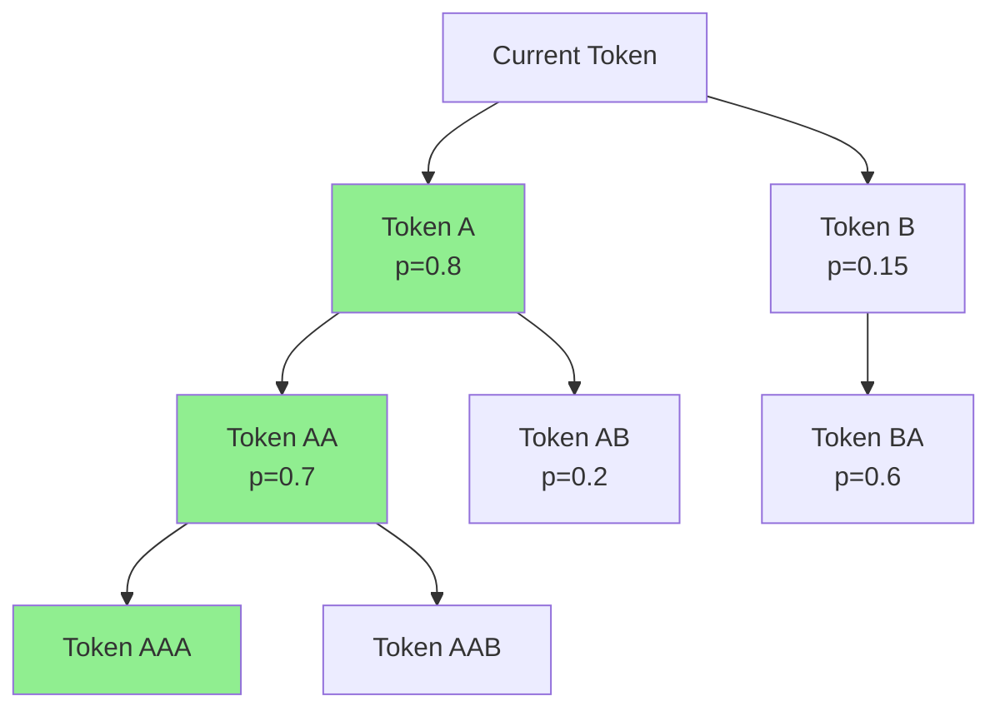
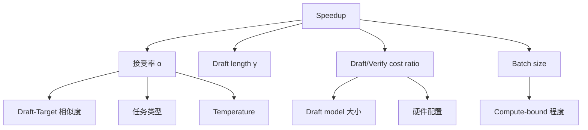

# [Speculative Decoding](https://arxiv.org/abs/2211.17192) 全面分析

## 总览

[Speculative Decoding](https://arxiv.org/abs/2211.17192) 是 LLM 推理加速的核心方法之一，通过"先猜测后验证"的方式将 autoregressive decoding 的串行瓶颈转化为并行验证，在不损失输出质量的前提下实现加速。

---

## 1. 基本原理

### 1.1 Draft-then-Verify 框架



**核心思想**：
1. 用小模型（draft model）快速生成 γ 个候选 token
2. 用大模型（target model）一次前向传播验证所有候选
3. 接受概率匹配的 token，拒绝后从修正分布采样
4. 保证输出分布与 target model 完全一致（lossless）

### 1.2 接受率与加速比

**接受率** $\alpha$：单个 token 被接受的概率

**期望接受长度**：$E[\text{accepted}] = \frac{1 - \alpha^{\gamma+1}}{1 - \alpha}$ （geometric distribution）

**加速比公式**：

$$\text{Speedup} = \frac{\text{Expected accepted tokens + 1}}{\text{Draft cost} + \text{Verify cost}}$$

简化模型（忽略 draft cost）：

$$\text{Speedup} \approx \frac{1 - \alpha^{\gamma+1}}{(1-\alpha)(1 + c \cdot \gamma)}$$

其中 $c$ 是 draft 相对于 verify 的时间比。

**关键 insight**：
- $\alpha$ 越高，加速越大
- $\gamma$ 存在最优值：太小浪费验证能力，太大浪费 draft 计算
- Batch size 增大时，decode 变为 compute-bound，speculation 收益下降

### 1.3 Token-level vs Sequence-level Speculation

| 类型 | 描述 | 代表方法 |
|------|------|----------|
| Token-level | 逐 token 验证，rejection sampling | 标准 speculative decoding |
| Sequence-level | 生成多个完整序列，选最优 | Best-of-N with speculation |
| Tree-level | 生成 token tree，并行验证多条路径 | [SpecInfer](https://arxiv.org/abs/2305.09781), [Medusa](https://arxiv.org/abs/2401.10774) |

---

## 2. Draft Model 方法分类

### 2.1 独立小模型

[**SpecInfer (2023)**](https://arxiv.org/abs/2305.09781)
- **问题定义**：如何用多个小模型协同 draft 提高接受率
- **方法核心**：多个 SSM（Small Speculative Model）生成 token tree
- **系统机制**：Tree-based parallel decoding + token tree verification
- **实验指标**：在 LLaMA-7B 上 1.5-2.8x speedup
- **工程难点**：需要训练/选择合适的 draft model，tree 管理复杂

**标准 [Speculative Decoding](https://arxiv.org/abs/2211.17192) (DeepMind, 2023)**
- **方法核心**：单个小模型 draft + rejection sampling 验证
- **数学保证**：输出分布与 target model 完全一致
- **验证公式**：accept if $u < \min(1, \frac{p(x)}{q(x)})$，其中 $p$ 是 target，$q$ 是 draft

### 2.2 Self-Draft 方法

[**Medusa (2024)**](https://arxiv.org/abs/2401.10774)
- **问题定义**：如何避免独立 draft model 的额外内存和计算开销
- **方法核心**：在 target model 最后一层添加多个 prediction head
  - Head $i$ 预测第 $i+1$ 个 future token
  - 所有 head 共享 backbone 的 hidden state
- **系统机制**：
  - Tree attention：将多个 head 的预测组合成 token tree
  - Typical acceptance：放宽验证条件，允许近似匹配
- **实验指标**：2.2-3.6x speedup（无需额外模型）
- **与同类差异**：无需独立 draft model，但需要微调 head
- **工程难点**：
  - Head 训练需要 target model 的 hidden state
  - Tree attention 的 KV cache 管理
  - 对 vLLM/SGLang 的集成需要修改 attention mask

[**EAGLE (2024)**](https://arxiv.org/abs/2401.15077)
- **问题定义**：[Medusa](https://arxiv.org/abs/2401.10774) 的 head 独立预测，缺乏 token 间依赖
- **方法核心**：
  - 用 autoregressive draft head（单层 Transformer）
  - 输入：前一个 token 的 embedding + target model 的 feature
  - 保持 token 间的依赖关系
- **实验指标**：2.5-3.8x speedup，优于 [Medusa](https://arxiv.org/abs/2401.10774)
- **工程难点**：draft head 的训练数据生成

[**EAGLE-2 (2024)**](https://arxiv.org/abs/2406.16858)
- **改进**：Dynamic draft tree construction
  - 根据 confidence score 动态调整 tree 结构
  - 高 confidence 路径分配更多 budget
- **实验指标**：3.0-4.2x speedup

### 2.3 Retrieval-based

[**REST (2024)**](https://arxiv.org/abs/2311.08252)
- **方法核心**：从 datastore 中检索 n-gram 作为 draft
- **优点**：无需训练 draft model
- **缺点**：依赖 datastore 质量，domain-specific

### 2.4 [Lookahead Decoding](https://arxiv.org/abs/2402.02057)

[**Lookahead Decoding (2024)**](https://arxiv.org/abs/2402.02057)
- **方法核心**：利用 Jacobi iteration 并行生成多个 token
  - 维护 n-gram pool
  - 每步同时 verify 已有 n-gram 和生成新 n-gram
- **优点**：无需额外模型或训练
- **缺点**：加速比有限（~1.5-2x）

### 2.5 [Mamba Drafters (2025)](https://arxiv.org/abs/2506.01206)

- **方法核心**：用 [Mamba](https://arxiv.org/abs/2312.00752)（SSM）模型作为 draft model
  - [Mamba](https://arxiv.org/abs/2312.00752) 的线性复杂度使 draft 更快
  - 特别适合长序列场景
- **优点**：draft 速度快，长序列友好
- **缺点**：需要训练 [Mamba](https://arxiv.org/abs/2312.00752) draft model

### 2.6 [MineDraft (2026)](https://arxiv.org/abs/2603.18016)

- **方法核心**：Batch Parallel [Speculative Decoding](https://arxiv.org/abs/2211.17192)
  - 在 batch 维度并行化 speculation
  - 不同请求可以有不同的 draft length
- **优点**：适合高吞吐 serving 场景
- **工程难点**：batch 内异构 draft length 的调度

---

## 3. Tree Decoding

### 3.1 Token Tree 结构



### 3.2 Tree Attention

**机制**：
- 将 tree 中所有 token 展平为序列
- 使用 causal mask 确保每个 token 只 attend 到其祖先
- 一次前向传播验证整棵树

**Attention Mask 示例**（5 个 tree nodes）：
```
     A  B  AA AB BA
A  [ 1  0  0  0  0 ]
B  [ 0  1  0  0  0 ]
AA [ 1  0  1  0  0 ]
AB [ 1  0  0  1  0 ]
BA [ 0  1  0  0  1 ]
```

### 3.3 各方法的 Tree 策略

| 方法 | Tree 构建 | Tree 大小 | 动态调整 |
|------|-----------|-----------|----------|
| [SpecInfer](https://arxiv.org/abs/2305.09781) | 多 SSM 生成 | 固定 | 否 |
| [Medusa](https://arxiv.org/abs/2401.10774) | Top-k per head | 固定 (64 nodes) | 否 |
| [EAGLE-2](https://arxiv.org/abs/2406.16858) | Confidence-based | 动态 | 是 |
| [MineDraft](https://arxiv.org/abs/2603.18016) | Batch-aware | 动态 | 是 |

---

## 4. 验证机制

### 4.1 Rejection Sampling（标准）

对每个 draft token $x_i$：
- 计算 $r = p(x_i) / q(x_i)$（target prob / draft prob）
- 以 $\min(1, r)$ 的概率接受
- 拒绝后从修正分布 $\text{norm}(\max(0, p - q))$ 采样

**保证**：输出分布与 target model 完全一致

### 4.2 Typical Acceptance ([Medusa](https://arxiv.org/abs/2401.10774))

- 放宽验证条件：只要 token 在 target model 的 typical set 中就接受
- 允许轻微的分布偏差
- 换取更高的接受率

### 4.3 Speculative Rejection ([Fast Best-of-N](https://arxiv.org/abs/2410.20290))

**论文**：[Fast Best-of-N](https://arxiv.org/abs/2410.20290) Decoding via Speculative Rejection (CMU, 2024)

- **问题**：Best-of-N 需要生成 N 个完整序列再选最优
- **方法**：用 speculation 提前拒绝低质量序列
- **效果**：减少 Best-of-N 的计算量

---

## 5. 系统集成

### 5.1 [vLLM](https://github.com/vllm-project/vllm) [Speculative Decoding](https://arxiv.org/abs/2211.17192)

**支持的方法**：
- Draft model（独立小模型）
- [Medusa](https://arxiv.org/abs/2401.10774) heads
- [EAGLE](https://arxiv.org/abs/2401.15077)
- ngram-based（无模型）

**工程挑战**：
- Batch 内不同请求的 draft length 不同
- Tree attention 的 KV cache block 管理
- Speculation 失败时的 rollback

### 5.2 [SGLang](https://github.com/sgl-project/sglang) [Speculative Decoding](https://arxiv.org/abs/2211.17192)

**特点**：
- 与 [RadixAttention](https://arxiv.org/abs/2312.07104) 集成
- Draft model 的 KV cache 也可以 prefix share
- [EAGLE](https://arxiv.org/abs/2401.15077) 集成

### 5.3 [TensorRT-LLM](https://github.com/NVIDIA/TensorRT-LLM)

**特点**：
- Draft model 支持
- [FP8](https://arxiv.org/abs/2209.05433) draft model
- 硬件级优化的 tree attention

### 5.4 工程挑战总结

| 挑战 | 描述 | 解决方案 |
|------|------|----------|
| KV Cache 管理 | Tree nodes 的 KV cache 分配/回收 | Paged allocation + rollback |
| Batch 异构 | 不同请求 draft length 不同 | Padding 或 variable-length batch |
| Draft model 选择 | 如何选择最优 draft model | 离线评估 acceptance rate |
| 长序列 | 长 context 下 draft 质量下降 | [MagicDec](https://arxiv.org/abs/2408.11049): speculation on KV subset |
| Serving 集成 | 与 continuous batching 的交互 | 每个 iteration 决定是否 speculate |

---

## 6. 性能分析

### 6.1 Speedup 影响因素



### 6.2 各方法性能对比

| 方法 | Speedup (7B) | Speedup (70B) | 额外内存 | 需要训练 |
|------|-------------|---------------|----------|----------|
| Draft model (68M) | 1.8-2.5x | 2.0-3.0x | +68M params | 否（用现有模型） |
| [Medusa](https://arxiv.org/abs/2401.10774) | 2.2-3.6x | 2.5-3.8x | +少量 head | 是 |
| [EAGLE](https://arxiv.org/abs/2401.15077) | 2.5-3.8x | 3.0-4.0x | +1 layer | 是 |
| [EAGLE-2](https://arxiv.org/abs/2406.16858) | 3.0-4.2x | 3.5-4.5x | +1 layer | 是 |
| Lookahead | 1.5-2.0x | 1.8-2.5x | 无 | 否 |
| [REST](https://arxiv.org/abs/2311.08252) | 1.5-2.5x | 2.0-3.0x | +datastore | 否 |

### 6.3 Batch Size 效应

- **小 batch (1-4)**：Decode 是 memory-bound，speculation 收益最大
- **中 batch (8-32)**：逐渐变为 compute-bound，收益下降
- **大 batch (64+)**：Compute-bound，speculation 几乎无收益（verify 成本高）

**MagicDec 的解决方案**：在大 batch 下，对 KV cache 做 sparse attention 来降低 verify 成本

### 6.4 对主流系统的影响

| 系统 | 集成状态 | 推荐方法 |
|------|----------|----------|
| [vLLM](https://github.com/vllm-project/vllm) | 完整支持 | [EAGLE](https://arxiv.org/abs/2401.15077)（高加速比） |
| [SGLang](https://github.com/sgl-project/sglang) | 完整支持 | [EAGLE](https://arxiv.org/abs/2401.15077) + [RadixAttention](https://arxiv.org/abs/2312.07104) |
| [TensorRT-LLM](https://github.com/NVIDIA/TensorRT-LLM) | 支持 draft model | Draft model（稳定） |
| [llama.cpp](https://github.com/ggerganov/llama.cpp) | 基础支持 | Draft model（简单） |

---

## 最新进展 (2025-2026)

- [**EAGLE-3**](https://arxiv.org/abs/2503.01840) (Peking University, 2025): Training-Time Test架构，直接预测token+多步生成模拟训练，LLaMA-3.3-70B达4.79x加速
- [**EAGLE-3.1**](https://github.com/SafeAILab/EAGLE) (SafeAI Lab, 2026): 修复attention drift问题，FC normalization稳定hidden states，长上下文acceptance length提升2x
- [**DART**](https://arxiv.org/abs/2601.19278) (2026): 扩散模型启发的并行draft，单次forward预测多个future masked positions的logits，消除autoregressive rollout
- [**Speculative Speculative Decoding (SSD/Saguaro)**](https://arxiv.org/abs/2603.03251) (2026): 二级speculation架构，比SGLang最优baseline快2x，建立新的SOTA
- [**P-EAGLE**](https://aws.amazon.com/blogs/machine-learning/p-eagle-faster-llm-inference-with-parallel-speculative-decoding-in-vllm) (AWS, 2025): 并行化EAGLE draft生成，4层模型单次forward生成10 tokens，B200上比EAGLE-3快1.69x
- [**SpecForge**](https://arxiv.org/abs/2603.18567) (2026): 开源生产级speculative decoding训练框架，target-draft解耦+混合并行，Qwen3-235B训练加速9.9x
- [**Learning To Draft (LTD)**](https://arxiv.org/abs/2603.01639) (2026): 强化学习自适应draft深度和tree大小，DeepSeek-R1上额外加速10%
