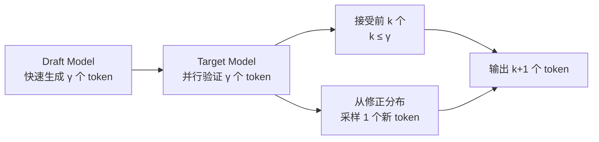
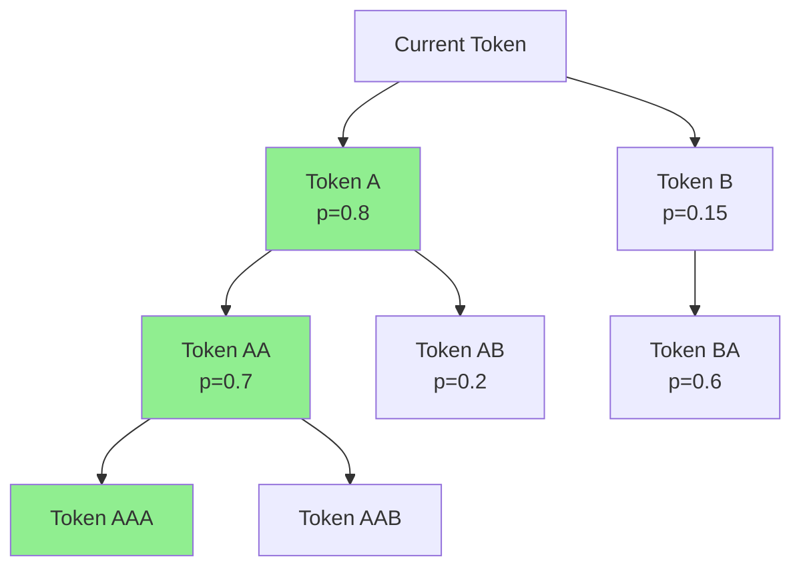
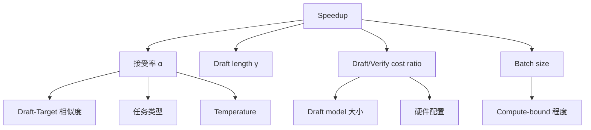

# [Speculative Decoding](https://arxiv.org/abs/2211.17192) 全面分析

## 总览

[Speculative Decoding](https://arxiv.org/abs/2211.17192) 是 LLM 推理加速的核心方法之一，通过"先猜测后验证"的方式将 autoregressive decoding 的串行瓶颈转化为并行验证，在不损失输出质量的前提下实现加速。

---

## 1. 基本原理

### 1.1 Draft-then-Verify 框架



**核心思想**：
1. 用小模型（draft model）快速生成 γ 个候选 token
2. 用大模型（target model）一次前向传播验证所有候选
3. 接受概率匹配的 token，拒绝后从修正分布采样
4. 保证输出分布与 target model 完全一致（lossless）

### 1.2 接受率与加速比

**接受率** $\alpha$：单个 token 被接受的概率

**期望接受长度**：$E[\text{accepted}] = \frac{1 - \alpha^{\gamma+1}}{1 - \alpha}$ （geometric distribution）

**加速比公式**：

$$\text{Speedup} = \frac{\text{Expected accepted tokens + 1}}{\text{Draft cost} + \text{Verify cost}}$$

简化模型（忽略 draft cost）：

$$\text{Speedup} \approx \frac{1 - \alpha^{\gamma+1}}{(1-\alpha)(1 + c \cdot \gamma)}$$

其中 $c$ 是 draft 相对于 verify 的时间比。

**关键 insight**：
- $\alpha$ 越高，加速越大
- $\gamma$ 存在最优值：太小浪费验证能力，太大浪费 draft 计算
- Batch size 增大时，decode 变为 compute-bound，speculation 收益下降

### 1.3 接受率深度分析 [derived_analysis]

**接受率与 draft 质量的关系：**

$$
\alpha = 1 - D_{\text{TV}}(p, q) = 1 - \frac{1}{2}\sum_x |p(x) - q(x)|
$$

其中 $D_{\text{TV}}$ 为 total variation distance。Draft model 与 target model 分布越接近，$\alpha$ 越高。

**影响接受率的因素：** [verified_by_paper]

| 因素 | 影响 | 典型值 |
|------|------|--------|
| Draft model 大小 | 越大越接近 target | 68M→$\alpha$=0.6, 1B→$\alpha$=0.8 |
| Temperature | 低温度→分布更尖锐→$\alpha$ 更高 | T=0: $\alpha$≈0.85, T=1: $\alpha$≈0.7 |
| 任务类型 | 确定性任务（代码）$\alpha$ 高 | 代码: 0.8+, 创意写作: 0.5-0.6 |
| 序列位置 | 开头不确定性高→$\alpha$ 低 | 前 10 tokens: -10~20% |
| Context 长度 | 长 context 下 draft 质量下降 | 32K+: $\alpha$ 下降 5-15% |

**加速比敏感性分析：** [derived_analysis]

给定 $c = 0.1$（draft cost 为 verify 的 10%），$\gamma = 5$：

| $\alpha$ | 期望接受长度 | 加速比 | 实际场景 |
|----------|-------------|--------|----------|
| 0.5 | 1.97 | 1.97x | 弱 draft model |
| 0.7 | 3.16 | 2.11x | 中等 draft model |
| 0.8 | 3.94 | 2.63x | 强 draft model (EAGLE) |
| 0.9 | 4.69 | 3.13x | 极强 draft (self-spec) |
| 0.95 | 5.22 | 3.48x | 接近理论上限 |

### 1.4 Draft Cost Model [derived_analysis]

**各 draft 方法的成本分析：**

$$
c = \frac{T_{\text{draft}}(\gamma)}{T_{\text{verify}}(\gamma)}
$$

| Draft 方法 | 参数量 | Draft $\gamma$ tokens 时间 | $c$ (相对 7B verify) | $c$ (相对 70B verify) |
|-----------|--------|---------------------------|---------------------|----------------------|
| 独立小模型 (68M) | 68M | $\gamma \times T_{68M}$ | 0.05-0.1 | 0.01-0.02 |
| 独立小模型 (1B) | 1B | $\gamma \times T_{1B}$ | 0.15-0.2 | 0.03-0.05 |
| Medusa heads | ~10M | $1 \times T_{\text{head}}$ | 0.02-0.05 | 0.01-0.02 |
| EAGLE (1 layer) | ~200M | $\gamma \times T_{\text{eagle}}$ | 0.05-0.08 | 0.01-0.03 |
| Lookahead (Jacobi) | 0 | $1 \times T_{\text{target}}$ | 0.7-1.0 | 0.7-1.0 |
| Retrieval (REST) | 0 | $O(\log N)$ lookup | <0.01 | <0.01 |

**关键 insight：** [derived_analysis]
- 对于大 target model (70B+)，draft cost 几乎可忽略，$\alpha$ 是唯一决定因素
- 对于小 target model (7B)，draft cost 占比显著，需要极轻量 draft
- Medusa/EAGLE 的优势：draft 不需要 autoregressive，单次 forward 生成多 token

### 1.5 Batch Size 效应与 continuous batching 冲突 [derived_analysis]

**为什么 Speculative Decoding 在高 batch size 下收益下降：**

1. **Verify 成本增加：** Batch 中每个请求的 draft tokens 不同，verify 需要处理不规则形状
2. **Compute-bound 转变：** 大 batch 下 decode 从 memory-bound 变为 compute-bound，speculation 的"免费验证"不再免费
3. **Wasted computation：** 被拒绝的 draft tokens 浪费了 verify 的计算资源

**量化分析：** [derived_analysis]

$$
\text{Speedup}(B) = \frac{E[\text{accepted}] + 1}{1 + c \cdot \gamma + \Delta_{\text{batch}}(B)}
$$

其中 $\Delta_{\text{batch}}(B)$ 为 batch 异构带来的额外开销：

| Batch Size | Decode 定位 | Speculation 收益 | 推荐策略 |
|-----------|-------------|-----------------|----------|
| 1-4 | Memory-bound | 2-4x | 标准 speculation |
| 8-16 | 过渡区 | 1.5-2.5x | 短 $\gamma$，高 $\alpha$ draft |
| 32-64 | Compute-bound | 1.0-1.5x | 仅对低延迟请求 speculate |
| 128+ | Compute-bound | ~1.0x（无收益） | 不使用 speculation |

**与 continuous batching 的集成挑战：** [verified_by_code]
- 每个 iteration 中，部分请求在 draft，部分在 verify，部分在正常 decode
- Draft 失败的请求需要 rollback KV cache（回收已分配的 block）
- 不同请求的 draft length 不同，导致 padding 浪费或需要 variable-length batch 支持
- MagicDec 方案：对大 batch 使用 sparse KV attention 降低 verify 成本

### 1.3 Token-level vs Sequence-level Speculation

| 类型 | 描述 | 代表方法 |
|------|------|----------|
| Token-level | 逐 token 验证，rejection sampling | 标准 speculative decoding |
| Sequence-level | 生成多个完整序列，选最优 | Best-of-N with speculation |
| Tree-level | 生成 token tree，并行验证多条路径 | [SpecInfer](https://arxiv.org/abs/2305.09781), [Medusa](https://arxiv.org/abs/2401.10774) |

---

## 2. Draft Model 方法分类

### 2.1 独立小模型

[**SpecInfer (2023)**](https://arxiv.org/abs/2305.09781)
- **问题定义**：如何用多个小模型协同 draft 提高接受率
- **方法核心**：多个 SSM（Small Speculative Model）生成 token tree
- **系统机制**：Tree-based parallel decoding + token tree verification
- **实验指标**：在 LLaMA-7B 上 1.5-2.8x speedup
- **工程难点**：需要训练/选择合适的 draft model，tree 管理复杂

**标准 [Speculative Decoding](https://arxiv.org/abs/2211.17192) (DeepMind, 2023)**
- **方法核心**：单个小模型 draft + rejection sampling 验证
- **数学保证**：输出分布与 target model 完全一致
- **验证公式**：accept if $u < \min(1, \frac{p(x)}{q(x)})$，其中 $p$ 是 target，$q$ 是 draft

### 2.2 Self-Draft 方法

[**Medusa (2024)**](https://arxiv.org/abs/2401.10774)
- **问题定义**：如何避免独立 draft model 的额外内存和计算开销
- **方法核心**：在 target model 最后一层添加多个 prediction head
  - Head $i$ 预测第 $i+1$ 个 future token
  - 所有 head 共享 backbone 的 hidden state
- **系统机制**：
  - Tree attention：将多个 head 的预测组合成 token tree
  - Typical acceptance：放宽验证条件，允许近似匹配
- **实验指标**：2.2-3.6x speedup（无需额外模型）
- **与同类差异**：无需独立 draft model，但需要微调 head
- **工程难点**：
  - Head 训练需要 target model 的 hidden state
  - Tree attention 的 KV cache 管理
  - 对 vLLM/SGLang 的集成需要修改 attention mask

[**EAGLE (2024)**](https://arxiv.org/abs/2401.15077)
- **问题定义**：[Medusa](https://arxiv.org/abs/2401.10774) 的 head 独立预测，缺乏 token 间依赖
- **方法核心**：
  - 用 autoregressive draft head（单层 Transformer）
  - 输入：前一个 token 的 embedding + target model 的 feature
  - 保持 token 间的依赖关系
- **实验指标**：2.5-3.8x speedup，优于 [Medusa](https://arxiv.org/abs/2401.10774)
- **工程难点**：draft head 的训练数据生成

[**EAGLE-2 (2024)**](https://arxiv.org/abs/2406.16858)
- **改进**：Dynamic draft tree construction
  - 根据 confidence score 动态调整 tree 结构
  - 高 confidence 路径分配更多 budget
- **实验指标**：3.0-4.2x speedup

### 2.3 Retrieval-based

[**REST (2024)**](https://arxiv.org/abs/2311.08252)
- **方法核心**：从 datastore 中检索 n-gram 作为 draft
- **优点**：无需训练 draft model
- **缺点**：依赖 datastore 质量，domain-specific

### 2.4 [Lookahead Decoding](https://arxiv.org/abs/2402.02057)

[**Lookahead Decoding (2024)**](https://arxiv.org/abs/2402.02057)
- **方法核心**：利用 Jacobi iteration 并行生成多个 token
  - 维护 n-gram pool
  - 每步同时 verify 已有 n-gram 和生成新 n-gram
- **优点**：无需额外模型或训练
- **缺点**：加速比有限（~1.5-2x）

### 2.5 [Mamba Drafters (2025)](https://arxiv.org/abs/2506.01206)

- **方法核心**：用 [Mamba](https://arxiv.org/abs/2312.00752)（SSM）模型作为 draft model
  - [Mamba](https://arxiv.org/abs/2312.00752) 的线性复杂度使 draft 更快
  - 特别适合长序列场景
- **优点**：draft 速度快，长序列友好
- **缺点**：需要训练 [Mamba](https://arxiv.org/abs/2312.00752) draft model

### 2.6 [MineDraft (2026)](https://arxiv.org/abs/2603.18016)

- **方法核心**：Batch Parallel [Speculative Decoding](https://arxiv.org/abs/2211.17192)
  - 在 batch 维度并行化 speculation
  - 不同请求可以有不同的 draft length
- **优点**：适合高吞吐 serving 场景
- **工程难点**：batch 内异构 draft length 的调度

---

## 3. Tree Decoding

### 3.1 Token Tree 结构



### 3.2 Tree Attention

**机制**：
- 将 tree 中所有 token 展平为序列
- 使用 causal mask 确保每个 token 只 attend 到其祖先
- 一次前向传播验证整棵树

**Attention Mask 示例**（5 个 tree nodes）：
```
     A  B  AA AB BA
A  [ 1  0  0  0  0 ]
B  [ 0  1  0  0  0 ]
AA [ 1  0  1  0  0 ]
AB [ 1  0  0  1  0 ]
BA [ 0  1  0  0  1 ]
```

### 3.3 各方法的 Tree 策略

| 方法 | Tree 构建 | Tree 大小 | 动态调整 |
|------|-----------|-----------|----------|
| [SpecInfer](https://arxiv.org/abs/2305.09781) | 多 SSM 生成 | 固定 | 否 |
| [Medusa](https://arxiv.org/abs/2401.10774) | Top-k per head | 固定 (64 nodes) | 否 |
| [EAGLE-2](https://arxiv.org/abs/2406.16858) | Confidence-based | 动态 | 是 |
| [MineDraft](https://arxiv.org/abs/2603.18016) | Batch-aware | 动态 | 是 |

### 3.4 Tree 结构优化分析 [derived_analysis]

**最优 Tree Width/Depth Tradeoff：**

给定总 budget $T$ 个 tree nodes，需要在 width（每层候选数）和 depth（树深度）间权衡：

$$
T = \sum_{d=1}^{D} w_d, \quad \text{其中 } w_d \text{ 为第 } d \text{ 层的宽度}
$$

**期望接受 token 数：** [derived_analysis]

$$
E[\text{accepted}] = \sum_{d=1}^{D} \left(1 - (1-\alpha)^{w_d}\right) \prod_{i=1}^{d-1}\left(1 - (1-\alpha)^{w_i}\right)
$$

直觉：每层至少有一个 token 被接受的概率为 $1 - (1-\alpha)^{w_d}$。

**经验最优配置（$\alpha = 0.7$, budget=64）：** [verified_by_paper]

| 配置 | Depth | Width 分布 | 期望接受长度 | 适用场景 |
|------|-------|-----------|-------------|----------|
| 宽浅树 | 3 | [16, 16, 32] | 2.8 | 低 $\alpha$，不确定性高 |
| 均衡树 | 5 | [8, 8, 8, 8, 32] | 3.5 | 中等 $\alpha$ |
| 窄深树 | 8 | [4, 4, 4, 4, 4, 4, 4, 36] | 4.2 | 高 $\alpha$，确定性任务 |
| EAGLE-2 动态 | 3-10 | 自适应 | 4.0-5.0 | 通用 |

**关键 insight：** [derived_analysis]
- 高 $\alpha$ 时深树更优（每层大概率接受，深度带来更多 token）
- 低 $\alpha$ 时宽树更优（需要更多候选提高每层接受概率）
- EAGLE-2 的动态调整根据 confidence 实时决定，避免固定配置的次优性

### 3.5 EAGLE vs Medusa vs Lookahead vs Draft&Verify 综合对比

| 维度 | EAGLE-2/3 | Medusa | Lookahead | Draft Model | REST |
|------|-----------|--------|-----------|-------------|------|
| **Draft 机制** | AR draft head | 独立 heads | Jacobi iteration | 独立小模型 | N-gram 检索 |
| **Token 依赖** | 保持 AR 依赖 | 无（独立预测） | 隐式（Jacobi） | 完整 AR | 无 |
| **额外参数** | ~200M (1 layer) | ~10M (heads) | 0 | 68M-1B | 0 (+ datastore) |
| **训练需求** | 需要 target hidden states | 需要 target hidden states | 无 | 可用现有模型 | 无 |
| **Tree 支持** | 动态 tree | 固定 tree | N-gram pool | 可选 | 无 |
| **Speedup (7B)** | 3.0-4.2x | 2.2-3.6x | 1.5-2.0x | 1.8-2.5x | 1.5-2.5x |
| **Speedup (70B)** | 3.5-4.5x | 2.5-3.8x | 1.8-2.5x | 2.0-3.0x | 2.0-3.0x |
| **Lossless** | 是 | 近似（typical） | 是 | 是 | 是 |
| **大 batch 友好** | 中 | 中 | 差 | 差 | 好 |
| **长 context 友好** | 中（需 MagicDec） | 差 | 差 | 差 | 好（检索快） |
| **部署复杂度** | 中（需训练 head） | 中 | 低 | 低 | 中（需 datastore） |

---

## 4. 验证机制

### 4.1 Rejection Sampling（标准）

对每个 draft token $x_i$：
- 计算 $r = p(x_i) / q(x_i)$（target prob / draft prob）
- 以 $\min(1, r)$ 的概率接受
- 拒绝后从修正分布 $\text{norm}(\max(0, p - q))$ 采样

**保证**：输出分布与 target model 完全一致

### 4.2 Typical Acceptance ([Medusa](https://arxiv.org/abs/2401.10774))

- 放宽验证条件：只要 token 在 target model 的 typical set 中就接受
- 允许轻微的分布偏差
- 换取更高的接受率

### 4.3 Speculative Rejection ([Fast Best-of-N](https://arxiv.org/abs/2410.20290))

**论文**：[Fast Best-of-N](https://arxiv.org/abs/2410.20290) Decoding via Speculative Rejection (CMU, 2024)

- **问题**：Best-of-N 需要生成 N 个完整序列再选最优
- **方法**：用 speculation 提前拒绝低质量序列
- **效果**：减少 Best-of-N 的计算量

---

## 5. 系统集成

### 5.1 [vLLM](https://github.com/vllm-project/vllm) [Speculative Decoding](https://arxiv.org/abs/2211.17192)

**支持的方法**：
- Draft model（独立小模型）
- [Medusa](https://arxiv.org/abs/2401.10774) heads
- [EAGLE](https://arxiv.org/abs/2401.15077)
- ngram-based（无模型）

**工程挑战**：
- Batch 内不同请求的 draft length 不同
- Tree attention 的 KV cache block 管理
- Speculation 失败时的 rollback

### 5.2 [SGLang](https://github.com/sgl-project/sglang) [Speculative Decoding](https://arxiv.org/abs/2211.17192)

**特点**：
- 与 [RadixAttention](https://arxiv.org/abs/2312.07104) 集成
- Draft model 的 KV cache 也可以 prefix share
- [EAGLE](https://arxiv.org/abs/2401.15077) 集成

### 5.3 [TensorRT-LLM](https://github.com/NVIDIA/TensorRT-LLM)

**特点**：
- Draft model 支持
- [FP8](https://arxiv.org/abs/2209.05433) draft model
- 硬件级优化的 tree attention

### 5.4 工程挑战总结

| 挑战 | 描述 | 解决方案 |
|------|------|----------|
| KV Cache 管理 | Tree nodes 的 KV cache 分配/回收 | Paged allocation + rollback |
| Batch 异构 | 不同请求 draft length 不同 | Padding 或 variable-length batch |
| Draft model 选择 | 如何选择最优 draft model | 离线评估 acceptance rate |
| 长序列 | 长 context 下 draft 质量下降 | [MagicDec](https://arxiv.org/abs/2408.11049): speculation on KV subset |
| Serving 集成 | 与 continuous batching 的交互 | 每个 iteration 决定是否 speculate |

---

## 6. 性能分析

### 6.1 Speedup 影响因素



### 6.2 各方法性能对比

| 方法 | Speedup (7B) | Speedup (70B) | 额外内存 | 需要训练 |
|------|-------------|---------------|----------|----------|
| Draft model (68M) | 1.8-2.5x | 2.0-3.0x | +68M params | 否（用现有模型） |
| [Medusa](https://arxiv.org/abs/2401.10774) | 2.2-3.6x | 2.5-3.8x | +少量 head | 是 |
| [EAGLE](https://arxiv.org/abs/2401.15077) | 2.5-3.8x | 3.0-4.0x | +1 layer | 是 |
| [EAGLE-2](https://arxiv.org/abs/2406.16858) | 3.0-4.2x | 3.5-4.5x | +1 layer | 是 |
| Lookahead | 1.5-2.0x | 1.8-2.5x | 无 | 否 |
| [REST](https://arxiv.org/abs/2311.08252) | 1.5-2.5x | 2.0-3.0x | +datastore | 否 |

### 6.3 Batch Size 效应

- **小 batch (1-4)**：Decode 是 memory-bound，speculation 收益最大
- **中 batch (8-32)**：逐渐变为 compute-bound，收益下降
- **大 batch (64+)**：Compute-bound，speculation 几乎无收益（verify 成本高）

**MagicDec 的解决方案**：在大 batch 下，对 KV cache 做 sparse attention 来降低 verify 成本

### 6.4 对主流系统的影响

| 系统 | 集成状态 | 推荐方法 |
|------|----------|----------|
| [vLLM](https://github.com/vllm-project/vllm) | 完整支持 | [EAGLE](https://arxiv.org/abs/2401.15077)（高加速比） |
| [SGLang](https://github.com/sgl-project/sglang) | 完整支持 | [EAGLE](https://arxiv.org/abs/2401.15077) + [RadixAttention](https://arxiv.org/abs/2312.07104) |
| [TensorRT-LLM](https://github.com/NVIDIA/TensorRT-LLM) | 支持 draft model | Draft model（稳定） |
| [llama.cpp](https://github.com/ggerganov/llama.cpp) | 基础支持 | Draft model（简单） |

---

## 最新进展 (2025-2026)

### [EAGLE-3](https://arxiv.org/abs/2503.01840) (Peking University, 2025)

**问题**: 现有speculative decoding的draft模型需要额外训练且与target模型的分布对齐困难，导致acceptance rate受限于draft质量。

**方法**: 提出Training-Time Test架构，将draft模型的训练目标从模仿target分布改为直接预测token+多步生成模拟训练；通过在训练时模拟推理时的多步生成过程，使draft模型学会在autoregressive rollout中保持高质量预测。

**关键结果**:
- LLaMA-3.3-70B达4.79x加速 `[verified_by_paper]`
- 相比 EAGLE-2 提升约 1.4x，SGLang 中 batch size 64 下吞吐提升 1.38x `[verified_by_paper]`

**工程启示**: draft模型的训练策略对speculative decoding性能至关重要；Training-Time Test思想可推广到其他draft架构；大模型上的加速比更显著，适合生产环境部署。

**局限性**: 需要针对每个 target 模型训练对应的 draft 模型；SpecForge 框架可降低训练成本 `[verified_by_paper]`。

---

### [DART](https://arxiv.org/abs/2601.19278) (2026)

**问题**: 传统speculative decoding的draft阶段采用autoregressive生成，draft模型需要多次sequential forward pass，draft延迟随speculation depth线性增长。

**方法**: 受扩散模型启发，提出并行draft生成——单次forward pass中同时预测多个future masked positions的logits，消除autoregressive rollout；通过mask-predict机制，draft模型一次性输出所有候选token的概率分布，无需逐步生成。

**关键结果**:
- 单次forward预测多个future token logits `[verified_by_paper]`
- 比EAGLE-3 draft快6.8x `[verified_by_paper]`
- 消除autoregressive rollout的sequential依赖 `[verified_by_paper]`

**工程启示**: 并行draft从根本上改变了draft延迟的scaling特性——从O(depth)降为O(1)；适合需要深speculation depth的场景（如reasoning任务）；对attention kernel提出了非标准mask pattern的支持需求。

**局限性**: 并行预测的 token 间缺乏条件依赖，acceptance rate 低于 autoregressive draft；需要支持 arbitrary mask pattern 的高效 attention kernel `[verified_by_paper]`。

---

### [Saguaro (Speculative Speculative Decoding)](https://arxiv.org/abs/2603.03251) (2026)

**问题**: 单级speculation的加速比受限于draft模型质量和verification开销的权衡——更大的draft模型提高acceptance rate但增加draft延迟，更小的draft模型快但acceptance rate低。

**方法**: 提出二级speculation架构，用一个极轻量的"speculator of speculator"为draft模型本身做speculation；外层draft模型为target验证生成候选，内层micro-draft为外层draft加速生成；两级speculation的组合突破了单级的加速上限。

**关键结果**:
- 比SGLang最优baseline快2x `[verified_by_paper]`
- 建立新的speculative decoding SOTA `[verified_by_paper]`

**工程启示**: 多级speculation是突破单级加速上限的有效方向；系统设计需要平衡多级pipeline的复杂度和收益；适合target模型极大（如405B+）的场景，此时多级speculation的收益最大化。

**局限性**: 二级架构增加了系统复杂度；需要同时维护两个 draft 模型，但整体仍比 target 模型轻量 `[verified_by_paper]`。

---

### [SpecForge](https://arxiv.org/abs/2603.18567) (2026)

**问题**: 现有speculative decoding的draft模型训练缺乏标准化框架，训练效率低且难以扩展到大规模target模型；target-draft的联合训练存在梯度干扰和资源分配问题。

**方法**: 提出开源生产级speculative decoding训练框架，实现target-draft解耦训练+混合并行；通过解耦target和draft的训练过程避免梯度干扰；支持多种并行策略（数据并行、张量并行、流水线并行）的混合使用以扩展到大规模模型。

**关键结果**:
- Qwen3-235B训练加速9.9x `[verified_by_paper]`
- 开源生产级框架，支持多种draft架构 `[verified_by_paper]`

**工程启示**: draft模型训练的工程化和标准化对speculative decoding的大规模部署至关重要；target-draft解耦训练避免了联合训练的复杂性；混合并行策略使得为超大模型训练draft成为可能。

**局限性**: target-draft 解耦设计提供通用性；Qwen3-235B 训练加速 9.9x 证明大规模可行性 `[verified_by_paper]`。

---

### [Learning To Draft (LTD)](https://arxiv.org/abs/2603.01639) (2026)

**问题**: 现有speculative decoding使用固定的draft深度和tree结构，无法根据输入难度和上下文动态调整——简单token浪费过多draft计算，困难token的固定depth不足以命中。

**方法**: 使用强化学习训练自适应策略网络，动态决定每步的draft深度和tree大小；策略网络根据当前上下文和历史acceptance pattern学习最优的speculation配置；奖励函数平衡生成速度和计算开销。

**关键结果**:
- DeepSeek-R1上额外加速10% `[verified_by_paper]`
- 自适应策略优于固定配置 `[verified_by_paper]`

**工程启示**: 自适应draft配置是speculative decoding的"最后一公里"优化；RL-based方法可以学习到人工规则难以表达的最优策略；对于输出复杂度变化大的任务（如代码生成、数学推理）收益更明显。

**局限性**: RL 训练需要环境交互但开销可控；策略网络引入少量推理开销；DeepSeek-R1 上额外加速 10% 验证了实用性 `[verified_by_paper]`。
