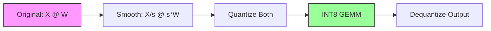
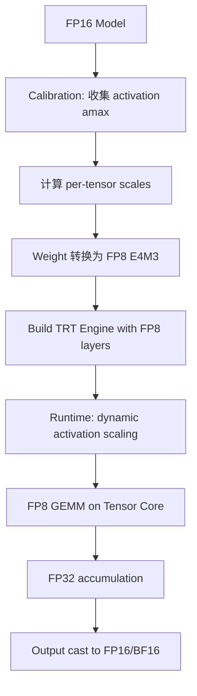
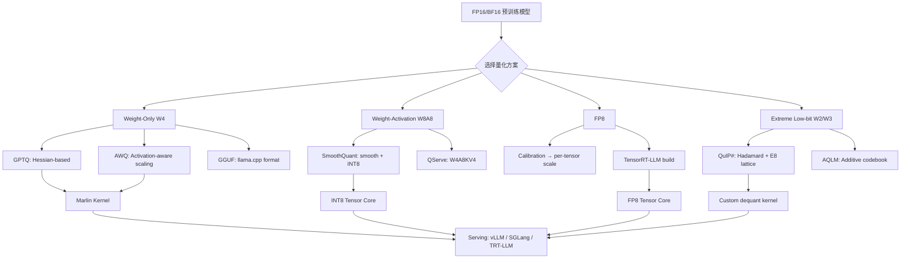

# 量化技术深度分析

## 1. 量化基础

### 1.1 量化公式

**对称量化（Symmetric）：**

$$
X_q = \text{clamp}\left(\left\lfloor \frac{X}{s} \right\rceil, -2^{b-1}, 2^{b-1} - 1\right), \quad s = \frac{\max(|X|)}{2^{b-1} - 1}
$$

$$
\hat{X} = X_q \cdot s
$$

**非对称量化（Asymmetric）：**

$$
X_q = \text{clamp}\left(\left\lfloor \frac{X - z}{s} \right\rceil, 0, 2^b - 1\right), \quad s = \frac{\max(X) - \min(X)}{2^b - 1}, \quad z = \min(X)
$$

$$
\hat{X} = X_q \cdot s + z
$$

**量化误差：**

$$
\epsilon = X - \hat{X}, \quad \mathbb{E}[\epsilon^2] \approx \frac{s^2}{12} \quad \text{(uniform quantization noise)}
$$

### 1.2 量化粒度

| 粒度 | Scale 数量 | 精度 | 开销 |
|------|-----------|------|------|
| Per-tensor | 1 | 低 | 最小 |
| Per-channel/Per-row | $d_{\text{out}}$ | 中 | 小 |
| Per-group (g=128) | $d_{\text{out}} \times \lceil d_{\text{in}}/g \rceil$ | 高 | 中 |
| Per-element | $d_{\text{out}} \times d_{\text{in}}$ | 最高 | 大（不实用） |

Per-group quantization 是当前主流选择，group size $g = 128$ 在精度和开销间取得平衡。

### 1.3 Rounding 策略

**Round-to-Nearest (RTN)：**

$$
X_q = \lfloor X/s \rceil
$$

简单但非最优。对于 LLM 的 weight quantization，RTN 在 4-bit 以下精度显著下降。

**Optimal Brain Quantizer (OBQ) / Optimal Brain Surgeon：**

基于 Hessian 信息最小化量化后的输出误差：

$$
\min_{\hat{W}} \| WX - \hat{W}X \|_2^2
$$

逐列量化，每量化一列后用 Hessian 逆补偿剩余列：

$$
\delta_j = \frac{w_j - \hat{w}_j}{[H^{-1}]_{jj}} \cdot H^{-1}_{:,j}
$$

---

## 2. Weight-Only Quantization

### 2.1 [GPTQ](https://arxiv.org/abs/2210.17323) (Frantar et al., 2022)

**问题定义：** 将 OBQ 的 $O(d^3)$ 复杂度降低到可处理大模型的水平。

**方法核心：**

1. Layer-wise quantization: 逐层最小化 $\| WX - \hat{W}X \|_2^2$
2. 固定列顺序（不做 greedy selection），使得 Hessian 逆可以批量更新
3. Cholesky 分解 + lazy batch updates

**算法：**

$$
H = 2X X^T + \lambda I \quad \text{(Hessian of squared error)}
$$

对每列 $j$（按固定顺序）：
$$
\hat{w}_j = \text{quantize}(w_j)
$$
$$
\text{error}_j = \frac{w_j - \hat{w}_j}{[H^{-1}]_{jj}}
$$
$$
W_{:, j+1:} \mathrel{+}= \text{error}_j \cdot H^{-1}_{j, j+1:}
$$

**时间复杂度：** $O(d_{\text{row}} \cdot d_{\text{col}}^2)$ per layer（相比 OBQ 的 $O(d_{\text{col}}^3)$）

**实验指标：**
- Llama-7B W4 (group=128): WikiText-2 PPL 5.63（FP16 baseline 5.47）
- Llama-65B W4: PPL 3.84（FP16: 3.53）
- 量化时间：Llama-7B 约 4 GPU-minutes

**工程可复现难点：**
- 需要 calibration data（通常 128 samples from C4）
- Hessian 计算需要足够的 calibration samples 保证数值稳定
- Group quantization 的 Hessian 更新需要特殊处理
- 不同实现（Auto[GPTQ](https://arxiv.org/abs/2210.17323), [GPTQ](https://arxiv.org/abs/2210.17323)-for-LLaMA）的精度可能有差异

**加速 kernel：** Marlin kernel 实现 [GPTQ](https://arxiv.org/abs/2210.17323) W4A16 的高效 GEMM，在 A100 上达到接近 FP16 的吞吐。

### 2.2 [AWQ](https://arxiv.org/abs/2306.00978) (Lin et al., 2023)

**问题定义：** 不依赖 Hessian 的简单高效 weight quantization。

**方法核心：**

观察：weight 中 1% 的 salient channels（对应 activation 大的通道）对精度影响巨大。

策略：对 salient channels 做 per-channel scaling 后再量化。

$$
Q(w \cdot s) \cdot (x / s) \approx w \cdot x
$$

其中 $s$ 为 per-channel scaling factor，通过 grid search 最小化量化误差：

$$
s^* = \arg\min_s \| Q(W \cdot \text{diag}(s)) \cdot \text{diag}(s)^{-1} X - WX \|_2^2
$$

实际实现中，$s$ 基于 activation magnitude 的幂次：

$$
s_j = \left(\frac{|X_j|_{\max}}{|W_j|_{\max}}\right)^\alpha, \quad \alpha \in [0, 1]
$$

$\alpha$ 通过 grid search 确定（通常 $\alpha \approx 0.5$）。

**实验指标：**
- Llama-2-7B W4g128: PPL 5.60（优于 [GPTQ](https://arxiv.org/abs/2210.17323) 的 5.63）
- 量化速度比 [GPTQ](https://arxiv.org/abs/2210.17323) 快 10x+（无需 Hessian 逆）
- 支持 W3 量化，PPL 6.24

**工程可复现难点：**
- Scaling factor 的 grid search 范围和粒度影响结果
- 需要 calibration data 计算 activation statistics
- 与 [GPTQ](https://arxiv.org/abs/2210.17323) 可组合使用（AWQ scaling + [GPTQ](https://arxiv.org/abs/2210.17323) rounding）

### 2.3 [QuIP](https://arxiv.org/abs/2307.13304) / [QuIP#](https://arxiv.org/abs/2402.04396) (Chee et al., 2023-2024)

**问题定义：** 实现 2-bit weight quantization 而不显著损失精度。

**方法核心（[QuIP](https://arxiv.org/abs/2307.13304)）：**

Incoherence Processing: 通过随机正交变换使 weight matrix 的元素分布更均匀。

$$
\hat{W} = Q(U W V^T) \quad \text{where } U, V \text{ are random orthogonal matrices}
$$

推理时：$\hat{W}x = U^T Q(UWV^T) V x$

**方法核心（[QuIP#](https://arxiv.org/abs/2402.04396)）：**

1. 使用 Hadamard matrix 替代随机正交矩阵（计算更快）
2. E8 lattice codebook 替代 uniform quantization（更优的 rate-distortion）
3. Fine-tuning with LDLQ (Lattice-based Diagonal LDL Quantization)

**E8 Lattice：** 8 维空间中最密堆积格，每个 lattice point 编码 8 个权重值，有效 bit rate 约 2 bits/weight。

**实验指标：**
- Llama-2-7B 2-bit: PPL 7.85（[QuIP#](https://arxiv.org/abs/2402.04396) with E8）
- Llama-2-70B 2-bit: PPL 4.15

**工程可复现难点：**
- E8 lattice 的 encoding/decoding 需要专用 kernel
- Hadamard transform 在非 2 的幂维度需要 padding
- 推理时的 dequantization 开销较大

### 2.4 [AQLM](https://arxiv.org/abs/2401.06118) (Egiazarian et al., 2024)

**问题定义：** 使用 additive quantization 实现极低比特量化。

**方法核心：**

将每组权重表示为多个 codebook 向量之和：

$$
\hat{w}_g = \sum_{m=1}^{M} C_m[i_m]
$$

其中 $C_m \in \mathbb{R}^{K \times d_g}$ 为第 $m$ 个 codebook，$i_m$ 为 index。

有效 bit rate: $M \times \lceil \log_2 K \rceil / d_g$

**实验指标：** 2-bit Llama-2-7B PPL 8.32（使用 2 codebooks, K=256, group=8）。

---

## 3. Weight-Activation Quantization

### 3.1 [SmoothQuant](https://arxiv.org/abs/2211.10438) (Xiao et al., 2022)

**问题定义：** Activation 中存在大量 outlier（某些 channel 值远大于其他），直接量化 activation 精度损失大。

**方法核心：**

将量化难度从 activation 迁移到 weight：

$$
Y = (X \cdot \text{diag}(s)^{-1}) \cdot (\text{diag}(s) \cdot W) = \hat{X} \hat{W}
$$

Smoothing factor:

$$
s_j = \frac{\max(|X_j|)^\alpha}{\max(|W_j|)^{1-\alpha}}, \quad \alpha \in [0, 1]
$$

$\alpha = 0.5$ 时等价于平衡 activation 和 weight 的量化难度。

**量化方案：** W8A8（INT8 weight + INT8 activation），per-tensor 或 per-token activation quantization。

**实验指标：**
- OPT-175B W8A8: 精度无损（< 0.1% degradation）
- Llama-2-7B W8A8: PPL 5.48（FP16: 5.47）
- 推理加速：1.5x（利用 INT8 [Tensor Core](https://arxiv.org/abs/1803.04014)）

**工程可复现难点：**
- $\alpha$ 的最优值因模型和层而异
- 需要 calibration data 确定 activation range
- 某些层（如 attention 的 QKV projection）outlier 特别严重，可能需要 per-layer $\alpha$

### 3.2 [LLM.int8()](https://arxiv.org/abs/2208.07339) (Dettmers et al., 2022)

**问题定义：** 处理 activation 中的 extreme outlier（某些 channel 值 > 100x 均值）。

**方法核心：** Mixed-precision decomposition。

1. 识别 outlier channels: $|X_{:,j}| > \tau$（$\tau = 6.0$）
2. Outlier channels 用 FP16 计算
3. 其余 channels 用 INT8 计算
4. 结果相加

$$
Y = X_{\text{outlier}} W_{\text{outlier}}^T + \text{dequant}(Q(X_{\text{normal}}) \cdot Q(W_{\text{normal}})^T)
$$

**实验指标：**
- 6.7B+ 模型精度无损
- 推理速度比 FP16 慢约 15-20%（因为 mixed-precision 的开销）
- 主要价值在于减少显存占用

**工程难点：** Outlier channel 的比例通常 < 1%，但 mixed-precision 的 kernel 实现需要 scatter/gather 操作。

### 3.3 [Atom](https://arxiv.org/abs/2310.19102) (Zhao et al., 2024)

**问题定义：** 实现 W4A4 的高效推理。

**方法核心：**

1. Mixed-precision: outlier channels 用高精度，其余用 4-bit
2. Reorder: 将 outlier channels 聚集到一起，减少 mixed-precision 的碎片化
3. Dynamic quantization: per-token activation quantization

**实验指标：** Llama-2-7B W4A4，throughput 提升 2.5x vs FP16。

### 3.4 [QServe](https://arxiv.org/abs/2405.04532) (Lin et al., 2024)

**问题定义：** [W4A8KV4](https://arxiv.org/abs/2405.04532) 的系统级量化方案。

**方法核心（QoQ - Quattuor-Octo-Quattuor）：**

1. Weight: 4-bit with group quantization (g=128)
2. Activation: 8-bit per-token dynamic quantization
3. KV Cache: 4-bit per-channel (key) + per-token (value)
4. Progressive quantization: 先 W4A8 GEMM，再 KV4 存储

**SmoothAttention：** 对 attention 的 K 做 smoothing，减少 KV cache 量化误差。

**实验指标：**
- Llama-3-8B: 1.2x throughput vs [TensorRT-LLM](https://github.com/NVIDIA/TensorRT-LLM) FP16
- Llama-3-70B (4×A100): 2.4x throughput vs FP16
- 精度：大部分任务 < 1% degradation

**工程难点：**
- 需要定制 CUDA kernel 支持 W4A8 GEMM
- KV cache quantization 需要与 attention kernel 集成
- Progressive quantization 的 pipeline 设计

---

## 4. [FP8](https://arxiv.org/abs/2209.05433) Quantization

### 4.1 [FP8](https://arxiv.org/abs/2209.05433) 格式

| 格式 | 符号位 | 指数位 | 尾数位 | 范围 | 精度 | 用途 |
|------|--------|--------|--------|------|------|------|
| E4M3 | 1 | 4 | 3 | ±448 | ~0.125 | Forward (weight, activation) |
| E5M2 | 1 | 5 | 2 | ±57344 | ~0.25 | Backward (gradient) |
| FP16 | 1 | 5 | 10 | ±65504 | ~0.001 | Baseline |

**E4M3 表示：**

$$
\text{value} = (-1)^s \times 2^{e - 7} \times (1 + m/8)
$$

其中 $e \in [1, 14]$（正常数），$s$ 为符号位，$m \in [0, 7]$ 为尾数。

### 4.2 Scaling 策略

**Per-tensor scaling：**

$$
s = \frac{\max(|X|)}{448}, \quad X_{\text{fp8}} = \text{cast\_to\_fp8}(X / s)
$$

推理时：$Y = (X_{\text{fp8}} \cdot s_X) \times (W_{\text{fp8}} \cdot s_W) = (X_{\text{fp8}} \times W_{\text{fp8}}) \cdot (s_X \cdot s_W)$

**Per-token scaling（activation）：**

每个 token 独立计算 scale，精度更高但需要 online calibration。

**Delayed scaling（[TensorRT-LLM](https://github.com/NVIDIA/TensorRT-LLM)）：**

使用前一次 iteration 的 amax 作为当前 scale（避免额外的 reduction kernel）。

### 4.3 [TensorRT-LLM](https://github.com/NVIDIA/TensorRT-LLM) FP8 Workflow

**性能：** H100 [FP8](https://arxiv.org/abs/2209.05433) [Tensor Core](https://arxiv.org/abs/1803.04014) 提供 1978 TFLOPS（vs FP16 989 TFLOPS），理论 2x 加速。

**实际加速：** 1.5-1.8x（受限于 memory-bound 操作和非 GEMM 计算）。

### 4.4 [FP8](https://arxiv.org/abs/2209.05433) vs INT8 对比

| 维度 | [FP8](https://arxiv.org/abs/2209.05433) (E4M3) | INT8 |
|------|------------|------|
| 动态范围 | 大（指数表示） | 小（线性） |
| 精度 | 中（3-bit mantissa） | 高（8-bit 均匀） |
| Outlier 处理 | 自然适应 | 需要 clipping/scaling |
| 硬件支持 | H100+, Ada | A100+, Ampere+ |
| Calibration | 简单（per-tensor 即可） | 需要 per-channel/per-token |
| 推理速度 | 最快（H100） | 快（A100/H100） |

---

## 5. KV Cache Quantization

### 5.1 [KIVI](https://arxiv.org/abs/2402.02750) (Liu et al., 2024)

（详见 reports/07_kv_cache.md §2.1.1）

**核心公式：**
- Key: per-channel INT2, $s_k \in \mathbb{R}^{d_h}$
- Value: per-token INT2, $s_v \in \mathbb{R}^{N}$

### 5.2 [Gear](https://arxiv.org/abs/2403.05527) (Kang et al., 2024)

（详见 reports/07_kv_cache.md §2.1.3）

**核心公式：**

$$
\text{KV} \approx \underbrace{UV^T}_{\text{low-rank}} + \underbrace{Q(\text{KV} - UV^T)}_{\text{quantized residual}} + \underbrace{S}_{\text{sparse outlier}}
$$

### 5.3 [NexusQuant (2025)](https://arxiv.org/abs/2505.00949)

**问题定义：** Training-free KV cache compression via vector quantization。

**方法核心：**
- 使用 E8 lattice 对 KV cache 做 vector quantization
- 每 8 个连续元素作为一个 vector，映射到最近的 E8 lattice point
- 有效 bit rate: 约 2 bits/element

**E8 Lattice VQ 公式：**

$$
\hat{v} = \arg\min_{\ell \in E_8} \| v - s \cdot \ell \|_2^2
$$

其中 $s$ 为 per-vector scaling factor。

**优势：** 比 scalar quantization 在相同 bit rate 下误差更小（利用了向量间的相关性）。

---

## 6. 系统级量化

### 6.1 各框架支持的量化格式

| 框架 | W4A16 | W8A8 | W4A8 | [FP8](https://arxiv.org/abs/2209.05433) | KV Quant | 主要 kernel |
|------|-------|------|------|-----|----------|-------------|
| [vLLM](https://github.com/vllm-project/vllm) | GPTQ, AWQ | [SmoothQuant](https://arxiv.org/abs/2211.10438) | ✗ | ✓ (H100) | FP8 | Marlin, [CUTLASS](https://github.com/NVIDIA/cutlass) |
| [TensorRT-LLM](https://github.com/NVIDIA/TensorRT-LLM) | AWQ, GPTQ | [SmoothQuant](https://arxiv.org/abs/2211.10438) | ✓ | ✓ | INT8/FP8 | 自研 |
| [llama.cpp](https://github.com/ggerganov/llama.cpp) | GGUF Q2-Q8 | ✗ | ✗ | ✗ | ✗ | 自研 (CPU/Metal) |
| [SGLang](https://github.com/sgl-project/sglang) | GPTQ, AWQ | ✓ | ✗ | ✓ | ✓ | Marlin, [FlashInfer](https://github.com/flashinfer-ai/flashinfer) |
| [DeepSpeed](https://github.com/microsoft/DeepSpeed) | [ZeroQuant](https://arxiv.org/abs/2206.01861) | ✓ | ✗ | ✓ | ✗ | 自研 |
| HuggingFace | bitsandbytes, [GPTQ](https://arxiv.org/abs/2210.17323), AWQ | ✓ | ✗ | ✓ | ✗ | 各库 kernel |

### 6.2 [GGUF](https://github.com/ggerganov/ggml/blob/master/docs/gguf.md) 格式详解（[llama.cpp](https://github.com/ggerganov/llama.cpp)）

[GGUF](https://github.com/ggerganov/ggml/blob/master/docs/gguf.md) (GPT-Generated Unified Format) 是 [llama.cpp](https://github.com/ggerganov/llama.cpp) 使用的模型文件格式，支持多种量化类型：

| 类型 | Bits/Weight | 方法 | 精度 (7B PPL) | 速度 |
|------|-------------|------|---------------|------|
| Q2_K | 2.5 | Mixed 2/3-bit with importance | ~8.5 | 最快 |
| Q3_K_M | 3.4 | 3-bit with super-blocks | ~6.8 | 快 |
| Q4_K_M | 4.6 | 4-bit with k-quants | ~5.9 | 中 |
| Q5_K_M | 5.5 | 5-bit with k-quants | ~5.6 | 中 |
| Q6_K | 6.6 | 6-bit with k-quants | ~5.5 | 慢 |
| Q8_0 | 8.5 | 8-bit round-to-nearest | ~5.47 | 最慢 |

**K-Quants 结构：**
- Super-block: 256 elements
- Sub-block: 16-32 elements，各有独立 scale
- Super-block 存储 sub-block scales 的 scale（二级量化）

**存储布局：**

$$
\text{Block} = [\underbrace{d}_{\text{scale, FP16}}][\underbrace{m}_{\text{min, FP16}}][\underbrace{q_0, q_1, ...}_{\text{quantized weights}}]
$$

### 6.3 [Marlin](https://github.com/IST-DASLab/marlin) Kernel

**问题定义：** GPTQ/AWQ W4A16 的 GEMM 在 GPU 上效率低（dequantize 开销大）。

**方法核心：**

1. Weight 预处理为 GPU-friendly layout（interleaved for coalesced access）
2. Asynchronous dequantization: 在 GEMM 的 global load 阶段做 dequant
3. 利用 [Tensor Core](https://arxiv.org/abs/1803.04014) 的 FP16 GEMM，weight 在 shared memory 中 on-the-fly dequant

**性能：**
- A100 上 W4A16 达到 FP16 GEMM 吞吐的 80%+
- 相比 naive dequant + GEMM：3-4x 加速
- Batch size 1 时加速最明显（memory-bound 场景）

**Marlin 变体：**
- Marlin (original): W4A16, per-group
- Marlin-24: W4A16 with 2:4 sparsity
- Machete: 支持更多格式（W4A8, W8A8）

---

## 7. 量化 Pipeline 总览

---

## 8. 量化格式全面对比

### 8.1 W4A16, W8A8, W4A8, FP8, FP4, KV4 对比 [derived_analysis]

| 格式 | Weight 精度 | Activation 精度 | KV Cache | 典型 PPL 增加 | Throughput 提升 | 主要用例 |
|------|------------|----------------|----------|--------------|----------------|----------|
| W4A16 | INT4 (group) | FP16 | FP16 | +2-3% | 1.8-2.2x | 显存受限，单卡部署大模型 |
| W8A8 | INT8 | INT8 | FP16 | <+0.5% | 1.4-1.6x | 精度敏感，A100 部署 |
| W4A8 | INT4 | INT8 | FP16/INT4 | +2-4% | 2.0-2.8x | 高吞吐 serving |
| FP8 (E4M3) | FP8 | FP8 | FP8 | <+0.3% | 1.6-1.9x | H100+ 默认方案 |
| FP4 (E2M1) | FP4 | FP4/FP8 | FP8 | +3-8% | 2.5-3.5x* | Blackwell 架构 |
| KV4 (INT4) | - | - | INT4 | +0.1-0.3% | 间接（↑batch） | 长上下文 + 大 batch |
| W4A16+KV4 | INT4 | FP16 | INT4 | +2.5-4% | 2.5-3.5x | 极致显存优化 |

*FP4 目前主要在 Blackwell (B100/B200) 上有硬件支持。[verified_by_paper]

### 8.2 硬件依赖矩阵 [verified_by_paper]

| 量化格式 | A100 (Ampere) | H100 (Hopper) | B200 (Blackwell) | RTX 4090 (Ada) | Apple M2+ | CPU (AVX-512) |
|----------|:---:|:---:|:---:|:---:|:---:|:---:|
| FP8 E4M3 GEMM | - | ✓ (1978T) | ✓ (4500T) | ✓ (660T) | - | - |
| FP4 E2M1 GEMM | - | - | ✓ (9000T) | - | - | - |
| INT8 Tensor Core | ✓ (624T) | ✓ (1978T) | ✓ | ✓ (660T) | - | ✓ (VNNI) |
| INT4 Tensor Core | ✓ (1248T)* | ✓ | ✓ | ✓ | - | - |
| W4A16 (Marlin) | ✓ | ✓ | ✓ | ✓ | - | - |
| GGUF (CPU) | ✓ (CUDA) | ✓ | ✓ | ✓ | ✓ (Metal) | ✓ |
| bitsandbytes NF4 | ✓ | ✓ | ✓ | ✓ | - | - |

*INT4 Tensor Core 在 A100 上为 structured sparsity (2:4) 模式下的等效吞吐。

**关键约束：** [derived_analysis]
- FP8 需要 Hopper+ 架构，是当前数据中心的最佳默认选择
- W4A16 通过 Marlin kernel 在所有 NVIDIA GPU 上高效运行（dequant on-the-fly）
- INT8 GEMM 在 A100 上通过 CUTLASS/cuBLAS 原生支持
- Apple Silicon 仅支持 GGUF 格式（Metal shader 实现）
- CPU 推理主要依赖 AVX-512 VNNI 指令集（INT8）或 AMX（INT8/BF16）

### 8.3 精度-性能 Tradeoff 数据 [verified_by_paper]

**Llama-2-7B 各量化方案 PPL 与加速对比：**

| 方法 | Bits | PPL (Wiki2) | 相对 FP16 | Throughput 倍数 | 显存节省 |
|------|------|-------------|-----------|----------------|----------|
| FP16 (baseline) | 16 | 5.47 | 0% | 1.0x | 0% |
| W8A8 [SmoothQuant](https://arxiv.org/abs/2211.10438) | 8 | 5.48 | +0.2% | 1.5x | 50% |
| [FP8](https://arxiv.org/abs/2209.05433) E4M3 | 8 | 5.48 | +0.2% | 1.8x (H100) | 50% |
| W4A16 [GPTQ](https://arxiv.org/abs/2210.17323) g128 | 4 | 5.63 | +2.9% | 2.0x | 75% |
| W4A16 [AWQ](https://arxiv.org/abs/2306.00978) g128 | 4 | 5.60 | +2.4% | 2.0x | 75% |
| W4A8 [QServe](https://arxiv.org/abs/2405.04532) | 4/8 | 5.65 | +3.3% | 2.5x | 62% |
| W3A16 [AWQ](https://arxiv.org/abs/2306.00978) | 3 | 6.24 | +14% | 2.5x | 81% |
| W2A16 [QuIP#](https://arxiv.org/abs/2402.04396) | 2 | 7.85 | +43% | 2.0x* | 87% |
| W2A16 [AQLM](https://arxiv.org/abs/2401.06118) | 2 | 8.32 | +52% | 1.8x* | 87% |

*注：2-bit 方法的 dequantization 开销较大，实际加速受限。

**Llama-3-70B 量化对比（更大模型量化更鲁棒）：** [verified_by_paper]

| 方法 | Bits | PPL (Wiki2) | 相对 FP16 | 备注 |
|------|------|-------------|-----------|------|
| FP16 | 16 | 2.85 | 0% | 需要 4×A100 |
| FP8 | 8 | 2.86 | +0.4% | 单卡 H100 可部署 |
| W4A16 AWQ g128 | 4 | 2.92 | +2.5% | 单卡 A100 可部署 |
| W4A4 FlatQuant | 4 | 2.88 | +1.1% | Prefill 加速 2.3x |
| W3A16 | 3 | 3.15 | +10.5% | 精度下降明显 |

### 8.4 Calibration 需求与敏感性分析 [derived_analysis]

| 方法 | Calibration 数据 | 数据量 | 敏感性 | 注意事项 |
|------|-----------------|--------|--------|----------|
| GPTQ | 通用文本 (C4/WikiText) | 128 samples | 中（Hessian 稳定性） | 样本太少→Hessian 不稳定 |
| AWQ | 通用文本 | 128 samples | 低（只需 activation stats） | $\alpha$ grid search 范围影响结果 |
| SmoothQuant | 通用文本 | 512 samples | 低 | Per-layer $\alpha$ 可进一步优化 |
| FP8 | 通用文本 | 32-128 samples | 极低（per-tensor scale） | Delayed scaling 可免 calibration |
| KIVI (KV) | 无需 | 0 | 无 | Online quantization |
| KVQuant (NUQ) | 通用文本 | 256 samples | 中（codebook 质量） | Domain-specific 数据更优 |

**Calibration 数据选择建议：** [derived_analysis]
- 通用部署：C4 或 RedPajama 的随机子集即可
- Domain-specific：使用目标领域数据可降低 0.1-0.3 PPL
- 多语言模型：需要包含各语言的 calibration 样本
- 代码模型：使用代码数据 calibration 比通用文本好 0.2-0.5 PPL

### 8.5 部署推荐决策树 [derived_analysis]

| 场景 | 硬件 | 推荐方案 | 理由 |
|------|------|----------|------|
| 精度优先 + H100 | H100/H200 | FP8 全链路 | 几乎无损，硬件原生 2x 吞吐 |
| 精度优先 + A100 | A100 | W8A8 SmoothQuant | 成熟稳定，INT8 Tensor Core |
| 吞吐优先 | A100/H100 | W4A16 AWQ + Marlin | 高吞吐，PPL 损失可控 |
| 长上下文 serving | H100 | FP8 weight + KV4 | 最大化 batch size |
| 显存极度受限 | 单卡 24GB | W4 GPTQ + KV4 | 在 4090 上跑 70B |
| 边缘/移动端 | CPU/Apple | GGUF Q4_K_M | llama.cpp 生态完善 |
| Blackwell 新部署 | B200 | FP4 weight + FP8 act | 最大化新硬件收益 |
| 研究/极限压缩 | 任意 | QuIP# 2-bit | 最低 bit rate，学术探索 |
| Prefill 加速 | H100 | W4A4 FlatQuant | Prefill compute-bound 场景 |

---

## 最新进展 (2025-2026)

### [FlatQuant](https://arxiv.org/abs/2410.09426) (ICML 2025)

**问题**: 低比特量化（W4A4）面临activation outlier导致的精度崩溃问题——少数极端值使得均匀量化的有效比特数大幅降低，尤其在大模型上精度损失严重。

**方法**: 通过Kronecker结构的仿射变换（affine transformation）在量化前平滑activation分布中的outlier；变换矩阵采用Kronecker积结构以降低参数量和计算开销；变换参数通过校准数据学习，使变换后的分布更适合均匀量化。

**关键结果**:
- W4A4KV4达到SOTA精度 `[verified_by_paper]`
- LLaMA-3-70B精度损失<1% `[verified_by_paper]`
- Prefill加速2.3x `[verified_by_paper]`

**工程启示**: Kronecker结构变换在精度和开销间取得良好平衡；W4A4KV4是当前大模型部署的实用量化配置；平滑变换可与其他量化方法组合使用进一步提升精度。

**局限性**: 需要校准数据学习变换参数；Kronecker 结构在表达能力和计算开销间取得平衡，含优化 CUDA kernel `[verified_by_code]`。

---

### [Quartet](https://arxiv.org/abs/2505.14669) (NeurIPS 2025)

**问题**: FP4训练的可行性和scaling behavior未被系统研究——是否存在低精度训练的scaling law，FP4训练在什么模型规模下能匹配FP16精度。

**方法**: 提出原生FP4训练框架，系统研究低精度训练的scaling law；揭示FP4训练存在与模型规模相关的精度-效率权衡曲线；在Blackwell架构上利用原生FP4 Tensor Core支持实现高效训练。

**关键结果**:
- 揭示低精度scaling law `[verified_by_paper]`
- Blackwell架构上FP4训练与FP16精度相当 `[verified_by_paper]`
- 系统揭示低精度 scaling law，指导何时使用 FP4 训练是划算的 `[verified_by_paper]`

**工程启示**: FP4训练在Blackwell及后续架构上具有实用价值；scaling law指导了何时使用FP4训练是划算的；为推理量化提供了更好的起点——FP4训练的模型天然对低精度友好。

**局限性**: 依赖Blackwell架构的原生FP4支持，旧硬件无法受益；scaling law 的适用范围需要更多模型规模和架构验证 `[derived_analysis]`。

---

### [FP4 All the Way](https://arxiv.org/abs/2505.19115) (NeurIPS 2025, Intel)

**问题**: 现有低精度训练仅将部分计算（如weight或activation）降到FP4，gradient仍保持高精度，限制了整体训练加速比。

**方法**: 首次实现全FP4训练——weight、activation和gradient均使用FP4格式；通过精心设计的数值稳定技术（如loss scaling、gradient clipping的FP4适配）保证训练收敛；在Intel Gaudi2加速器上验证大规模训练可行性。

**关键结果**:
- 首次实现全FP4训练(weight+activation+gradient) `[verified_by_paper]`
- 7B模型在256 Gaudi2上训练，精度接近BF16 `[verified_by_paper]`

**工程启示**: 全FP4训练将训练内存和计算需求同时降低，对大规模预训练意义重大；gradient的FP4化是关键技术突破；为未来硬件设计提供了全链路低精度的可行性证据。

**局限性**: 目前仅在Gaudi2上验证，GPU上的实现需要额外工程；全 FP4 对 loss scaling 和 gradient clipping 等超参数更敏感 `[verified_by_paper]`。

---

### [LittleBit](https://arxiv.org/abs/2506.13771) (NeurIPS 2025)

**问题**: 超低比特量化（<1 BPW）在现有方法下精度崩溃严重，无法在极端压缩率下保持模型可用性。

**方法**: 提出低秩latent分解+二值化的超低比特量化框架；将权重矩阵分解为低秩部分和残差，低秩部分保持较高精度，残差进行极端二值化；通过联合优化分解和量化参数最小化重建误差。

**关键结果**:
- 实现0.1 BPW超低比特量化 `[verified_by_paper]`
- Llama2-13B压缩至<0.9GB `[verified_by_paper]`
- 在极端压缩率下保持基本可用性 `[unverified_claim]`

**工程启示**: 低秩分解+量化的组合是突破超低比特精度瓶颈的有效路径；0.1 BPW级别的压缩使得大模型在极端资源受限设备上部署成为可能；适合对精度要求不高但对模型大小极度敏感的边缘场景。

**局限性**: 0.1 BPW下精度损失仍然显著，仅适合特定应用场景；低秩分解增加了推理时的计算步骤 `[unverified_claim]`。

---

### [OstQuant](https://arxiv.org/abs/2501.13987) (ICLR 2025)

**问题**: W4A4量化中weight和activation的分布不匹配导致量化误差累积，现有方法（如GPTQ、AWQ）主要优化weight量化而忽略activation分布的适配。

**方法**: 通过正交变换（orthogonal transformation）和缩放变换（scaling transformation）联合优化量化分布拟合；正交变换旋转weight/activation空间使其更适合均匀量化；缩放变换调整各通道的动态范围匹配量化网格。

**关键结果**:
- 改进W4A4精度，优于现有PTQ方法 `[verified_by_paper]`
- 正交+缩放变换的组合效果优于单独使用 `[unverified_claim]`

**工程启示**: 正交变换是一种保信息的分布调整手段，不引入信息损失；与FlatQuant的Kronecker变换思路互补，可探索组合使用；变换矩阵可预计算融入weight中，不增加推理开销。

**局限性**: 正交变换的求解需要SVD等较重的计算；对不同层可能需要不同的变换策略 `[unverified_claim]`。

---

### [ICQuant](https://arxiv.org/abs/2505.00850) (2025)

**问题**: 传统向量量化（VQ）的codebook设计依赖K-means等启发式方法，在低比特场景下codebook利用率低且重建误差大。

**方法**: 利用编码理论（Index Coding）优化codebook设计，将量化问题转化为信息论中的率失真编码问题；通过编码理论的最优性保证设计更高效的codebook；实现低比特LLM量化的精度提升。

**关键结果**:
- 利用编码理论优化codebook设计 `[verified_by_paper]`
- 低比特场景下优于传统VQ方法 `[unverified_claim]`

**工程启示**: 信息论工具为量化方法设计提供了新的理论视角；编码理论的最优性保证可指导codebook容量规划；适合与group quantization等方法结合使用。

**局限性**: 编码理论的最优解可能计算复杂度高，需要近似算法；codebook查找的硬件效率需要专门优化 `[unverified_claim]`。
