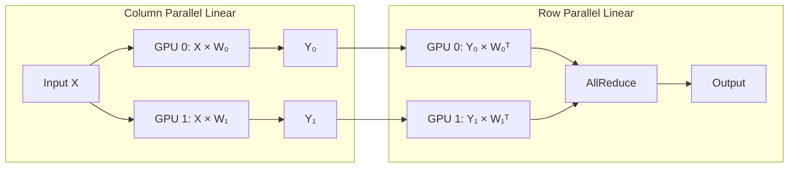
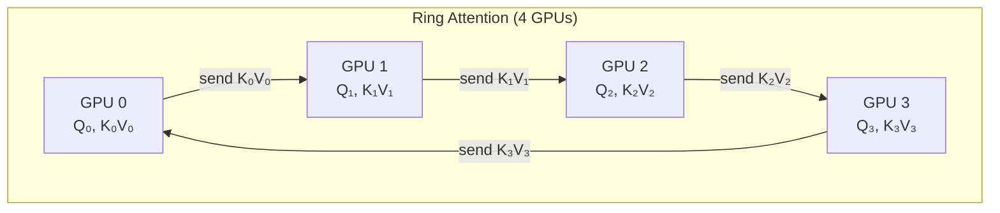
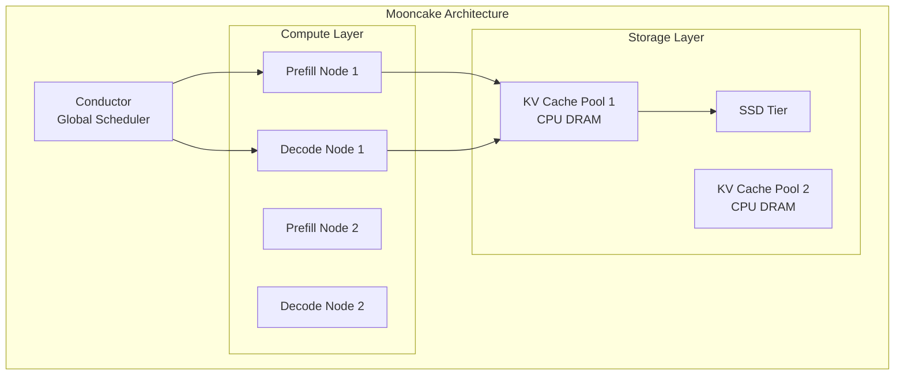
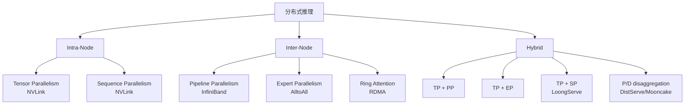

# 分布式推理分析

## 总览

随着模型规模增长（70B → 405B → [MoE](https://arxiv.org/abs/2407.06204)），单 GPU 无法容纳完整模型，分布式推理成为必需。本文档分析各种并行策略、多节点 serving 架构和通信优化。

---

## 1. 并行策略

### 1.1 [Tensor Parallelism](https://arxiv.org/abs/2402.04925) (TP)

**定义**：将单层的权重矩阵沿某个维度切分到多个 GPU，每个 GPU 计算部分结果后通过 AllReduce 聚合。

**Megatron-LM Column/Row Parallel**：



**通信量分析**：
- 每层 2 次 AllReduce（MLP 前后）
- 每次 AllReduce 通信量：$2 \times (N-1)/N \times hidden\_size \times batch \times dtype\_bytes$
- 对于 TP=8, hidden=8192, FP16：每层 ~128KB per token

**适用条件**：
- GPU 间需要高带宽互联（NVLink > 600 GB/s）
- 通常 TP ≤ 8（单机内）
- Latency-sensitive：每层都有同步点

**Inference 特点**：
- Decode 阶段：通信量小（单 token），但 AllReduce latency 是瓶颈
- Prefill 阶段：通信量大，但可被计算 overlap

### 1.2 Pipeline Parallelism (PP)

**定义**：将模型的不同层分配到不同 GPU，形成流水线。

**Bubble Ratio**：

$$\text{Bubble} = \frac{(p-1) \times t_{micro}}{(m + p - 1) \times t_{micro}} = \frac{p-1}{m+p-1}$$

其中 $p$ = pipeline stages, $m$ = micro-batches。

**Inference 中的 PP**：
- Prefill：可以用 micro-batch 填充 bubble
- Decode：每个 token 必须经过所有 stage，bubble 严重
- 通常 inference 中 PP 不如 TP 高效（latency 增加）

**适用条件**：
- 跨节点（网络带宽有限）
- 模型太大无法用 TP 放入单机
- 通常与 TP 组合：intra-node TP + inter-node PP

### 1.3 Sequence Parallelism (SP)

**定义**：将长序列切分到多个 GPU 并行处理 attention。

[**Ring Attention**](https://arxiv.org/abs/2310.01889)：
- 将 KV 分块，在 GPU 间以 ring 方式传递
- 每个 GPU 计算 local Q × remote K/V
- 通信与计算 overlap



**通信量**：每个 GPU 发送 $2 \times seq\_len/P \times d \times dtype\_bytes$（K 和 V）

**Ulysses ([DeepSpeed](https://github.com/microsoft/DeepSpeed))**：
- 将 Q/K/V 沿 head 维度切分
- AlltoAll 通信重新分布
- 每个 GPU 计算完整 attention 的一部分 head

**Ring vs Ulysses**：

| 维度 | [Ring Attention](https://arxiv.org/abs/2310.01889) | Ulysses |
|------|---------------|---------|
| 通信模式 | P2P ring | AlltoAll |
| 通信量 | O(seq_len × d / P) | O(seq_len × d / P) |
| Overlap | 可以 overlap | 难以 overlap |
| 适用场景 | 超长序列 | 中等序列 + 多 head |
| 实现复杂度 | 高 | 中 |

**LoongServe (2024)**：
- **问题**：固定 SP degree 无法适应动态 workload
- **方法**：Elastic Sequence Parallelism
  - 根据请求长度动态调整 SP degree
  - 短请求用 TP，长请求用 SP
- **实验指标**：相比固定 SP，吞吐提升 1.5-2x

### 1.4 Expert Parallelism (EP)

**定义**：[MoE](https://arxiv.org/abs/2407.06204) 模型中，将不同 expert 分配到不同 GPU。

**通信模式**：
- AlltoAll：将 token 路由到对应 expert 所在的 GPU
- 通信量取决于 routing 结果（不均匀）

**挑战**：
- Expert load imbalance：热门 expert 成为瓶颈
- AlltoAll 通信延迟
- 与 TP 的组合（EP + TP）

#### MoE AlltoAll 通信详细分析 [derived_analysis]

**AlltoAll 通信量公式：**

$$
V_{\text{AlltoAll}} = 2 \times B \times S \times \text{top\_k} \times H \times \text{bytes} \times \frac{E_P - 1}{E_P}
$$

其中 $B$ = batch size, $S$ = seq_len, top_k = 路由选择的 expert 数, $H$ = hidden_size, $E_P$ = EP degree。

因子 2 表示 dispatch（发送 token 到 expert）+ combine（收集结果）两次 AlltoAll。

**DeepSeek-V3 通信量估算（EP=32, top_k=2, H=7168, BF16）：** [derived_analysis]

$$
V = 2 \times B \times S \times 2 \times 7168 \times 2 \times \frac{31}{32} \approx 55 \text{ KB/token}
$$

对于 batch=128 tokens（decode 阶段）：$V \approx 7$ MB per MoE layer。

**Load Balancing 问题：** [verified_by_paper]

Token routing 不均匀导致部分 GPU 处理更多 token：

$$
\text{Load Factor} = \frac{\max_i(n_i)}{B \times S \times \text{top\_k} / E_P}
$$

其中 $n_i$ 为第 $i$ 个 GPU 接收的 token 数。理想值为 1.0，实际通常 1.2-2.0。

**DeepEP (DeepSeek, 2025)：** [verified_by_paper]
- 针对 DeepSeek-V3 的 256 expert 优化的 AlltoAll 通信库
- 低延迟模式：用于 decode 阶段，利用 RDMA 直接写入远程 GPU 内存
- 高吞吐模式：用于 prefill 阶段，批量传输 + NVLink/IB 混合
- 支持 FP8 传输：通信量减半
- 与 NCCL AlltoAll 对比：延迟降低 2-3x

**EPLB (Expert Parallelism Load Balancer, DeepSeek 2025)：** [verified_by_paper]
- 基于历史 routing 统计的 expert 重分配
- 将热门 expert 复制到多个 GPU（redundant placement）
- 冷门 expert 合并到同一 GPU
- 动态调整周期：每 N 个 batch 重新评估 load 分布

### 1.5 Context Parallelism (CP)

**定义**：在 prefill 阶段将长 context 切分到多个 GPU 并行处理。

**与 SP 的区别**：CP 通常指 prefill 阶段的并行，SP 更通用。

**Cache-DiT 实现**：
- [Ring Attention](https://arxiv.org/abs/2310.01889) with batched P2P
- USP (Hybrid Ring + Ulysses)
- 2D/3D Hybrid Parallelism (USP + TP)

---

## 2. Multi-Node Serving

### 2.1 [LoongServe](https://arxiv.org/abs/2404.09526)

**论文**：LoongServe: Efficiently Serving Long-Context Large Language Models with Elastic Sequence Parallelism

**问题定义**：长序列请求需要 SP，但短序列不需要，如何动态适配？

**方法核心**：
- Elastic SP：根据请求长度动态调整并行度
- 请求迁移：在 SP degree 变化时迁移 KV Cache
- 与 TP 的混合：短请求 TP-only，长请求 TP+SP

**实验指标**：
- 支持 100K+ token 序列
- 相比 static SP，吞吐提升 1.5-2x
- P99 latency 降低

### 2.2 [HexGen](https://arxiv.org/abs/2311.11514)

**问题定义**：如何在异构 GPU 集群上高效 serving？

**方法核心**：
- 异构感知的模型放置
- 根据 GPU 计算能力和互联带宽分配层
- 支持混合 A100 + A10G 等配置

### 2.3 [Mooncake](https://arxiv.org/abs/2407.00079)

**问题定义**：如何构建以 KV Cache 为中心的分布式 serving 架构？

**方法核心**：
- Disaggregated architecture：计算节点 + 存储节点
- KV Cache Pool：独立的分布式 KV 存储层
- Conductor：全局调度，决定 prefill/decode 放置

**架构**：


### 2.4 [DistServe](https://arxiv.org/abs/2401.09670)

（详见 06_serving_scheduling.md 第 3 节）

---

## 3. [MoE Inference](https://arxiv.org/abs/2404.02852)

### 3.1 [MoE](https://arxiv.org/abs/2407.06204) 基础

**结构**：每层有 N 个 expert（FFN），router 选择 top-k expert 处理每个 token。

**DeepSeek-V3 MoE**：
- 256 个 routed experts + 1 shared expert
- Top-2 routing
- 每个 token 只激活 2/256 的 expert 参数

### 3.2 推理挑战

| 挑战 | 描述 | 影响 |
|------|------|------|
| Expert Load Imbalance | 热门 expert 处理更多 token | GPU 利用率不均 |
| AlltoAll Communication | Token 路由到远程 GPU | 通信延迟 |
| Memory | 所有 expert 权重需要常驻显存 | 显存占用大 |
| Batch Efficiency | 每个 expert 处理的 token 数不同 | GEMM 效率低 |

### 3.3 优化方法

**Expert Parallelism + TP**：
- EP：不同 expert 在不同 GPU
- TP：每个 expert 内部 tensor parallel
- 组合：EP=8, TP=4 → 32 GPU

**Expert Offloading**：
- 将不活跃 expert 卸载到 CPU
- 预测下一步需要的 expert 并预取
- [Mixtral Offloading](https://arxiv.org/abs/2312.17238)：在消费级 GPU 上运行 MoE

**Expert Quantization**：
- 对不同 expert 使用不同量化精度
- 热门 expert 保持高精度

### 3.4 [DeepSeek-V3](https://arxiv.org/abs/2412.19437) 推理优化

- 256 expert 分布在多节点
- Shared expert 在所有 GPU 上复制
- 优化的 AlltoAll kernel
- [FP8](https://arxiv.org/abs/2209.05433) 量化减少通信量

#### DeepSeek-V3 分布式推理架构详解 [verified_by_paper]

**模型结构：** 61 层，其中第 1 层为 dense，第 2-61 层为 MoE（256 routed experts + 1 shared expert），top-2 routing。

**典型部署配置：**
- TP=8（intra-node NVLink）
- EP=32-64（inter-node IB/RoCE）
- 每个 GPU 承载 256/EP = 4-8 个 expert

**通信流程（每个 MoE 层）：** [derived_analysis]

```
1. Shared Expert: 本地计算（所有 GPU 复制）
2. Router: 计算 token-expert affinity → top-2 routing decision
3. Dispatch AlltoAll: 将 token hidden states 发送到目标 expert 所在 GPU
4. Expert Compute: 各 GPU 并行计算本地 expert
5. Combine AlltoAll: 将 expert 输出发送回原始 GPU
6. Merge: shared_output + weighted_sum(routed_outputs)
```

**DeepEP 通信优化：** [verified_by_paper]
- **低延迟模式（decode）：** 利用 RDMA one-sided write 直接写入远程 GPU HBM，绕过 CPU 参与
- **高吞吐模式（prefill）：** 批量聚合 token 后发送，利用大消息提高带宽利用率
- **FP8 dispatch：** Token hidden states 在发送前量化为 FP8，通信量减半
- **Topology-aware routing：** 优先将 token 路由到同节点 expert，减少跨节点通信

**EPLB (Expert-level Load Balancing)：** [verified_by_paper]
- 监控每个 expert 的实际负载（处理 token 数）
- 热门 expert 复制到多个 GPU（redundant expert placement）
- 冷门 expert 合并（多个 expert 共享同一 GPU）
- 重平衡周期：每 1000 batch 评估一次，避免频繁迁移开销

---

## 4. Communication Optimization

### 4.1 Compute-Communication Overlap

**原理**：在 GPU 计算当前层时，同时传输下一层需要的数据。

**实现方式**：
- CUDA Stream：计算和通信在不同 stream
- Kernel-level overlap：在 kernel 内部交替计算和通信
- TileLink ([Triton-distributed](https://arxiv.org/abs/2503.20313))：tile 级别的 overlap

### 4.2 [Triton-distributed](https://arxiv.org/abs/2503.20313) / TileLink

**论文**：TileLink: Generating Efficient Compute-Communication Overlapping Kernels (ByteDance-Seed, 2025)

**方法核心**：
- 在 Triton kernel 中嵌入通信原语
- Tile 级别的 compute-communication overlap
- 自动生成 overlap kernel

**效果**：减少 AllReduce 的暴露延迟

### 4.3 NCCL 优化

- Ring AllReduce vs Tree AllReduce
- 小消息优化：batched small AllReduce
- NVLink topology-aware routing

### 4.4 NVLink vs InfiniBand

| 维度 | NVLink (H100) | InfiniBand HDR |
|------|---------------|----------------|
| 带宽 | 900 GB/s (bi) | 200 Gb/s (25 GB/s) |
| 延迟 | ~1 μs | ~1-2 μs |
| 适用 | Intra-node TP | Inter-node PP/EP |
| 拓扑 | Full mesh (8 GPU) | Fat tree |

---

## 5. 性能模型

### 5.1 Communication Volume 详细公式 [verified_by_paper]

**TP AllReduce per layer（Attention + MLP 各一次）：**

$$
V_{TP} = 2 \times 2 \times \frac{P-1}{P} \times H \times B \times S \times \text{dtype\_bytes}
$$

其中第一个 2 表示 Attention 和 MLP 各一次 AllReduce，第二个 $2 \times \frac{P-1}{P}$ 为 Ring AllReduce 的通信系数（reduce-scatter + all-gather），$P$ = TP degree。

**PP inter-stage activation transfer：**

$$
V_{PP} = H \times B \times S \times \text{dtype\_bytes}
$$

每个 micro-batch 在 stage 间传递一次 hidden states。总通信量 = $V_{PP} \times m$（$m$ 个 micro-batch）。

**SP Ring Attention per ring step：**

$$
V_{SP} = 2 \times \frac{S}{P} \times d_h \times n_{\text{kv\_heads}} \times \text{dtype\_bytes}
$$

每步传递一个 KV chunk（K + V），共需 $P-1$ 步完成一轮。

**EP AlltoAll per MoE layer（dispatch + combine）：**

$$
V_{EP} = 2 \times B \times S \times \text{top\_k} \times H \times \text{dtype\_bytes} \times \frac{P-1}{P}
$$

**CP (Context Parallelism) per layer：**

$$
V_{CP} = 2 \times \frac{S}{P} \times d_h \times n_{\text{kv\_heads}} \times (P-1) \times \text{dtype\_bytes}
$$

Ring 方式需要 $P-1$ 步，每步传递一个 KV chunk。

### 5.2 各策略通信量对比（Llama-3-70B, H=8192, L=80, BF16）[derived_analysis]

| 策略 | 公式实例化 | 每层通信量 (decode, B=1) | 每层通信量 (prefill, S=4096) |
|------|-----------|------------------------|----------------------------|
| TP=8 | $2 \times 2 \times \frac{7}{8} \times 8192 \times 2$ | 57 KB | 229 MB |
| PP=8 | $8192 \times 2$ | 16 KB | 64 MB |
| SP=4 (Ring) | $2 \times 1024 \times 128 \times 8 \times 2$ | - | 4 MB/step × 3 steps |
| EP=32 (MoE) | $2 \times 1 \times 2 \times 7168 \times 2 \times \frac{31}{32}$ | 55 KB | 225 MB |

### 5.3 适用边界分析 [derived_analysis]

**何时使用哪种策略：**

$$
\text{TP 适用条件：} \quad T_{\text{AllReduce}} < T_{\text{compute\_per\_layer}} \quad \Rightarrow \quad \frac{V_{TP}}{BW_{\text{NVLink}}} < \frac{\text{FLOPs\_per\_layer}}{\text{GPU\_FLOPS} / P}
$$

| 策略 | 适用条件 | 不适用场景 | 典型配置 |
|------|----------|-----------|----------|
| TP | 高带宽互联（NVLink 600+ GB/s） | 跨节点（IB 带宽不足） | Intra-node, P≤8 |
| PP | 跨节点、模型层数多 | Decode 延迟敏感（bubble 大） | Inter-node, P=2-16 |
| SP/CP | 超长序列（>32K）、单序列 | 短序列（并行度不足） | 长 context prefill |
| EP | MoE 模型、expert 数 > GPU 数 | Dense 模型 | MoE, P=8-64 |
| P/D Disagg | 高吞吐 serving、混合 workload | 低延迟单请求 | 大规模集群 |

**TP vs PP 决策公式：** [derived_analysis]

$$
\text{选择 TP 当：} \quad \frac{2 \times H \times \text{dtype}}{BW_{\text{interconnect}}} < \frac{2 \times H^2 \times \text{dtype}}{P \times BW_{\text{HBM}}}
$$

即通信延迟 < 计算时间/P。对于 decode 阶段（B=1），左侧约 $16\mu s$（NVLink），右侧约 $10\mu s$（A100），因此 TP=8 时效率约 60-70%。

### 5.4 P/D disaggregation KV Transfer 分析 [derived_analysis]

**KV 传输延迟模型：**

$$
T_{\text{KV\_transfer}} = \frac{2 \times L \times n_{\text{kv}} \times d_h \times S \times \text{bytes}}{BW_{\text{network}}} + T_{\text{setup}}
$$

**各模型 KV 传输时间（S=4096, BF16）：**

| 模型 | KV Size | IB 200Gbps | IB 400Gbps | RDMA 直写 |
|------|---------|------------|------------|-----------|
| Llama-3-8B (GQA-8) | 512 MB | 205 ms | 102 ms | ~80 ms |
| Llama-3-70B (GQA-8) | 1.28 GB | 512 ms | 256 ms | ~200 ms |
| DeepSeek-V3 (MLA) | 274 MB | 110 ms | 55 ms | ~43 ms |

**降低 KV 传输开销的方法：** [verified_by_paper]
1. **FP8/INT4 压缩传输：** 减少 2-4x 数据量，PPL 增加可忽略
2. **Chunk pipeline：** Prefill 每完成一个 chunk 立即传输，overlap 后续计算
3. **选择性传输：** 只传输 important KV（SnapKV 筛选），减少 50-80%
4. **MLA 天然优势：** DeepSeek-V3 KV 仅为 GQA 的 1/5

### 5.5 Scaling Efficiency

**TP Scaling**：
$$\text{Efficiency}_{TP} = \frac{T_{compute}}{T_{compute} + T_{allreduce}}$$

对于 decode（单 token）：
- $T_{compute}$ 很小（memory-bound）
- $T_{allreduce}$ 相对较大
- TP=8 时效率可能只有 60-70%

**PP Scaling**：
$$\text{Efficiency}_{PP} = \frac{m}{m + p - 1}$$

### 5.6 最优并行策略选择

| 模型大小 | 硬件 | 推荐策略 |
|----------|------|----------|
| 7B | 1×A100 | 无并行 |
| 13B | 1×A100 | 无并行（[FP8](https://arxiv.org/abs/2209.05433)）或 TP=2 |
| 70B | 8×A100 | TP=8 |
| 70B | 2×8×A100 | TP=8, PP=2 |
| 405B | 8×8×H100 | TP=8, PP=8 |
| [MoE](https://arxiv.org/abs/2407.06204)-8x22B | 8×A100 | EP=8 或 TP=4,EP=2 |
| [DeepSeek-V3](https://arxiv.org/abs/2412.19437) | 多节点 | TP=8, EP=32+ |

---

## 6. Mermaid 总览图



---

## 7. 工程可复现难点

| 系统 | 难点 | 原因 |
|------|------|------|
| LoongServe | KV Cache 迁移 | 动态 SP 变化时需要重新分布 KV |
| [Mooncake](https://arxiv.org/abs/2407.00079) | 分布式 KV Pool | 需要高性能 KV 存储系统 |
| [DeepSeek-V3](https://arxiv.org/abs/2412.19437) | 256 expert routing | AlltoAll 通信优化需要定制 |
| [Ring Attention](https://arxiv.org/abs/2310.01889) | Overlap 实现 | 需要精确的 CUDA stream 管理 |
| TileLink | Triton 扩展 | 需要修改 Triton compiler |

---

## 最新进展 (2025-2026)

- [**NVIDIA Dynamo**](https://developer.nvidia.com/blog/nvidia-dynamo-adds-gpu-autoscaling-kubernetes-automation-and-networking-optimizations/) (NVIDIA, GTC 2025): 数据中心级推理编排，原生P/D disaggregation + wide Expert Parallelism，B200上单GPU 3.1k tok/s
- [**llm-d**](https://github.com/llm-d/llm-d) (Red Hat/IBM, 2025): Kubernetes原生分布式推理，支持disaggregated serving + prefix-cache-aware routing + MoE wide-EP，16x16 B200达50k tok/s
- [**STAR**](https://arxiv.org/abs/2510.13668) (2025): Decode阶段重调度，解决disaggregated架构中长输出reasoning任务导致的decode实例负载不均衡
- [**PPD Disaggregation**](https://arxiv.org/abs/2603.13358) (2026): 多轮对话场景的三级disaggregation(Prefill-Prefill-Decode)，区分full-prefill和append-prefill减少KV传输
- [**AMPD**](https://arxiv.org/abs/2602.14516) (2026): 高效多轮LLM推理的disaggregated serving，基于实时队列状态的路由优化
- [**DuetServe**](https://arxiv.org/abs/2511.04791) (2025): 自适应intra-GPU prefill/decode协调，挑战完全物理隔离的必要性，在同一GPU上高效混合两阶段
