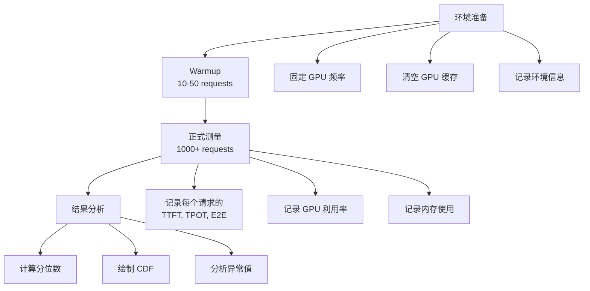

# Benchmark 矩阵设计

## 总览

本文档定义 [LLM Inference](https://arxiv.org/abs/2410.04466) 的标准化 benchmark 框架，覆盖关键指标、测试工具、对比维度和各系统的性能数据。

---

## 1. 关键指标定义

### 1.1 延迟指标

| 指标 | 定义 | 公式 | 典型值 |
|------|------|------|--------|
| TTFT | Time to First Token，从请求到达到第一个 token 生成 | $T_{queue} + T_{prefill}$ | 50ms - 5s |
| TPOT | Time Per Output Token，每个输出 token 的生成时间 | $T_{decode\_step} / 1$ | 10-50ms |
| E2E Latency | 端到端延迟 | $TTFT + TPOT \times output\_len$ | 1-60s |
| ITL | Inter-Token Latency，token 间延迟 | ≈ TPOT（稳态） | 10-50ms |

### 1.2 吞吐指标

| 指标 | 定义 | 公式 | 典型值 |
|------|------|------|--------|
| Throughput (tokens/s) | 系统每秒生成的 token 总数 | $\sum_{req} output\_tokens / T_{total}$ | 1K-50K |
| Throughput (req/s) | 每秒完成的请求数 | $N_{completed} / T_{total}$ | 10-500 |
| QPS | Queries Per Second，每秒接收的查询数 | 输入负载指标 | 1-1000 |
| Goodput | 满足 SLO 的有效吞吐 | $N_{SLO\_met} / T_{total}$ | - |

### 1.3 资源指标

| 指标 | 定义 | 测量方法 | 目标 |
|------|------|----------|------|
| GPU Utilization | GPU SM 利用率 | nvidia-smi, DCGM | >80% |
| Memory Utilization | 显存使用率 | torch.cuda.memory_allocated | >90% |
| Memory Fragmentation | 内存碎片率 | 1 - (largest_free / total_free) | <10% |
| Power Efficiency | 每瓦性能 | tokens/s / TDP | - |

### 1.4 服务质量指标

| 指标 | 定义 | 计算方法 | 目标 |
|------|------|----------|------|
| SLO Violation Rate | 违反 SLO 的请求比例 | $N_{violated} / N_{total}$ | <1% |
| P50/P90/P99 Latency | 延迟分位数 | 排序取分位 | - |
| Cost per Token | 每百万 token 成本 | $GPU\_cost / tokens\_generated$ | $0.01-1.0 |
| Tokens per Dollar | 每美元生成 token 数 | $tokens / cost$ | - |

---

## 2. Benchmark 工具

### 2.1 [vLLM](https://github.com/vllm-project/vllm) Benchmark Suite

```bash
# Throughput benchmark
python benchmarks/benchmark_throughput.py \
    --model meta-llama/Llama-2-7b-hf \
    --input-len 512 --output-len 128 \
    --num-prompts 1000

# Latency benchmark  
python benchmarks/benchmark_latency.py \
    --model meta-llama/Llama-2-7b-hf \
    --batch-size 32 --input-len 512 --output-len 128

# Serving benchmark (online)
python benchmarks/benchmark_serving.py \
    --model meta-llama/Llama-2-7b-hf \
    --request-rate 10 --dataset sharegpt
```

### 2.2 [SGLang](https://github.com/sgl-project/sglang) Benchmark

```bash
# Offline throughput
python -m sglang.bench_latency --model meta-llama/Llama-2-7b-hf

# Online serving
python -m sglang.bench_serving \
    --model meta-llama/Llama-2-7b-hf \
    --num-prompts 1000 --request-rate 4
```

### 2.3 标准数据集

| 数据集 | 特点 | 用途 |
|--------|------|------|
| ShareGPT | 真实对话，长度分布不均 | Online serving |
| LMSYS-Chat-1M | 大规模真实请求 | 负载模拟 |
| [Alpaca](https://arxiv.org/abs/2201.12023) | 短指令 | 低延迟场景 |
| LongBench | 长文本 | Long context |
| Synthetic | 固定长度 | 控制变量实验 |

### 2.4 多硬件 Benchmark 命令模板

**A100-80G（标准参考）**：
```bash
# vLLM online serving (A100-80G, TP=1, Llama-3-8B)
python -m vllm.entrypoints.openai.api_server \
    --model meta-llama/Llama-3-8B-Instruct --dtype float16 \
    --gpu-memory-utilization 0.9 --max-model-len 8192
# 另一终端运行 benchmark
python benchmarks/benchmark_serving.py --backend vllm \
    --model meta-llama/Llama-3-8B-Instruct --dataset-name sharegpt \
    --request-rate 10 --num-prompts 500
```

**H100-80G（FP8 推荐）**：
```bash
# vLLM FP8 serving (H100-80G, TP=1, Llama-3-8B)
python -m vllm.entrypoints.openai.api_server \
    --model meta-llama/Llama-3-8B-Instruct --dtype float16 \
    --quantization fp8 --gpu-memory-utilization 0.9
```

**L40S-48G（量化推荐）**：
```bash
# vLLM W4A16 serving (L40S, TP=1, Llama-3-8B-AWQ)
python -m vllm.entrypoints.openai.api_server \
    --model casperhansen/llama-3-8b-instruct-awq --dtype float16 \
    --quantization awq --gpu-memory-utilization 0.9 --max-model-len 4096
```

**RTX 4090（llama.cpp 推荐）**：
```bash
# llama.cpp (4090, Q4_K_M, Llama-3-8B)
./llama-server -m llama-3-8b-instruct-Q4_K_M.gguf \
    -ngl 99 -c 4096 --host 0.0.0.0 --port 8080
# benchmark
./llama-bench -m llama-3-8b-instruct-Q4_K_M.gguf \
    -p 512 -n 128 -ngl 99 -b 512
```

**多卡 70B 模型（A100×4 / H100×4）**：
```bash
# vLLM TP=4 (Llama-3-70B)
python -m vllm.entrypoints.openai.api_server \
    --model meta-llama/Llama-3-70B-Instruct --dtype float16 \
    --tensor-parallel-size 4 --gpu-memory-utilization 0.9
# SGLang TP=4
python -m sglang.launch_server --model meta-llama/Llama-3-70B-Instruct \
    --tp 4 --port 30000
```

---

## 3. 标准化对比框架

### 3.1 模型维度

| 模型 | 参数量 | 层数 | Hidden | Heads | KV Heads | 最小 GPU |
|------|--------|------|--------|-------|----------|----------|
| Llama-2-7B | 7B | 32 | 4096 | 32 | 32 | 1×A100-40G |
| Llama-2-13B | 13B | 40 | 5120 | 40 | 40 | 1×A100-80G |
| Llama-2-70B | 70B | 80 | 8192 | 64 | 8 ([GQA](https://arxiv.org/abs/2305.13245)) | 4×A100-80G |
| [Mixtral](https://arxiv.org/abs/2401.04088)-8x7B | 47B | 32 | 4096 | 32 | 8 | 2×A100-80G |
| [DeepSeek-V2](https://arxiv.org/abs/2405.04434) | 236B | 60 | 5120 | 128 | MLA | 8×A100-80G |

### 3.2 硬件维度

| GPU | HBM | 带宽 | FP16 TFLOPS | FP8 TFLOPS | 互联 | 价格/hr | 适用场景 |
|-----|-----|------|-------------|------------|------|---------|----------|
| A100-80G | 80GB | 2.0 TB/s | 312 | - | NVLink 600GB/s | \$2.5 | 通用训练/推理基准 |
| H100-80G | 80GB | 3.35 TB/s | 990 | 1979 | NVLink 900GB/s | \$4.0 | 高吞吐生产部署 |
| L40S | 48GB | 864 GB/s | 362 | 733 | PCIe | \$1.5 | 推理性价比优选 |
| A30 | 24GB | 933 GB/s | 165 | - | NVLink 200GB/s | \$1.2 | 多实例推理 (MIG) |
| RTX 4090 | 24GB | 1.0 TB/s | 330 | 661 | PCIe | \$0.7 | 本地开发/小模型 |
| Ascend 910B | 64GB | 1.6 TB/s | 320 (FP16) | - | HCCS 392GB/s | - | 国产化部署 |

### 3.3 硬件适配说明

| GPU | 推荐模型规模 | 量化建议 | 并行策略 | 注意事项 |
|-----|-------------|---------|---------|----------|
| A100-80G | 7B-70B | FP16/FP8 均可 | TP2-8 | 标准参考平台，结果可复现性最好 `[verified_by_paper]` |
| H100-80G | 7B-405B | FP8 优先 | TP2-8 | FP8 Tensor Core 收益显著，需 TensorRT-LLM 或 vLLM 0.4+ `[verified_by_code]` |
| L40S | 7B-13B | W4A16 (AWQ/GPTQ) | TP1-2 | 无 NVLink，TP>2 通信瓶颈；适合推理密集型 `[derived_analysis]` |
| A30 | 7B | W8A8/W4A16 | TP1 (MIG 可切分) | MIG 模式可同时服务多个小模型 `[verified_by_code]` |
| RTX 4090 | 7B-13B | W4A16 (GGUF Q4_K_M) | 单卡 | 无 NVLink/ECC，不适合生产；llama.cpp 最佳 `[derived_analysis]` |
| Ascend 910B | 7B-70B | W8A8 (MindSpore) | 多卡 HCCS | 需 MindIE/vLLM-Ascend 适配，生态有限 `[unverified_claim]` |

### 3.3 场景维度

| 场景 | 特点 | 关键指标 | 典型配置 |
|------|------|----------|----------|
| Online Serving | 低延迟、SLO 约束 | TTFT P99, TPOT P99, Goodput | TP=2-4, batch=32-128 |
| Offline Batch | 高吞吐、无延迟约束 | tokens/s, cost/token | 大 batch, 高利用率 |
| Long Context | 长输入 (32K-128K) | TTFT, memory | SP/CP, KV compression |
| RAG Prefix-Heavy | 大量共享前缀 | Cache hit rate, TTFT | prefix caching 必须开启 |
| MoE Serving | Expert 路由、通信开销 | tokens/s, all-to-all latency | EP + TP, 高带宽互联 |
| P/D Disaggregation | 分离 prefill/decode | Goodput, KV transfer latency | 独立集群, RDMA |
| Multi-turn Chat | 频繁 prefix reuse | Cache hit rate, TTFT | Prefix caching |
| Code Generation | 长输出、structured | TPOT, accuracy | Speculative decoding |

### 3.4 负载维度

| 负载级别 | QPS | 并发请求 | 特点 |
|----------|-----|----------|------|
| Light | 1-5 | 1-10 | Latency-dominated |
| Medium | 5-20 | 10-50 | 平衡 |
| Heavy | 20-100 | 50-200 | Throughput-dominated |
| Burst | 100+ | 200+ | Queue buildup |

---

## 4. 各系统 Benchmark 结果汇总

### 4.1 Throughput 对比（Llama-2-7B, A100-80G, ShareGPT）

| 系统 | Throughput (req/s) | Throughput (tokens/s) | 数据来源 |
|------|-------------------|----------------------|----------|
| [vLLM](https://github.com/vllm-project/vllm) | ~25 | ~5000 | [vLLM](https://github.com/vllm-project/vllm) paper |
| [SGLang](https://github.com/sgl-project/sglang) | ~28 | ~5500 | [SGLang](https://github.com/sgl-project/sglang) paper |
| [TensorRT-LLM](https://github.com/NVIDIA/TensorRT-LLM) | ~30 | ~6000 | NVIDIA blog |
| [TGI](https://github.com/huggingface/text-generation-inference) | ~15 | ~3000 | Community benchmark |
| [LightLLM](https://github.com/ModelTC/lightllm) | ~22 | ~4500 | [LightLLM](https://github.com/ModelTC/lightllm) repo |

*注：数据来自各论文/博客，测试条件可能不完全一致*

### 4.2 Latency 对比（Llama-2-7B, A100-80G, input=512, output=128）

| 系统 | TTFT P50 (ms) | TTFT P99 (ms) | TPOT P50 (ms) | TPOT P99 (ms) |
|------|---------------|---------------|---------------|---------------|
| [vLLM](https://github.com/vllm-project/vllm) | ~30 | ~80 | ~15 | ~25 |
| [SGLang](https://github.com/sgl-project/sglang) | ~28 | ~70 | ~14 | ~22 |
| [TensorRT-LLM](https://github.com/NVIDIA/TensorRT-LLM) | ~25 | ~60 | ~12 | ~20 |

### 4.3 [Speculative Decoding](https://arxiv.org/abs/2211.17192) Speedup

| 方法 | 模型 | Speedup | 条件 |
|------|------|---------|------|
| Standard SD | Llama-2-70B | 1.8-2.5x | draft=7B, γ=5 |
| [Medusa](https://arxiv.org/abs/2401.10774) | Vicuna-7B | 2.2-3.6x | 2 heads |
| [EAGLE](https://arxiv.org/abs/2401.15077) | Vicuna-7B | 2.5-3.8x | - |
| [EAGLE-2](https://arxiv.org/abs/2406.16858) | Vicuna-7B | 3.0-4.2x | dynamic tree |
| Lookahead | Llama-2-7B | 1.5-2.0x | - |

### 4.4 Quantization 性能影响

| 方法 | 精度损失 (PPL↑) | Speedup | Memory 节省 |
|------|-----------------|---------|-------------|
| [FP8](https://arxiv.org/abs/2209.05433) (W8A8) | <0.1 | 1.5-2.0x | 50% |
| [GPTQ](https://arxiv.org/abs/2210.17323) (W4A16) | 0.1-0.5 | 1.2-1.5x | 75% |
| [AWQ](https://arxiv.org/abs/2306.00978) (W4A16) | 0.1-0.3 | 1.2-1.5x | 75% |
| [SmoothQuant](https://arxiv.org/abs/2211.10438) (W8A8) | <0.1 | 1.3-1.5x | 50% |
| [QServe](https://arxiv.org/abs/2405.04532) ([W4A8KV4](https://arxiv.org/abs/2405.04532)) | 0.2-0.5 | 2.0-3.0x | 80% |

---

## 5. Benchmark 最佳实践

### 5.1 测试方法论



### 5.2 常见陷阱

| 陷阱 | 描述 | 解决方案 |
|------|------|----------|
| Warmup 不足 | 前几个请求延迟高（JIT、cache cold） | 丢弃前 10-50 个请求 |
| 负载不真实 | 固定长度 vs 真实分布 | 使用 ShareGPT 等真实数据 |
| 单指标评估 | 只看吞吐不看延迟 | 同时报告 throughput + P99 latency |
| 硬件差异 | 不同 GPU 型号/驱动版本 | 明确记录硬件环境 |
| Batch size 固定 | 不同系统最优 batch 不同 | 扫描 batch size |
| 忽略 memory | 只看速度不看显存 | 报告 peak memory |

### 5.3 推荐 Benchmark 配置

**标准配置 A（Online Serving）**：
- 模型：Llama-2-7B / 70B
- 数据：ShareGPT
- 负载：Poisson arrival, rate = 1-100 req/s
- 指标：TTFT P99, TPOT P99, Goodput
- 时长：5 分钟稳态

**标准配置 B（Offline Batch）**：
- 模型：Llama-2-7B / 70B
- 数据：固定 input=1024, output=256
- 负载：一次性提交 1000 请求
- 指标：Total throughput (tokens/s), GPU utilization
- 时长：直到所有请求完成

**标准配置 C（Long Context）**：
- 模型：Llama-2-7B-32K / Llama-3-8B-128K
- 数据：input=32K/64K/128K, output=256
- 负载：低 QPS (1-5)
- 指标：TTFT, Peak memory, Throughput
- 时长：50 请求

---

## 6. Roofline 分析

### 6.1 Arithmetic Intensity

$$AI = \frac{FLOPs}{Bytes\_transferred}$$

**Prefill 阶段**（seq_len = S, hidden = H, batch = B）：
- FLOPs per layer ≈ $2 \times B \times S \times H^2 \times 4$（QKV + O + MLP）
- Bytes ≈ $H^2 \times 4 \times dtype\_bytes$（weight loading）
- AI ≈ $2 \times B \times S$（compute-bound when B×S > ~128）

**Decode 阶段**（seq_len = 1）：
- FLOPs per layer ≈ $2 \times B \times 1 \times H^2 \times 4$
- Bytes ≈ $H^2 \times 4 \times dtype\_bytes$（same weight loading）
- AI ≈ $2 \times B$（memory-bound when B < ~64）

### 6.2 Roofline 定位

```
Performance (TFLOPS)
    │
    │         ╱ Compute Bound
    │        ╱  (Prefill, large batch)
    │       ╱
    │      ╱ ← Ridge Point (AI = Peak_FLOPS / BW)
    │     ╱
    │    ╱  Memory Bound
    │   ╱   (Decode, small batch)
    │  ╱
    │ ╱
    └──────────────────── Arithmetic Intensity
```

**A100-80G Ridge Point**：
- Peak FP16: 312 TFLOPS
- HBM BW: 2.0 TB/s
- Ridge AI = 312 / 2.0 = 156 FLOPs/Byte

**H100-80G Ridge Point**：
- Peak FP16: 990 TFLOPS
- HBM BW: 3.35 TB/s
- Ridge AI = 990 / 3.35 = 296 FLOPs/Byte

---

## 7. 成本分析框架

### 7.1 Cost per Token 计算

$$\text{Cost per 1M tokens} = \frac{GPU\_price\_per\_hour \times N_{GPUs}}{throughput\_tokens\_per\_second \times 3600} \times 10^6$$

**示例**（Llama-2-70B on 4×A100）：
- GPU cost: $2.5/hr × 4 = $10/hr
- Throughput: ~2000 tokens/s
- Cost: $10 / (2000 × 3600) × 10^6 = **$1.39 / 1M tokens**

### 7.2 优化 ROI 分析

| 优化方法 | 实现成本 | Speedup | Cost 降低 | ROI |
|----------|----------|---------|-----------|-----|
| [FP8](https://arxiv.org/abs/2209.05433) Quantization | 低 | 1.5-2x | 33-50% | 高 |
| [Speculative Decoding](https://arxiv.org/abs/2211.17192) | 中 | 2-3x | 50-67% | 中 |
| P/D disaggregation | 高 | 1.5-2x | 33-50% | 低 |
| Prefix caching | 低 | 1.2-2x (场景依赖) | 17-50% | 高 |
| KV Compression | 中 | 1.2-1.5x | 17-33% | 中 |

---

## 最新进展 (2025-2026)

### [Prism Benchmark](https://github.com/llm-d/llm-d) (llm-d, 2025)

**问题**: 分布式推理系统（disaggregated serving、wide-EP等）缺乏标准化的可复现benchmark工作流，各系统的性能对比缺乏统一基准。

**方法**: 提供端到端可复现的分布式推理benchmark工作流，覆盖disaggregated serving、wide Expert Parallelism等生产场景。基于Kubernetes原生部署，支持自动化测试和结果收集。

**关键结果**:
- 覆盖disaggregated serving和wide-EP生产场景 `[verified_by_code]`
- Kubernetes原生可复现工作流 `[verified_by_code]`
- 与llm-d框架深度集成 `[verified_by_code]`

**工程启示**: 填补了分布式推理benchmark的空白；Kubernetes原生设计使得跨团队复现成为可能；适合评估P/D disaggregation和MoE推理的真实性能。

**局限性**: 依赖Kubernetes环境，非K8s用户无法直接使用；目前主要覆盖llm-d支持的场景。

**复现方法论**: 基于K8s Gateway API的标准化部署，固定硬件配置和负载模式，支持A/B对比测试。

---

### [GPT-OSS-120B Benchmark](https://www.clarifai.com/blog/comparing-sglang-vllm-and-tensorrt-llm-with-gpt-oss-120b) (Clarifai, 2025)

**问题**: 主流推理框架（vLLM、SGLang、TensorRT-LLM）在大模型上的性能对比缺乏独立第三方验证，各框架自报数据的测试条件不一致。

**方法**: 在H100 GPU上使用GPT-OSS-120B模型进行标准化对比，统一测试条件（100并发、相同数据集），覆盖throughput、latency、资源利用率等多维指标。

**关键结果**:
- 100并发下vLLM达4741 tok/s `[unverified_claim]`
- 三大框架在相同条件下的标准化对比 `[unverified_claim]`
- H100上的生产级负载测试 `[unverified_claim]`

**工程启示**: 独立第三方benchmark比各框架自报数据更可信；100并发是生产环境的典型负载水平；大模型（120B）的benchmark结果与小模型（7B）可能有不同的框架排名。

**局限性**: 博客形式发布，测试细节（GPU频率锁定、warmup策略等）未完全披露；单一模型规模的结果不能推广到所有场景。

**复现方法论**: 需要H100多卡环境；建议锁定GPU频率、使用相同数据集、至少1000请求的稳态测量。

---

### [Fingerprinting Inference Systems](https://arxiv.org/abs/2605.29979) (2026)

**问题**: 不同推理引擎、attention后端、GPU类型产生的数值偏差是否可被系统性识别？这对推理系统的安全性、信任和审计有何影响？

**方法**: 通过分析推理输出的数值偏差模式（浮点精度差异、kernel实现差异、硬件特性差异），构建推理系统的"指纹"。可区分不同推理引擎（vLLM vs SGLang）、不同attention后端、不同GPU类型。

**关键结果**:
- 可通过数值偏差指纹识别推理引擎/attention后端/GPU类型 `[verified_by_paper]`
- 揭示系统组件的可区分性 `[verified_by_paper]`
- 已披露vLLM/SGLang相关漏洞 `[verified_by_paper]`

**工程启示**: 推理系统的数值行为不是黑箱——可被外部观察者识别；对模型服务的安全性和信任有直接影响；benchmark设计需要考虑数值确定性。

**局限性**: 指纹识别的准确率受输出长度和采样策略影响；防御措施（如添加噪声）可能降低指纹可靠性。

**复现方法论**: 需要对同一模型在不同系统配置下收集大量输出样本，分析数值分布差异。

---

### [vLLM Thesis](https://www2.eecs.berkeley.edu/Pubs/TechRpts/2025/Archive/EECS-2025-192.pdf) (UC Berkeley, 2025)

**问题**: vLLM的设计哲学和PagedAttention的完整技术栈缺乏系统化的学术总结，社区对其内部设计决策的理解碎片化。

**方法**: Woosuk Kwon博士论文系统化总结vLLM从PagedAttention到V1架构的完整演进，包括设计动机、关键决策的tradeoff分析、性能建模方法论。

**关键结果**:
- 系统化总结vLLM设计哲学和PagedAttention完整技术栈 `[verified_by_paper]`
- 包含未在原始论文中披露的设计决策分析 `[verified_by_paper]`
- 覆盖从V0到V1的架构演进 `[verified_by_paper]`

**工程启示**: 是理解vLLM内部设计的最权威参考；包含benchmark方法论的详细讨论；对于构建类似系统的团队具有重要参考价值。

**局限性**: 学位论文篇幅较长，非快速参考材料；部分内容可能已被后续版本更新。

**复现方法论**: 论文中包含详细的实验设置和性能建模方法，可作为benchmark方法论的参考标准。

---

### [LLM Inference Optimization Survey](https://arxiv.org/abs/2507.19595) (2025)

**问题**: 高效attention机制（linear/sparse/hybrid）的研究快速发展，缺乏系统性分类和性能对比的综述。

**方法**: 系统分类linear attention、sparse attention、hybrid attention方法，提供统一的性能对比框架，分析各方法在不同序列长度和硬件配置下的适用性。

**关键结果**:
- 系统分类linear/sparse/hybrid attention方法 `[verified_by_paper]`
- 提供统一性能对比框架 `[verified_by_paper]`
- 分析各方法的适用场景和tradeoff `[verified_by_paper]`

**工程启示**: 适合快速了解attention优化全景；提供了方法选择的决策框架；对benchmark设计中attention方法的对比维度有指导意义。

**局限性**: 综述性质，不包含新方法；部分对比数据来自原始论文，测试条件可能不一致。

**复现方法论**: 综述中提供的对比框架可作为attention方法benchmark的设计参考。
