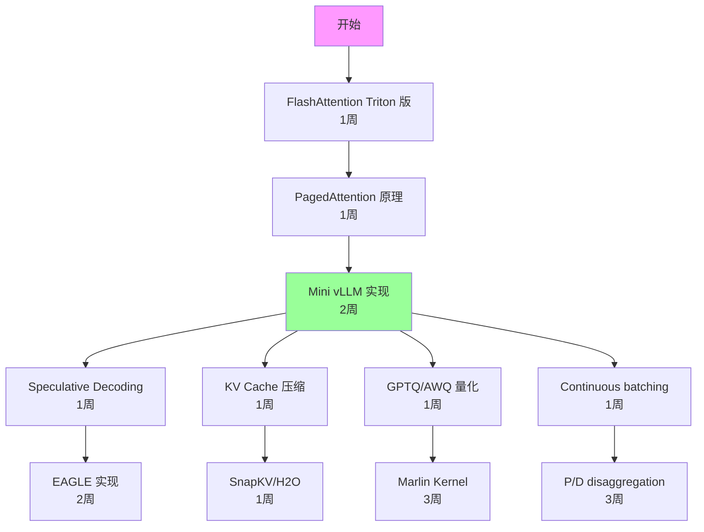

# 复现计划

## 总览

本文档为仓库中的关键论文和系统提供工程复现路线图，按难度分级，标注所需资源和预期时间。

**证据等级说明**：
- `[verified_by_code]` — 开源代码可直接运行复现
- `[derived_analysis]` — 基于文档和经验推导的时间/资源估计

---

## 1. 复现难度分级

| 级别 | 描述 | 典型时间 | 典型资源 |
|------|------|----------|----------|
| L1 - 入门 | 运行开源代码，复现论文数据 | 1-3 天 | 1×A100 |
| L2 - 中级 | 修改/扩展开源代码 | 1-2 周 | 2-4×A100 |
| L3 - 高级 | 从零实现核心算法 | 2-4 周 | 4-8×A100 |
| L4 - 专家 | 系统级实现，需要深入 CUDA | 1-3 月 | 8+×A100 |
| L5 - 团队 | 完整系统，需要多人协作 | 3-6 月 | 集群 |

---

## 2. 优先复现列表

### 2.1 Attention Kernel（L2-L4）

| 项目 | 难度 | 前置知识 | 资源 | 预期产出 |
|------|------|----------|------|----------|
| [FlashAttention-2](https://arxiv.org/abs/2307.08691) forward | L3 | CUDA, tiling | 1×A100 | 理解 IO-aware attention |
| [FlashDecoding](https://crfm.stanford.edu/2023/10/12/flashdecoding.html) | L3 | [FlashAttention](https://arxiv.org/abs/2205.14135), split-K | 1×A100 | Decode 加速 |
| [PagedAttention](https://arxiv.org/abs/2309.06180) kernel | L4 | vLLM 源码, CUDA | 1×A100 | 理解 paged memory |
| Triton [FlashAttention](https://arxiv.org/abs/2205.14135) | L2 | Triton, Python | 1×A100 | 快速原型 |

**复现路线**：
```
1. 先用 Triton 实现简化版 FlashAttention（1周）
2. 阅读 FlashAttention-2 CUDA 源码（1周）
3. 实现 FlashDecoding 的 split-K（1周）
4. 在 vLLM 中修改 PagedAttention kernel（2周）
```

### 2.2 KV Cache 优化（L2-L3）

| 项目 | 难度 | 前置知识 | 资源 | 预期产出 |
|------|------|----------|------|----------|
| [H2O](https://arxiv.org/abs/2306.14048) (Heavy Hitter Oracle) | L2 | Attention score 分析 | 1×A100 | KV eviction 基线 |
| [SnapKV](https://arxiv.org/abs/2404.14469) | L2 | Attention pattern | 1×A100 | 观察窗口压缩 |
| [KIVI](https://arxiv.org/abs/2402.02750) (KV quantization) | L2 | 量化基础 | 1×A100 | KV INT4 |
| [vLLM](https://github.com/vllm-project/vllm) Block Manager | L3 | [vLLM](https://github.com/vllm-project/vllm) 源码 | 1×A100 | 内存管理 |

### 2.3 [Speculative Decoding](https://arxiv.org/abs/2211.17192)（L2-L3）

| 项目 | 难度 | 前置知识 | 资源 | 预期产出 |
|------|------|----------|------|----------|
| 标准 [Speculative Decoding](https://arxiv.org/abs/2211.17192) | L2 | Rejection sampling | 1×A100 | 基础框架 |
| [Medusa](https://arxiv.org/abs/2401.10774) heads 训练 | L3 | 模型微调 | 2×A100 | Self-draft |
| [EAGLE](https://arxiv.org/abs/2401.15077) 实现 | L3 | [Medusa](https://arxiv.org/abs/2401.10774) + autoregressive | 2×A100 | 改进 draft |
| Tree attention | L3 | Custom attention mask | 1×A100 | Tree verification |

**复现路线**：
```
1. 实现标准 speculative decoding（rejection sampling）（3天）
2. 在 HuggingFace 上训练 Medusa heads（1周）
3. 实现 tree attention verification（1周）
4. 集成到 vLLM/SGLang（2周）
```

### 2.4 量化（L2-L3）

| 项目 | 难度 | 前置知识 | 资源 | 预期产出 |
|------|------|----------|------|----------|
| [GPTQ](https://arxiv.org/abs/2210.17323) 量化流程 | L2 | Hessian, OBQ | 1×A100 | W4 模型 |
| [AWQ](https://arxiv.org/abs/2306.00978) 量化 | L2 | Activation-aware scaling | 1×A100 | W4 模型 |
| [SmoothQuant](https://arxiv.org/abs/2211.10438) | L2 | Per-channel scaling | 1×A100 | W8A8 |
| Marlin kernel | L4 | CUDA, 4-bit GEMM | 1×A100 | 加速 kernel |

### 2.5 Serving 系统（L3-L5）

| 项目 | 难度 | 前置知识 | 资源 | 预期产出 |
|------|------|----------|------|----------|
| Mini [vLLM](https://github.com/vllm-project/vllm) | L3 | Python, [PagedAttention](https://arxiv.org/abs/2309.06180) | 1×A100 | 理解 serving 架构 |
| [Continuous Batching](https://www.usenix.org/system/files/osdi22-yu.pdf) | L3 | Scheduler 设计 | 1×A100 | 动态 batching |
| Prefix Caching (Radix Tree) | L3 | 数据结构 | 1×A100 | Cache 管理 |
| P/D disaggregation | L4 | 分布式系统 | 4×A100 | 分离架构 |

---

## 3. 环境配置

### 3.1 基础环境

```bash
# CUDA 12.1+, PyTorch 2.1+
conda create -n llm-inference python=3.10
conda activate llm-inference
pip install torch==2.1.0 --index-url https://download.pytorch.org/whl/cu121
pip install transformers accelerate datasets
pip install triton==2.1.0
pip install flash-attn==2.5.0
```

### 3.2 Step-by-Step: vLLM Throughput Benchmark 复现

```bash
# Step 1: 安装 vLLM
pip install vllm>=0.4.0

# Step 2: 下载测试数据集
wget -O ShareGPT_V3.json \
  "https://huggingface.co/datasets/anon8231489123/ShareGPT_Vicuna_unfiltered/resolve/main/ShareGPT_V3_unfiltered_cleaned_split.json"

# Step 3: 锁定 GPU 频率（减少波动）
sudo nvidia-smi -lgc 1410,1410  # A100
# sudo nvidia-smi -lgc 1980,1980  # H100

# Step 4: 运行 offline throughput benchmark
python -m vllm.entrypoints.openai.api_server \
    --model meta-llama/Llama-3-8B-Instruct \
    --dtype float16 --gpu-memory-utilization 0.9 &
sleep 30  # 等待模型加载

python benchmarks/benchmark_serving.py \
    --backend openai --base-url http://localhost:8000 \
    --model meta-llama/Llama-3-8B-Instruct \
    --dataset-name sharegpt --dataset-path ShareGPT_V3.json \
    --num-prompts 500 --request-rate inf

# Step 5: 预期结果范围 (A100-80G, Llama-3-8B, FP16)
# - Throughput: 4000-6000 tokens/s
# - TTFT P50: 20-40ms, P99: 60-120ms
# - TPOT P50: 12-18ms

# Troubleshooting:
# - OOM: 降低 --gpu-memory-utilization 到 0.85
# - 性能低于预期: 检查 GPU 频率是否锁定，检查 PCIe 带宽
# - CUDA error: 确认 CUDA 版本与 vLLM 兼容
```

### 3.3 Step-by-Step: FlashAttention Triton 实现复现

```bash
# Step 1: 安装依赖
pip install triton==2.1.0 torch==2.1.0

# Step 2: 实现简化版 (参考 triton tutorials)
# 核心文件: flash_attention_triton.py
# 关键参数: BLOCK_M=128, BLOCK_N=64, num_warps=4

# Step 3: 验证正确性
python -c "
import torch
from flash_attention_triton import flash_attention
q = torch.randn(1, 32, 2048, 128, device='cuda', dtype=torch.float16)
k = torch.randn(1, 32, 2048, 128, device='cuda', dtype=torch.float16)
v = torch.randn(1, 32, 2048, 128, device='cuda', dtype=torch.float16)
out_triton = flash_attention(q, k, v)
out_ref = torch.nn.functional.scaled_dot_product_attention(q, k, v)
print(f'Max diff: {(out_triton - out_ref).abs().max().item():.6f}')
# 预期: Max diff < 1e-2 (FP16 精度)
"

# Step 4: Benchmark
# 预期 (A100, seq_len=2048, d=128, FP16):
# - Triton 实现: ~150 TFLOPS (约 50% peak)
# - flash-attn 库: ~220 TFLOPS (约 70% peak)
```

### 3.2 Serving 框架

```bash
# vLLM
pip install vllm==0.4.0

# SGLang
pip install sglang[all]

# TensorRT-LLM (需要 NVIDIA container)
docker pull nvcr.io/nvidia/tritonserver:24.01-trtllm-python-py3
```

### 3.3 Benchmark 工具

```bash
# vLLM benchmark
git clone https://github.com/vllm-project/vllm
cd vllm/benchmarks

# ShareGPT dataset
wget https://huggingface.co/datasets/anon8231489123/ShareGPT_Vicuna_unfiltered/resolve/main/ShareGPT_V3_unfiltered_cleaned_split.json
```

---

## 4. 复现检查清单

### 4.1 每个实验必须记录

- [ ] 硬件配置（GPU 型号、数量、互联）
- [ ] 软件版本（CUDA、PyTorch、框架版本）
- [ ] 模型信息（名称、参数量、精度）
- [ ] 输入配置（prompt length、output length、batch size）
- [ ] 测量方法（warmup 次数、测量次数、统计方法）
- [ ] 结果（均值、标准差、分位数）
- [ ] 与论文数据的对比

### 4.2 常见复现问题

| 问题 | 原因 | 解决方案 |
|------|------|----------|
| 性能低于论文 | GPU 频率未锁定 | `nvidia-smi -lgc 1410,1410` |
| 内存不足 | KV Cache 预分配过大 | 调整 `gpu_memory_utilization` |
| 精度不匹配 | 随机种子不同 | 固定 seed，多次运行取均值 |
| Throughput 波动 | 请求长度分布 | 使用固定长度 synthetic data |
| TTFT 异常 | CUDA graph 编译 | 增加 warmup |

---

## 5. 推荐复现顺序



**总预计时间**：完整路线约 3-4 个月（全职）

---

## 最新进展 (2025-2026)

### [SpecForge](https://arxiv.org/abs/2603.18567) (2026)

**问题**: Speculative decoding的实际部署面临缺乏高质量开源draft model和大规模训练基础设施的双重障碍。

**方法**: Target-draft解耦训练避免target model全量前向传播，混合并行（DP+TP+PP）扩展训练规模，优化训练kernel提升效率。与SGLang生产推理引擎集成。

**关键结果**:
- Qwen3-235B-A22B的EAGLE-3训练加速9.9x `[verified_by_paper]`
- Draft model端到端推理加速最高4.48x `[verified_by_paper]`
- 发布SpecBundle：主流开源LLM的生产级draft model集合 `[verified_by_paper]`

**工程启示**: 解决了speculative decoding从研究到生产的最后一公里问题；SpecBundle可直接用于部署。

**局限性**: 训练框架与EAGLE-3架构绑定；需要多卡GPU环境进行训练。

**复现指南**:
```bash
# Step 1: 安装SpecForge
git clone https://github.com/SafeAILab/SpecForge
cd SpecForge && pip install -e .

# Step 2: 使用SpecBundle预训练draft model（无需自行训练）
# 下载对应target model的draft model
huggingface-cli download specforge/eagle3-llama3-8b

# Step 3: 在SGLang中部署speculative decoding
pip install sglang[all]
python -m sglang.launch_server \
    --model meta-llama/Llama-3-8B-Instruct \
    --speculative-algorithm eagle3 \
    --speculative-draft specforge/eagle3-llama3-8b \
    --port 30000

# Step 4: Benchmark
python -m sglang.bench_serving --port 30000 \
    --num-prompts 500 --request-rate 10

# 预期结果: 2-4x加速（取决于任务和batch size）
# 资源需求: 1×A100-80G (8B target), 4×A100-80G (70B target)
```

**复现难度**: L2（使用SpecBundle）/ L4（自行训练draft model）

---

### [TorchSpec](https://github.com/SafeAILab/EAGLE) (2026)

**问题**: EAGLE-3.1的训练需要专用基础设施，研究者难以快速迭代speculative decoding的新想法。

**方法**: 提供EAGLE-3.1官方训练基础设施，包含完整的数据准备、训练、评估pipeline，降低speculative decoding研究的训练门槛。

**关键结果**:
- EAGLE-3.1官方训练基础设施 `[verified_by_code]`
- 修复EAGLE-3的attention drift问题 `[verified_by_code]`
- FC normalization + post-norm设计 `[verified_by_code]`

**工程启示**: 降低了speculative decoding研究的入门门槛；FC normalization是长上下文鲁棒性的关键。

**局限性**: 训练仍需要多卡GPU；与EAGLE架构绑定。

**复现指南**:
```bash
# Step 1: 安装
git clone https://github.com/SafeAILab/EAGLE
cd EAGLE && pip install -e .

# Step 2: 准备训练数据（从target model生成）
python generate_train_data.py \
    --model meta-llama/Llama-3-8B-Instruct \
    --output-dir ./train_data --num-samples 50000

# Step 3: 训练EAGLE-3.1 draft model
torchrun --nproc_per_node=4 train.py \
    --target-model meta-llama/Llama-3-8B-Instruct \
    --train-data ./train_data \
    --output-dir ./eagle31_draft

# 资源需求: 4×A100-80G, 约24小时训练
# 预期结果: acceptance rate ~0.7-0.8
```

**复现难度**: L3

---

### [llm-d](https://github.com/llm-d/llm-d) (Red Hat/IBM, 2025)

**问题**: Disaggregated serving的性能评估缺乏标准化可复现的benchmark工作流。

**方法**: 提供Kubernetes原生的分布式推理框架，内置可复现的benchmark工作流，覆盖disaggregated serving和wide-EP场景。

**关键结果**:
- 开源Kubernetes原生推理框架 `[verified_by_code]`
- 可复现的disaggregated serving benchmark `[verified_by_code]`
- Prefix-cache-aware routing `[verified_by_code]`

**工程启示**: 是评估P/D disaggregation性能的标准化平台；K8s原生设计便于云环境部署。

**局限性**: 需要Kubernetes 1.29+环境；完整benchmark需要多节点集群。

**复现指南**:
```bash
# Step 1: 部署K8s集群（需要GPU节点）
# 确保 Kubernetes 1.29+, Gateway API v1

# Step 2: 安装llm-d
helm repo add llm-d https://llm-d.github.io/charts
helm install llm-d llm-d/llm-d \
    --set model=meta-llama/Llama-3-8B-Instruct \
    --set replicas.prefill=2 --set replicas.decode=4

# Step 3: 运行benchmark
kubectl apply -f benchmarks/disaggregated-serving.yaml
kubectl logs -f job/benchmark-runner

# 资源需求: 6+ GPU节点（2 prefill + 4 decode）
# 预期结果: P/D disaggregation在高负载下goodput提升1.5-2x
```

**复现难度**: L4（需要K8s集群和多GPU节点）

---

### [FlatQuant](https://arxiv.org/abs/2410.09426) (ICML 2025)

**问题**: W4A4KV4量化在大模型上的精度和加速效果需要独立验证。

**方法**: 开源W4A4KV4量化实现，包含可学习Kronecker仿射变换和优化CUDA kernel，支持完整的校准-量化-推理pipeline。

**关键结果**:
- LLaMA-3-70B W4A4精度损失<1% `[verified_by_paper]`
- Prefill加速最高2.3x `[verified_by_paper]`
- 开源实现含优化CUDA kernel `[verified_by_code]`

**工程启示**: 当前W4A4KV4的SOTA方案；校准成本低（几小时），适合快速部署。

**局限性**: 需要校准数据；Kronecker变换的kernel融合需要特定CUDA版本。

**复现指南**:
```bash
# Step 1: 安装
git clone https://github.com/ruikangliu/FlatQuant
cd FlatQuant && pip install -e .

# Step 2: 校准（学习仿射变换）
python calibrate.py \
    --model meta-llama/Llama-3-8B-Instruct \
    --wbits 4 --abits 4 --kvbits 4 \
    --calib-dataset wikitext2 --nsamples 128 \
    --output-dir ./flatquant_llama3_8b

# Step 3: 量化推理
python eval_ppl.py \
    --model meta-llama/Llama-3-8B-Instruct \
    --quant-dir ./flatquant_llama3_8b

# Step 4: Benchmark加速
python benchmark_latency.py \
    --model-dir ./flatquant_llama3_8b \
    --input-len 2048 --output-len 128

# 资源需求: 1×A100-80G (8B), 4×A100-80G (70B)
# 校准时间: ~2-4小时 (8B), ~8-12小时 (70B)
# 预期结果: PPL增加<0.1, prefill加速1.5-2.3x
```

**复现难度**: L2

---

### [NVIDIA Dynamo](https://developer.nvidia.com/blog/nvidia-dynamo-adds-gpu-autoscaling-kubernetes-automation-and-networking-optimizations/) (NVIDIA, 2025)

**问题**: P/D disaggregation的生产级参考实现缺乏，各团队需要从零构建disaggregated serving基础设施。

**方法**: 开源数据中心级推理框架，提供P/D disaggregation的生产级参考实现，支持GPU autoscaling和prefix-aware routing。

**关键结果**:
- 原生P/D disaggregation支持 `[verified_by_code]`
- GPU autoscaling与K8s集成 `[verified_by_code]`
- 支持vLLM/TRT-LLM/SGLang作为backend `[verified_by_code]`

**工程启示**: P/D disaggregation的生产级参考实现；适合大规模集群部署。

**局限性**: 需要InfiniBand/RoCE高速网络；面向大规模集群。

**复现指南**:
```bash
# Step 1: 安装NVIDIA Dynamo
# 需要NVIDIA Container Toolkit和K8s环境
helm install dynamo nvidia/dynamo \
    --set backend=vllm \
    --set model=meta-llama/Llama-3-70B-Instruct \
    --set disaggregation.enabled=true \
    --set disaggregation.prefill_replicas=2 \
    --set disaggregation.decode_replicas=4

# Step 2: 验证P/D disaggregation
curl http://dynamo-gateway:8000/v1/completions \
    -d '{"model":"llama3-70b","prompt":"Hello","max_tokens":100}'

# Step 3: Benchmark
python benchmarks/benchmark_serving.py \
    --backend openai --base-url http://dynamo-gateway:8000 \
    --num-prompts 1000 --request-rate 50

# 资源需求: 6+ H100 GPU (InfiniBand互联)
# 预期结果: 高负载下goodput提升1.5-2x vs 非disaggregated
```

**复现难度**: L4（需要大规模GPU集群和高速网络）
