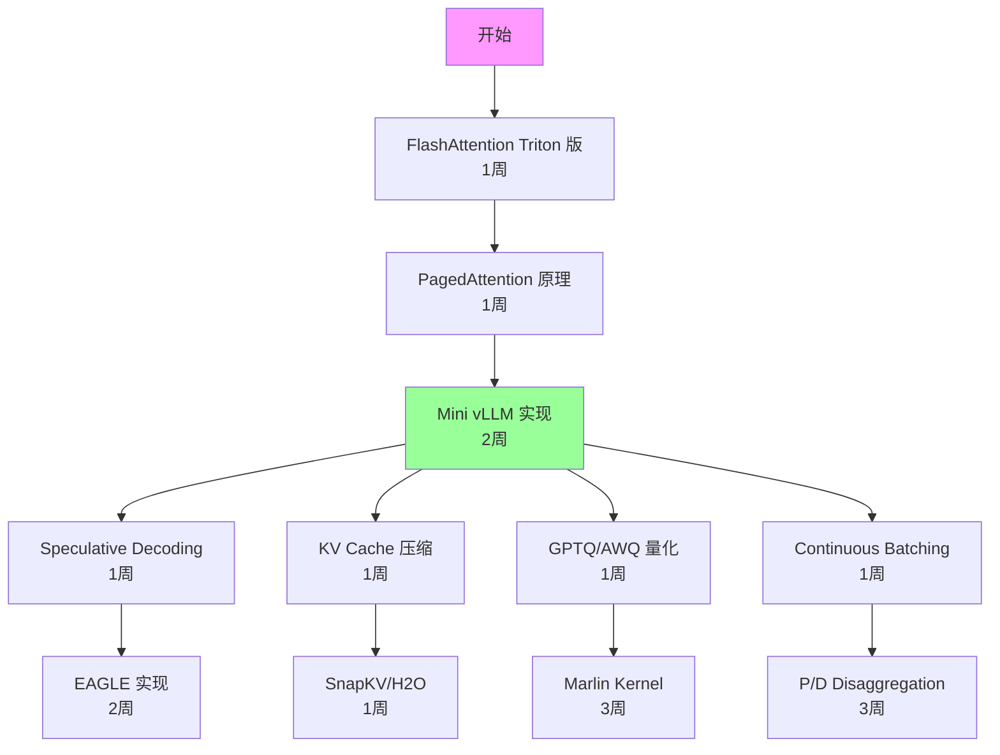

# 复现计划

## 总览

本文档为仓库中的关键论文和系统提供工程复现路线图，按难度分级，标注所需资源和预期时间。

---

## 1. 复现难度分级

| 级别 | 描述 | 典型时间 | 典型资源 |
|------|------|----------|----------|
| L1 - 入门 | 运行开源代码，复现论文数据 | 1-3 天 | 1×A100 |
| L2 - 中级 | 修改/扩展开源代码 | 1-2 周 | 2-4×A100 |
| L3 - 高级 | 从零实现核心算法 | 2-4 周 | 4-8×A100 |
| L4 - 专家 | 系统级实现，需要深入 CUDA | 1-3 月 | 8+×A100 |
| L5 - 团队 | 完整系统，需要多人协作 | 3-6 月 | 集群 |

---

## 2. 优先复现列表

### 2.1 Attention Kernel（L2-L4）

| 项目 | 难度 | 前置知识 | 资源 | 预期产出 |
|------|------|----------|------|----------|
| FlashAttention-2 forward | L3 | CUDA, tiling | 1×A100 | 理解 IO-aware attention |
| FlashDecoding | L3 | FlashAttention, split-K | 1×A100 | Decode 加速 |
| PagedAttention kernel | L4 | vLLM 源码, CUDA | 1×A100 | 理解 paged memory |
| Triton FlashAttention | L2 | Triton, Python | 1×A100 | 快速原型 |

**复现路线**：
```
1. 先用 Triton 实现简化版 FlashAttention（1周）
2. 阅读 FlashAttention-2 CUDA 源码（1周）
3. 实现 FlashDecoding 的 split-K（1周）
4. 在 vLLM 中修改 PagedAttention kernel（2周）
```

### 2.2 KV Cache 优化（L2-L3）

| 项目 | 难度 | 前置知识 | 资源 | 预期产出 |
|------|------|----------|------|----------|
| H2O (Heavy Hitter Oracle) | L2 | Attention score 分析 | 1×A100 | KV eviction 基线 |
| SnapKV | L2 | Attention pattern | 1×A100 | 观察窗口压缩 |
| KIVI (KV quantization) | L2 | 量化基础 | 1×A100 | KV INT4 |
| vLLM Block Manager | L3 | vLLM 源码 | 1×A100 | 内存管理 |

### 2.3 Speculative Decoding（L2-L3）

| 项目 | 难度 | 前置知识 | 资源 | 预期产出 |
|------|------|----------|------|----------|
| 标准 Speculative Decoding | L2 | Rejection sampling | 1×A100 | 基础框架 |
| Medusa heads 训练 | L3 | 模型微调 | 2×A100 | Self-draft |
| EAGLE 实现 | L3 | Medusa + autoregressive | 2×A100 | 改进 draft |
| Tree attention | L3 | Custom attention mask | 1×A100 | Tree verification |

**复现路线**：
```
1. 实现标准 speculative decoding（rejection sampling）（3天）
2. 在 HuggingFace 上训练 Medusa heads（1周）
3. 实现 tree attention verification（1周）
4. 集成到 vLLM/SGLang（2周）
```

### 2.4 量化（L2-L3）

| 项目 | 难度 | 前置知识 | 资源 | 预期产出 |
|------|------|----------|------|----------|
| GPTQ 量化流程 | L2 | Hessian, OBQ | 1×A100 | W4 模型 |
| AWQ 量化 | L2 | Activation-aware scaling | 1×A100 | W4 模型 |
| SmoothQuant | L2 | Per-channel scaling | 1×A100 | W8A8 |
| Marlin kernel | L4 | CUDA, 4-bit GEMM | 1×A100 | 加速 kernel |

### 2.5 Serving 系统（L3-L5）

| 项目 | 难度 | 前置知识 | 资源 | 预期产出 |
|------|------|----------|------|----------|
| Mini vLLM | L3 | Python, PagedAttention | 1×A100 | 理解 serving 架构 |
| Continuous Batching | L3 | Scheduler 设计 | 1×A100 | 动态 batching |
| Prefix Caching (Radix Tree) | L3 | 数据结构 | 1×A100 | Cache 管理 |
| P/D Disaggregation | L4 | 分布式系统 | 4×A100 | 分离架构 |

---

## 3. 环境配置

### 3.1 基础环境

```bash
# CUDA 12.1+, PyTorch 2.1+
conda create -n llm-inference python=3.10
conda activate llm-inference
pip install torch==2.1.0 --index-url https://download.pytorch.org/whl/cu121
pip install transformers accelerate datasets
pip install triton==2.1.0
pip install flash-attn==2.5.0
```

### 3.2 Serving 框架

```bash
# vLLM
pip install vllm==0.4.0

# SGLang
pip install sglang[all]

# TensorRT-LLM (需要 NVIDIA container)
docker pull nvcr.io/nvidia/tritonserver:24.01-trtllm-python-py3
```

### 3.3 Benchmark 工具

```bash
# vLLM benchmark
git clone https://github.com/vllm-project/vllm
cd vllm/benchmarks

# ShareGPT dataset
wget https://huggingface.co/datasets/anon8231489123/ShareGPT_Vicuna_unfiltered/resolve/main/ShareGPT_V3_unfiltered_cleaned_split.json
```

---

## 4. 复现检查清单

### 4.1 每个实验必须记录

- [ ] 硬件配置（GPU 型号、数量、互联）
- [ ] 软件版本（CUDA、PyTorch、框架版本）
- [ ] 模型信息（名称、参数量、精度）
- [ ] 输入配置（prompt length、output length、batch size）
- [ ] 测量方法（warmup 次数、测量次数、统计方法）
- [ ] 结果（均值、标准差、分位数）
- [ ] 与论文数据的对比

### 4.2 常见复现问题

| 问题 | 原因 | 解决方案 |
|------|------|----------|
| 性能低于论文 | GPU 频率未锁定 | `nvidia-smi -lgc 1410,1410` |
| 内存不足 | KV Cache 预分配过大 | 调整 `gpu_memory_utilization` |
| 精度不匹配 | 随机种子不同 | 固定 seed，多次运行取均值 |
| Throughput 波动 | 请求长度分布 | 使用固定长度 synthetic data |
| TTFT 异常 | CUDA graph 编译 | 增加 warmup |

---

## 5. 推荐复现顺序



**总预计时间**：完整路线约 3-4 个月（全职）
