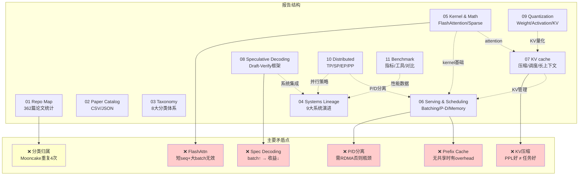
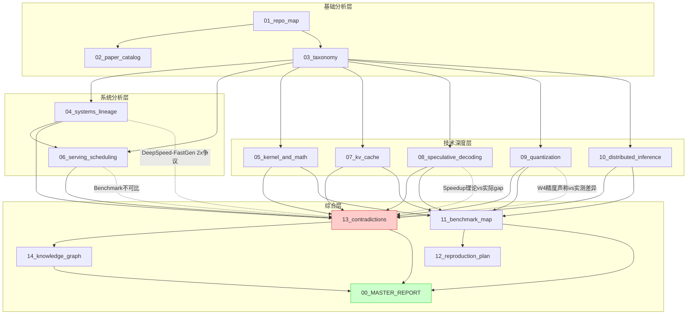

# 矛盾、注意事项与常见误区

## 总览

本文档汇总 [LLM Inference](https://arxiv.org/abs/2410.04466) 领域中论文间的矛盾结论、容易被忽视的 caveats、以及常见的工程误区。

---

## 1. 论文间矛盾

### 1.1 [Speculative Decoding](https://arxiv.org/abs/2211.17192) 的实际收益

**矛盾**：
- 论文声称：2-4x speedup（单请求，batch=1）
- 实际 serving：batch size 增大后收益急剧下降

**证据等级**：A（多篇独立论文实验验证）  
**解决状态**：部分解决 — [MagicDec](https://arxiv.org/abs/2408.11049)/[MineDraft](https://arxiv.org/abs/2603.18016) 针对高 batch 场景提出方案，但尚未广泛验证

**原因分析**：
- 论文通常在 batch=1 下测试（memory-bound，speculation 收益最大）
- 实际 serving 中 batch=32-128，decode 变为 compute-bound
- Speculation 增加的计算量在高 batch 下不可忽略
- Draft model 的 KV cache 额外占用显存，减少可用 batch size

**结论**：Speculative decoding 在低并发/长序列场景有效，高吞吐 serving 中收益有限。[MagicDec](https://arxiv.org/abs/2408.11049) 尝试解决这个问题。

### 1.2 KV cache 压缩的精度影响

**矛盾**：
- H2O/SnapKV 声称：保留 20% KV 即可维持精度
- 实际测试：在 multi-turn、长依赖任务上精度下降明显

**证据等级**：A（MiKV、CriticalKV 等多篇论文独立验证）  
**解决状态**：部分解决 — 自适应策略（AdaKV, DynamicKV）和三路分配（VECTOR）改善了问题

**原因分析**：
- 论文通常在 perplexity 或简单 benchmark 上评估
- 复杂推理任务需要访问"不重要"的 token
- Attention pattern 在不同层、不同 head 差异大
- 静态 eviction 策略无法适应动态查询

**结论**：KV cache 压缩需要 task-aware 评估，不能只看 PPL。

### 1.3 [Continuous Batching](https://www.usenix.org/system/files/osdi22-yu.pdf) 的 overhead

**矛盾**：
- [Orca](https://www.usenix.org/conference/osdi22/presentation/yu) 论文：36.9x throughput improvement
- 实际部署：overhead 在 2-5%

**证据等级**：B（对比基准不同导致数字差异，非真正矛盾）  
**解决状态**：已解决 — 业界共识是 continuous batching 有效但 36.9x 是极端对比

**原因分析**：
- 36.9x 是与最差情况（static batching + padding）对比
- 实际对比应该是 dynamic batching（按长度分桶）
- Continuous batching 的 scheduling overhead 在高 QPS 下不可忽略

**结论**：Continuous batching 确实有效，但 36.9x 是极端情况。

### 1.4 P/D disaggregation 的网络需求

**矛盾**：
- [DistServe](https://arxiv.org/abs/2401.09670) 声称：1.5-2.3x goodput improvement
- 实际部署：需要极高带宽网络，否则 KV transfer 成为瓶颈

**证据等级**：A（多个工业部署报告验证）  
**解决状态**：部分解决 — Mooncake 的 KVCache-centric 设计和 KV 压缩传输缓解了问题，但仍需高速网络

**原因分析**：
- 论文假设 NVLink/InfiniBand 高速互联
- KV cache 传输量：$2 \times L \times n_{kv\_heads} \times d_{head} \times seq\_len \times 2$ bytes
- 对于 Llama-70B, seq_len=2048：~2.6 GB per request
- 在 PCIe/Ethernet 环境下延迟不可接受

**结论**：P/D disaggregation 需要 NVLink 或 RDMA，不适合普通网络环境。

### 1.5 [FlashAttention](https://arxiv.org/abs/2205.14135) 的适用范围

**矛盾**：
- [FlashAttention](https://arxiv.org/abs/2205.14135) 论文：2-4x speedup
- 实际：在短序列 + 大 batch 下可能不如 cuBLAS

**证据等级**：A（FlashAttention-3 论文自身承认此限制）  
**解决状态**：已解决 — 业界共识是根据 workload 特征选择 kernel

**原因分析**：
- [FlashAttention](https://arxiv.org/abs/2205.14135) 优化的是 IO（减少 HBM 访问）
- 短序列时 attention 本身不是瓶颈
- 大 batch 时 GEMM 变为 compute-bound，[FlashAttention](https://arxiv.org/abs/2205.14135) 的 tiling overhead 反而有害
- [FlashAttention-3](https://arxiv.org/abs/2407.08608) 在 H100 上的 FP8 模式才能充分利用硬件

**结论**：[FlashAttention](https://arxiv.org/abs/2205.14135) 在长序列 + 中等 batch 下收益最大。

---

## 2. 容易被忽视的 Caveats

### 2.1 Benchmark 条件不一致

| 问题 | 影响 | 建议 |
|------|------|------|
| GPU 频率未锁定 | 性能波动 10-20% | 使用 `nvidia-smi -lgc` |
| Warmup 不充分 | CUDA graph 编译影响首次测量 | 至少 10 次 warmup |
| 请求长度分布 | 不同分布下系统表现差异大 | 明确标注分布 |
| 模型版本 | 同名模型不同 checkpoint 性能不同 | 标注完整 model ID |
| 量化校准集 | 不同校准集导致量化质量差异 | 标注校准数据 |

### 2.2 内存计算常见错误

**错误 1**：忽略 activation memory
- KV cache 不是唯一的显存消耗
- Prefill 阶段的 activation 可能很大：$batch \times seq\_len \times hidden \times 4$ bytes

**错误 2**：忽略 memory fragmentation
- [PagedAttention](https://arxiv.org/abs/2309.06180) 的 block 粒度导致内部碎片
- 16 token block：平均浪费 8 tokens 的空间

**错误 3**：忽略 CUDA context overhead
- 每个 GPU 的 CUDA context 占用 ~1-2 GB
- 多进程时更严重

### 2.3 Quantization 的隐藏成本

| 成本 | 描述 |
|------|------|
| 校准时间 | [GPTQ](https://arxiv.org/abs/2210.17323) 对 70B 模型需要数小时 |
| 精度评估 | 需要在目标任务上评估，不能只看 PPL |
| Kernel 支持 | 不是所有量化格式都有高效 kernel |
| 动态范围 | Outlier 处理不当导致精度崩溃 |
| 模型兼容性 | 新模型架构可能不支持现有量化方法 |

### 2.4 Serving 系统的隐藏开销

| 开销 | 来源 | 量级 |
|------|------|------|
| Tokenization | CPU-bound，长 prompt 耗时 | 1-10ms |
| Scheduling | 每个 iteration 的调度决策 | 0.1-1ms |
| Detokenization | 增量 detokenize | 0.1ms |
| Network | HTTP/gRPC 序列化 | 1-5ms |
| Sampling | Top-k/Top-p 采样 | 0.1-0.5ms |

---

## 3. 常见工程误区

### 3.1 "更大的 batch size 总是更好"

**误区**：增大 batch size 一定能提高吞吐。

**现实**：
- Decode 阶段：batch 增大 → KV cache 增大 → 可用显存减少 → 触发 preemption
- 存在最优 batch size：throughput 先升后降
- 需要根据 seq_len 分布动态调整

### 3.2 "TP=8 一定比 TP=4 快"

**误区**：更多 GPU 并行一定更快。

**现实**：
- TP 增加 → 通信次数增加 → AllReduce latency 累积
- 对于小模型（7B），TP=2 可能比 TP=4 快（通信 overhead > 计算节省）
- Decode 阶段尤其明显（计算量小，通信占比高）

### 3.3 "[FP8](https://arxiv.org/abs/2209.05433) 无损"

**误区**：[FP8](https://arxiv.org/abs/2209.05433) 量化没有精度损失。

**现实**：
- E4M3 只有 3 bit mantissa，动态范围有限
- 对 outlier 敏感的模型（如 OPT-175B）可能有明显精度下降
- 需要 per-tensor 或 per-token scaling 来缓解
- 某些任务（数学推理）对精度更敏感

### 3.4 "prefix caching 总是有效"

**误区**：开启 prefix caching 一定能加速。

**现实**：
- 如果请求没有共享 prefix，cache 命中率为 0
- Cache 管理本身有 overhead（hash 计算、tree 维护）
- Cache 占用显存，减少可用于新请求的空间
- 需要根据 workload 特征决定是否开启

### 3.5 "KV cache 压缩可以无限压"

**误区**：压缩到 2-bit 仍然可用。

**现实**：
- 压缩率与精度损失非线性关系
- 不同层、不同 head 的敏感度不同
- 长距离依赖对 KV 精度要求更高
- 需要 layer-wise 或 head-wise 的自适应策略

---

## 4. 研究中的开放问题

### 4.1 尚未解决的矛盾

| 矛盾 | 现状 | 可能方向 | 证据等级 | 解决状态 |
|------|------|----------|----------|----------|
| Latency vs Throughput | 无法同时最优 | P/D disaggregation, adaptive batching | A | 部分解决 |
| Compression vs Accuracy | 压缩越多精度越差 | Task-aware compression, learned codebook | A | 开放 |
| Speculation vs Batch | 高 batch 下 speculation 无效 | Batch-aware speculation ([MineDraft](https://arxiv.org/abs/2603.18016)) | B | 部分解决 |
| Long Context vs Memory | 长序列 KV cache 爆炸 | Offloading + compression + sparse | A | 开放 |
| Generality vs Performance | 通用框架 vs 专用优化 | Compiler-based approach ([MLC-LLM](https://github.com/mlc-ai/mlc-llm)) | B | 开放 |

### 4.2 需要更多实验验证的声明

1. "[RadixAttention](https://arxiv.org/abs/2312.07104) 在所有场景下优于 APC" — 需要在低 prefix reuse 场景验证
2. "[EAGLE-2](https://arxiv.org/abs/2406.16858) 的 dynamic tree 总是优于 static tree" — 需要在不同 temperature 下验证
3. "P/D disaggregation 在所有负载下都有效" — 需要在低 QPS 下验证
4. "[MoE](https://arxiv.org/abs/2407.06204) 推理可以通过 expert offloading 在消费级 GPU 上运行" — 需要验证实际延迟
5. "Non-transformer 架构（[Mamba](https://arxiv.org/abs/2312.00752)）可以替代 Transformer" — 需要在复杂推理任务上验证

---

## 5. 系统方向补充（repo-systems-paper-analyst 审查）

### 5.1 分类交叉与归属问题

| 论文 | 当前归属 | 问题 | 建议 |
|------|----------|------|------|
| [Mooncake](https://arxiv.org/abs/2407.00079) | 出现在 Trending、Framework、Batching、KV cache 四个章节 | 重复计入导致统计膨胀 | 应标注主归属为 Framework/Disaggregation，其余为交叉引用 |
| [Star Attention](https://arxiv.org/abs/2411.17116) | 同时出现在 Trending 和 Multi-GPU Parallelism | 重复 | 主归属 Parallelism |
| DeepSeek-V2/V3/R1 | 同时出现在 Trending、[MLA](https://arxiv.org/abs/2405.04434)、[MoE](https://arxiv.org/abs/2407.06204) | 重复 | 主归属 MLA/Architecture |
| [Splitwise](https://arxiv.org/abs/2311.18677) | 归属 [Continuous Batching](https://www.usenix.org/system/files/osdi22-yu.pdf) | 实际是 P/D disaggregation 的早期工作 | 应归属 Disaggregating Prefill and Decoding |
| [LightSeq](https://arxiv.org/abs/2310.03294) | 归属 [Continuous Batching](https://www.usenix.org/system/files/osdi22-yu.pdf) | 实际是 Sequence Parallelism | 应归属 Multi-GPU Parallelism |
| vAttention/vTensor | 归属 [Continuous Batching](https://www.usenix.org/system/files/osdi22-yu.pdf) | 核心贡献是 memory management | 可保留，但更适合独立的 Memory Management 子章节 |

### 5.2 系统论文的遗漏

以下重要系统论文未被仓库收录（截至 2026.03）：

| 论文 | 年份 | 重要性 | 遗漏原因推测 |
|------|------|--------|-------------|
| [Sarathi-Serve](https://arxiv.org/abs/2403.02310) (stall-free serving) | 2024 | 高 — chunked prefill 的系统化实现 | 仅 [Sarathi](https://arxiv.org/abs/2308.16369) 被提及（在 KV cache 章节），[Sarathi-Serve](https://arxiv.org/abs/2403.02310) 未收录 |
| LoongServe (elastic SP) | 2024 | 中 — 动态 SP 调度 | 可能发表时间较晚 |
| ORCA 的后续 (Vidur, etc.) | 2024 | 中 — serving simulator | 工具类论文 |
| Infinite-LLM/DistKV-LLM | 2024.01 | 已收录 | — |

### 5.3 系统演进描述中的潜在误导

1. **DeepSpeed-[FastGen](https://arxiv.org/abs/2310.01801) "2x vLLM" 声明**：仓库标题保留了 "2x vLLM?" 的问号，这是合理的。vLLM 团队发布了反驳 blog，实际差距取决于 workload。仓库未标注此争议。

2. **TensorRT-LLM 的开源程度**：仓库将其列为开源框架（有 GitHub 链接），但实际核心 kernel 是闭源的（预编译 .so）。这影响可复现性评估。

3. **llama.cpp 的 serving 能力**：仓库将其与 vLLM/SGLang 并列为 Framework，但 [llama.cpp](https://github.com/ggerganov/llama.cpp) 的 server mode 功能远弱于专业 serving 系统（无 paged attention、有限的 batching）。应注明其定位是本地推理而非生产 serving。

### 5.4 Benchmark 数据的时效性问题

- 报告 11 (benchmark_map.md) 中引用的性能数据来自各论文发表时的版本。[vLLM](https://github.com/vllm-project/vllm)、[SGLang](https://github.com/sgl-project/sglang) 等系统迭代极快（月级更新），论文中的对比数据可能已过时。
- 例如：[vLLM](https://github.com/vllm-project/vllm) 0.2 时代的性能数据不能代表 [vLLM](https://github.com/vllm-project/vllm) 0.6+ 的表现。
- 建议：benchmark 数据标注系统版本号和测试日期。

### 5.5 Serving 方向的分类缺失

仓库缺少以下重要子方向的独立章节：
- **Request Routing / Load Balancing**：多实例间的请求分发策略
- **Auto-scaling**：基于负载的弹性伸缩
- **Multi-model Serving**：同一集群服务多个模型
- **Fairness / Multi-tenancy**：多租户公平性保证

这些在工程实践中极为重要，但学术论文覆盖较少，可能是仓库未收录的原因。

---

## 6. 报告交叉引用与矛盾点分布图

---

## 附录：报告交叉引用与矛盾分布图

---

## 最新进展 (2025-2026)

### [PPD Disaggregation](https://arxiv.org/abs/2603.13358) (ICML 2026)

**问题**: 标准P/D disaggregation假设所有prefill都需要物理隔离到专用节点，但这一假设在多轮对话场景下导致不必要的KV传输开销。

**方法**: 通过实验量化append-prefill（后续轮次的增量prefill）对decode的干扰程度，证明其比full-prefill小一个数量级。基于此引入三级节点角色，Turn 2+请求可在decode节点本地执行append-prefill。

**关键结果**:
- Append-prefill对decode干扰比full-prefill小一个数量级 `[verified_by_paper]`
- Turn 2+ TTFT降低约68% `[verified_by_paper]`
- ICML 2026录用 `[verified_by_paper]`

**工程启示**: 挑战了"所有prefill都需要物理隔离"的假设——多轮场景下大部分prefill可以在decode节点本地完成，避免KV传输。

**局限性**: 仅适用于多轮对话场景；首轮full-prefill仍需要隔离。

**挑战的假设**: P/D disaggregation的核心假设"prefill干扰decode"在append-prefill场景下不成立，静态二级分离架构在多轮场景下次优。

---

### [DuetServe](https://arxiv.org/abs/2511.04791) (2025)

**问题**: 完全物理隔离的P/D disaggregation浪费资源（模型权重重复、KV cache传输开销），但简单的聚合执行会导致prefill干扰decode的TBT延迟。

**方法**: 默认聚合模式运行（prefill+decode同GPU），仅在检测到干扰威胁SLO时激活SM级空间分区。三个核心组件：attention-aware roofline模型（预测延迟）、分区优化器（选择最优SM划分）、无中断执行引擎。

**关键结果**:
- 相比SOTA框架吞吐提升1.3x `[verified_by_paper]`
- 保持低生成延迟（TBT满足SLO） `[verified_by_paper]`
- 避免了disaggregation的模型重复和KV传输开销 `[verified_by_paper]`

**工程启示**: P/D disaggregation并非所有场景的最优解——中等负载下自适应intra-GPU协调更高效；SM级分区是NVIDIA GPU的原生能力，DuetServe将其自动化。

**局限性**: 仅适用于单GPU内的协调；高负载场景仍需要物理disaggregation。

**挑战的假设**: 挑战了"P/D disaggregation总是优于聚合执行"的假设，证明大部分时间聚合执行更高效，仅在必要时隔离。

---

### [VECTOR](https://arxiv.org/abs/2605.23258) (2026)

**问题**: 现有KV cache eviction采用二元决策（保留或丢弃），被驱逐的token信息完全丢失，在中高压缩率下导致显著精度下降。

**方法**: 引入三路分配框架：将token路由到保留（Retention）、近似（Approximation）、驱逐（Eviction）三类。关键设计：保留key vectors（维持attention路由稳定性），仅对value vectors做近似。路由决策结合重要性信号和可重建性信号。

**关键结果**:
- 在中高压缩率下显著改善quality-memory tradeoff `[verified_by_paper]`
- 严格budget regime下增益最明显 `[verified_by_paper]`
- 恢复了二元eviction下不可逆丢失的有用value信息 `[verified_by_paper]`

**工程启示**: 二元keep-or-drop策略次优——三路分配在相同budget下精度更好；保留key、近似value的设计洞察：key影响attention路由，value影响输出值。

**局限性**: 回归模型的推理有额外开销；需要离线校准可重建性评估。

**挑战的假设**: 挑战了KV cache管理的二元决策范式，证明"保留-近似-驱逐"的连续谱优于"保留-丢弃"的离散决策。

---

### [MiKV](https://openreview.net/forum?id=CRQ8JuQDEd) (ICLR 2025)

**问题**: KV cache eviction方法通常只关注精度指标（PPL、benchmark分数），忽略了eviction可能带来的安全风险——安全提示泄露、幻觉增加和关键上下文丢失。

**方法**: 系统性分析KV cache eviction的隐藏风险，证明完全丢弃token信息可能导致安全对齐失效。提出低精度保留策略：对被驱逐的KV保留低精度副本（如INT2），而非完全丢弃。

**关键结果**:
- 揭示KV cache eviction的安全风险——安全提示可能被驱逐 `[verified_by_paper]`
- 低精度保留优于完全丢弃 `[verified_by_paper]`
- ICLR 2025录用 `[verified_by_paper]`

**工程启示**: KV cache压缩不仅是精度问题，更是安全问题；生产系统中安全相关token（system prompt）应被保护不被驱逐。

**局限性**: 低精度保留增加了存储开销（相比完全驱逐）；安全风险的量化依赖于特定攻击场景。

**挑战的假设**: 挑战了"KV eviction只影响精度"的假设，揭示了安全维度的风险——eviction可能破坏模型的安全对齐。

---

### [CriticalKV](https://arxiv.org/abs/2502.03805) (2025)

**问题**: 现有KV cache eviction方法主要依据attention weight大小判断token重要性，但attention weight仅反映query-key相似度，忽略了value states的贡献和预训练参数矩阵的影响。

**方法**: 从attention层输出扰动角度分析KV cache驱逐的影响，证明重要性评估需要联合考虑attention weights + value state norms + 预训练参数矩阵。设计为即插即用增强模块，可叠加在任何现有eviction策略之上。

**关键结果**:
- 与3种SOTA eviction方法组合，跨3个LLM验证 `[verified_by_paper]`
- 在29个数据集上平均将压缩损失降低超过一半 `[verified_by_paper]`
- 验证了不同head和layer对cache eviction的敏感度差异 `[verified_by_paper]`

**工程启示**: 仅看attention weight是不够的——value states同样重要；任何现有eviction方法都可通过叠加CriticalKV获得显著改进。

**局限性**: 多因子评分增加了计算复杂度（虽然可忽略）；需要访问预训练参数矩阵信息。

**挑战的假设**: 挑战了"attention weight是KV重要性的充分代理"的假设，证明需要结合value states的输出扰动分析。

---

### [Fingerprinting Inference Systems](https://arxiv.org/abs/2605.29979) (2026)

**问题**: 推理系统通常被视为确定性黑箱——相同输入应产生相同输出。但不同系统组件（引擎、attention后端、GPU类型）是否引入可被识别的数值偏差？

**方法**: 通过分析推理输出的数值偏差模式构建推理系统"指纹"，可区分不同推理引擎（vLLM vs SGLang）、不同attention后端、不同GPU类型。已向vLLM/SGLang披露相关漏洞。

**关键结果**:
- 可通过数值偏差指纹识别推理引擎/attention后端/GPU类型 `[verified_by_paper]`
- 揭示系统组件的可区分性 `[verified_by_paper]`
- 已披露vLLM/SGLang漏洞 `[verified_by_paper]`

**工程启示**: 推理系统的数值行为不是黑箱——可被外部观察者识别；对模型服务的安全性和信任有直接影响；benchmark设计需要考虑数值确定性。

**局限性**: 指纹识别准确率受输出长度和采样策略影响；防御措施可能降低指纹可靠性。

**挑战的假设**: 挑战了"推理系统是确定性黑箱"的假设，揭示了系统组件的数值可区分性及其安全影响。
