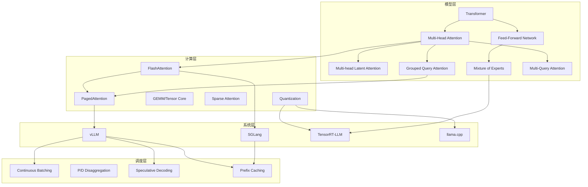
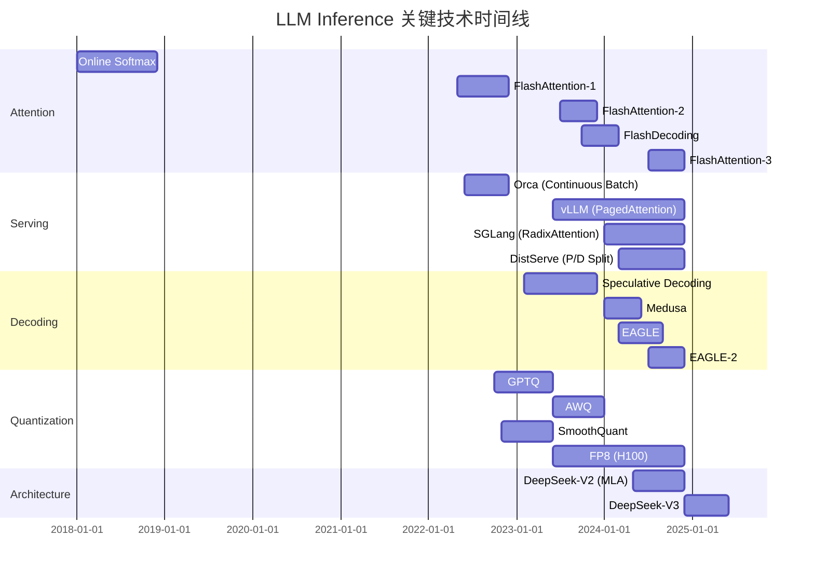
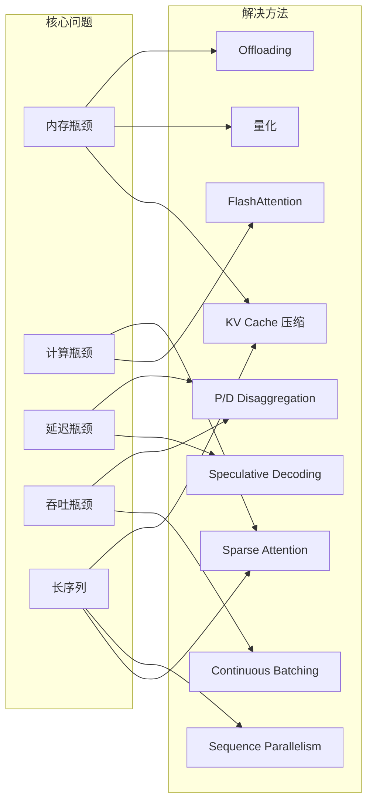
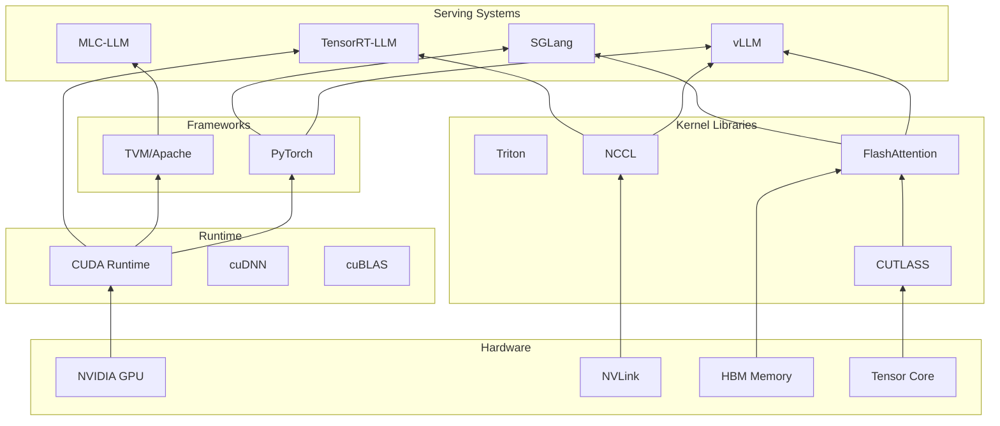
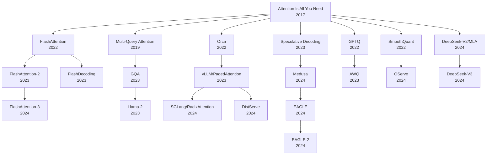

# LLM Inference 知识图谱

## 总览

本文档以 Mermaid 图和结构化描述展示 LLM Inference 领域的知识关系网络。

---

## 1. 核心概念关系图

## 2. 技术演进时间线

## 3. 问题-方法映射

## 4. 系统依赖关系

## 5. 论文引用网络（核心节点）

## 6. 知识领域交叉

| 领域 A | 领域 B | 交叉点 | 代表工作 |
|--------|--------|--------|----------|
| Attention | Memory | KV Cache 管理 | PagedAttention, H2O |
| Quantization | Serving | 量化模型 serving | QServe, Marlin |
| Speculation | Batching | Batch-aware speculation | MineDraft |
| Sparse | Long Context | 稀疏长序列 attention | MInference, StreamingLLM |
| MoE | Distributed | Expert parallelism | DeepSeek-V3 |
| Compression | KV Cache | KV 量化/蒸馏 | KIVI, Gear |
| Scheduling | Disaggregation | P/D 调度 | DistServe, Mooncake |
| Hardware | Kernel | 硬件感知 kernel | FlashAttention-3 (FP8) |

## 7. 研究热度趋势

| 方向 | 2022 | 2023 | 2024 | 2025 | 趋势 |
|------|------|------|------|------|------|
| FlashAttention | ★★ | ★★★ | ★★ | ★ | 成熟，增量改进 |
| KV Cache | ★ | ★★ | ★★★★ | ★★★ | 持续热门 |
| Speculative Decoding | ★ | ★★ | ★★★ | ★★ | 稳定 |
| P/D Disaggregation | - | - | ★★★ | ★★★★ | 快速增长 |
| MLA/DeepSeek | - | - | ★★★ | ★★★★ | 快速增长 |
| Long Context | - | ★ | ★★★ | ★★★★ | 快速增长 |
| MoE Inference | - | ★ | ★★ | ★★★ | 增长 |
| Quantization | ★★ | ★★★ | ★★★ | ★★ | 稳定 |
