# LLM Inference 演讲大纲

## 演讲信息

- **主题**：LLM Inference 优化：从算法到系统的全景分析
- **时长**：90 分钟（含 Q&A）
- **目标听众**：ML 工程师、系统研究者、基础设施团队
- **前置知识**：Transformer 基础、GPU 编程基础

---

## Part 1: 基础与动机（15 分钟）

### Slide 1-3: 为什么 LLM Inference 重要
- LLM 部署成本：GPT-4 级别模型的推理成本
- Inference vs Training 的计算特性差异
- 关键指标：TTFT、TPOT、Throughput、Cost/Token

### Slide 4-6: Autoregressive Decoding 的瓶颈
- Prefill vs Decode 的计算特性
  - Prefill: Compute-bound (大矩阵乘法)
  - Decode: Memory-bound (逐 token，受带宽限制)
- Roofline Model 分析
- KV Cache 的内存增长问题

### Slide 7-8: 优化方向总览
- 展示分类体系 Mermaid 图
- 各方向的成熟度和研究热度

---

## Part 2: 计算优化（20 分钟）

### Slide 9-12: FlashAttention 系列
- Standard Attention 的 IO 瓶颈
- FlashAttention-1: Tiling + Recomputation
  - SRAM tiling 示意图
  - IO 复杂度从 O(N²) 降到 O(N²d/M)
- FlashAttention-2: Work partitioning 改进
- FlashAttention-3: FP8 + Async + Warp-specialization

### Slide 13-15: Decode 阶段优化
- FlashDecoding: Split-K over sequence length
- PagedAttention: Block-level memory management
  - 与 OS 虚拟内存的类比
  - Physical/Logical block mapping 示意图
- GQA/MQA: 减少 KV heads

### Slide 16-18: Sparse Attention
- StreamingLLM: Attention Sink 现象
- H2O: Heavy Hitter Oracle
- MInference: Million-token sparse patterns
- 精度-速度 tradeoff 分析

---

## Part 3: 内存优化（15 分钟）

### Slide 19-21: KV Cache 管理
- KV Cache 大小计算公式
- 各模型的 KV Cache 占用对比
- vLLM Block Manager 机制

### Slide 22-24: KV Cache 压缩
- Quantization: KIVI (per-channel K + per-token V)
- Eviction: SnapKV, PyramidKV
- 各方法的压缩率 vs 精度对比表

### Slide 25-26: 量化技术
- Weight-only: GPTQ, AWQ
- Weight-Activation: SmoothQuant, QServe
- FP8: H100 原生支持
- 精度-速度-内存 三角 tradeoff

---

## Part 4: 调度与 Serving（15 分钟）

### Slide 27-29: Continuous Batching
- Static vs Dynamic vs Continuous Batching
- Orca 设计原理
- SplitFuse (DeepSpeed) 和 Chunked Prefill

### Slide 30-32: Prefix Caching
- vLLM APC vs SGLang RadixAttention
- Radix Tree 数据结构示意
- Cache hit rate 分析

### Slide 33-35: P/D Disaggregation
- 动机：Prefill 和 Decode 的资源需求不同
- DistServe 架构
- Mooncake: KVCache-centric 设计
- 工程挑战：KV Transfer latency

---

## Part 5: 解码加速（10 分钟）

### Slide 36-38: Speculative Decoding
- Draft-then-Verify 框架
- 接受率与加速比公式
- Draft model 选择：独立模型 vs Self-draft

### Slide 39-41: 方法对比
- Medusa: Multi-head prediction
- EAGLE/EAGLE-2: Autoregressive draft + dynamic tree
- MineDraft: Batch parallel speculation
- 各方法 speedup 对比表

---

## Part 6: 分布式推理（10 分钟）

### Slide 42-44: 并行策略
- TP/PP/SP/EP 对比
- 通信量分析
- 何时用哪种策略

### Slide 45-46: MoE 推理
- DeepSeek-V3 的 256 expert 推理
- Expert Parallelism + AlltoAll
- Load balancing 挑战

---

## Part 7: 系统对比与选型（5 分钟）

### Slide 47-48: 主流系统对比
- vLLM vs SGLang vs TensorRT-LLM vs llama.cpp
- 选型决策树
- 各系统适用场景

---

## Part 8: 未来方向（5 分钟）

### Slide 49-50: 开放问题与趋势
- P/D Disaggregation 的工程化
- Long context (1M+ tokens) 的高效推理
- 硬件-软件协同设计
- Non-Transformer 架构的推理优化

---

## Q&A（10 分钟）

### 预备问题
1. "vLLM 和 SGLang 该选哪个？" → 取决于 workload 特征
2. "Speculative decoding 在生产中有用吗？" → 低并发场景有效
3. "FP8 真的无损吗？" → 大部分场景接近无损，但需要验证
4. "如何评估 KV cache 压缩的影响？" → 不能只看 PPL，需要 task-specific 评估

---

## 附录：Demo 建议

| Demo | 工具 | 时间 | 效果 |
|------|------|------|------|
| FlashAttention 性能对比 | Triton benchmark | 2 min | 直观展示 IO 优化效果 |
| vLLM vs HF 吞吐对比 | benchmark_throughput.py | 3 min | 展示 PagedAttention 效果 |
| Speculative Decoding | vLLM + draft model | 3 min | 展示加速效果 |
| 量化精度对比 | lm-eval | 5 min | 展示量化 tradeoff |

---

## 附录：演讲结构流程图

```mermaid
graph LR
    subgraph "Part 1: 基础 (15min)"
        A1[开场: 为什么关注推理] --> A2[全景图: 7大方向]
        A2 --> A3[关键指标: TTFT/TPOT/Throughput]
    end
    
    subgraph "Part 2: 核心技术 (25min)"
        A3 --> B1[Attention Kernel<br/>FlashAttention系列]
        B1 --> B2[KV Cache<br/>压缩/驱逐/共享]
        B2 --> B3[Quantization<br/>W4A8 实践]
        B3 --> B4[Speculative Decoding<br/>Draft-Verify范式]
    end
    
    subgraph "Part 3: 系统与工程 (15min)"
        B4 --> C1[Serving系统对比<br/>vLLM/SGLang/TRT-LLM]
        C1 --> C2[分布式推理<br/>TP/EP/P-D分离]
        C2 --> C3[DeepSeek-V3<br/>全栈案例分析]
    end
    
    subgraph "Part 4: 展望 (5min)"
        C3 --> D1[趋势: FP4/MLA/1M Context]
        D1 --> D2[研究机会: 55条选题]
        D2 --> D3[Q&A]
    end
    
    style A1 fill:#e8f4fd
    style D3 fill:#e8f4fd
```

