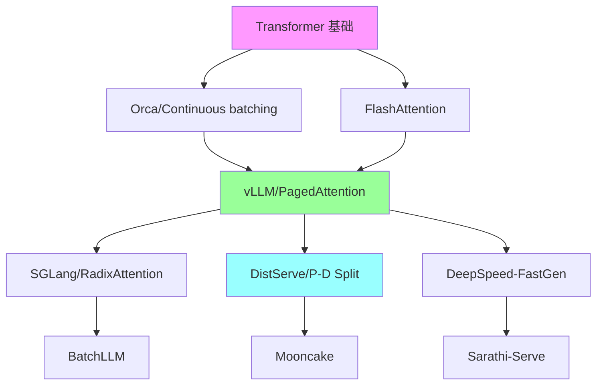

# 论文阅读路线图

## 总览

本文档为不同背景的读者设计分阶段的论文阅读计划，从基础到前沿，覆盖 [LLM Inference](https://arxiv.org/abs/2410.04466) 的核心技术栈。

---

## 路线 A：系统工程师（侧重 Serving 和调度）

### 阶段 1：基础（2 周）— 难度：入门

| # | 论文 | 核心收获 | 优先级 | 前置要求 |
|---|------|----------|--------|----------|
| 1 | Attention Is All You Need (2017) | Transformer 基础 | 必读 | 无 |
| 2 | [Orca](https://www.usenix.org/conference/osdi22/presentation/yu) (OSDI 2022) | [Continuous Batching](https://www.usenix.org/system/files/osdi22-yu.pdf) 原理 | 必读 | #1 |
| 3 | vLLM/PagedAttention (SOSP 2023) | Paged memory management | 必读 | #2 |
| 4 | [FlashAttention](https://arxiv.org/abs/2205.14135) (NeurIPS 2022) | IO-aware attention | 必读 | #1 |

### 阶段 2：核心系统（3 周）— 难度：中级

| # | 论文 | 核心收获 | 优先级 | 前置要求 |
|---|------|----------|--------|----------|
| 5 | SGLang/[RadixAttention (2024)](https://arxiv.org/abs/2312.07104) | Prefix sharing, DSL | 必读 | #3 |
| 6 | [DeepSpeed](https://github.com/microsoft/DeepSpeed)-FastGen (2023) | SplitFuse, chunked prefill | 推荐 | #2 |
| 7 | [Sarathi-Serve (2024)](https://arxiv.org/abs/2403.02310) | Stall-free batching | 推荐 | #2, #6 |
| 8 | [DistServe](https://arxiv.org/abs/2401.09670) (OSDI 2024) | P/D disaggregation | 必读 | #3 |
| 9 | [Mooncake (2024)](https://arxiv.org/abs/2407.00079) | KVCache-centric architecture | 必读 | #8 |
| 10 | [Splitwise (2023)](https://arxiv.org/abs/2311.18677) | Phase splitting | 推荐 | #2 |

### 阶段 3：进阶（2 周）— 难度：高级

| # | 论文 | 核心收获 | 优先级 | 前置要求 |
|---|------|----------|--------|----------|
| 11 | [FastServe (2023)](https://arxiv.org/abs/2305.05920) | Preemptive scheduling | 推荐 | #2 |
| 12 | [vAttention (2024)](https://arxiv.org/abs/2405.04437) | Dynamic memory without paging | 推荐 | #3 |
| 13 | [BatchLLM (2024)](https://arxiv.org/abs/2412.03594) | Global prefix sharing | 选读 | #5 |
| 14 | [NanoFlow (2024)](https://arxiv.org/abs/2408.12757) | Optimal throughput | 选读 | #3, #8 |
| 15 | [DynamoLLM (2024)](https://arxiv.org/abs/2408.00741) | Energy-efficient clusters | 选读 | #8 |

---

## 路线 B：Kernel 工程师（侧重 CUDA 和 Attention）

### 阶段 1：基础（2 周）— 难度：入门

| # | 论文 | 核心收获 | 优先级 | 前置要求 |
|---|------|----------|--------|----------|
| 1 | [Online Softmax](https://arxiv.org/abs/2112.05682) (NVIDIA, 2018) | Safe softmax 计算 | 必读 | 无 |
| 2 | [FlashAttention (2022)](https://arxiv.org/abs/2205.14135) | Tiling, recomputation | 必读 | #1 |
| 3 | [FlashAttention-2 (2023)](https://arxiv.org/abs/2307.08691) | Work partitioning, warp parallelism | 必读 | #2 |
| 4 | CUTLASS/CuTe 文档 | GPU GEMM 基础 | 必读 | CUDA 基础 |

### 阶段 2：核心 Kernel（3 周）— 难度：中级

| # | 论文 | 核心收获 | 优先级 | 前置要求 |
|---|------|----------|--------|----------|
| 5 | [FlashAttention-3 (2024)](https://arxiv.org/abs/2407.08608) | FP8, async, warp-specialization | 必读 | #3, #4 |
| 6 | [FlashDecoding (2023)](https://crfm.stanford.edu/2023/10/12/flashdecoding.html) | Split-K for decode | 必读 | #2 |
| 7 | [PagedAttention](https://arxiv.org/abs/2309.06180) kernel | Block-level attention | 必读 | #2 |
| 8 | Triton tutorials | Python GPU programming | 推荐 | #4 |
| 9 | Marlin (2024) | 4-bit GEMM kernel | 推荐 | #4 |
| 10 | [FFPA (2025)](https://github.com/xlite-dev/ffpa-attn) | O(1) SRAM prefill attention | 推荐 | #3 |

### 阶段 3：进阶（2 周）— 难度：高级

| # | 论文 | 核心收获 | 优先级 | 前置要求 |
|---|------|----------|--------|----------|
| 11 | [SageAttention](https://arxiv.org/abs/2410.02367) 1/2/3 (2024-2025) | INT8/FP4 attention | 推荐 | #5 |
| 12 | [FlashInfer](https://github.com/flashinfer-ai/flashinfer) 文档 | Kernel library design | 推荐 | #6, #7 |
| 13 | TileLink/[Triton-distributed (2025)](https://arxiv.org/abs/2503.20313) | Compute-comm overlap | 选读 | #8 |
| 14 | [DeepGEMM](https://github.com/deepseek-ai/DeepGEMM) (DeepSeek, 2025) | [FP8](https://arxiv.org/abs/2209.05433) GEMM | 选读 | #5 |
| 15 | LUT [Tensor Core (2024)](https://arxiv.org/abs/1803.04014) | Lookup table acceleration | 选读 | #4 |

---

## 路线 C：算法研究者（侧重压缩和加速）

### 阶段 1：基础（2 周）— 难度：入门

| # | 论文 | 核心收获 | 优先级 | 前置要求 |
|---|------|----------|--------|----------|
| 1 | [GPTQ (2022)](https://arxiv.org/abs/2210.17323) | Post-training quantization | 必读 | 线性代数基础 |
| 2 | [SmoothQuant (2022)](https://arxiv.org/abs/2211.10438) | Activation-weight migration | 必读 | #1 |
| 3 | [AWQ (2023)](https://arxiv.org/abs/2306.00978) | Activation-aware weight quant | 必读 | #1 |
| 4 | [Speculative Decoding](https://arxiv.org/abs/2211.17192) (DeepMind, 2023) | Draft-verify framework | 必读 | 无 |

### 阶段 2：核心方法（3 周）— 难度：中级

| # | 论文 | 核心收获 | 优先级 | 前置要求 |
|---|------|----------|--------|----------|
| 5 | [Medusa (2024)](https://arxiv.org/abs/2401.10774) | Multi-head self-draft | 必读 | #4 |
| 6 | EAGLE/[EAGLE-2 (2024)](https://arxiv.org/abs/2406.16858) | Autoregressive draft head | 必读 | #4, #5 |
| 7 | [QServe (2024)](https://arxiv.org/abs/2405.04532) | [W4A8KV4](https://arxiv.org/abs/2405.04532) co-design | 必读 | #1, #2 |
| 8 | [H2O (2023)](https://arxiv.org/abs/2306.14048) | KV cache eviction | 推荐 | 无 |
| 9 | [SnapKV (2024)](https://arxiv.org/abs/2404.14469) | Observation window compression | 推荐 | #8 |
| 10 | [KIVI (2024)](https://arxiv.org/abs/2402.02750) | KV quantization | 推荐 | #1 |

### 阶段 3：进阶（2 周）— 难度：高级

| # | 论文 | 核心收获 | 优先级 | 前置要求 |
|---|------|----------|--------|----------|
| 11 | [MInference (2024)](https://arxiv.org/abs/2407.02490) | Dynamic sparse attention | 推荐 | #8 |
| 12 | [StreamingLLM (2023)](https://arxiv.org/abs/2309.17453) | Attention sink | 推荐 | #8 |
| 13 | [TriForce (2024)](https://arxiv.org/abs/2404.11912) | Hierarchical speculation | 选读 | #4, #6 |
| 14 | [MagicDec (2024)](https://arxiv.org/abs/2408.11049) | Speculation for high throughput | 选读 | #4, #6 |
| 15 | [NexusQuant (2026)](https://arxiv.org/abs/2505.00949) | E8 lattice VQ for KV | 选读 | #10 |

---

## 路线 D：架构研究者（侧重模型设计）

### 阶段 1：基础（2 周）— 难度：入门

| # | 论文 | 核心收获 | 优先级 | 前置要求 |
|---|------|----------|--------|----------|
| 1 | [MQA](https://arxiv.org/abs/1911.02150) (Google, 2019) | Single KV head | 必读 | Transformer 基础 |
| 2 | [GQA](https://arxiv.org/abs/2305.13245) (Google, 2023) | Grouped KV heads | 必读 | #1 |
| 3 | [Mamba (2023)](https://arxiv.org/abs/2312.00752) | Selective State Space Model | 必读 | 无 |
| 4 | [DeepSeek-V2 (2024)](https://arxiv.org/abs/2405.04434) | MLA 设计 | 必读 | #1, #2 |

### 阶段 2：核心架构（3 周）— 难度：中级

| # | 论文 | 核心收获 | 优先级 | 前置要求 |
|---|------|----------|--------|----------|
| 5 | [DeepSeek-V3 (2024)](https://arxiv.org/abs/2412.19437) | MoE + MLA 大规模验证 | 必读 | #4 |
| 6 | [RWKV (2023)](https://arxiv.org/abs/2305.13048) | Linear RNN | 推荐 | #3 |
| 7 | [YOCO](https://arxiv.org/abs/2405.05254) (Microsoft, 2024) | Decoder-Decoder | 推荐 | #1 |
| 8 | [MiniMax-01 (2025)](https://filecdn.minimax.chat/_Arxiv_MiniMax_01_Report.pdf) | [Lightning Attention](https://filecdn.minimax.chat/_Arxiv_MiniMax_01_Report.pdf) | 推荐 | #3 |
| 9 | [GLA (2023)](https://arxiv.org/abs/2312.06635) | Gated Linear Attention | 推荐 | #3 |
| 10 | [CLA (2024)](https://arxiv.org/abs/2405.12981) | Cross-Layer Attention | 选读 | #2 |

### 阶段 3：进阶（2 周）— 难度：高级

| # | 论文 | 核心收获 | 优先级 | 前置要求 |
|---|------|----------|--------|----------|
| 11 | Flash[MLA](https://arxiv.org/abs/2405.04434) (DeepSeek, 2025) | [MLA](https://arxiv.org/abs/2405.04434) kernel | 推荐 | #4, #5 |
| 12 | [TransMLA (2025)](https://arxiv.org/abs/2502.07864) | MHA to MLA conversion | 选读 | #4 |
| 13 | NSA (DeepSeek, 2025) | Native Sparse Attention | 选读 | #5 |
| 14 | [Star Attention](https://arxiv.org/abs/2411.17116) (NVIDIA, 2024) | 11x speedup long seq | 选读 | #2 |
| 15 | [Infini-attention](https://arxiv.org/abs/2404.07143) (Google, 2024) | Infinite context | 选读 |

---

## 路线 E：分布式系统（侧重多 GPU/多节点）

### 阶段 1：基础（2 周）— 难度：入门

| # | 论文 | 核心收获 | 优先级 | 前置要求 |
|---|------|----------|--------|----------|
| 1 | [Megatron-LM](https://github.com/NVIDIA/Megatron-LM) TP (2020) | [Tensor Parallelism](https://arxiv.org/abs/2402.04925) | 必读 | 无 |
| 2 | [ZeRO (2019)](https://arxiv.org/abs/1910.02054) | Memory optimization | 必读 | 无 |
| 3 | [Ring Attention (2023)](https://arxiv.org/abs/2310.01889) | Sequence parallelism | 必读 | #1 |
| 4 | Ulysses ([DeepSpeed](https://github.com/microsoft/DeepSpeed), 2023) | AlltoAll SP | 必读 | #1 |

### 阶段 2：核心系统（3 周）— 难度：中级

| # | 论文 | 核心收获 | 优先级 | 前置要求 |
|---|------|----------|--------|----------|
| 5 | [Megatron-LM](https://github.com/NVIDIA/Megatron-LM) SP/CP (2024) | Context parallelism | 必读 | #1, #3 |
| 6 | [Star Attention (2024)](https://arxiv.org/abs/2411.17116) | Efficient long-seq inference | 推荐 | #3 |
| 7 | [DistServe (2024)](https://arxiv.org/abs/2401.09670) | P/D disaggregation | 必读 | #1 |
| 8 | [Mooncake (2024)](https://arxiv.org/abs/2407.00079) | Disaggregated KV | 必读 | #7 |
| 9 | [DeepEP](https://github.com/deepseek-ai/DeepEP) (DeepSeek, 2025) | Expert parallelism | 推荐 | #1 |
| 10 | [DualPipe](https://github.com/deepseek-ai/DualPipe) (DeepSeek, 2025) | Pipeline optimization | 推荐 | #1 |

### 阶段 3：进阶（2 周）— 难度：高级

| # | 论文 | 核心收获 | 优先级 | 前置要求 |
|---|------|----------|--------|----------|
| 11 | USP/YunChang (2024) | Hybrid Ring+Ulysses | 推荐 | #3, #4 |
| 12 | [TokenRing (2024)](https://arxiv.org/abs/2412.20501) | Bidirectional SP | 选读 | #3 |
| 13 | [MegaScale-Infer (2025)](https://arxiv.org/abs/2504.02263) | MoE disaggregated EP | 选读 | #7, #9 |
| 14 | TileLink (2025) | Compute-comm overlap | 选读 | #9 |
| 15 | [PETALS (2023)](https://arxiv.org/abs/2312.08361) | Decentralized inference | 选读 |

---

## 每日阅读建议

| 时间 | 活动 | 产出 |
|------|------|------|
| 30 min | 快速浏览（Abstract + Figures） | 判断是否深读 |
| 60 min | 精读核心方法 | 理解算法/系统设计 |
| 30 min | 复现/实验 | 验证理解 |
| 15 min | 笔记总结 | 记录 insight |

**总预计时间**：每条路线 7 周，每天 2-3 小时。

---

## 阅读顺序 Mermaid 图（路线 A 示例）

---

## 路线 F：Serving 系统全栈（系统方向补充）

本路线面向希望深入理解 LLM Serving 系统设计的工程师，从调度器设计到分布式 KV cache 管理，覆盖生产级系统的完整技术栈。

### 阶段 1：Serving 基础范式（2 周）— 难度：入门

| # | 论文/资料 | 核心收获 | 优先级 | 前置要求 |
|---|-----------|----------|--------|----------|
| 1 | [Orca](https://www.usenix.org/conference/osdi22/presentation/yu) (OSDI 2022) | Iteration-level scheduling，continuous batching 的起源 | 必读 | 无 |
| 2 | vLLM/PagedAttention (SOSP 2023) | Paged KV cache，block manager，preemption | 必读 | #1 |
| 3 | [Sarathi](https://arxiv.org/abs/2308.16369) (2023.08) | Chunked prefill，piggyback decode with prefill | 必读 | #1 |
| 4 | [FlashAttention-2](https://arxiv.org/abs/2307.08691) (2023.07) | IO-aware attention kernel，理解 serving 的计算基础 | 必读 | 无 |
| 5 | [TensorRT-LLM](https://github.com/NVIDIA/TensorRT-LLM) Batch Manager 文档 | In-flight batching 的工业实现 | 推荐 | #1 |

**阶段目标**：理解 continuous batching 为何有效、[PagedAttention](https://arxiv.org/abs/2309.06180) 如何解决内存碎片、chunked prefill 如何缓解 prefill-decode 干扰。

### 阶段 2：前缀复用与调度优化（2 周）— 难度：中级

| # | 论文/资料 | 核心收获 | 优先级 | 前置要求 |
|---|-----------|----------|--------|----------|
| 6 | SGLang/[RadixAttention (2023.12)](https://arxiv.org/abs/2312.07104) | Radix tree 管理 KV cache，自动前缀复用 | 必读 | #2 |
| 7 | [Prompt Cache](https://arxiv.org/abs/2311.04934) (Yale, 2023.11) | 模块化 attention state 复用 | 推荐 | #2 |
| 8 | [ChunkAttention](https://arxiv.org/abs/2402.15220) (Microsoft, 2024.02) | Prefix-aware KV cache + kernel 级共享 | 推荐 | #6 |
| 9 | [CacheBlend](https://arxiv.org/abs/2405.16444) (UChicago, 2024.05) | Cached KV 的 partial recomputation | 推荐 | #6 |
| 10 | [Hydragen (2024.02)](https://arxiv.org/abs/2402.05099) | Shared prefix 高吞吐推理 | 选读 | #6 |
| 11 | [BatchLLM](https://arxiv.org/abs/2412.03594) (Microsoft, 2024.12) | Global prefix sharing + throughput-oriented batching | 选读 | #6 |
| 12 | [SJF Scheduling](https://arxiv.org/abs/2408.15792) (UCSD, 2024.08) | Learning to rank for scheduling | 推荐 | #1 |

**阶段目标**：掌握 prefix caching 从手动标注到全自动的演进，理解 cache-aware scheduling 的设计空间。

### 阶段 3：Prefill/Decode 分离架构（2 周）— 难度：中级

| # | 论文/资料 | 核心收获 | 优先级 | 前置要求 |
|---|-----------|----------|--------|----------|
| 13 | [DistServe](https://arxiv.org/abs/2401.09670) (PKU, 2024.01) | Goodput-optimized P/D disaggregation | 必读 | #2, #3 |
| 14 | [Splitwise](https://arxiv.org/abs/2311.18677) (Microsoft, 2023.11) | Phase splitting 的早期探索 | 推荐 | #1 |
| 15 | [Mooncake](https://arxiv.org/abs/2407.00079) (Moonshot AI, 2024.06) | KVCache-centric disaggregated architecture | 必读 | #13 |
| 16 | [KVDirect](https://arxiv.org/abs/2501.14743) (ByteDance, 2024.12) | 分布式 disaggregated inference | 推荐 | #13 |
| 17 | [MegaScale-Infer](https://arxiv.org/abs/2504.02263) (ByteDance, 2025.04) | MoE 模型的 disaggregated expert parallelism | 推荐 | #13, #15 |

**阶段目标**：理解 P/D 分离的动机（compute-bound vs memory-bound 的本质差异）、KV cache 传输的带宽瓶颈、以及 [MoE](https://arxiv.org/abs/2407.06204) 场景下的多级 disaggregation。

### 阶段 4：内存管理演进（1 周）— 难度：高级

| # | 论文/资料 | 核心收获 | 优先级 | 前置要求 |
|---|-----------|----------|--------|----------|
| 18 | [vAttention](https://arxiv.org/abs/2405.04437) (Microsoft, 2024.05) | OS VMM 替代 paged attention kernel | 必读 | #2 |
| 19 | [vTensor](https://arxiv.org/abs/2407.15309) (SJTU, 2024.07) | 弹性虚拟 tensor，跨设备迁移 | 推荐 | #18 |
| 20 | Infinite-LLM/DistKV-LLM (Alibaba, 2024.01) | 分布式 KV cache + DistAttention | 推荐 | #2 |
| 21 | [MemServe](https://arxiv.org/abs/2406.17565) (Huawei, 2024.06) | Elastic memory pool，跨请求 KV 复用 | 选读 | #15, #18 |

**阶段目标**：理解从 [PagedAttention](https://arxiv.org/abs/2309.06180) 到 [vAttention](https://arxiv.org/abs/2405.04437) 的演进逻辑（消除 paged kernel overhead），以及分布式 KV cache 的设计模式。

### 阶段 5：生产系统源码阅读（3 周）— 难度：高级

| # | 系统 | 重点模块 | 优先级 | 前置要求 |
|---|------|----------|--------|----------|
| 22 | [vLLM](https://github.com/vllm-project/vllm) 源码 | `core/scheduler.py`, `core/block_manager.py`, `worker/` | 必读 | #2, #6 |
| 23 | [SGLang](https://github.com/sgl-project/sglang) 源码 | `srt/managers/`, `srt/mem_cache/radix_cache.py` | 必读 | #6 |
| 24 | [FlashInfer](https://github.com/flashinfer-ai/flashinfer) 源码 | `include/flashinfer/`, paged attention kernel | 推荐 | #4 |
| 25 | [LightLLM](https://github.com/ModelTC/lightllm) 源码 | 整体架构（代码量小，适合入门） | 推荐 | #1 |
| 26 | [Mooncake](https://arxiv.org/abs/2407.00079) 源码 | KV cache pool 设计 | 选读 | #15 |

**阶段目标**：从源码层面理解 scheduler 决策逻辑、block manager 的 allocate/free/swap 流程、以及 radix cache 的 insert/match/evict 实现。

---

### 路线 F 依赖关系图

---

### 系统方向关键论文的阅读顺序建议

**如果只有 1 天**：[Orca](https://www.usenix.org/conference/osdi22/presentation/yu) → [vLLM](https://github.com/vllm-project/vllm) → [SGLang](https://github.com/sgl-project/sglang)（理解 serving 三代范式）

**如果只有 1 周**：上述 + [DistServe](https://arxiv.org/abs/2401.09670) + [Mooncake](https://github.com/kvcache-ai/Mooncake) + [vAttention](https://arxiv.org/abs/2405.04437)（加入 disaggregation 和 memory 演进）

**如果有 1 个月**：完整路线 F + 源码阅读

**核心 insight 链**：
1. Static batching 浪费严重 → [Orca](https://www.usenix.org/conference/osdi22/presentation/yu) 提出 iteration-level scheduling
2. KV cache 碎片化 → [vLLM](https://github.com/vllm-project/vllm) 提出 [PagedAttention](https://arxiv.org/abs/2309.06180)
3. 前缀重复计算 → [SGLang](https://github.com/sgl-project/sglang) 提出 [RadixAttention](https://arxiv.org/abs/2312.07104)
4. Prefill 阻塞 decode → [Sarathi](https://arxiv.org/abs/2308.16369) 提出 chunked prefill → [DistServe](https://arxiv.org/abs/2401.09670) 提出 P/D 分离
5. Paged kernel 有 overhead → [vAttention](https://arxiv.org/abs/2405.04437) 用 OS VMM 消除
6. 单机 KV cache 不够 → [Mooncake](https://arxiv.org/abs/2407.00079) 提出分布式 KV pool

---

## 最新进展 (2025-2026)

### [EAGLE-3](https://arxiv.org/abs/2503.01840) (Peking University, 2025)

**问题**: EAGLE/EAGLE-2的feature prediction范式存在天花板，扩大训练数据带来的收益有限。

**方法**: 放弃feature prediction转为直接token prediction，用多层特征融合（Training-Time Test技术）替代仅依赖顶层特征，从target model多个层提取信息。

**关键结果**:
- 最高6.5x加速，LLaMA-3.3-70B达4.79x `[verified_by_paper]`
- SGLang框架中batch size 64下吞吐提升1.38x `[verified_by_paper]`
- 已成为工业标准draft方法 `[verified_by_paper]`

**工程启示**: 代表speculative decoding draft model设计的范式转变；已在SGLang等生产框架中集成，部署成熟度高。

**局限性**: 需要训练专用draft model；多层特征提取增加与target model的耦合度。

**阅读优先级**: 必读（路线C阶段2）
**前置要求**: Speculative Decoding基础、EAGLE/EAGLE-2
**适合读者**: 算法研究者、系统工程师
**建议阅读时间**: 精读2小时，含EAGLE-1/2对比分析

---

### [FlatQuant](https://arxiv.org/abs/2410.09426) (ICML 2025)

**问题**: LLM量化受outlier影响严重，W4A4等激进量化设置下精度损失显著。

**方法**: 为每个线性层学习Kronecker结构仿射变换，最大化量化前分布的"平坦度"，所有操作融合为单个kernel。Post-training方法，仅需几小时校准。

**关键结果**:
- LLaMA-3-70B W4A4精度损失<1%，超越SpinQuant 7.5% `[verified_by_paper]`
- Prefill加速最高2.3x，Decode加速最高1.7x `[verified_by_paper]`
- ICML 2025录用 `[verified_by_paper]`

**工程启示**: W4A4KV4的SOTA方案；Kronecker分解思路可推广；校准成本低，适合快速部署。

**局限性**: 可学习变换增加部署复杂度；需要per-layer校准。

**阅读优先级**: 必读（路线C阶段3）
**前置要求**: GPTQ/AWQ基础、SmoothQuant/SpinQuant了解
**适合读者**: 量化方向研究者、部署工程师
**建议阅读时间**: 精读1.5小时，重点关注Kronecker分解和kernel融合设计

---

### [KVzip](https://arxiv.org/abs/2505.23416) (NeurIPS 2025 Oral)

**问题**: 现有KV cache eviction方法是query-aware的，每个新query都需要重新压缩cache，在多query共享长上下文场景中效率极低。

**方法**: Query-agnostic重要性评估——利用LLM自身评估KV对的上下文重建能力，压缩一次即可服务多个不同query。

**关键结果**:
- 3-4x KV cache大小缩减 `[verified_by_paper]`
- FlashAttention decode延迟降低约2x `[verified_by_paper]`
- 支持LLaMA3.1/Qwen2.5/Gemma3，上下文达170K tokens `[verified_by_paper]`
- NeurIPS 2025 Oral `[verified_by_paper]`

**工程启示**: 多query共享上下文场景（RAG、agent）的首选方案；压缩一次、服务多次的特性大幅降低计算开销。

**局限性**: 重要性评估本身有计算开销；适合长上下文+多query场景。

**阅读优先级**: 必读（路线C阶段3）
**前置要求**: H2O/SnapKV等KV eviction基础
**适合读者**: KV cache方向研究者、长上下文部署工程师
**建议阅读时间**: 精读1.5小时，重点关注query-agnostic评估机制

---

### [NVIDIA Dynamo](https://developer.nvidia.com/blog/nvidia-dynamo-adds-gpu-autoscaling-kubernetes-automation-and-networking-optimizations/) (NVIDIA, GTC 2025)

**问题**: 大规模LLM推理部署缺乏统一的数据中心级编排层，P/D disaggregation需要从零构建。

**方法**: 数据中心级推理编排框架，原生支持P/D disaggregation、GPU autoscaling、prefix-aware routing，支持多种推理引擎作为backend。

**关键结果**:
- 原生P/D disaggregation和多节点EP支持 `[verified_by_code]`
- GPU-level autoscaling `[verified_by_code]`
- 支持vLLM/TRT-LLM/SGLang作为backend `[verified_by_code]`

**工程启示**: P/D disaggregation已成为生产标准；代表了从"单机引擎优化"到"集群级编排"的演进。

**局限性**: 面向大规模集群；需要高带宽互联。

**阅读优先级**: 必读（路线A阶段3、路线F阶段3）
**前置要求**: DistServe/Mooncake的P/D disaggregation概念
**适合读者**: 系统工程师、基础设施架构师
**建议阅读时间**: 快速浏览1小时（博客+文档），重点关注架构设计和部署模式

---

### [Quartet](https://arxiv.org/abs/2505.14669) (NeurIPS 2025)

**问题**: Blackwell架构提供原生FP4硬件支持，需要验证FP4训练可行性并建立低精度scaling law。

**方法**: 端到端FP4训练，所有线性层在FP4精度下执行，针对Blackwell架构优化CUDA kernel。揭示低精度scaling law。

**关键结果**:
- FP4训练是FP16/FP8训练的竞争性替代方案 `[verified_by_paper]`
- 提升吞吐量和能效 `[verified_by_paper]`
- NeurIPS 2025录用 `[verified_by_paper]`

**工程启示**: Blackwell GPU用户应考虑FP4训练；low-precision scaling law可指导训练预算分配。

**局限性**: 依赖Blackwell硬件；可能需要更多数据/步数匹配FP16精度。

**阅读优先级**: 必读（路线B阶段3、路线C阶段3）
**前置要求**: FP8训练基础、Transformer Engine了解
**适合读者**: 硬件-算法协同设计研究者、训练基础设施工程师
**建议阅读时间**: 精读2小时，重点关注scaling law分析和FP4 kernel设计

---

### [Efficient Attention Mechanisms Survey](https://arxiv.org/abs/2507.19595) (2025)

**问题**: 高效attention机制（linear/sparse/hybrid）研究快速发展，缺乏系统性分类和性能对比综述。

**方法**: 系统分类linear attention、sparse attention、hybrid attention方法，提供统一性能对比框架，分析各方法在不同序列长度和硬件配置下的适用性。

**关键结果**:
- 系统分类linear/sparse/hybrid attention方法 `[verified_by_paper]`
- 提供统一性能对比框架 `[verified_by_paper]`
- 分析各方法的适用场景和tradeoff `[verified_by_paper]`

**工程启示**: 适合快速了解attention优化全景；提供方法选择的决策框架。

**局限性**: 综述性质，不包含新方法；部分对比数据来自原始论文。

**阅读优先级**: 推荐（所有路线的入门参考）
**前置要求**: FlashAttention基础
**适合读者**: 所有背景的读者，特别适合快速建立全景认知
**建议阅读时间**: 快速浏览1小时（重点看分类图和对比表），按需深读具体方法
