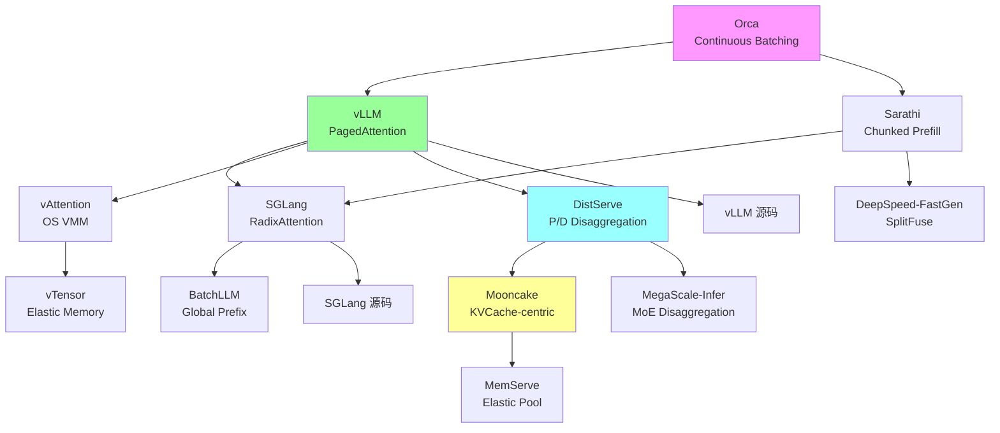

# 论文阅读路线图

## 总览

本文档为不同背景的读者设计分阶段的论文阅读计划，从基础到前沿，覆盖 LLM Inference 的核心技术栈。

---

## 路线 A：系统工程师（侧重 Serving 和调度）

### 阶段 1：基础（2 周）

| # | 论文 | 核心收获 | 优先级 |
|---|------|----------|--------|
| 1 | Attention Is All You Need (2017) | Transformer 基础 | 必读 |
| 2 | Orca (OSDI 2022) | Continuous Batching 原理 | 必读 |
| 3 | vLLM/PagedAttention (SOSP 2023) | Paged memory management | 必读 |
| 4 | FlashAttention (NeurIPS 2022) | IO-aware attention | 必读 |

### 阶段 2：核心系统（3 周）

| # | 论文 | 核心收获 | 优先级 |
|---|------|----------|--------|
| 5 | SGLang/RadixAttention (2024) | Prefix sharing, DSL | 必读 |
| 6 | DeepSpeed-FastGen (2023) | SplitFuse, chunked prefill | 推荐 |
| 7 | Sarathi-Serve (2024) | Stall-free batching | 推荐 |
| 8 | DistServe (OSDI 2024) | P/D disaggregation | 必读 |
| 9 | Mooncake (2024) | KVCache-centric architecture | 必读 |
| 10 | Splitwise (2023) | Phase splitting | 推荐 |

### 阶段 3：进阶（2 周）

| # | 论文 | 核心收获 | 优先级 |
|---|------|----------|--------|
| 11 | FastServe (2023) | Preemptive scheduling | 推荐 |
| 12 | vAttention (2024) | Dynamic memory without paging | 推荐 |
| 13 | BatchLLM (2024) | Global prefix sharing | 选读 |
| 14 | NanoFlow (2024) | Optimal throughput | 选读 |
| 15 | DynamoLLM (2024) | Energy-efficient clusters | 选读 |

---

## 路线 B：Kernel 工程师（侧重 CUDA 和 Attention）

### 阶段 1：基础（2 周）

| # | 论文 | 核心收获 | 优先级 |
|---|------|----------|--------|
| 1 | Online Softmax (NVIDIA, 2018) | Safe softmax 计算 | 必读 |
| 2 | FlashAttention (2022) | Tiling, recomputation | 必读 |
| 3 | FlashAttention-2 (2023) | Work partitioning, warp parallelism | 必读 |
| 4 | CUTLASS/CuTe 文档 | GPU GEMM 基础 | 必读 |

### 阶段 2：核心 Kernel（3 周）

| # | 论文 | 核心收获 | 优先级 |
|---|------|----------|--------|
| 5 | FlashAttention-3 (2024) | FP8, async, warp-specialization | 必读 |
| 6 | FlashDecoding (2023) | Split-K for decode | 必读 |
| 7 | PagedAttention kernel | Block-level attention | 必读 |
| 8 | Triton tutorials | Python GPU programming | 推荐 |
| 9 | Marlin (2024) | 4-bit GEMM kernel | 推荐 |
| 10 | FFPA (2025) | O(1) SRAM prefill attention | 推荐 |

### 阶段 3：进阶（2 周）

| # | 论文 | 核心收获 | 优先级 |
|---|------|----------|--------|
| 11 | SageAttention 1/2/3 (2024-2025) | INT8/FP4 attention | 推荐 |
| 12 | FlashInfer 文档 | Kernel library design | 推荐 |
| 13 | TileLink/Triton-distributed (2025) | Compute-comm overlap | 选读 |
| 14 | DeepGEMM (DeepSeek, 2025) | FP8 GEMM | 选读 |
| 15 | LUT Tensor Core (2024) | Lookup table acceleration | 选读 |

---

## 路线 C：算法研究者（侧重压缩和加速）

### 阶段 1：基础（2 周）

| # | 论文 | 核心收获 | 优先级 |
|---|------|----------|--------|
| 1 | GPTQ (2022) | Post-training quantization | 必读 |
| 2 | SmoothQuant (2022) | Activation-weight migration | 必读 |
| 3 | AWQ (2023) | Activation-aware weight quant | 必读 |
| 4 | Speculative Decoding (DeepMind, 2023) | Draft-verify framework | 必读 |

### 阶段 2：核心方法（3 周）

| # | 论文 | 核心收获 | 优先级 |
|---|------|----------|--------|
| 5 | Medusa (2024) | Multi-head self-draft | 必读 |
| 6 | EAGLE/EAGLE-2 (2024) | Autoregressive draft head | 必读 |
| 7 | QServe (2024) | W4A8KV4 co-design | 必读 |
| 8 | H2O (2023) | KV cache eviction | 推荐 |
| 9 | SnapKV (2024) | Observation window compression | 推荐 |
| 10 | KIVI (2024) | KV quantization | 推荐 |

### 阶段 3：进阶（2 周）

| # | 论文 | 核心收获 | 优先级 |
|---|------|----------|--------|
| 11 | MInference (2024) | Dynamic sparse attention | 推荐 |
| 12 | StreamingLLM (2023) | Attention sink | 推荐 |
| 13 | TriForce (2024) | Hierarchical speculation | 选读 |
| 14 | MagicDec (2024) | Speculation for high throughput | 选读 |
| 15 | NexusQuant (2026) | E8 lattice VQ for KV | 选读 |

---

## 路线 D：架构研究者（侧重模型设计）

### 阶段 1：基础（2 周）

| # | 论文 | 核心收获 | 优先级 |
|---|------|----------|--------|
| 1 | MQA (Google, 2019) | Single KV head | 必读 |
| 2 | GQA (Google, 2023) | Grouped KV heads | 必读 |
| 3 | Mamba (2023) | Selective State Space Model | 必读 |
| 4 | DeepSeek-V2 (2024) | MLA 设计 | 必读 |

### 阶段 2：核心架构（3 周）

| # | 论文 | 核心收获 | 优先级 |
|---|------|----------|--------|
| 5 | DeepSeek-V3 (2024) | MoE + MLA 大规模验证 | 必读 |
| 6 | RWKV (2023) | Linear RNN | 推荐 |
| 7 | YOCO (Microsoft, 2024) | Decoder-Decoder | 推荐 |
| 8 | MiniMax-01 (2025) | Lightning Attention | 推荐 |
| 9 | GLA (2023) | Gated Linear Attention | 推荐 |
| 10 | CLA (2024) | Cross-Layer Attention | 选读 |

### 阶段 3：进阶（2 周）

| # | 论文 | 核心收获 | 优先级 |
|---|------|----------|--------|
| 11 | FlashMLA (DeepSeek, 2025) | MLA kernel | 推荐 |
| 12 | TransMLA (2025) | MHA to MLA conversion | 选读 |
| 13 | NSA (DeepSeek, 2025) | Native Sparse Attention | 选读 |
| 14 | Star Attention (NVIDIA, 2024) | 11x speedup long seq | 选读 |
| 15 | Infini-attention (Google, 2024) | Infinite context | 选读 |

---

## 路线 E：分布式系统（侧重多 GPU/多节点）

### 阶段 1：基础（2 周）

| # | 论文 | 核心收获 | 优先级 |
|---|------|----------|--------|
| 1 | Megatron-LM TP (2020) | Tensor Parallelism | 必读 |
| 2 | ZeRO (2019) | Memory optimization | 必读 |
| 3 | Ring Attention (2023) | Sequence parallelism | 必读 |
| 4 | Ulysses (DeepSpeed, 2023) | AlltoAll SP | 必读 |

### 阶段 2：核心系统（3 周）

| # | 论文 | 核心收获 | 优先级 |
|---|------|----------|--------|
| 5 | Megatron-LM SP/CP (2024) | Context parallelism | 必读 |
| 6 | Star Attention (2024) | Efficient long-seq inference | 推荐 |
| 7 | DistServe (2024) | P/D disaggregation | 必读 |
| 8 | Mooncake (2024) | Disaggregated KV | 必读 |
| 9 | DeepEP (DeepSeek, 2025) | Expert parallelism | 推荐 |
| 10 | DualPipe (DeepSeek, 2025) | Pipeline optimization | 推荐 |

### 阶段 3：进阶（2 周）

| # | 论文 | 核心收获 | 优先级 |
|---|------|----------|--------|
| 11 | USP/YunChang (2024) | Hybrid Ring+Ulysses | 推荐 |
| 12 | TokenRing (2024) | Bidirectional SP | 选读 |
| 13 | MegaScale-Infer (2025) | MoE disaggregated EP | 选读 |
| 14 | TileLink (2025) | Compute-comm overlap | 选读 |
| 15 | PETALS (2023) | Decentralized inference | 选读 |

---

## 每日阅读建议

| 时间 | 活动 | 产出 |
|------|------|------|
| 30 min | 快速浏览（Abstract + Figures） | 判断是否深读 |
| 60 min | 精读核心方法 | 理解算法/系统设计 |
| 30 min | 复现/实验 | 验证理解 |
| 15 min | 笔记总结 | 记录 insight |

**总预计时间**：每条路线 7 周，每天 2-3 小时。

---

## 阅读顺序 Mermaid 图（路线 A 示例）

---

## 路线 F：Serving 系统全栈（系统方向补充）

本路线面向希望深入理解 LLM Serving 系统设计的工程师，从调度器设计到分布式 KV Cache 管理，覆盖生产级系统的完整技术栈。

### 阶段 1：Serving 基础范式（2 周）

| # | 论文/资料 | 核心收获 | 优先级 |
|---|-----------|----------|--------|
| 1 | Orca (OSDI 2022) | Iteration-level scheduling，continuous batching 的起源 | 必读 |
| 2 | vLLM/PagedAttention (SOSP 2023) | Paged KV cache，block manager，preemption | 必读 |
| 3 | Sarathi (2023.08) | Chunked prefill，piggyback decode with prefill | 必读 |
| 4 | FlashAttention-2 (2023.07) | IO-aware attention kernel，理解 serving 的计算基础 | 必读 |
| 5 | TensorRT-LLM Batch Manager 文档 | In-flight batching 的工业实现 | 推荐 |

**阶段目标**：理解 continuous batching 为何有效、PagedAttention 如何解决内存碎片、chunked prefill 如何缓解 prefill-decode 干扰。

### 阶段 2：前缀复用与调度优化（2 周）

| # | 论文/资料 | 核心收获 | 优先级 |
|---|-----------|----------|--------|
| 6 | SGLang/RadixAttention (2023.12) | Radix tree 管理 KV cache，自动前缀复用 | 必读 |
| 7 | Prompt Cache (Yale, 2023.11) | 模块化 attention state 复用 | 推荐 |
| 8 | ChunkAttention (Microsoft, 2024.02) | Prefix-aware KV cache + kernel 级共享 | 推荐 |
| 9 | CacheBlend (UChicago, 2024.05) | Cached KV 的 partial recomputation | 推荐 |
| 10 | Hydragen (2024.02) | Shared prefix 高吞吐推理 | 选读 |
| 11 | BatchLLM (Microsoft, 2024.12) | Global prefix sharing + throughput-oriented batching | 选读 |
| 12 | SJF Scheduling (UCSD, 2024.08) | Learning to rank for scheduling | 推荐 |

**阶段目标**：掌握 prefix caching 从手动标注到全自动的演进，理解 cache-aware scheduling 的设计空间。

### 阶段 3：Prefill/Decode 分离架构（2 周）

| # | 论文/资料 | 核心收获 | 优先级 |
|---|-----------|----------|--------|
| 13 | DistServe (PKU, 2024.01) | Goodput-optimized P/D disaggregation | 必读 |
| 14 | Splitwise (Microsoft, 2023.11) | Phase splitting 的早期探索 | 推荐 |
| 15 | Mooncake (Moonshot AI, 2024.06) | KVCache-centric disaggregated architecture | 必读 |
| 16 | KVDirect (ByteDance, 2024.12) | 分布式 disaggregated inference | 推荐 |
| 17 | MegaScale-Infer (ByteDance, 2025.04) | MoE 模型的 disaggregated expert parallelism | 推荐 |

**阶段目标**：理解 P/D 分离的动机（compute-bound vs memory-bound 的本质差异）、KV cache 传输的带宽瓶颈、以及 MoE 场景下的多级 disaggregation。

### 阶段 4：内存管理演进（1 周）

| # | 论文/资料 | 核心收获 | 优先级 |
|---|-----------|----------|--------|
| 18 | vAttention (Microsoft, 2024.05) | OS VMM 替代 paged attention kernel | 必读 |
| 19 | vTensor (SJTU, 2024.07) | 弹性虚拟 tensor，跨设备迁移 | 推荐 |
| 20 | Infinite-LLM/DistKV-LLM (Alibaba, 2024.01) | 分布式 KV cache + DistAttention | 推荐 |
| 21 | MemServe (Huawei, 2024.06) | Elastic memory pool，跨请求 KV 复用 | 选读 |

**阶段目标**：理解从 PagedAttention 到 vAttention 的演进逻辑（消除 paged kernel overhead），以及分布式 KV cache 的设计模式。

### 阶段 5：生产系统源码阅读（3 周）

| # | 系统 | 重点模块 | 优先级 |
|---|------|----------|--------|
| 22 | vLLM 源码 | `core/scheduler.py`, `core/block_manager.py`, `worker/` | 必读 |
| 23 | SGLang 源码 | `srt/managers/`, `srt/mem_cache/radix_cache.py` | 必读 |
| 24 | FlashInfer 源码 | `include/flashinfer/`, paged attention kernel | 推荐 |
| 25 | LightLLM 源码 | 整体架构（代码量小，适合入门） | 推荐 |
| 26 | Mooncake 源码 | KV cache pool 设计 | 选读 |

**阶段目标**：从源码层面理解 scheduler 决策逻辑、block manager 的 allocate/free/swap 流程、以及 radix cache 的 insert/match/evict 实现。

---

### 路线 F 依赖关系图

---

### 系统方向关键论文的阅读顺序建议

**如果只有 1 天**：Orca → vLLM → SGLang（理解 serving 三代范式）

**如果只有 1 周**：上述 + DistServe + Mooncake + vAttention（加入 disaggregation 和 memory 演进）

**如果有 1 个月**：完整路线 F + 源码阅读

**核心 insight 链**：
1. Static batching 浪费严重 → Orca 提出 iteration-level scheduling
2. KV cache 碎片化 → vLLM 提出 PagedAttention
3. 前缀重复计算 → SGLang 提出 RadixAttention
4. Prefill 阻塞 decode → Sarathi 提出 chunked prefill → DistServe 提出 P/D 分离
5. Paged kernel 有 overhead → vAttention 用 OS VMM 消除
6. 单机 KV cache 不够 → Mooncake 提出分布式 KV pool
